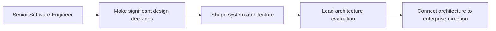

# Software Architect

> **Positioning:** A role focused on the significant structural decisions that shape software systems, their quality attributes, their evolution, and their relationship to surrounding systems.

## What This Path Is

A software architect helps stakeholders and engineers make decisions about system boundaries, responsibilities, interfaces, data, technology, deployment, security, and quality attributes. The role is not simply drawing diagrams or approving designs. It is about understanding the problem, evaluating alternatives, and making the system's important decisions explicit.

Architecture scope varies. An architect may work within one product, across a platform, or at an enterprise level. The role should stay connected to implementation and operation so that architecture remains useful rather than becoming documentation detached from reality.

## Primary Outcomes

- A system structure that supports required behavior and quality attributes
- Clear boundaries, interfaces, and ownership
- Explicit and reviewable architecture decisions
- Controlled technical debt and evolution
- Alignment between business, product, security, data, and operational concerns
- Architecture guidance that engineers can apply in practice

## Capability Areas

| Capability | Architect behavior | Existing vault anchor |
|---|---|---|
| Architecture fundamentals | Distinguishes architecture from implementation detail | [[software-engineering-note/02_Software_Architecture/01_Architecture_Fundamentals]] |
| Quality attributes | Converts quality needs into scenarios and design responses | [[software-engineering-note/02_Software_Architecture/02_Quality_Attributes_Overview]] |
| Views and viewpoints | Communicates architecture to different stakeholders | [[software-engineering-note/02_Software_Architecture/07_Design_and_Documentation]] |
| Evaluation | Uses trade-offs and structured evaluation instead of opinion | [[software-engineering-note/02_Software_Architecture/09_Evaluation_and_Governance]] |
| Security | Builds security into system structure and decisions | [[software-engineering-note/13_Software_Security/Software Security Overview]] |
| Data | Aligns data ownership, flow, and lifecycle | [[DMBOK v2 - Overview]] |
| Operations | Designs for deployment, observability, resilience, and support | [[software-engineering-note/06_Software_Engineering_Operations/Software Engineering Operations Overview]] |

## Typical Progression

## Signals for Moving Forward

- You can explain why a design is appropriate for its context.
- You can identify the quality attributes and constraints that drive an architecture.
- You can make trade-offs visible to both technical and non-technical stakeholders.
- You can help teams evolve architecture without requiring a perfect up-front design.
- You can validate architecture through prototypes, tests, operational data, and reviews.

## Evidence to Build

- Architecture Decision Record set
- Architecture description with relevant views
- Quality Attribute Scenario catalog
- Architecture Evaluation Report
- Technology or platform roadmap
- Migration and modernization strategy
- Secure-by-design review
- Data and integration architecture

## Nearby Paths

- [[career-path/05_Tech_Lead/00_overview|Tech Lead]]: team-level technical leadership
- [[career-path/03_Staff_Engineer/00_overview|Staff Engineer]]: cross-team technical influence
- [[career-path/15_Solutions_and_Enterprise_Architect/00_overview|Solutions or Enterprise Architect]]: customer and enterprise scope
- [[career-path/07_SRE_and_Platform_Engineer/00_overview|SRE and Platform Engineer]]: operational and platform specialization
- [[career-path/08_Security_Engineer/00_overview|Security Engineer]]: security specialization

## Suggested Future Note Route

1. [[software-engineering-note/02_Software_Architecture/Software Architecture Overview]]
2. [[software-engineering-note/02_Software_Architecture/09_Evaluation_and_Governance]]
3. [[software-engineering-note/03_Software_Design/07_Design_Rationale_and_Decisions]]
4. [[SEBoK v2 - Overview]]
5. [[body-of-knowledge/System Engineer BOK/07_System_Definition_and_Architecture]]
6. [[DMBOK v2 - Overview]]
7. [[CyBOK v1 - Overview]]

## Sources

- [[SWEBOK v4 - Overview]]
- [OWASP Secure by Design Framework](https://owasp.org/www-project-secure-by-design-framework/)
- [The Open Group: TOGAF Standard](https://www.opengroup.org/togaf)
- [[SEBoK v2 - Overview]]

## Related

- [[00_Career_Path_Overview]]
- [[career-path/05_Tech_Lead/00_overview|Tech Lead]]
- [[career-path/03_Staff_Engineer/00_overview|Staff Engineer]]
- [[career-path/15_Solutions_and_Enterprise_Architect/00_overview|Solutions and Enterprise Architect]]
