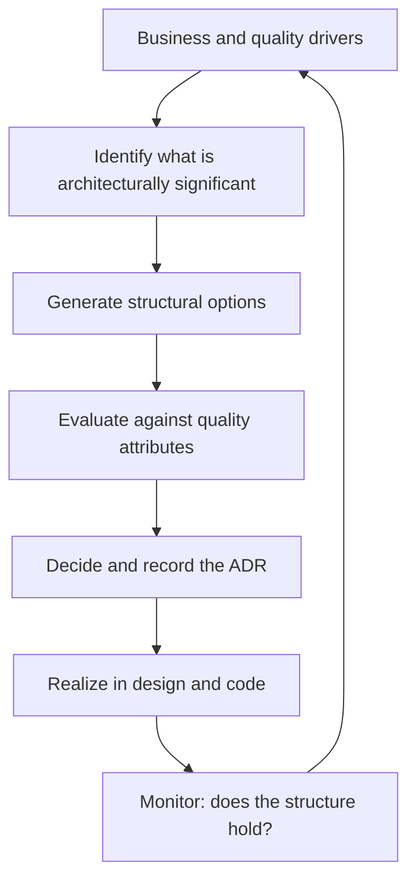

# Architecture Fundamentals

> **Core capability:** The architect distinguishes architecture from implementation detail — understanding what is architecturally significant, how architectural decisions shape systems over time, and where the role adds value beyond design.

## Why This Matters

Every engineer makes design decisions. The architect's contribution is knowing which decisions are *architecturally significant* — the ones that are costly to reverse, constrain future choices, or determine a system's quality attributes — and making those decisions deliberately, with explicit reasoning recorded.

Without fundamentals, architecture becomes either over-engineering (everything is important) or negligence (structural decisions accumulate accidentally). The architect bridges this gap: knowing the styles and patterns, applying them to context, and making structural choices reviewable by people who were not in the room.

## Topics in This Capability Area

| Topic | Core Skill | When It Matters |
|-------|------------|-----------------|
| [[01_Architectural_Significance]] | Distinguishing structure from detail; recognizing costly-to-reverse decisions | Every design; distinguishing architecture from decoration |
| [[02_Architecture_vs_Design]] | Understanding the continuum from system structure to component design | Role definition; scope negotiation |
| [[03_Architecture_Patterns_and_Styles]] | Knowing the pattern catalog and when each applies | System inception; modernization; break-glass decisions |
| [[04_Architecture_Decision_Making]] | Making structural decisions with explicit reasoning | Every consequential structural choice |
| [[05_Architecture_Across_the_Lifecycle]] | Embedding architecture in incremental delivery | Agile teams; continuous delivery contexts |
| [[06_The_Architect_Role_in_Context]] | Position, responsibilities, and boundaries with TL, Staff, and EM | Role clarity; multi-role teams |
| [[07_Architecture_and_Quality_Attributes]] | How quality attributes drive structural decisions | Before any architecture decision |

## The Architecture Decision Loop

## Senior vs Architect

| Activity | Senior engineer | Software Architect |
|----------|-----------------|-------------------|
| Decisions | Component and module design | System structure and boundaries |
| Scope | Their area or team's services | Cross-system; quality-attribute-spanning |
| Patterns | Applies known patterns to components | Chooses the architectural style for the system |
| Reasoning | Explains a local design | Evaluates structural alternatives with trade-off analysis |
| Documentation | Writes design notes | Owns the architecture description and ADR set |

## Practical Applications

### Architecture Fundamentals Checklist

- [ ] Architectural significance is defined and communicated to the team
- [ ] Consequential structural decisions are recorded as ADRs
- [ ] The system's architectural style is named and justified
- [ ] Architecture is embedded in delivery increments, not a separate phase
- [ ] The architect role's scope is explicit — complemented by TL and Staff, not competing
- [ ] Quality attributes are listed as architecture drivers before structure is designed

## Common Pitfalls

| Pitfall | Why It Is a Problem | Better Approach |
|---------|---------------------|-----------------|
| **Everything-is-architecture** | Detail drowns significance; team autonomy erodes | Define significance criteria; delegate implementation design |
| **Nothing-is-architecture** | Structure emerges; nobody can say why it is shaped that way | Identify consequential decisions and record them early |
| **Architecture-as-phase** | Architecture divorced from delivery becomes shelfware | Embed in increments; validate with working software |
| **Style-by-fashion** | Pattern chosen by trend, not context | Evaluate style against quality attribute scenarios |

## Success Indicators

- The team can identify architecturally significant decisions without the architect present
- Architectural style is named and cited in team decisions
- ADRs survive team changes — new members read and cite them
- Quality attributes are reviewed with the same rigor as functional requirements
- Architecture withstands the first unplanned change without breaking

## Related Capabilities

- [[04_Architecture_Evaluation_and_Trade_Offs/00_overview|Architecture Evaluation and Trade Offs]]: how fundamentals are tested
- [[02_Quality_Attribute_Analysis/00_overview|Quality Attribute Analysis]]: the drivers this area identifies
- [[career-path/02_Senior_Software_Engineer/03_Architecture_and_Design_Judgment/00_overview|Architecture and Design Judgment (Senior)]]: the foundation this builds on
- [[career-path/05_Tech_Lead/03_Technical_Direction_and_Architecture/00_overview|Technical Direction and Architecture (Tech Lead)]]: the team-level counterpart

## Summary

Architecture fundamentals establish what matters and why: architectural significance separates structure from detail, patterns provide a shared vocabulary, decisions carry explicit reasoning, and architecture lives inside delivery — not in a separate track. The architect's value hinges on knowing where to spend structural rigor.