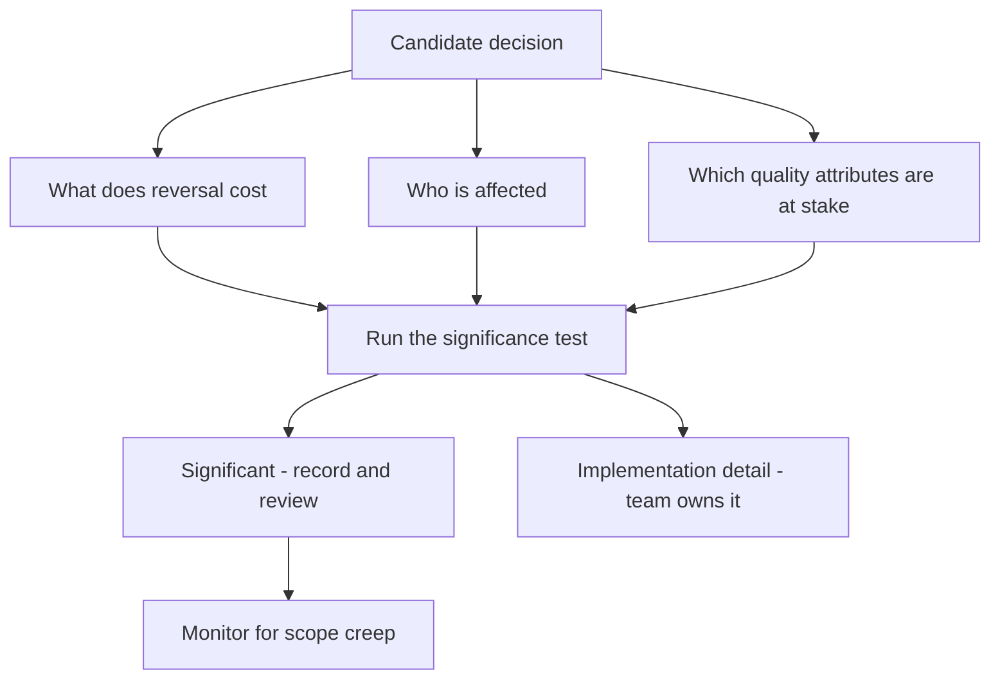

# Architectural Significance

> **Core skill:** Separating architecturally significant decisions from implementation detail — by testing decisions against cost to reverse, blast radius, and quality attribute impact, and making the verdict explicit to the team.

## Why This Matters

Every line of code encodes a decision, but only a small fraction of those decisions determine the shape of the system a year from now. The architect's first discipline is discrimination: knowing which decisions are architecturally significant — costly to reverse, broad in blast radius, or decisive for a quality attribute — and which are implementation detail that belongs to the team. Without that discrimination, architecture collapses into one of two failure modes: everything is significant, so the architect becomes an approval bottleneck, or nothing is significant, so structural choices accumulate silently and nobody can explain why the system looks the way it does.

Significance is not a matter of taste and not a matter of title. It is a property of a decision, and it can be tested: what does it cost to undo, who is affected when it changes, and which quality attributes will feel it. A database engine choice is significant not because databases are interesting but because reversing it means migrating data, rewriting query layers, and retraining operators — the cost to reverse is measured in quarters, not days. A logging library choice is not significant because reversing it costs an afternoon.

The architect who articulates significance gives the team a shared filter. Once the criteria are named and used, engineers stop escalating trivia and stop making irreversible choices unilaterally. The test travels, the architect stops being the bottleneck for triage, and design reviews spend their limited attention where it actually changes outcomes.

## What Makes a Decision Significant

| Criterion | The Question It Asks | Signal of Significance | Example |
|---|---|---|---|
| **Cost to reverse** | If this choice is wrong, what does undoing it cost? | Reversal means migration, rewrite, or redeployment across systems | Database engine; message broker; authentication model |
| **Blast radius** | Who and what are affected when this decision changes? | Multiple teams, external integrations, or the whole product line | Public API contract; shared schema; platform runtime |
| **Quality attribute impact** | Which qualities does this decision set, cap, or threaten? | It determines a measurable quality target the system must meet | Latency budget; consistency model; availability topology |
| **Constraint on future options** | What does this decision make hard or impossible later? | It closes doors on vendors, protocols, or deployment models | Cloud provider; data residency; on-premise constraint |
| **Interface permanence** | Will other systems and consumers build against this? | The interface becomes a contract others depend on | Event schema; service API; plugin boundary |
| **Cross-team structure** | Does it change ownership or team boundaries? | It alters who builds, deploys, or operates what | Service split; platform extraction; shared library |

A decision is significant when it scores high on at least one criterion — and the strongest candidates score on two or three at once. Most significant decisions combine a structural change with a quality attribute consequence: splitting a service changes the deployment topology and the operational failure modes together.

## Cost to Reverse

The single best test of significance is the price of being wrong.

| Reversal Cost | Typical Examples | Decision Discipline |
|---|---|---|
| **Minutes to hours** | Library choice; internal naming; utility design | Delegate to the team; decide fast and move on |
| **Days to weeks** | API shape; module boundaries; configuration approach | Team-level decision with a lightweight record |
| **Weeks to months** | Service boundaries; data ownership; messaging technology | Architect-led decision; options evaluated against scenarios |
| **Quarters to years** | Database engine; core protocol; cloud platform; identity model | Full architecture process; ADR mandatory; revisit triggers named |
| **Effectively irreversible** | Regulatory commitments; acquired contracts; published schemas | Treat as one-way; invest heavily before committing |

The asymmetry matters: teams routinely over-deliberate reversible choices and under-deliberate irreversible ones. The architect's job is to move deliberation to match reversal cost — more scrutiny where undoing is expensive, more speed where it is cheap.

## Blast Radius

Scope determines who must be in the conversation.

| Scope | Who Is Affected | Example | Review Level |
|---|---|---|---|
| **Single component** | The owning developer | Internal method design | None; implementation detail |
| **Whole team** | One team's services and workflow | Module layout; test strategy | Team design review |
| **Multiple teams** | Integrators, consumers, platform | Service contract; event schema | Architecture review with affected teams |
| **Organization** | Every team and operational process | Platform standard; identity model | Architecture board or equivalent; ADR |
| **External parties** | Customers, partners, regulators | Public API; data format; compliance posture | Formal review; contract-level analysis |

A decision that looks local today can acquire blast radius later: an internal schema that quietly becomes the integration point of three teams is a significance change as much as a technical one. The architect watches for scope creep in decisions, not only in code.

## Quality Attribute Impact

| Quality Attribute | The Decision Affects It When It... | Significance Escalates When... |
|---|---|---|
| **Performance** | Sets a latency budget or throughput ceiling | The target is contractual or user-visible |
| **Availability** | Introduces or removes a failure mode | The availability target is externally promised |
| **Security** | Changes a trust boundary or credential flow | Regulated data or external exposure is involved |
| **Modifiability** | Fixes an interface that many future changes flow through | The change rate of that area is high |
| **Deployability** | Defines the deployable unit or release mechanism | Release frequency is a business requirement |
| **Cost** | Commits to a resource profile or vendor | The commitment is multi-year or contractual |

## The Significance Test

Before a design conversation ends, run the decision through six questions:

1. If we are wrong, what does it cost to reverse — and who pays?
2. Who is affected: this component, this team, other teams, the organization?
3. Which quality attribute targets does this decision set, cap, or threaten?
4. What future options does this close, and is that acceptable?
5. Will people who were not in the room need to know why this was chosen?

One or more affirmative answers make the decision architecturally significant: record it, review it, and name its revisit triggers. All negative answers mean the team owns it — and the architect's correct move is to let go.

## Communicating Significance to the Team

| Mechanism | What It Does | When to Use |
|---|---|---|
| **Published significance criteria** | Gives the team a shared filter for escalation | Onboarding; project start |
| **ADR with context and consequences** | Records the decision and its reversal cost | Every significant decision |
| **Test-shaped review agendas** | Spends meeting time only on significant items | Recurring design reviews |
| **Explicit delegation** | Names what the team owns and need not escalate | When the boundary is unclear |
| **Architecture change log** | Makes drift and reversal visible over time | At each increment boundary |

The communication that matters most is the negative case: naming what is *not* significant. A team that knows the architect does not need to see component internals moves faster and escalates the right things.

## The Two Failure Modes

| Anti-Pattern | Symptoms | Consequence | Fix |
|---|---|---|---|
| **Everything is significant** | Approvals for naming, logging libraries, class structure | Team autonomy erodes; architecture becomes a bottleneck | Apply the test; delegate the lower tiers by default |
| **Nothing is significant** | No records; structure emerges; nobody can explain the shape | Irreversible choices accumulate silently; re-litigation after departures | Define criteria; require records at the high tiers |
| **Significance by title** | Only the architect's preferred topics get scrutiny | Blind spots; team disengagement | Criteria-based triage, applicable by anyone |
| **Significance discovered late** | A local choice becomes an org-wide contract unremarked | Expensive retrofits; surprise dependencies | Watch for scope creep; re-test decisions at increments |



## Practical Applications

### Significance Screening Checklist

- [ ] Significance criteria are written down and used by the whole team, not only the architect
- [ ] Every high-reversal-cost decision has an ADR with named revisit triggers
- [ ] Delegated territory is explicit: the team knows what it does not need to escalate
- [ ] Design reviews spend their time on significant decisions only
- [ ] Decisions are re-tested when their scope grows — a local schema that becomes a shared contract
- [ ] The significance test is part of onboarding, not folklore

### Decision Significance Record Template

```markdown
# Significance Record: [Decision]

- **Decision:** [what is being decided]
- **Cost to reverse:** [hours / days / months / effectively irreversible]
- **Blast radius:** [component / team / teams / organization / external]
- **Quality attributes at stake:** [performance, availability, security, ...]
- **Future options constrained:** [list, or none]
- **Verdict:** [architecturally significant / implementation detail]
- **Handling:** [ADR + review / team decision + log / decide and move on]
```

## Common Pitfalls

| Pitfall | Why It Is a Problem | Better Approach |
|---------|---------------------|-----------------|
| **Everything-is-significant** | The architect becomes a queue; teams lose ownership and slow down | Apply the reversal-cost test; delegate the lower tiers |
| **Nothing-is-significant** | Irreversible choices accumulate; the structure becomes unexplainable | Name the criteria and require records above the threshold |
| **Reversal cost ignored** | Cheap-to-undo decisions get weeks of debate; expensive ones get none | Set deliberation effort proportional to the cost of undoing |
| **Blast radius blindness** | A local choice silently becomes a cross-team contract | Re-test decisions when their consumers grow |
| **Significance as opinion** | Same decision classified differently by different people | Publish criteria so classification is repeatable |
| **No negative case** | The team never learns what it may decide alone | Explicitly communicate what is not significant |

## Success Indicators

- The team escalates structural questions and resolves detail locally without asking
- High-reversal decisions are visible in ADRs before implementation begins
- New engineers can apply the significance test unaided within their first months
- Design review time correlates with reversal cost, not with seniority of the presenter
- Decisions whose scope grew are flagged and re-recorded, not silently promoted

## Related Topics

- [[04_Architecture_Decision_Making]] — the process that turns significance into decisions
- [[02_Architecture_vs_Design]] — how the significance boundary maps to ownership
- [[07_Architecture_and_Quality_Attributes]] — the drivers that make decisions significant
- [[career-path/02_Senior_Software_Engineer/03_Architecture_and_Design_Judgment/00_overview|Architecture and Design Judgment (Senior)]] — the judgment foundation this formalizes
- [[career-path/15_Solutions_and_Enterprise_Architect/00_overview|Solutions and Enterprise Architect]] — significance at enterprise scope

## Summary

Architectural significance is the filter that decides where architecture attention is spent: a decision earns it when it is costly to reverse, broad in blast radius, or decisive for a quality attribute. The categories are testable, not intuitive — reversal cost, scope of impact, quality attribute consequence, options closed, interface permanence — and the test is designed to be applied by anyone on the team. The two failure modes bracket the discipline: when everything is significant, architecture throttles delivery; when nothing is, structure happens by accident. The architect's craft is holding the line between them, and communicating both the significant and the explicitly not-significant so the team can move fast where it is safe and escalate where it matters.
