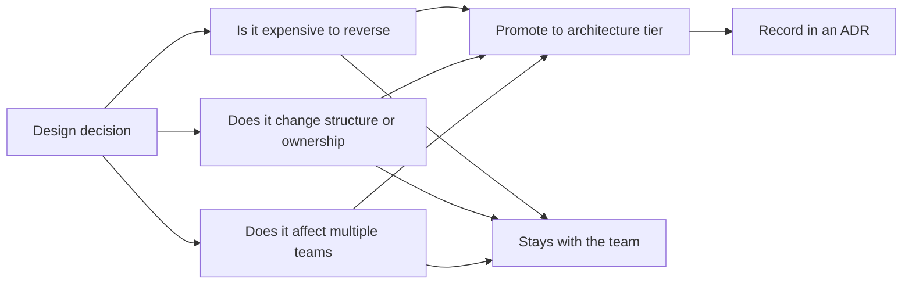

# Architecture vs Design

> **Core skill:** Working the continuum between architecture and detailed design — knowing what architects own, what teams own, and the conditions that move a design decision into the architecture tier.

## Why This Matters

The architecture-versus-design distinction is usually stated as a clean line and practiced as a messy gradient. Textbooks say architecture is the strategic structure and design is the local implementation, but real projects raise concrete questions the textbook does not answer: Who owns the API contract once a second team consumes it? Is the database schema a design artifact or an architectural one? When does a module boundary stop being a refactoring and become a structural commitment?

The architect who cannot answer those questions with a rule either overreaches — reviewing class diagrams that teams should own — or abdicates, discovering only after the migration that a "detail" fixed the system's data ownership model. The cost of the wrong boundary is paid daily: a bottleneck architect slows every team, while an absent one lets irreversible decisions ride in on routine pull requests.

This note frames architecture and design as a continuum with ownership agreements at each tier, defines the handoff boundary explicitly, and gives the three tests — irreversible, structural, cross-cutting — that promote a design decision into architecture.

## The Continuum

| Tier | Typical Decisions | Usual Owner | Change Frequency | Artifact |
|---|---|---|---|---|
| **Strategic** | System boundaries; platform direction; build-versus-buy | Architect with stakeholders | Years | Strategy note; ADR set |
| **Architectural** | Services, interfaces, data ownership, quality budgets | Architect and senior engineers together | Quarters | Architecture description; ADRs |
| **Component design** | Module layout; class structure; algorithms; patterns | Team engineers | Weeks | Design notes; code |
| **Detailed design** | Method signatures; naming; local data structures | Individual engineer | Days | Code; tests |

The tiers are not ranks. They are different decision horizons, and a healthy system has all four moving at different speeds.

## Architecture vs Design at a Glance

| Dimension | Architecture | Detailed Design |
|---|---|---|
| **Question answered** | How will the system be structured to meet its drivers? | How will this part be implemented? |
| **Scope** | System, platform, or domain | Component and module |
| **Reversibility** | Expensive: migration, rewrite, redeployment | Cheap: refactoring inside a boundary |
| **Quality attributes** | Sets and caps targets | Inherits targets as constraints |
| **Consumers** | Multiple teams and systems | The owning team |
| **Artifact** | Views, ADRs, interface contracts | Code, component notes, tests |
| **Failure cost** | Systemic: teams blocked, promises broken | Local: a rework within the team |

The rows move together: decisions with systemic failure cost belong at the architecture tier regardless of how technical they look.

## What Architects Own, What Teams Own

| Concern | Architect Accountability | Team Accountability |
|---|---|---|
| **System boundaries and responsibilities** | Decides and records; negotiates with stakeholders | Implements within the boundary |
| **Interface contracts between teams** | Owns the contract and its evolution rules | Implements and evolves non-breaking changes |
| **Data ownership and flow** | Decides where data lives and who may touch it | Designs the queries and models inside its store |
| **Quality attribute targets** | Sets measurable targets from scenarios | Meets targets; reports evidence |
| **Technology standards** | Names standard choices and exceptions process | Chooses within the standard; proposes exceptions |
| **Internal component structure** | Reviews only when promotion triggers apply | Owns fully; no escalation needed |
| **Deployment topology** | Defines deployable units and environments | Implements pipelines for its units |

The table is a default, not a law: healthy projects renegotiate it explicitly when scale or regulation changes the stakes.

## The Handoff Boundary

The boundary between architect and team is not a document dump; it is a small set of artifacts a team needs to design autonomously.

| Handoff Artifact | What It Conveys | Failing Sign |
|---|---|---|
| **Structural brief** | The context, quality drivers, and chosen structure | Team asks why the system is shaped this way |
| **Interface contracts** | Cross-team APIs, events, and their evolution rules | Integrators reverse-engineer semantics from code |
| **Quality budgets** | Measurable targets: latency, availability, capacity | Targets become slogans with no numbers |
| **Constraint list** | What the team may not change, and why | Constraints discovered at review, not before |
| **Decision records** | Reasoning behind choices already made | Re-litigation of settled questions |
| **Escalation path** | When and how to raise a design for architectural review | Team guesses; some escalate everything, others nothing |

The handoff is bidirectional: the team returns feedback when a constraint does not survive contact with reality, and that feedback is an architecture input, not a complaint.

## When Design Becomes Architecture

Three triggers promote a design decision to the architecture tier. Any one of them is sufficient.

| Trigger | Test Question | Example |
|---|---|---|
| **Irreversible** | Would reversing this cost more than a sprint of focused work? | Database engine; published schema; vendor commitment |
| **Structural** | Does it change boundaries, ownership, or the deployment model? | Service extraction; shared library consolidation |
| **Cross-cutting** | Does it affect multiple teams, or set a rule others must follow? | Authentication approach; logging format; retry standard |

| Boundary Example | Design or Architecture? | Why |
|---|---|---|
| Internal class refactoring | Design | Reversible within the module; one team affected |
| Module layout inside a service | Design, unless teams integrate at module level | Cheap to change while the service holds together |
| REST payload shape for one client | Borderline: design until a second consumer signs | Promotion trigger is consumer count |
| Shared event schema consumed by three teams | Architecture | Cross-cutting contract; expensive to alter |
| Retry and timeout conventions | Architecture when mandated org-wide | Sets behavior for teams that did not choose it |
| Local caching strategy | Design | Contained reversal cost; performance evidence local |

## Working the Boundary

| Collaboration Model | How It Works | Fits When | Risk |
|---|---|---|---|
| **Architect leads** | Architect decides structure; team designs within it | High stakes; early system life; regulated context | Architect becomes bottleneck if overused |
| **Team leads with review** | Team proposes; architect reviews at promotion triggers | Mature teams on stable systems | Review drift if triggers are vague |
| **Embedded architect** | Architect works as a hands-on member of the team | Complex domain; fast-moving product | Role ambiguity with tech lead |
| **Distributed ownership** | Senior engineers across teams own areas; architect coordinates | Large org; established standards | Fragmentation without a coordination rhythm |

## Keeping the Boundary Healthy

Two signals tell the architect the boundary has drifted:

- **Over-escalation:** the team brings class design and naming to architecture review. The boundary is too high; reestablish delegation.
- **Under-escalation:** architecture-relevant decisions appear first in a pull request. The boundary is too low; restate the promotion triggers.

Both signals are fixed the same way: make the promotion triggers explicit, publish them with examples, and audit the review queue against them a quarter later.



## Practical Applications

### Boundary Health Checklist

- [ ] The promotion triggers — irreversible, structural, cross-cutting — are written with examples
- [ ] The handoff artifacts exist: structural brief, interface contracts, quality budgets, constraint list
- [ ] Teams know their delegated territory and do not escalate inside it
- [ ] The architecture review queue contains only promoted decisions
- [ ] Cross-team interfaces have named owners and evolution rules
- [ ] Handoff artifacts are reviewed as the system evolves, not written once

### Handoff Brief Template

```markdown
# Structural Brief: [System or Service]

## Context
[Problem, stakeholders, and constraints that drove the structure]

## Quality Drivers
| Attribute | Target | Scenario Reference |
|---|---|---|
| [latency/availability/...] | [measure] | [scenario id] |

## Chosen Structure
[Boundaries, responsibilities, key interfaces — with the ADRs that decided them]

## Interfaces
| Interface | Owner | Evolution Rule |
|---|---|---|
| [API/event/schema] | [team] | [additive only / versioned / frozen] |

## Constraints the Team Must Respect
[What may not change, and why]

## Escalation Path
[What gets raised, to whom, before implementation]
```

## Common Pitfalls

| Pitfall | Why It Is a Problem | Better Approach |
|---------|---------------------|-----------------|
| **Boundary as a wall** | The architect reviews everything, teams lose ownership and speed | Delegate by default; review only promotion triggers |
| **No boundary at all** | Irreversible decisions ship inside routine pull requests | Publish triggers with concrete examples |
| **Handoff as document dump** | Teams receive artifacts but no rationale; decision re-litigation follows | Pair each artifact with its ADR and revisit conditions |
| **Promotion by surprise** | A detail becomes structural without anyone noticing | Re-test decisions when consumers or scope grow |
| **Title-based ownership** | Whoever has "architect" in their title owns everything | Ownership follows decision type, not org chart |
| **One-way handoff** | Constraints never get feedback from implementation reality | Treat team feedback as an architecture input |

## Success Indicators

- Teams design within their territory without waiting on the architect
- Promoted decisions arrive at review before implementation, not after
- Cross-team interfaces have explicit owners and evolution rules
- Re-litigation of settled design questions is rare and references ADRs
- The architect's calendar is dominated by significant decisions, not approvals

## Related Topics

- [[01_Architectural_Significance]] — the test that defines the promotion boundary
- [[06_The_Architect_Role_in_Context]] — how the boundary maps to roles and mandate
- [[05_Architecture_Across_the_Lifecycle]] — how the boundary moves through delivery models
- [[career-path/05_Tech_Lead/03_Technical_Direction_and_Architecture/00_overview|Technical Direction and Architecture (Tech Lead)]] — the team-side owner of the design tier
- [[career-path/02_Senior_Software_Engineer/03_Architecture_and_Design_Judgment/05_Design_Patterns_Judgment|Design Patterns Judgment (Senior)]] — the pattern-level judgment that lives inside the design tier

## Summary

Architecture and design form a continuum from strategic structure to method-level detail, and the architect's job is not to own the whole continuum but to hold the boundary between what must be coordinated across teams and what can be decided locally. Three tests — irreversible, structural, cross-cutting — promote a design decision to the architecture tier; everything else belongs to the team, supported by a small set of handoff artifacts: structural brief, interface contracts, quality budgets, and constraints. The boundary is kept healthy by watching both failure directions — over-escalation that bottlenecks the team and under-escalation that lets irreversible decisions ship silently — and by treating implementation feedback as legitimate architecture input rather than noise.
