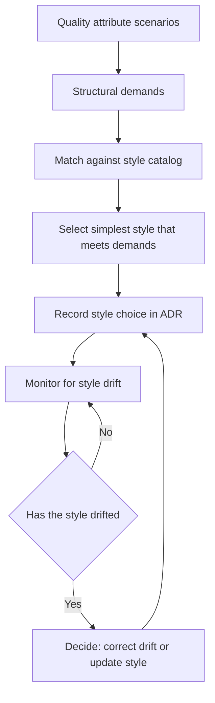

# Architecture Patterns and Styles

> **Core skill:** Selecting the architectural style that fits the problem — using pattern knowledge to match coupling, deployment, team, and data needs to structures that can survive growth, and detecting when the chosen style is drifting.

## Why This Matters

An architectural style is not a fashion choice. It is a set of constraints that determines how the system is built, deployed, operated, and evolved — and those constraints produce a predictable set of benefits and costs. The architect who chooses a style without understanding its trade-offs builds a system whose most expensive problems were decided on day one and will surface only when change becomes painful.

The pattern catalog exists because systems face recurring structural challenges: separating concerns without coupling them, scaling without fragmenting data integrity, evolving without breaking consumers. Each style answers some of those challenges at the expense of others. The architect's job is to match the pattern to the problem — not to start with a pre-committed style and contort the requirements to fit.

Style drift is the silent failure mode: a system that was layered becomes a distributed tangle without anyone deciding to abandon the original style. The architect detects drift before it becomes the architecture, and makes the choice explicit again.

## The Style Catalog

| Style | Core Constraint | Benefits | Costs | Fits When |
|-------|----------------|----------|-------|-----------|
| **Layered** | Components organized in hierarchical layers; each layer depends only on the one below | Simplicity; clear separation; easy to understand | Rigid layering creates pass-through layers; deployment monolithic | Known domain; small-to-medium team; low change rate |
| **Microservices** | Independently deployable services; each owns its data; communicate over network | Independent deployment; team autonomy; scaling per service | Network latency; distributed data consistency; operational complexity | Multiple teams; high change rate; independent scaling needs |
| **Event-Driven** | Components communicate through asynchronous events; producers and consumers are decoupled | Temporal decoupling; extensibility; resilience through buffering | Debugging complexity; eventual consistency; event schema governance | Asynchronous workflows; high ingestion; independent consumers |
| **Hexagonal / Ports and Adapters** | Business logic at center; ports define interfaces; adapters connect to infrastructure | Testability; infrastructure independence; clean domain isolation | Indirection overhead; requires discipline to maintain boundary | Domain-heavy systems; infrastructure variety; long-lived codebases |
| **Service-Oriented Architecture** | Services expose business capabilities; enterprise service bus mediates | Reuse of business capabilities; integration standardization | ESB becomes bottleneck and single point of failure; governance overhead | Large enterprise; many integrated systems; stable business capabilities |
| **Monolith** | Single deployable unit; all components in one process | Simple deployment; fast local development; transactional consistency | Scaling the whole unit; team coupling; technology lock-in | Early product; small team; simple domain |
| **Modulith** | Monolith deployment; modules enforce compile-time and runtime boundaries | Monolith simplicity with enforced modularity; migration path to services | Module discipline must be enforced; still a single deployment | Growing monolith; team that wants boundaries without distribution cost |
| **Space-Based** | Shared in-memory data grid; processing units are stateless; data is partitioned | Linear scalability; low latency; resilience through replication | Complex data consistency; specialized infrastructure; smaller ecosystem | High throughput; low latency; transactional integrity not required |

## Decision Criteria

| Criterion | What It Tests | Style Guidance |
|-----------|--------------|----------------|
| **Coupling tolerance** | How much coupling between components can the system afford? | High → layered/modulith; low → microservices/event-driven |
| **Deployment independence** | Must teams deploy independently? | Yes → microservices; no → modulith/layered |
| **Team topology** | How are teams organized? | Single team → monolith/modulith; many teams → microservices/SOA |
| **Data consistency** | What consistency model does the domain require? | Strong → monolith/modulith; eventual → event-driven/microservices |
| **Scale profile** | Where does load concentrate? | Uniform → layered/modulith; per-component → microservices/space-based |
| **Change rate** | How fast do requirements evolve? | Slow → layered/SOA; fast → microservices/event-driven |
| **Operational maturity** | Can the org operate distributed systems? | Low → monolith/modulith; high → microservices/event-driven |
| **Domain complexity** | Is the domain deep and evolving? | Simple → monolith; complex → hexagonal/event-driven |

## Selecting a Style

The style decision is not a one-time selection from a menu. It is a matching exercise: requirements produce scenarios, scenarios demand structural responses, and the style that best accommodates those responses wins.

1. **Start with quality attribute scenarios** — not with pattern preferences. What must the system do under stress, at scale, under change?
2. **Map scenarios to structural demands** — availability scenarios demand isolation; modifiability scenarios demand boundaries; performance scenarios demand locality.
3. **Evaluate styles against demands** — score each style on its ability to accommodate the structural demands, not on its popularity.
4. **Select the simplest style that meets demands** — prefer monolith over microservices, layered over event-driven, unless the demand requires the costlier option.
5. **Name the style in an ADR** — with the scenarios that drove the choice, so future architects understand why the system is shaped this way.

## Mixing Styles

Most real systems combine styles. A microservices system may use event-driven communication between some services and synchronous calls between others. An application core may be hexagonal while its surrounding platform layer is event-driven.

| Mixing Approach | Description | Risk |
|----------------|-------------|------|
| **Nested styles** | One style inside another — hexagonal services inside an event-driven system | Boundary confusion if not diagrammed |
| **Per-boundary styles** | Different styles for different system boundaries | Inconsistent operational model |
| **Evolutionary mix** | Style changes as the system grows — monolith → modulith → services | Drift if the transition is never completed |

When mixing styles, name the primary style — the one that governs system-level concerns — and treat others as localized decisions within boundaries. Every mixed-style system needs a diagram that shows which style applies where.

## Style Drift Detection

| Drift Signal | What It Looks Like | What It Means |
|-------------|-------------------|---------------|
| **Layer bypass** | A component in layer 3 calls a component in layer 1 directly | The layered constraint is no longer enforced |
| **Service coupling** | Two microservices share a database or deploy together | Services are not independently deployable |
| **Synchronous creep** | Event-driven system increasingly uses synchronous calls for core flows | Eventual consistency is being abandoned |
| **Adapter leakage** | Domain logic imports infrastructure libraries directly | The hexagonal boundary has collapsed |
| **Module erosion** | Modules that were separated by convention now import each other freely | Modulith constraints are not enforced at build time |
| **Monolith fragmentation** | Components extracted from a monolith but still require monolithic deployment | The migration stalled; hybrid complexity is permanent |

Drift is detected by comparison, not by code review: compare the current structure to the named style, and find the deviations. If the deviation is intentional, update the style decision. If it is accidental, the drift must be corrected or the style name no longer describes the system.



## Practical Applications

### Style Selection Checklist

- [ ] The system's primary architectural style is named and documented
- [ ] Style selection is justified by quality attribute scenarios, not by trend
- [ ] Team topology and operational maturity informed the style choice
- [ ] Mixed styles are diagrammed: which style applies where
- [ ] Style drift signals are monitored at each increment boundary
- [ ] The style choice lives in an ADR that new team members can read

### Style Decision Template

```markdown
# Style Decision: [System]

## Quality Attribute Scenarios
| Scenario | Target | Implication for Structure |
|---|---|---|
| [id] | [measure] | [what the structure must provide] |

## Style Options Considered
| Style | Strengths for This System | Weaknesses for This System |
|---|---|---|
| [style] | [benefit] | [cost] |

## Decision
[Primary style], with [secondary style if applicable] at [boundary].

## Justification
[Why this style meets the scenarios better than alternatives]
```

## Common Pitfalls

| Pitfall | Why It Is a Problem | Better Approach |
|---------|---------------------|-----------------|
| **Style by fashion** | Pattern chosen because it is popular, not because it fits | Evaluate styles against quality attribute scenarios |
| **No named style** | Structure emerges without a shared vocabulary; team cannot reason about it | Name the style in an ADR and reference it in team decisions |
| **Monolith-as-default** | The default choice without evaluating whether it will survive growth | Run scenarios at projected scale before committing to monolith |
| **Microservices-as-default** | Distributed complexity inflicted on a system that does not need it | Demand that each service boundary earns its cost |
| **Drift undetected** | The system operates under a style name that no longer describes it | Compare structure to style at each increment; correct or update |
| **Mixed without diagram** | Styles mix without anyone knowing which governs where | Diagram the style map; put it in the architecture description |

## Success Indicators

- The team can name the system's architectural style and its driving scenarios
- Style drift is detected and addressed within one increment
- New joiners learn the style from the ADR and the diagram, not from tribal knowledge
- Style decisions are revisited when team topology or scale changes materially
- The system's style choice withstands a "why not the other one" challenge from a peer

## Related Topics

- [[04_Architecture_Decision_Making]] — the decision process that produces style choices
- [[07_Architecture_and_Quality_Attributes]] — the drivers that determine which style fits
- [[05_Architecture_Across_the_Lifecycle]] — how style evolves across delivery models
- [[career-path/02_Senior_Software_Engineer/03_Architecture_and_Design_Judgment/05_Design_Patterns_Judgment|Design Patterns Judgment (Senior)]] — component-level patterns inside the style
- [[career-path/05_Tech_Lead/03_Technical_Direction_and_Architecture/00_overview|Technical Direction and Architecture (Tech Lead)]] — the team-side application of the chosen style

## Summary

Architectural styles are sets of constraints that produce predictable benefits and costs, and the architect's responsibility is to match style to problem — not to pre-commit and contort requirements to fit. The catalog spans layered, microservices, event-driven, hexagonal, SOA, monolith, modulith, and space-based, each evaluated against coupling tolerance, deployment independence, team topology, data consistency, scale profile, change rate, operational maturity, and domain complexity. Most systems mix styles; the primary style must be named and diagrammed. Style drift is detected by comparing current structure to named style at each increment, and addressed by either correcting the drift or updating the style decision — so the name always describes reality.