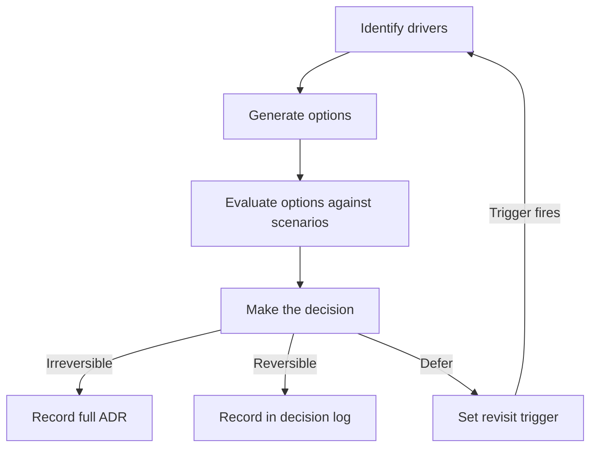

# Architecture Decision Making

> **Core skill:** Running a structured decision process — drivers to options to evaluation to decision to record — that makes structural choices deliberate, reviewable, and reversible on known timelines.

## Why This Matters

Every architecture decision shapes the system's future, but the quality of those decisions depends on the quality of the process that produced them. Decisions made by gut feel produce systems nobody can explain; decisions made by committee produce compromises that satisfy no requirement; decisions deferred produce drift that accumulates silently until reversal is too expensive. The architect's discipline is a structured process that makes each choice deliberate, evaluated against criteria, and recorded so someone who was not in the room can understand why the system looks the way it does.

Structured decision making is not bureaucracy. It is the minimum viable process that prevents the four failure modes: deciding without evidence, deciding without examining alternatives, deciding without recording why, and delaying decisions until the default answer hardens into the architecture. An ADR is not paperwork; it is the residue of a defensible decision.

The architect also judges when not to decide: some choices belong to teams, some are reversible enough to delegate, and some can wait for more information. The skill is knowing which decisions get which treatment.

## The Structured Decision Process

| Phase | Activity | Output | Duration |
|-------|----------|--------|----------|
| **Drivers** | Identify the forces that require a decision: business goals, quality attributes, constraints, risks | Prioritized driver list | Hours to days |
| **Options** | Generate candidate solutions; include "do nothing" as a baseline | Option set with brief descriptions | Days |
| **Evaluation** | Assess each option against drivers using scenarios and criteria | Evaluation matrix | Days to a week |
| **Decision** | Select the option; name the trade-offs accepted | Decision statement | One meeting |
| **Record** | Write the ADR: context, decision, consequences, alternatives considered | ADR committed to repository | Hours |

The phases are sequential but not gated: new drivers discovered during evaluation return to the drivers phase; an option that surfaces a missed constraint returns to options. The process is a loop, not a waterfall.

## Drivers

Drivers are the forces that make the decision necessary and that constrain its answer. They come from multiple sources:

| Driver Category | Source | Examples |
|----------------|--------|----------|
| **Business** | Product, revenue, compliance | Time-to-market deadline; regulatory requirement; cost constraint |
| **Quality attributes** | Scenarios and targets | Latency p99 < 200ms; availability 99.95%; audit trail completeness |
| **Technical constraints** | Existing systems, team skills, platform | Must integrate with legacy CRM; team knows Python not Go; AWS-only policy |
| **Architecture principles** | Agreed-upon design rules | Services own their data; prefer async over sync; no vendor lock-in |
| **Risks** | Known unknowns and threats | Uncertain scale projection; vendor stability; technology maturity |

A driver without a measurable consequence is a preference, not a driver. The architect's job is to convert preferences into testable statements: "The system should be fast" becomes "Page load time under 2 seconds at p95 for 10,000 concurrent users."

## Generating Options

| Option Generation Rule | Why |
|------------------------|-----|
| **Always include the status quo** | "Do nothing" or "keep current" is a real option with known costs |
| **Include at least one option from outside the comfort zone** | Prevents local-optimum trap; borrow, buy, or unconventional |
| **Every option must be structurally distinct** | Two options that differ only in vendor or library are one option |
| **For two options, ask what a third would be** | Binary choices produce false dichotomies; a third reveals assumptions |
| **Eliminate infeasible options early** | Document why an option was removed so the reasoning survives |

Option generation is a divergent phase: quantity over quality, no evaluation yet. The architect creates the space; evaluation narrows it.

## Evaluation

| Evaluation Tool | What It Does | When to Use |
|----------------|--------------|-------------|
| **Scenario-based evaluation** | Each option is tested against quality attribute scenarios | When quality attributes drive the decision |
| **Decision matrix** | Options scored against weighted criteria | When criteria are clear and quantifiable |
| **Trade-off analysis** | Each option's costs and benefits listed side by side | When options represent genuine trade-offs, not rankable choices |
| **Risk assessment** | Each option's risks identified and mitigation named | When options carry different risk profiles |
| **Prototype or spike** | Build just enough to answer the specific question | When evaluation requires empirical data |
| **Peer review** | Another architect or senior engineer reviews the evaluation | Before any decision that will be hard to reverse |

```markdown
# Decision Matrix Template

| Criterion | Weight | Option A Score | Option B Score | Option C Score |
|-----------|---|--------|--------|--------|
| Meets latency scenario | 3 | 4 | 3 | 5 |
| Team can operate | 2 | 5 | 4 | 2 |
| Cost over 3 years | 2 | 3 | 5 | 4 |
| Migration effort | 1 | 4 | 2 | 3 |
| **Weighted total** | | **33** | **30** | **30** |
```

Weights make preferences explicit; scores make assessments testable. A matrix that produces a surprising result is often right — it surfaced criteria that intuition undervalued.

## Reversible vs Irreversible Decisions

| Decision Type | Characteristics | Process | Record |
|--------------|----------------|---------|--------|
| **Type 1: Irreversible** | Costly to reverse; broad blast radius; quality attribute impact | Full process; stakeholder review; named revisit triggers | ADR required |
| **Type 2: Reversible with cost** | Reversible in weeks; limited blast radius | Accelerated process; team review | Lightweight decision log |
| **Type 3: Easily reversible** | Reversible in hours or days; contained impact | Decide fast; delegate to team | Optional; code comment or commit message |

The distinction is not academic: Type 1 decisions that skip evaluation produce the most expensive mistakes, while Type 3 decisions that undergo full process waste everyone's time. The architect's triage skill is matching process weight to reversal cost.

## When to Decide, Delegate, Defer

| Action | Trigger | Example |
|--------|---------|---------|
| **Decide now** | Decision is blocking progress; cost of delay exceeds cost of being wrong | Database engine choice blocking schema design |
| **Delegate** | Decision is contained within one team's boundary; reversal cost is low | Module layout inside a service |
| **Defer with a trigger** | Information is missing but will arrive by a known date | Scale numbers from load test arriving next sprint |
| **Defer and accept the default** | Decision is not consequential enough to invest in; the default is acceptable | Framework version within a supported range |

A deferred decision without a trigger is a decision abandoned. The architect names the trigger — the event or date that will re-open the choice — and records it so the deferral is visible and time-bound.

## The Decision Delayed as Drift

Every architecture decision not made is a decision made by default. The system accumulates the path of least resistance, and the architect who did not decide on a database strategy discovers the team has chosen for them — one service at a time, inconsistently.

| Deferral Failure Mode | What Happens | Prevention |
|-----------------------|-------------|------------|
| **Deferral without a trigger** | Decision never re-opens; default hardens | Every deferred decision has a named revisit date or event |
| **Deferral without a record** | Nobody remembers a decision was deferred | Deferred decisions appear in the decision log like any other outcome |
| **Deferral cascade** | One deferred decision blocks three others that depend on it | Identify dependency chains; decide the root decision or accept it as a constraint |
| **Deferral as avoidance** | "We'll decide later" used to avoid hard trade-offs | Audit deferred decisions quarterly; escalate those past their trigger with no action |

## ADR as the Decision Record

The Architecture Decision Record is the standard output of the process. It captures:

```markdown
# ADR-XXX: [Title]

## Status
[Proposed / Accepted / Deprecated / Superseded by ADR-YYY]

## Context
[What problem required a decision; what drivers are in play; what constraints apply]

## Decision
[What was decided, in one sentence]

## Alternatives Considered
| Alternative | Why Not Chosen |
|---|---|
| [Option B] | [Trade-off or shortfall] |

## Consequences
### Positive
[What improves]
### Negative
[What costs or constraints are accepted]
### Neutral
[What is noted but neither positive nor negative]

## Revisit Triggers
[Conditions under which this decision should be re-examined]
```

The ADR is not the process — it is the record of the process. If the ADR cannot be written because the decision was not evaluated, the process failed.



## Practical Applications

### Decision Process Checklist

- [ ] Every architecturally significant decision follows the drivers→options→evaluation→decision→record path
- [ ] All options include the status quo baseline and at least one unconventional alternative
- [ ] Evaluation uses scenarios, not intuition, wherever quality attributes are at stake
- [ ] Process weight matches reversal cost: full process for Type 1, lightweight for Type 2, delegation for Type 3
- [ ] Deferred decisions have named revisit triggers and are tracked in the decision log
- [ ] ADRs record alternatives considered and negative consequences — not only the winning argument

### Decision Log Entry Template

```markdown
# Decision Log Entry: [Title]

- **Date:** [YYYY-MM-DD]
- **Type:** [Architectural / Design / Operational]
- **Decision:** [one sentence]
- **Alternatives:** [list with brief rejection reasons]
- **Reversal Cost:** [hours / days / weeks / months / irreversible]
- **Revisit Trigger:** [condition or date, or "none"]
```

## Common Pitfalls

| Pitfall | Why It Is a Problem | Better Approach |
|---------|---------------------|-----------------|
| **Deciding without alternatives** | The first option becomes the only option; hidden costs undiscovered | Generate at least three options including the status quo |
| **Gut-feel evaluation** | Decisions are unreviewable because reasoning is private | Use scenarios and matrices; make criteria explicit |
| **Process weight mismatch** | Reversible decisions get heavy process; irreversible ones get light | Match process to reversal cost; delegate low-cost decisions |
| **Deferral without a trigger** | Decisions disappear until they become crises | Every deferred decision gets a named revisit condition |
| **Winning-argument ADR** | ADR records only the chosen option's case; alternatives are strawmen | Record each alternative's genuine strengths and real weaknesses |
| **Decision debt ignored** | Accumulated deferred decisions harden into accidental architecture | Audit the deferred-decision queue quarterly |

## Success Indicators

- Architecture decisions cite evaluated alternatives and trade-offs accepted
- ADRs are readable by someone who was not in the decision meeting
- Deferred decisions have triggers and are revisited when triggers fire
- The team can distinguish Type 1, Type 2, and Type 3 decisions without the architect present
- Decision process duration correlates with decision significance, not with meeting availability

## Related Topics

- [[01_Architectural_Significance]] — the test that determines whether a decision needs this process
- [[02_Architecture_vs_Design]] — which decisions belong at the architecture tier
- [[03_Architecture_Patterns_and_Styles]] — the style choices that this process produces
- [[career-path/02_Senior_Software_Engineer/03_Architecture_and_Design_Judgment/04_Architecture_Decision_Records|Architecture Decision Records (Senior)]] — the ADR format and lifecycle in practice
- [[career-path/02_Senior_Software_Engineer/08_Engineering_Economics_and_Trade_Offs/06_Trade_Off_Evaluation|Trade Off Evaluation (Senior)]] — the evaluation discipline that feeds this process

## Summary

Architecture decision making is a structured process — drivers, options, evaluation, decision, record — that turns structural choices from intuition into deliberate, reviewable commitments. The process weight matches the reversal cost: irreversible decisions get full evaluation and an ADR; easily reversible decisions are delegated to the team. Deferral is a legitimate outcome only when paired with a named revisit trigger; without one, deferred decisions accumulate as decision debt that hardens into accidental architecture. The ADR is the visible residue: it captures what was decided, what was considered, what trade-offs were accepted, and when the decision should be revisited — so that future architects can understand, challenge, and if necessary reverse the choice with the same evidence that produced it.