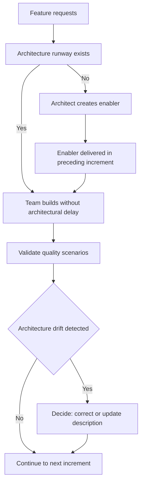

# Architecture Across the Lifecycle

> **Core skill:** Embedding architecture inside delivery — applying the just-enough-architecture principle so that structure is intentional without becoming a phase that blocks progress.

## Why This Matters

Architecture has a lifecycle problem. Waterfall treats architecture as an upfront phase whose output is handed off to implementation — producing shelfware documents and a structure designed for requirements that no longer exist by the time the system ships. Agile's reaction was to treat architecture as emergent — but emergence without intention produces systems that look like the first path taken through them, shaped by the order features were built rather than by structural reasoning.

The architect who cannot operate across the lifecycle is either ignored (the team builds without architecture) or resented (the architect blocks delivery with upfront design). The alternative is a discipline you might call just-enough architecture: structural decisions made at the last responsible moment, embedded in increment delivery, and validated by working software rather than by document review. This note covers the three paradigms — upfront, incremental, continuous — and the practices that keep architecture intentional while delivery stays fast.

## The Three Paradigms

| Dimension | Waterfall / Upfront | Agile / Incremental | Continuous |
|-----------|-------------------|---------------------|------------|
| **When architecture happens** | Before development, as a phase | Each increment, as a parallel concern | In the delivery pipeline, as automated validation |
| **Architecture artifact** | Comprehensive document | Evolving views and ADRs per increment | Fitness functions; automated checks |
| **Decision window** | Once, at project start | At the last responsible moment in each increment | Continuously, as drift is detected |
| **Validation** | Review against the document | Working software meets quality scenarios | Pipeline gates enforce architectural rules |
| **Reaction to change** | Change request; re-planning | Backlog adjustment; architecture stories | Automated detection; team corrects in flight |
| **Primary risk** | Architecture obsoleted by requirements change before delivery | Architecture fragmented across increments; no whole-system view | False positives from automated checks; rigidity of pipeline rules |

The paradigm is not a choice of religion. It is a calibration: how much architecture, how early, and how validated — matched to the system's stakes, change rate, and team maturity.

## The Just-Enough-Architecture Principle

Just-enough architecture is not minimal architecture; it is architecture proportional to risk. The principle has four applications:

| Application | What It Means | How to Apply |
|-------------|---------------|--------------|
| **Decide at the last responsible moment** | Delay decisions until deferral costs more than being wrong, but not beyond | Set a trigger date for each decision; decide when the trigger fires or the cost of indecision crosses the threshold |
| **Design for the known, accommodate the unknown** | Structure for current requirements; leave extension points for plausible futures | Build extension points only where change is forecast by quality scenarios; do not build for every hypothetical |
| **Validate with working software** | Architecture is not real until code exercises it | Every increment delivers running code that exercises one or more architectural decisions |
| **Record decisions, not specifications** | ADRs carry the reasoning; code carries the structure | Write ADRs for structural decisions; keep architecture description at the view level, not the specification level |

The principle does not mean "no upfront architecture." It means upfront architecture limited to decisions that cannot be deferred — system boundaries, platform commitments, regulatory constraints — and everything else deferred to increment delivery.

## Intentional Architecture in Iterative Delivery

| Practice | What It Does | How to Execute |
|----------|-------------|----------------|
| **Architecture runway** | Keeps architectural work ahead of feature delivery by one or two increments | Architect identifies structural prerequisites for upcoming features and shapes them before the features need them |
| **Architecture spikes** | Prototype a structural uncertainty before committing it to the system | Time-boxed exploration; output is an ADR proposal, not production code |
| **Architecture stories** | Structural work expressed as backlog items alongside features | "Extract reporting service from monolith" with acceptance criteria drawn from quality scenarios |
| **Increment validation** | Each increment tests architecture assumptions with running code | Quality attribute scenarios tested in the increment, not deferred to a later phase |
| **Architecture sync** | A short recurring sync between architect and teams to detect drift | 30 minutes per increment; compare emerging structure to architecture description; identify deviations |
| **Living architecture description** | Views and ADRs updated as the system evolves, not written once | Architecture description changes in the same increment as the structural change it documents |

## Architecture Runway in SAFe

The Scaled Agile Framework formalizes architecture runway as "existing code, components, and technical infrastructure needed to implement near-term features without excessive redesign and delay." The architect's responsibility is to maintain enough runway that feature teams are not blocked by missing structure.

| Runway Element | Architect's Role | Evidence of Sufficiency |
|---------------|------------------|------------------------|
| **Enabler epics** | Define structural enablers; sequence them before dependent features | Features ship in planned increments without architectural rework |
| **Intentional architecture** | Maintain system-level views and ADRs; define architectural guidelines | Teams can make component-level decisions without architectural consultation |
| **Nonfunctional requirements** | Convert quality needs into measurable scenarios and backlog constraints | Quality scenarios pass in each increment |
| **Technology portfolio** | Manage technology choices, versions, and migration paths | Technology debt is visible and planned, not discovered |

## Technical Debt vs Intentional Pragmatism

| Category | Definition | Handling |
|----------|-----------|----------|
| **Technical debt** | A deliberate shortcut that will cost more later; known, tracked, and scheduled for repayment | Record in the backlog with repayment conditions; do not let it accumulate silently |
| **Intentional pragmatism** | A simpler solution chosen because the full architecture is not yet justified; not debt because the cost of the full solution now exceeds its value | Name the trigger that would justify the full solution; do not repay until the trigger fires |
| **Accidental complexity** | Structural complication that accumulated without a decision; the most expensive category | Refactor when discovered; add the structural decision that was missing |
| **Strategic investment** | Upfront architectural work that reduces future cost or risk; justified by projected savings | Record in an ADR with the projected benefit; verify the benefit materialized |

The distinction between technical debt and intentional pragmatism is the presence or absence of a plan: debt is tracked and scheduled; pragmatism is a conscious choice with a named trigger for revisiting. The architect's job is to keep debt visible and pragmatism honest — not to pretend every shortcut is a strategy.



## Practical Applications

### Lifecycle Integration Checklist

- [ ] Architecture decisions are made at the last responsible moment, not at project kickoff
- [ ] Architecture runway extends one to two increments ahead of feature delivery
- [ ] Every increment validates at least one architectural decision with running code
- [ ] Architecture description is updated in the same increment as the structural change
- [ ] Technical debt is tracked, visible, and scheduled — not accumulated silently
- [ ] Intentional pragmatism is paired with a named trigger for revisiting

### Architecture Runway Assessment Template

```markdown
# Architecture Runway Assessment: [Increment]

| Upcoming Feature | Structural Dependency | Runway Status | Action |
|---|---|---|---|
| [feature] | [needed component, boundary, or capability] | [ready / in progress / missing] | [none / enabler story / spike] |
```

## Common Pitfalls

| Pitfall | Why It Is a Problem | Better Approach |
|---------|---------------------|-----------------|
| **Architecture as a phase** | Architecture happens once, upfront, in isolation from delivery — and is obsolete by the time code ships | Embed architecture in increment delivery; validate with working software |
| **Emergence without intention** | Structure is whatever survived the first path through the backlog | Maintain intentional architecture; review structure at increment boundaries |
| **Runway too short** | Feature teams blocked waiting for structural work to complete | Maintain runway one to two increments ahead of feature demand |
| **Runway too long** | Architectural work far ahead of features builds what is never used | Stop runway at two increments; any further is speculation |
| **Debt unmeasured** | Shortcuts accumulate without visibility or repayment plan | Log every deliberate shortcut with repayment conditions |
| **Pragmatism as camouflage** | Every shortcut labeled "intentional pragmatism" to avoid accountability | Require a named revisit trigger for every pragmatic choice |

## Success Indicators

- Features ship in planned increments without architectural rework surprises
- Architecture description reflects the current system, not the system as designed
- Technical debt is visible, sized, and has a repayment schedule
- The team can explain which decisions were deferred and what triggers will reopen them
- Architecture runway is maintained without speculative over-building

## Related Topics

- [[02_Architecture_vs_Design]] — how the architecture-design boundary moves through the lifecycle
- [[04_Architecture_Decision_Making]] — the decision process that operates inside increment delivery
- [[07_Architecture_and_Quality_Attributes]] — quality scenarios as increment validation targets
- [[06_Deployability_and_Operability]] — deployment architecture as a lifecycle concern
- [[career-path/05_Tech_Lead/03_Technical_Direction_and_Architecture/00_overview|Technical Direction and Architecture (Tech Lead)]] — the team-side owner of increment architecture

## Summary

Architecture across the lifecycle means embedding structural decisions inside delivery rather than treating them as a separate phase. The just-enough-architecture principle governs: decide at the last responsible moment, design for the known, validate with working software, and record decisions rather than specifications. In incremental delivery, architecture runway keeps structural work one to two increments ahead of features; technical debt is tracked and scheduled while intentional pragmatism is paired with a named revisit trigger. The architect's value is not in producing a comprehensive document at project start — it is in keeping the structure intentional through every increment, validated by running code, and visible to anyone who needs to understand why the system looks the way it does.