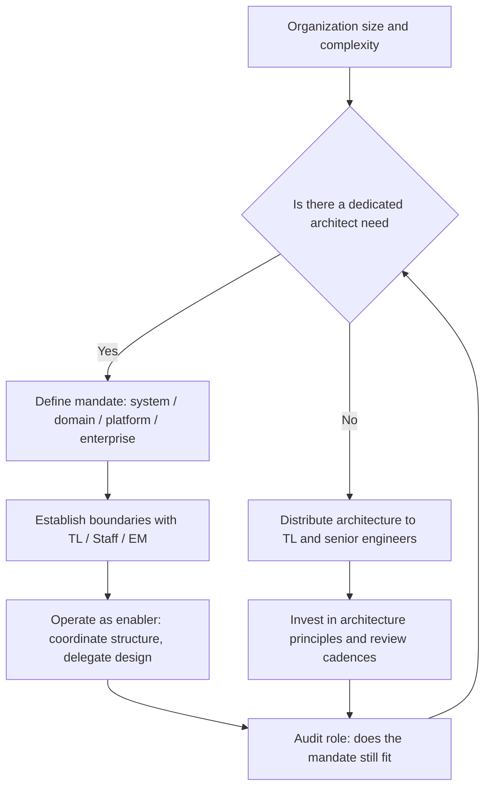

# The Architect Role in Context

> **Core skill:** Operating the architect role within an engineering organization — knowing its scope and mandate, its boundaries with Tech Lead and Staff Engineer, and when an org needs a dedicated architect versus distributed architecture responsibility.

## Why This Matters

The architect role is one of the least standardized in software engineering. In some organizations the architect is a gatekeeper who approves every design; in others the title does not exist and architecture is everybody's job; in still others the architect is a senior developer with a fancier title but no distinct mandate. The result is confusion about who owns structure, who may make binding decisions, and who is accountable when the system's shape becomes a problem.

Role clarity matters because it determines where architecture attention goes and who is allowed to spend it. When the architect is undefined, structural decisions happen anyway — made by whoever reaches them first, with no coordination and no record. When the architect is over-defined, every cross-team interface waits on a single person's approval and delivery slows to that person's throughput.

This note positions the architect among neighboring roles — Tech Lead, Staff Engineer, Engineering Manager — and gives criteria for when a dedicated architect is worth the title and when distributed architecture responsibility is the better fit.

## Architect vs Neighboring Roles

| Dimension | Software Architect | Tech Lead | Staff Engineer | Engineering Manager |
|-----------|-------------------|-----------|---------------|---------------------|
| **Primary concern** | System structure and quality attribute outcomes | Team delivery and technical direction | Cross-team technical strategy and organizational leverage | People, process, and delivery |
| **Scope** | System, platform, or domain | One team's services and codebase | Multiple teams; organizational patterns | Team or department |
| **Decisions owned** | Structural boundaries, quality budgets, technology standards | Component design, implementation approach, team practices | Technical strategy, architecture principles, org-wide standards | Hiring, performance, prioritization, stakeholder management |
| **Authority type** | Influence and decision rights over structure; rarely reports to | Technical authority over team's code and practices | Organizational influence; rarely direct authority | Direct authority over team members |
| **Reports to** | CTO, Head of Architecture, or Engineering Director | Engineering Manager or Architect | Senior IC track; reports to Director or VP | Director of Engineering |
| **IC vs manager** | Individual contributor, often hands-on | Individual contributor, hands-on | Individual contributor, non-manager | Manager, non-coding or light coding |

The roles overlap at the edges: a Tech Lead may own architecture for their team's services; a Staff Engineer may set architecture principles across teams; an Architect may influence team practices. The distinctions are defaults, not walls, and healthy orgs let them flex with context.

## Scope and Mandate

| Mandate Model | Architect's Domain | Decision Authority | Fits When |
|--------------|-------------------|-------------------|-----------|
| **System architect** | One system or product | Decides system-level structure; delegates component design to teams | Single product with cross-team complexity |
| **Domain architect** | A business domain spanning multiple systems | Decides domain data models, integration patterns, and quality standards | Multiple systems serving the same business domain |
| **Platform architect** | The shared platform and infrastructure | Decides platform capabilities, APIs, and standards | Internal platform serving multiple product teams |
| **Enterprise architect** | Technology strategy across the organization | Sets technology standards, principles, and governance; rarely decides per-system structure | Large enterprise with many systems and teams |
| **Solution architect** | One solution spanning multiple systems | Decides how systems integrate to deliver a business capability | Project-based work crossing system boundaries |

The mandate is more useful than the title. A person titled "Software Architect" with a system-architect mandate operates differently from the same title with a platform mandate. The architect's first question is always: what system, domain, or platform am I responsible for shaping — and what authority do I have over it?

## Multi-Role Teams

In smaller organizations or teams, one person plays multiple roles. The combination changes behavior:

| Combined Role | Strengths | Risks |
|--------------|-----------|-------|
| **Tech Lead + Architect** | Decisions reach code quickly; no handoff friction | Architecture becomes tactical; long-term structure under-weighted |
| **Architect + Staff Engineer** | Broad structural view paired with organizational influence | Role confusion for other teams; hard to maintain both scopes |
| **Architect + Engineering Manager** | Structure and staffing aligned; team shaped to architecture | Conflict of interest: manager incentives may override architectural integrity |
| **Team doing architecture collectively** | Distributed ownership; no bottleneck | No accountability for whole-system structure; nobody can say why it is shaped that way |

When one person plays architect among other roles, the risk is always the same: urgent work crowds out important structural thinking. The mitigation is a recurring architecture cadence — a half-day per increment reserved for structure, protected from feature pressure. Without it, the architect portion of the role is always the first to be deferred.

## The Architect as Enabler, Not Gatekeeper

| Gatekeeper Model | Enabler Model |
|-----------------|---------------|
| Architecture review is an approval gate before teams can proceed | Architecture review is a collaborative checkpoint; teams own their designs |
| Architect decides what teams may do | Architect defines what teams must coordinate and why |
| Teams escalate decisions upward | Teams make decisions downward and escalate only structural ones |
| Architecture documentation is a compliance artifact | Architecture documentation is a shared understanding tool |
| The architect's calendar is full of approval meetings | The architect's calendar is full of design collaboration and forward planning |

The enabler model does not mean the architect never says no. It means the architect says no to structural choices that would degrade the system's quality attributes — with evidence — and delegates everything else. The architect's most valuable word is not "approved" or "rejected"; it is "here is the constraint you must respect, and here is why."

## When an Org Needs a Dedicated Architect

| Signal | What It Means | Action |
|--------|---------------|--------|
| **Cross-team structural conflicts** | Teams make incompatible choices about interfaces, data, or technology | Appoint a system or domain architect to coordinate |
| **Quality attribute gaps** | The system meets functional requirements but fails performance, availability, or security tests | A dedicated architect to own quality attribute scenarios and tactics |
| **ADR accumulation with no owner** | Decisions are recorded but nobody curates, revisits, or enforces them | An architect to own the ADR set and its lifecycle |
| **Architecture knowledge concentrated in one person without the title** | An engineer is doing the architect's work but without mandate or recognition | Formalize the role; give the title and the authority |
| **Growth requiring structural change** | The system must change shape to accommodate new scale or teams | A dedicated architect to lead the structural transition |

| Signal | What It Means | Action |
|--------|---------------|--------|
| **Single team, simple domain** | Architecture complexity does not justify a dedicated role | Distribute architecture responsibility to the Tech Lead and senior engineers |
| **Mature platform with stable boundaries** | The platform's structure is settled; decisions are operational, not architectural | Transition to platform engineering with architectural guidelines, not a dedicated architect |
| **Strong senior engineering culture** | Senior engineers already own structural decisions within clear principles | Keep architecture distributed; invest in architectural principles and review cadences |

The decision to create or eliminate a dedicated architect role follows the same logic as any architectural decision: what is the cost of not having the role, and who will pay it? When the cost is structural drift, quality degradation, and re-litigated decisions, the role is worth creating. When the cost is zero — because the structure is stable and the team coordinates itself — the role is overhead.



## Practical Applications

### Role Clarity Checklist

- [ ] The architect's mandate is explicit: system, domain, platform, or enterprise
- [ ] Boundaries with Tech Lead, Staff Engineer, and Engineering Manager are named and agreed
- [ ] The architect operates as an enabler — coordinating structure, delegating design — not as a gatekeeper
- [ ] In multi-role situations, a recurring architecture cadence exists and is protected from feature pressure
- [ ] Architecture knowledge is distributed: at least one other person can explain the system's structure
- [ ] The decision to have a dedicated architect is periodically re-examined against organizational needs

### Role Charter Template

```markdown
# Architect Role Charter: [Name or Title]

## Mandate
[System / domain / platform / enterprise — and what decisions that includes]

## Scope
| Concern | Owned by Architect | Owned by Others |
|---|---|---|
| [structural concern] | [decides / coordinates / advises] | [Tech Lead / Staff / Team] |

## Boundaries
- With Tech Lead: [what the architect does not decide at team level]
- With Staff Engineer: [how strategic direction and system structure intersect]
- With Engineering Manager: [who owns prioritization and resourcing]

## Operating Model
[How architecture decisions are made, recorded, communicated, and revisited]
```

## Common Pitfalls

| Pitfall | Why It Is a Problem | Better Approach |
|---------|---------------------|-----------------|
| **Architect as gatekeeper** | All design flows through one person; teams lose ownership and speed | Define what must be coordinated; delegate everything else |
| **Title without mandate** | "Architect" is a prestige title with no decision authority or accountability | Pair the title with an explicit charter and decision rights |
| **Architect in isolation** | Structural decisions made without team input or validation | Embed architecture in increment delivery; work with teams, not above them |
| **Role confusion with Tech Lead** | Two people think they own the same structural decisions | Write a role charter that names the boundary explicitly |
| **No architect when one is needed** | Structural drift accumulates; nobody can fix it because nobody owns it | Recognize the signals and create the role before structural debt is unmanageable |
| **Permanent architect assumption** | The role is created and never re-examined, even when structure stabilizes | Audit the role annually: does the mandate still justify a dedicated person |

## Success Indicators

- Teams know which structural decisions they own and which require coordination
- The architect's calendar is dominated by structural work, not approval meetings
- Architecture decisions survive the architect's absence — the role enables, it does not bottleneck
- Cross-team structural conflicts are resolved before they reach production
- The organization can answer "why do we have a dedicated architect" with a current rationale, not a historical one

## Related Topics

- [[02_Architecture_vs_Design]] — how the role boundary maps to the architecture-design boundary
- [[04_Architecture_Decision_Making]] — the decision process the architect runs
- [[career-path/05_Tech_Lead/03_Technical_Direction_and_Architecture/00_overview|Technical Direction and Architecture (Tech Lead)]] — the closest neighboring role
- [[career-path/03_Staff_Engineer/02_Cross_Team_Technical_Leadership/01_Cross_Team_Architecture|Cross Team Architecture (Staff)]] — the Staff-level counterpart across teams
- [[career-path/15_Solutions_and_Enterprise_Architect/00_overview|Solutions and Enterprise Architect]] — the enterprise-scope counterpart

## Summary

The architect role operates in the space between Tech Lead, Staff Engineer, and Engineering Manager — owning system structure and quality attribute outcomes while delegating component design to teams. The role's mandate must be explicit: system, domain, platform, or enterprise, each with distinct scope and decision authority. Multi-role teams where one person plays architect must protect architecture time with a recurring cadence. The architect operates as an enabler — coordinating what must be shared, delegating what can be local — rather than as a gatekeeper. The decision to have a dedicated architect follows the same logic as any architectural decision: is the cost of structural drift and re-litigation higher than the cost of the role? When it is, the role earns its place; when it is not, distributed architecture with strong principles and review cadences is the better fit.