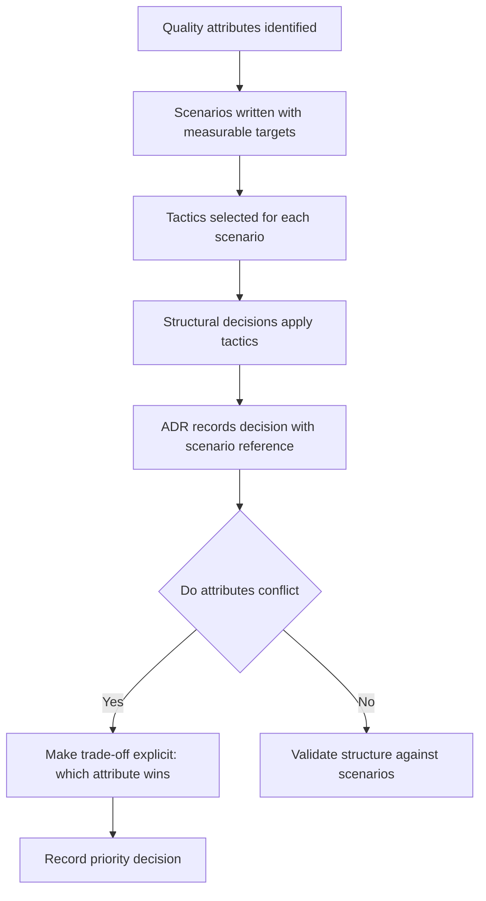

# Architecture and Quality Attributes

> **Core skill:** Treating quality attributes as first-class architecture drivers — using the ISO 25010 catalog to identify which qualities matter, measuring them with scenarios, and letting them shape structure before functional requirements do.

## Why This Matters

Functional requirements tell you what the system must do. Quality attributes tell you how well it must do it — and those qualities drive structure more than any feature ever will. A system can satisfy every user story and still fail: it can be too slow to use, unavailable when needed, or impossible to change without breaking. Functional requirements shape code; quality attributes shape architecture. The architect who designs structure around features discovers this in production. The architect who designs structure around quality attributes discovers it in design reviews, where it is cheap.

Quality attributes are not a checklist to be satisfied at the end. They are inputs to every structural decision, and they often conflict: the structure that optimizes for performance is rarely the structure that optimizes for modifiability. The architect's job is to make the conflicts explicit, decide which quality wins for each structural choice, and record the trade-off so the next architect understands the priorities that shaped the system.

This note introduces the quality attribute catalog — ISO 25010 as the reference taxonomy — and shows how to convert quality attributes from adjectives ("secure," "fast") into measurable architecture drivers with scenarios, tactics, and structural consequences.

## The Quality Attributes Catalog

ISO 25010 defines eight product quality characteristics. Each drives architecture in a distinct way:

| Quality Attribute | What It Means for Architecture | Structural Consequence |
|-------------------|-------------------------------|----------------------|
| **Performance** | Response time, throughput, resource utilization under load | Determines component granularity, caching topology, and communication style |
| **Security** | Confidentiality, integrity, availability, accountability, authenticity | Determines trust boundaries, encryption points, and authentication gates |
| **Availability** | System readiness for use; uptime and recovery time | Determines redundancy, failover design, and isolation zones |
| **Reliability** | System behavior under specified conditions over time | Determines fault tolerance, retry patterns, and error recovery paths |
| **Modifiability** | Ease with which the system can be changed | Determines modularity, interface stability, and configuration-driven behavior |
| **Usability** | Ease of use, learnability, accessibility | Determines interaction architecture, error handling, and feedback mechanisms |
| **Interoperability** | Ability to exchange information with other systems | Determines integration patterns, protocol choices, and data format standards |
| **Deployability** | Ease of deployment and operational management | Determines deployable unit design, environment configuration, and release mechanisms |

Additional quality attributes not in ISO 25010 but common in practice:

| Quality Attribute | What It Means for Architecture | Structural Consequence |
|-------------------|-------------------------------|----------------------|
| **Scalability** | Ability to handle growing workload by adding resources | Determines partitioning strategy, statelessness, and resource elasticity |
| **Testability** | Ease with which the system's correctness can be verified | Determines component isolation, dependency injection, and observation points |
| **Observability** | Ability to infer internal state from external outputs | Determines logging, metrics, and tracing integration points |
| **Portability** | Ease of moving the system to different environments | Determines abstraction layers and platform dependencies |
| **Compliance** | Adherence to laws, regulations, and standards | Determines audit trails, data residency, and access controls |

## Quality Attributes vs Functional Requirements

| Dimension | Functional Requirements | Quality Attributes |
|-----------|------------------------|-------------------|
| **Question answered** | What does the system do? | How well does the system do it? |
| **Drives** | Code and behavior | Structure and architecture |
| **Measured by** | Acceptance tests | Quality attribute scenarios |
| **Change frequency** | High; evolves with product | Low; changes when SLAs or context change |
| **Impact of getting it wrong** | A feature does not work | The system does not work — globally |
| **Architecture attention** | Indirect; shapes component internals | Direct; shapes system topology and boundaries |

Architects treat quality attributes as architecture drivers because missing a functional requirement affects one feature; missing a quality attribute requirement affects every feature.

## Quality Attributes as Architecture Drivers

The path from quality attribute to structural decision follows four steps:

| Step | Action | Example |
|------|--------|---------|
| **1. Identify** | Which quality attributes are architecturally significant for this system? | Performance and availability are critical; modifiability is moderate; usability is not architectural |
| **2. Scenario-ize** | Write each quality attribute as a measurable scenario | "500 concurrent users submitting orders, order confirmation rendered within 2 seconds at p95" |
| **3. Select tactics** | Choose architectural tactics that satisfy the scenario | Caching, read replicas, load-balanced application tier |
| **4. Make structural decisions** | Apply tactics to the system's structure; record in ADRs | "Primary database with two read replicas; Redis cache layer for session and product data" |

The gap between "it must be fast" and the structural decision is the architect's work. Without the intermediate steps — scenario and tactic — quality attributes remain adjectives that drive nothing.

## The Architecture Tactic Catalog

Tactics are architectural design decisions that address specific quality attributes. They are the bridge between scenarios and structure:

| Quality Attribute | Example Tactics |
|-------------------|----------------|
| **Performance** | Caching, replication, load balancing, resource pooling, scheduling priority, asynchronous processing, data compression |
| **Availability** | Redundancy (active/passive, active/active), heartbeat monitoring, state resynchronization, graceful degradation, retry with backoff |
| **Security** | Encryption at rest and in transit, authentication gates, authorization models, audit trails, input validation boundaries, intrusion detection |
| **Modifiability** | Encapsulation, indirection layers, configuration-driven behavior, stable interfaces, semantic versioning, dependency inversion |
| **Deployability** | Feature flags, blue-green deployment, canary releases, rolling updates, immutable infrastructure |
| **Scalability** | Horizontal scaling (sharding, partitioning), vertical scaling, stateless design, asynchronous communication, eventual consistency |
| **Observability** | Structured logging, metrics aggregation, distributed tracing, health checks, alerting thresholds |

A tactic is not a technology choice — it is a class of solution. "Caching" is a tactic; "Redis with 60-second TTL for product data" is the structural decision that applies it.



## Quality Attribute Scenarios

A quality attribute scenario has six parts, following the SEI format:

| Part | Question It Answers | Example |
|------|--------------------|---------|
| **Source of stimulus** | Who or what generates the stimulus? | "500 concurrent users" |
| **Stimulus** | What condition or event arrives at the system? | "Submitting orders simultaneously" |
| **Artifact** | Which part of the system is stimulated? | "The order processing service" |
| **Environment** | Under what conditions does the stimulus occur? | "Normal operating conditions; peak-hour load" |
| **Response** | What does the system do in response? | "Processes each order and renders confirmation page" |
| **Response measure** | How is the response measured? | "2 seconds at p95; no order lost" |

A complete scenario: *500 concurrent users submitting orders under peak-hour conditions trigger the order processing service, which renders the confirmation page within 2 seconds at p95 with zero order loss.*

## Practical Applications

### Quality Attribute Driver Checklist

- [ ] Architecturally significant quality attributes are identified and named
- [ ] Each significant quality attribute has at least one measurable scenario
- [ ] Tactics are selected for the system, not copied from a textbook without evaluation
- [ ] Structural decisions reference the quality attribute scenarios they satisfy
- [ ] Trade-offs between quality attributes are explicit and recorded
- [ ] Quality attribute scenarios are reviewed each increment for continued relevance

### Quality Attribute Map Template

```markdown
# Quality Attribute Map: [System]

| Quality Attribute | Significance | Scenario Reference | Tactic | Structural Decision | ADR |
|---|---|---|---|---|---|
| Performance | Critical | QA-PERF-001 | Caching + read replicas | Redis cache + 2 read replicas | ADR-004 |
| Availability | High | QA-AVAIL-001 | Active-passive redundancy | Multi-AZ deployment | ADR-005 |
| Security | Critical | QA-SEC-001 | Encryption + auth gate | TLS everywhere; OAuth2 gateway | ADR-006 |
```

## Common Pitfalls

| Pitfall | Why It Is a Problem | Better Approach |
|---------|---------------------|-----------------|
| **Adjective quality** | "Fast" and "secure" drive nothing because they are not measurable | Write precise scenarios with numbers, conditions, and measures |
| **Quality retrofitted** | Architecture is shaped by features; quality is bolted on later at high cost | Drive structure from quality attribute scenarios from inception |
| **One quality dominates** | Performance-only architecture ignores modifiability until change becomes impossible | Evaluate all significant quality attributes together; make trade-offs explicit |
| **Tactics without scenarios** | Tactics are applied without knowing the target they must meet | Every tactic answers a scenario with a measurable target |
| **Scenario shelfware** | Scenarios written in a workshop and never referenced again | Reference scenarios in ADRs; review them at each increment boundary |
| **False precision** | "P99 latency under 50ms" for a system where 200ms is acceptable | Set targets based on business impact, not on what sounds impressive |

## Success Indicators

- Architecture decisions cite quality attribute scenarios as rationale
- The system's measured quality attributes trend toward scenario targets
- Trade-off decisions name which quality was prioritized and at what cost to the others
- New team members learn the quality drivers from the architecture description, not from oral tradition
- Quality scenarios are updated when business context changes — they are living documents

## Related Topics

- [[01_Architectural_Significance]] — quality attribute impact as a significance criterion
- [[03_Architecture_Patterns_and_Styles]] — how styles are chosen to satisfy quality attributes
- [[02_Quality_Attribute_Analysis/00_overview|Quality Attribute Analysis]] — the full methodology for quality-driven architecture
- [[career-path/02_Senior_Software_Engineer/05_Quality_Reliability_Security/00_overview|Quality Reliability Security (Senior)]] — quality practices at the implementation level
- [[04_Architecture_Evaluation_and_Trade_Offs/00_overview|Architecture Evaluation and Trade Offs]] — how quality scenarios are used in architecture evaluation

## Summary

Quality attributes — performance, security, availability, reliability, modifiability, usability, interoperability, deployability — drive architecture more than functional requirements because they determine system topology, boundaries, and communication patterns, not just component internals. The architect's method converts quality attributes from adjectives into measurable scenarios (source, stimulus, artifact, environment, response, measure), selects architectural tactics that satisfy them, makes structural decisions that apply those tactics, and records the whole chain in ADRs. Quality attributes frequently conflict; the architect makes the conflict explicit, decides which quality wins for each structural choice, and records the priority so future architects understand the trade-offs that shaped the system.