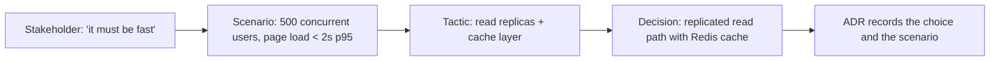

# Quality Attribute Analysis

> **Core capability:** The architect converts stakeholder quality needs into precise, measurable scenarios and uses them to drive structural choices — so that architecture is shaped by evidence, not intuition.

## Why This Matters

Most architecture is chosen on the basis of functional requirements and vaguely stated quality hopes ("it should be fast," "it must be secure"). Quality attributes are the structural drivers that determine whether a system succeeds — but they only drive decisions when they are precise enough to be measured and compared.

The architect's contribution is the quality attribute workshop and its output: scenarios that state, in concrete terms, what the system must do when stressed, what constitutes acceptable performance, and how quality attributes trade off against each other. Without scenarios, quality attributes are just adjectives on a slide.

## Topics in This Capability Area

| Topic | Core Skill | When It Matters |
|-------|------------|-----------------|
| [[01_Quality_Attribute_Workshops]] | Running stakeholder workshops that produce precise, prioritized scenarios | System inception; major iterations |
| [[02_Performance_and_Scalability]] | Designing for throughput, latency, capacity, and growth curves | Before growth; before launch |
| [[03_Availability_Resilience_Reliability]] | Designing for uptime, fault handling, and graceful degradation | Production systems; regulated domains |
| [[04_Security_as_Quality_Attribute]] | Treating security properties as architectural drivers — not bolt-on features | Every system; high-trust domains |
| [[05_Modifiability_and_Maintainability]] | Designing for change: coupling, cohesion, and evolution cost | Long-lived systems; product evolution |
| [[06_Deployability_and_Operability]] | Designing for deployment ease, monitoring, and operational health | Continuous delivery contexts |
| [[07_Quality_Attribute_Trade_Offs]] | Managing conflicts between quality attributes; making trade-off decisions explicit | Every multi-attribute system |

## From Stakeholder Need to Architecture

The gap between the stakeholder statement and the ADR is the architect's work.

## Senior vs Architect

| Activity | Senior engineer | Software Architect |
|----------|-----------------|-------------------|
| Quality concerns | Handles performance in their components | Designs system-level quality attribute responses |
| Scenarios | Follows acceptance criteria | Runs quality attribute workshops and writes scenarios |
| Tactics | Applies known patterns to local problems | Selects system-wide tactics and evaluates trade-offs |
| Measurement | Tests their code's performance | Defines what good looks like for each quality attribute |

## Practical Applications

### Quality Attribute Checklist

- [ ] Every architecturally significant quality attribute has at least one measurable scenario
- [ ] Scenarios include source, stimulus, artifact, environment, response, and measure
- [ ] Quality attribute tactics are chosen for the system, not borrowed from a textbook
- [ ] Trade-offs between quality attributes are explicit and recorded
- [ ] The scenario catalog is a living document, updated as the system evolves

## Common Pitfalls

| Pitfall | Why It Is a Problem | Better Approach |
|---------|---------------------|-----------------|
| **Adjective quality** | "Fast" and "secure" drive nothing because they are not measurable | Write precise scenarios with numbers |
| **Ignoring quality early** | The architecture hardens around functional choices; quality is expensive to retrofit | Quality scenarios as first-class drivers from inception |
| **Quality silos** | Security architect, performance architect — adversarial optimization | One architecture, cross-attribute trade-off analysis |
| **Scenario shelfware** | Workshop output sits in a doc until obsolete | Review scenarios each increment; remove stale ones |

## Success Indicators

- Architecture decisions cite quality attribute scenarios as rationale
- Trade-off decisions name which attribute was prioritized and at what cost
- The system's measured quality attributes trend toward scenario targets
- Stakeholders can name the qualities that drive the architecture

## Related Capabilities

- [[01_Architecture_Fundamentals/00_overview|Architecture Fundamentals]]: where quality attributes are identified as drivers
- [[04_Architecture_Evaluation_and_Trade_Offs/00_overview|Architecture Evaluation and Trade Offs]]: where scenarios are used in evaluation
- [[career-path/02_Senior_Software_Engineer/05_Quality_Reliability_Security/00_overview|Quality Reliability Security (Senior)]]: the quality foundations at implementation level

## Summary

Quality attribute analysis turns vague stakeholder concerns into measurable architecture drivers. The architect's toolset is the workshop, the scenario, the tactic, and the explicit trade-off — applied together so that structural decisions survive the first stress test with evidence, not luck.