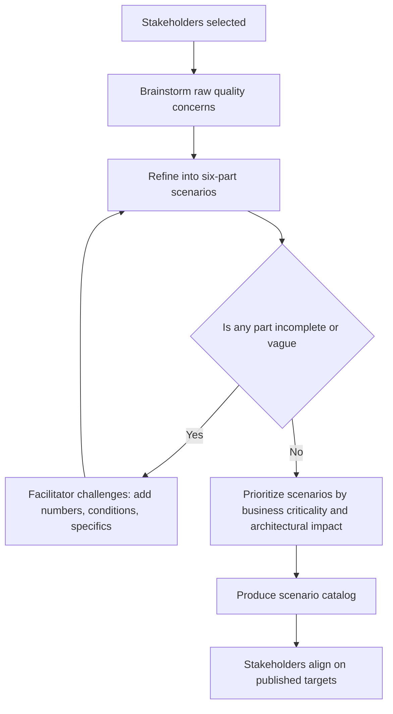

# Quality Attribute Workshops

> **Core skill:** Running a structured workshop that turns stakeholder quality hopes into precise, prioritized, measurable scenarios — producing a scenario catalog that drives architecture decisions and aligns the organization on what "good" looks like.

## Why This Matters

Most quality attribute requirements arrive as adjectives: "it should be fast," "it must be secure," "it has to scale." Those adjectives are harmless on a slide and useless in an architecture decision, because they cannot be tested, compared, or satisfied. The quality attribute workshop is the architect's primary tool for converting adjectives into architecture drivers — and it is as much a social exercise as a technical one.

The workshop gathers stakeholders who care about system qualities, walks them through scenario creation until every quality concern has a measurable expression, and prioritizes the results so the architect knows where to spend structural rigor. The output — a scenario catalog — becomes the evidence base for architectural decisions, the target for increment validation, and the shared language for discussing trade-offs.

Equally important, the workshop aligns stakeholders. When the product owner sees that "fast" means a specific p95 latency target and the operations lead sees an agreed recovery time, the organization has converged on what the system must deliver — not just in features, but in behavior under stress.

## Stakeholder Selection

| Stakeholder Group | Why They Must Be Present | What They Bring |
|------------------|-------------------------|-----------------|
| **Product owner / business sponsor** | Owns the business value and user expectations | User-facing quality targets; business-critical scenarios |
| **Operations / SRE** | Owns system health and incident response | Availability, observability, and deployability scenarios |
| **Security** | Owns threat posture and compliance | Security scenarios; regulatory constraints |
| **Lead developers / Tech Leads** | Will implement the architecture | Feasibility feedback; implementation cost awareness |
| **QA / Test lead** | Will verify quality targets | Measurability feedback; testability scenarios |
| **Data steward** | Owns data integrity and access | Data quality, consistency, and retention scenarios |
| **Architect (facilitator)** | Runs the workshop; does not dominate content | Process structure; scenario refinement; catalog production |

The architect facilitates, not dictates. The architect's job is to keep the workshop moving through its phases, ensure every scenario has all six parts, and catch the moment when two stakeholders discover they have been using the same word to mean different things.

## The Workshop Process

| Phase | Duration | Activities | Output |
|-------|----------|-----------|--------|
| **1. Setup** | Pre-workshop | Identify stakeholders; share pre-read on quality attributes and scenario format; gather existing quality requirements | Agenda; stakeholder list; pre-read materials |
| **2. Brainstorm** | 60-90 min | Stakeholders generate raw quality concerns without filtering; one concern per sticky note; group into quality attribute clusters | Raw concern clusters on a board |
| **3. Refine** | 90-120 min | Convert raw concerns into six-part scenarios; facilitator challenges vague language; stakeholders negotiate measures | Draft scenario catalog |
| **4. Prioritize** | 45-60 min | Vote or rank scenarios by business criticality, architectural impact, and implementation difficulty | Prioritized scenario list |
| **5. Validate** | 30 min | Walk through top scenarios; confirm they cover all stakeholder concerns; identify gaps | Validated scenario catalog |

## Scenario Refinement

The refinement phase is the heart of the workshop. Each raw concern — "the system should be fast" — must survive the six-part test:

| Part | Prompt Question | Example Refinement | Bad Refinement (rejected) |
|------|----------------|--------------------|--------------------------|
| **Source** | Who or what triggers this? | "500 concurrent users" | "Users" (vague count) |
| **Stimulus** | What event or condition arrives? | "Submitting orders during peak sales" | "Using the system" (too broad) |
| **Artifact** | Which part of the system responds? | "The order processing service" | "The system" (not specific) |
| **Environment** | Under what conditions? | "Normal operations; peak-hour load" | "Normal" (undefined) |
| **Response** | What measurable outcome occurs? | "Order confirmation page rendered" | "The system works" (not measurable) |
| **Response measure** | How is success measured? | "Within 2 seconds at p95; zero order loss" | "Fast enough" (not quantified) |

The facilitator's primary job in refinement is to challenge incomplete parts. "What does 'fast enough' mean in numbers?" "Under what load?" "Which specific component?" When two stakeholders disagree on a measure, the workshop has found a real conflict — and resolving it in the room is cheaper than resolving it in production.

## Prioritization

| Method | How It Works | When to Use |
|--------|-------------|-------------|
| **Voting** | Each stakeholder gets N votes to distribute across scenarios | Large group; many scenarios; quick initial cut |
| **Weighted ranking** | Stakeholders rate each scenario on business criticality, architectural impact, and implementation difficulty | Small-to-medium group; need quantified priorities |
| **Pairwise comparison** | Each scenario compared against every other; produces a strict ordering | Small set; high-stakes decisions |
| **Utility tree** | Scenarios organized in a tree by quality attribute and prioritized by business value and technical risk | Formal architecture evaluation; SEI ATAM-style |

The output of prioritization is a ranked scenario list. The top tier — scenarios rated critical for both business value and architectural impact — becomes the architecture's primary driver set. Lower tiers are addressed as the architecture evolves but do not dominate structural decisions.

## The Scenario Catalog

The workshop's output document is the scenario catalog:

```markdown
# Quality Attribute Scenario Catalog: [System]

## Performance Scenarios
| ID | Scenario | Source | Stimulus | Artifact | Environment | Response | Measure | Priority |
|---|---|---|---|---|---|---|---|---|
| QA-PERF-001 | Order submission under peak load | 500 concurrent users | Submit order | Order service | Peak hours | Render confirmation | ≤ 2s p95 | Critical |
| QA-PERF-002 | Product search latency | 2000 concurrent | Search query | Search service | Normal | Return results | ≤ 500ms p99 | High |

## Availability Scenarios
| ID | Scenario | Source | Stimulus | Artifact | Environment | Response | Measure | Priority |
|---|---|---|---|---|---|---|---|---|
| QA-AVAIL-001 | Order service failure | Server crash | Hardware failure | Order service | Normal ops | Failover | ≤ 30 seconds | Critical |

## Security Scenarios
| ID | Scenario | Source | Stimulus | Artifact | Environment | Response | Measure | Priority |
|---|---|---|---|---|---|---|---|---|
| QA-SEC-001 | Unauthorized access attempt | External attacker | Credential brute force | Auth gateway | Internet-facing | Block + alert | Block within 3 attempts | Critical |

[... additional quality attributes ...]
```

## The Workshop as Social Architecture

The workshop's technical output — scenarios — is only half its value. The other half is the alignment it produces:

| Alignment Outcome | How It Manifests | Architect's Role |
|------------------|-----------------|-----------------|
| **Shared vocabulary** | Stakeholders leave using the same terms for the same things | Insist on precision; challenge ambiguous words |
| **Conflict surfacing** | Security wants encryption; performance wants speed; the trade-off is now explicit | Make conflicts visible; do not resolve them prematurely |
| **Expectation calibration** | "Highly available" means 99.9% — and everyone knows what that costs | Translate quality adjectives into numbers with cost implications |
| **Priority alignment** | The ranking reflects organizational priorities, not individual preferences | Facilitate negotiation; do not impose your own ranking |
| **Architecture mandate** | Stakeholders commissioned the scenarios; they own the targets | The architect becomes the steward of the catalog, not its author |



## Practical Applications

### Workshop Facilitation Checklist

- [ ] Stakeholder list covers product, operations, security, development, QA, and data
- [ ] Pre-read materials explain quality attributes and the six-part scenario format
- [ ] Brainstorm phase is time-boxed and judgment-free — no filtering during generation
- [ ] Every scenario has all six parts; vague language is challenged
- [ ] Prioritization reflects organizational priorities, not facilitator preference
- [ ] Scenario catalog is published within 48 hours of the workshop
- [ ] Catalog includes a review cadence — scenarios revisited at each increment boundary

### Workshop Agenda Template

```markdown
# Quality Attribute Workshop: [Date]

## 09:00–09:15 — Setup and Goals
- Why we are here; what a quality attribute scenario looks like

## 09:15–10:30 — Brainstorm
- Generate raw quality concerns (one per sticky note)
- Group into quality attribute clusters

## 10:30–10:45 — Break

## 10:45–12:30 — Refine
- Convert top concerns into six-part scenarios
- Challenge vague language; negotiate measures

## 12:30–13:30 — Lunch

## 13:30–14:15 — Prioritize
- Vote or rank scenarios

## 14:15–14:45 — Validate
- Walk through top scenarios; identify gaps

## 14:45–15:00 — Next Steps
- Catalog production; review cadence; owner assignments
```

## Common Pitfalls

| Pitfall | Why It Is a Problem | Better Approach |
|---------|---------------------|-----------------|
| **Missing stakeholder group** | Quality scenarios lack the perspective of an affected group | Map stakeholders to quality attributes; ensure coverage |
| **Adjective scenarios survive refinement** | "Fast" and "secure" without numbers are invisible to architecture | Every incomplete scenario is challenged until all six parts exist |
| **Architect-dominated workshop** | Stakeholders become passengers; scenarios reflect the architect's bias, not business needs | Facilitate, do not dictate; let stakeholders own the content |
| **No prioritization** | All scenarios are equally important — which means none drive decisions | Prioritize by at least business criticality; record the ranking |
| **Catalog published and forgotten** | Scenarios become shelfware; architecture drifts from quality targets | Review scenarios at each increment boundary; retire stale ones |
| **Workshop as one-time event** | Quality concerns evolve; catalog frozen at inception | Schedule recurring workshops or scenario review sessions |

## Success Indicators

- Every architecturally significant quality attribute has at least one measurable scenario
- Architecture decisions cite scenario IDs as rationale
- Stakeholders can name the quality targets they agreed to in the workshop
- Scenario catalog is a living document with a named review cadence
- Workshop participation is broad enough that no stakeholder group can claim exclusion

## Related Topics

- [[07_Architecture_and_Quality_Attributes]] — the quality attribute catalog and scenario format
- [[02_Performance_and_Scalability]] — performance scenarios in depth
- [[03_Availability_Resilience_Reliability]] — availability scenarios and tactics
- [[04_Architecture_Evaluation_and_Trade_Offs/00_overview|Architecture Evaluation and Trade Offs]] — how scenarios are used in architecture evaluation
- [[career-path/02_Senior_Software_Engineer/05_Quality_Reliability_Security/00_overview|Quality Reliability Security (Senior)]] — quality implementation at the team level

## Summary

The quality attribute workshop is the architect's tool for converting stakeholder quality hopes into measurable architecture drivers. A structured process — brainstorm, refine into six-part scenarios, prioritize, validate — produces a scenario catalog that drives structural decisions, validates increments, and aligns stakeholders on what "good" looks like. The architect facilitates, not dictates: the job is to challenge vague language ("fast" becomes "2 seconds at p95"), surface conflicts between quality attributes, and ensure the catalog is a living document reviewed at each increment. The workshop's social output — shared vocabulary, aligned expectations, explicit trade-offs — is as valuable as its technical output, because it prevents the most expensive architecture mistake of all: discovering after launch that stakeholders meant different things by "available."