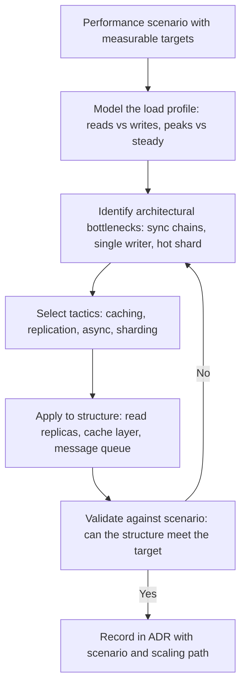

# Performance and Scalability

> **Core skill:** Designing architecture for throughput, latency, capacity, and growth — using caching, replication, load balancing, resource pooling, and sharding tactics matched to measurable performance scenarios and projected scale curves.

## Why This Matters

Performance is the quality attribute users feel immediately. A system that takes three seconds to respond loses users before they reach any feature. But performance is not a single number — it is a curve: response time under load, throughput at capacity, degradation behavior at saturation. The architect who designs for a target number without modeling the load that produces it designs a system that performs well in demos and collapses in production.

Scalability is performance over time and under growth: the system's ability to add capacity without rewriting its structure. A system that performs well at a thousand users may break at ten thousand not because the code is slow but because the architecture assumes a scale that no longer holds — a single database, a synchronous chain, a global lock. The architect's job is to design the performance envelope at inception and the scaling path before the envelope is reached.

Architecture-level performance work is not about optimizing code — it is about designing structures that make optimization possible: caching where reads dominate writes, partitioning where data outgrows a single store, asynchronous communication where latency compounds, and resource pooling where contention throttles throughput.

## Performance Scenarios

| Scenario Element | Performance-Specific Meaning | Example |
|-----------------|------------------------------|---------|
| **Source** | Load source: users, services, batch jobs | "10,000 concurrent users" |
| **Stimulus** | The request or event type | "Product search with filters" |
| **Artifact** | The component under load | "Search service and product database" |
| **Environment** | Load conditions and system state | "Normal operations; cache warm" |
| **Response** | The system's behavior | "Return search results" |
| **Response measure** | Throughput, latency, or capacity metric | "500ms at p99; 2000 requests per second sustained" |

| Metric | What It Measures | Architecture Levers |
|--------|-----------------|-------------------|
| **Response time / latency** | Time from request to response; measured at percentiles (p50, p95, p99) | Caching; data locality; compute parallelism; protocol efficiency |
| **Throughput** | Requests processed per unit time | Load balancing; horizontal scaling; asynchronous processing |
| **Capacity** | Maximum concurrent load the system can sustain | Resource pooling; connection management; queue depth tuning |
| **Utilization** | Resource consumption under load (CPU, memory, I/O, network) | Right-sizing; elastic resources; resource isolation |
| **Degradation profile** | How the system behaves when overloaded | Backpressure; circuit breaking; graceful degradation; rate limiting |

## Architectural Tactics for Performance

| Tactic | What It Does | When to Apply | Structural Cost |
|--------|-------------|---------------|-----------------|
| **Caching** | Stores computed or fetched data closer to the consumer to avoid recomputation or network calls | Reads dominate writes; data freshness tolerance exists | Cache invalidation complexity; memory cost; consistency risk |
| **Replication** | Copies data across nodes to distribute read load | Read-heavy workloads; geographic distribution of users | Write propagation latency; conflict resolution; storage cost |
| **Load balancing** | Distributes requests across multiple instances to share the load | Variable load; need for horizontal scaling | Session affinity complexity; uneven distribution risk |
| **Resource pooling** | Pre-allocates and reuses expensive resources (connections, threads) | High connection churn; resource acquisition is a bottleneck | Pool sizing; connection lifecycle management |
| **Asynchronous processing** | Queues work for later execution; decouples request from processing | Work that does not need synchronous response; burst handling | Eventual consistency; error handling complexity; observability cost |
| **Data compression** | Reduces payload size and transfer time | Large payloads; bandwidth-constrained paths | CPU overhead for compression/decompression |
| **Scheduling priority** | Assigns resources to requests by importance | Mixed workloads with different urgency levels | Starvation risk for low-priority work |

## Scalability Strategies

| Strategy | How It Works | Scaling Limit | When to Apply |
|----------|-------------|---------------|---------------|
| **Vertical scaling** | Add more resources (CPU, memory) to existing nodes | Hardware ceiling; diminishing returns | Short-term; before horizontal scaling is justified |
| **Horizontal scaling** | Add more nodes; distribute load across them | Coordination overhead; data consistency | Stateless services; read-heavy workloads |
| **Sharding** | Partition data across nodes; each shard serves a subset | Cross-shard queries and transactions | Write-heavy workloads; data exceeds single-node capacity |
| **Functional decomposition** | Split the system into independently scalable services | Network overhead; distributed complexity | Different components have different scale profiles |
| **CQRS** | Separate read and write models; scale each independently | Eventual consistency between models | Read and write patterns are asymmetric |
| **Event sourcing** | Store state changes as events; rebuild state from event stream | Event replay time; storage growth | Audit trail required; complex business logic |

## Bottleneck Analysis at Architecture Level

Architecture-level bottleneck analysis is not profiling — it is asking where the structure itself creates contention:

| Bottleneck Type | How It Manifests in Architecture | Detection Method | Mitigation |
|----------------|--------------------------------|-----------------|------------|
| **Single database primary** | All writes funnel through one node | Write throughput flattens at a fixed ceiling | Sharding; CQRS; write-async patterns |
| **Synchronous chain** | One slow downstream service delays all upstream callers | Latency compounds across service boundaries | Async messaging; circuit breaker; timeout tuning |
| **Global lock or mutex** | Only one request at a time can access a resource | Throughput limited to single-digit requests/sec | Partitioned locks; optimistic concurrency; eventual consistency |
| **Chatty interfaces** | Many small network calls instead of one batch call | High request count per user action; network overhead dominates | Batching; GraphQL; data aggregation layer |
| **Hot partition** | One shard or key receives disproportionate traffic | Monitoring shows one node at capacity while others idle | Better partitioning key; rate limiting; caching hot data |
| **Connection exhaustion** | Thread or connection pools sized below peak demand | Errors under load; queue growing | Pool right-sizing; async I/O; connection multiplexing |



## Practical Applications

### Performance Architecture Checklist

- [ ] Performance scenarios exist with measurable targets for latency, throughput, and capacity
- [ ] The load profile is modeled: read/write ratios, peak-to-average ratio, growth projections
- [ ] Architectural bottlenecks are identified before implementation, not during incidents
- [ ] Tactics are selected to match the load profile, not copied from a textbook
- [ ] Scaling strategy is designed before the scaling limit is reached
- [ ] Degradation behavior is designed: what happens when the system is overloaded

### Performance Budget Template

```markdown
# Performance Budget: [Service or System]

| Operation | p50 Target | p95 Target | p99 Target | Throughput Target | Timeout |
|---|---|---|---|---|---|
| [endpoint or operation] | [ms] | [ms] | [ms] | [req/s] | [ms] |
```

## Common Pitfalls

| Pitfall | Why It Is a Problem | Better Approach |
|---------|---------------------|-----------------|
| **Optimizing without scenario targets** | Effort spent on components that are not the bottleneck | Set scenario targets first; measure; optimize where the gap is |
| **Scaling strategy designed too late** | The system reaches its scaling limit before anyone planned for it | Design the scaling path before the limit is reached |
| **Cache-everywhere** | Caching applied indiscriminately; invalidation complexity explodes | Cache only where the read/write ratio and freshness tolerance justify it |
| **Synchronous-by-default** | Every call waits; latency compounds; throughput capped by slowest link | Default to async where the user does not need the synchronous response |
| **Horizontal scaling without statelessness** | Instances scaled out but state prevents load distribution | Design for statelessness before horizontal scaling |
| **Ignoring degradation behavior** | System collapses under overload instead of degrading gracefully | Design backpressure, circuit breaking, and rate limiting into the architecture |

## Success Indicators

- Performance scenarios have measurable targets and are referenced in ADRs
- The scaling path from current load to projected load is documented, not guessed
- Architectural bottlenecks are identified and mitigated before production incidents
- Caching decisions cite the freshness tolerance and read/write ratio that justify them
- The system degrades gracefully under overload — it slows or sheds load, but does not collapse

## Related Topics

- [[01_Quality_Attribute_Workshops]] — how performance scenarios are created and prioritized
- [[07_Quality_Attribute_Trade_Offs]] — performance vs security, modifiability, and consistency trade-offs
- [[04_Architecture_Evaluation_and_Trade_Offs/00_overview|Architecture Evaluation and Trade Offs]] — how performance architecture is evaluated
- [[06_Data_Architecture/00_overview|Data Architecture]] — data partitioning and replication for performance
- [[07_Operations_and_Infrastructure_Architecture/00_overview|Operations and Infrastructure Architecture]] — infrastructure for scaling and capacity

## Summary

Performance architecture is about designing structures that can meet latency, throughput, and capacity targets under load — not about code optimization. Tactics include caching for read-heavy workloads, replication for read distribution, load balancing for variable traffic, resource pooling for connection bottlenecks, and asynchronous processing for burst handling and decoupling. Scalability strategies — vertical, horizontal, sharding, functional decomposition — are matched to the system's load profile and designed before the scaling limit is reached. The architect identifies architectural bottlenecks (single writer, synchronous chain, hot partition) through structure analysis rather than profiling, selects tactics that address them, and records the performance architecture in ADRs that cite measurable scenarios and the scaling path.