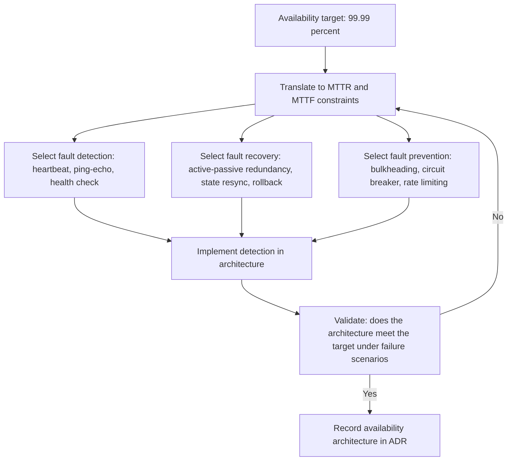

# Availability Resilience Reliability

> **Core skill:** Designing architecture for uptime, fault isolation, and graceful recovery — using fault detection, fault recovery, and fault prevention tactics to meet availability targets, measured through MTTR, MTTF, and MTBF.

## Why This Matters

Availability is not a feature — it is the condition under which every feature operates. A system that is unavailable for 1% of the time is unavailable 3.65 days per year, and no feature shipped in the other 361 days compensates for the lost 3.65. The architect who designs for availability is designing for the moment when something breaks — because in a distributed system, something is always breaking.

Resilience is availability's operational twin: the ability to absorb failure and continue operating, potentially in a degraded mode. Reliability is the system's probability of operating without failure over a time period — a statistical property that architecture can influence but never guarantee. The three concepts are distinct but architecturally addressed together: availability through redundancy, resilience through isolation, reliability through fault prevention.

Architects set availability targets (99.9%, 99.99%), translate them to architectural constraints (redundancy level, failover speed, recovery time), and select tactics that make the constraints achievable. The numbers are unforgiving: 99.99% availability permits 52 minutes of downtime per year. The architecture must make that number possible before the operations team can make it real.

## Availability Scenarios

| Scenario Element | Availability-Specific Meaning | Example |
|-----------------|------------------------------|---------|
| **Source** | The failure origin: hardware, software, network, operator | "Primary database server crash" |
| **Stimulus** | The failure event | "Disk failure on primary node" |
| **Artifact** | The system component that fails | "Order database" |
| **Environment** | System state when failure occurs | "Peak load; 10,000 concurrent users" |
| **Response** | System behavior: detection, failover, recovery | "Failover to standby; resume processing" |
| **Response measure** | Time to detect, failover, and recover | "Detect within 5 seconds; failover within 30 seconds; zero data loss" |

| Metric | What It Measures | Architecture Levers |
|--------|-----------------|-------------------|
| **MTTF** (Mean Time To Failure) | Average time between failures for a component | Redundancy; component quality; fault prevention |
| **MTTR** (Mean Time To Repair) | Average time to restore service after a failure | Automated failover; state resynchronization; deployment automation |
| **MTBF** (Mean Time Between Failures) | MTTF + MTTR; the full cycle time | Both prevention and recovery together |
| **Availability percentage** | Uptime / (Uptime + Downtime) over a period | All tactics combined; calculated from MTTF and MTTR |

Availability targets drive structure because reducing MTTR often requires different tactics than increasing MTTF. A 99.9% target (8.76 hours downtime/year) can be met with manual failover and good monitoring. A 99.99% target (52 minutes/year) demands automated failover, and 99.999% (5.26 minutes/year) demands architectural patterns that eliminate single points of failure entirely.

## Architectural Tactics: Fault Detection

| Tactic | How It Works | Strengths | Limitations |
|--------|-------------|-----------|-------------|
| **Heartbeat** | One component sends periodic signals to a monitor | Simple; detects complete failure | Does not detect partial failure or degraded performance |
| **Ping / echo** | Monitor sends a request and waits for a response | Detects unresponsiveness; can measure response time | False positives under high load; network-dependent |
| **Watchdog** | A timer that resets on successful operation; if it expires, the component is assumed failed | Self-contained; works inside a process | Does not detect stalled-but-responding components |
| **Voting** | Multiple redundant components process the same input; output determined by majority | Detects Byzantine failures; high confidence | High resource cost; latency overhead |
| **Health check** | Component exposes a status endpoint; monitor polls it | Rich information; can report degraded modes | Component must be healthy enough to respond |
| **Synthetic transaction** | Monitor executes a representative operation end-to-end | Detects failures in the full request path | Additional load; may miss failure modes not exercised |

## Architectural Tactics: Fault Recovery

| Tactic | How It Works | Strengths | Limitations |
|--------|-------------|-----------|-------------|
| **Active redundancy** | Multiple nodes serve simultaneously; traffic redistributed on failure | Fastest failover; no idle resources | Higher resource cost; consistency between active nodes |
| **Passive redundancy** | Primary serves; standby waits; failover on detection | Simpler consistency model | Standby resources idle; failover time includes detection and activation |
| **State resynchronization** | After failover, bring replacement up to current state | Enables recovery without data loss | Resynchronization may take time; state must be recoverable |
| **Rollback** | Revert to a known-good state on failure | Recovery from bad deployments or data corruption | Requires checkpointing; may lose recent transactions |
| **Graceful degradation** | Disable non-critical functions; continue critical operations | Maintains core availability under partial failure | Requires explicit criticality classification |
| **Retry with backoff** | Reattempt failed operations with increasing delays | Recovers from transient failures | May amplify load during partial outage; needs idempotency |

## Architectural Tactics: Fault Prevention

| Tactic | How It Works | Strengths | Limitations |
|--------|-------------|-----------|-------------|
| **Removal from service** | Take a failing component offline before it affects the system | Prevents cascading failure | Detection must be fast; removal must be safe |
| **Transactions** | Ensure operations are atomic, consistent, isolated, durable | Prevents partial state corruption | Performance overhead; distributed transaction complexity |
| **Bulkheading** | Isolate components so a failure in one does not sink others | Limits blast radius; critical for multi-tenant systems | Resource partitioning; over-provisioning risk |
| **Circuit breaker** | Stop calling a failing dependency; test periodically and resume when healthy | Prevents resource exhaustion waiting for failed services | May hide transient failures; needs careful threshold tuning |
| **Rate limiting** | Cap the rate of requests a component accepts | Prevents overload-induced failure | Must be tuned to real capacity; can reject legitimate traffic |



## Practical Applications

### Availability Architecture Checklist

- [ ] Availability targets are set, measured, and communicated in business terms
- [ ] The availability target is translated to MTTR and MTTF constraints
- [ ] Fault detection tactics are layered: heartbeat for process failure, health check for degradation, synthetic transaction for end-to-end
- [ ] Fault recovery is automated where MTTR demands it — manual recovery cannot meet sub-minute targets
- [ ] Single points of failure are identified and mitigated: no component whose failure takes down the system
- [ ] Bulkheading isolates critical functions from non-critical ones
- [ ] The degradation path is designed: what stops working first when the system is under stress

### Availability Budget Template

```markdown
# Availability Budget: [System]

| Component | Target Availability | Allowed Downtime/Year | Redundancy Model | Failover Time Target | Current MTTR |
|---|---|---|---|---|---|
| [component] | 99.99% | 52 min | Active-passive | < 30 seconds | [measured] |
```

## Common Pitfalls

| Pitfall | Why It Is a Problem | Better Approach |
|---------|---------------------|-----------------|
| **Availability as operations concern only** | Architecture embeds single points of failure that operations cannot fix | Design availability into structure; redundancy, isolation, failover |
| **Target without translation** | "99.99%" is a number nobody can act on | Translate to MTTR, MTTF, and redundancy requirements |
| **Detection without recovery** | Failures are detected quickly but recovery is manual and slow | Pair detection with automated recovery; match automation to MTTR target |
| **Redundancy without isolation** | Redundant components share a failure domain (same rack, same power) | Separate failure domains physically and logically |
| **No degradation design** | System is either fully up or fully down; no partial operation | Identify critical functions; design the degradation sequence |
| **Ignoring the recovery path** | Architecture designs for normal operation only; recovery is ad hoc | Design the recovery path: state resync, rollback, warm-up |

## Success Indicators

- Availability targets are met consistently, not occasionally
- Failure recovery is automated to meet MTTR targets without operator intervention
- The system degrades gracefully: critical functions remain available during partial failure
- Single points of failure are known, documented, and have a mitigation plan
- Incident postmortems trace failures to missing architectural tactics, not unknown failure modes

## Related Topics

- [[01_Quality_Attribute_Workshops]] — how availability scenarios are created and prioritized
- [[07_Quality_Attribute_Trade_Offs]] — availability vs consistency and performance trade-offs
- [[04_Architecture_Evaluation_and_Trade_Offs/00_overview|Architecture Evaluation and Trade Offs]] — availability evaluation methods
- [[07_Operations_and_Infrastructure_Architecture/00_overview|Operations and Infrastructure Architecture]] — operational architecture for availability
- [[05_Security_Architecture/00_overview|Security Architecture]] — availability as a security property in the CIA triad

## Summary

Availability architecture designs for the moment when something breaks — because in distributed systems, something is always breaking. The architect sets a target (e.g., 99.99%), translates it to MTTR and MTTF constraints, and layers tactics across the failure lifecycle: fault detection (heartbeat, ping/echo, health checks, synthetic transactions), fault recovery (active/passive redundancy, state resynchronization, rollback, graceful degradation), and fault prevention (bulkheading, circuit breakers, rate limiting). The target determines the automation level: sub-minute recovery demands automated failover; manual recovery cannot meet 99.99% targets. The architecture must design not only the normal path but the recovery path — because the system's availability is measured not when everything is working, but when something has failed.