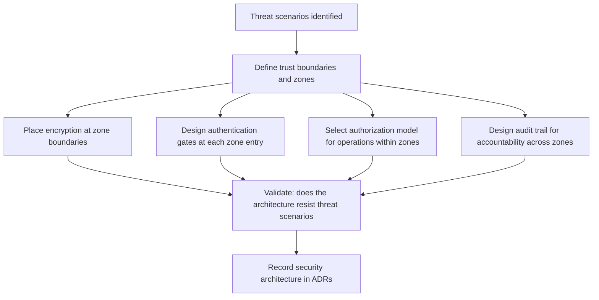

# Security as a Quality Attribute

> **Core skill:** Treating security properties — confidentiality, integrity, availability, accountability — as architectural drivers that determine trust boundaries, encryption points, authentication gates, and authorization models, rather than as features bolted on after design.

## Why This Matters

Security is not a feature you add to a finished system. It is a set of architectural properties — confidentiality, integrity, availability, accountability — that every structural decision either supports or undermines. A system designed without security architecture is a system where every component trusts every other component, every connection is in the clear, and every access control decision is local and inconsistent. Securing that system after the fact means unwinding assumptions baked into the structure — which is why retrofitted security is the most expensive kind.

The architect treats security as a first-class quality attribute: writing scenarios that describe threats and expected responses, defining trust boundaries that divide the system into zones of differing trust, placing encryption at those boundaries rather than everywhere or nowhere, and designing authentication and authorization as architectural services, not as code scattered across components. The architect is not the security specialist — but the architect owns the structural decisions that make the specialist's work possible.

This note covers the security quality attributes, architectural tactics for each, and the structural decisions — encryption boundaries, authentication gates, authorization models — that embed security in architecture rather than bolting it on.

## Security Quality Attributes

| Attribute | Definition | Architectural Question | Example Failure |
|-----------|-----------|----------------------|----------------|
| **Confidentiality** | Data is accessible only to authorized parties | Where are the trust boundaries, and what crosses them encrypted? | Customer PII exposed in logs; unencrypted backup |
| **Integrity** | Data and system state are not altered improperly | Which components can modify which data, and how is that enforced? | Unauthorized database write; tampered message in transit |
| **Availability** | System remains accessible to authorized users | How does the system resist denial-of-service and maintain service under attack? | DDoS takes down authentication; resource exhaustion |
| **Accountability** | Actions are traceable to responsible entities | What is logged, where, and can the audit trail prove non-repudiation? | No record of who changed a critical configuration |
| **Authenticity** | The identity of entities is verified | How does the system know who or what is making a request? | Spoofed service identity; replay attack |

These attributes are not independent: encryption for confidentiality consumes CPU and adds latency (performance trade-off); logging for accountability stores sensitive data (confidentiality trade-off). The architect makes these conflicts explicit rather than discovering them in a security audit.

## Security Scenarios

| Scenario Element | Security-Specific Meaning | Example |
|-----------------|--------------------------|---------|
| **Source** | The threat actor or condition | "External attacker with valid user credentials obtained through phishing" |
| **Stimulus** | The attack or security event | "Attempts to access another user's order data by modifying the order ID parameter" |
| **Artifact** | The system component or data targeted | "Order API endpoint" |
| **Environment** | System state when the attack occurs | "Normal operations; authenticated session" |
| **Response** | System behavior: block, detect, alert, log | "Deny access; log the attempt; alert security operations" |
| **Response measure** | How response is measured | "Blocks within the first unauthorized attempt; audit record includes user identity, target resource, timestamp" |

## Architectural Tactics for Security

| Tactic | What It Does | When to Apply | Structural Cost |
|--------|-------------|---------------|-----------------|
| **Encryption at rest** | Protects data stored on disk or in backups | Regulated data; any persistent storage of sensitive data | Key management complexity; performance overhead |
| **Encryption in transit** | Protects data moving between components | Every network hop; especially cross-zone and public networks | Certificate management; TLS termination architecture |
| **Authentication gates** | Centralized identity verification before any protected resource | Every access-controlled resource | Single point of failure if not redundant; latency overhead |
| **Authorization models** | Defines who may do what to which resources | Every operation on protected data or functionality | Policy complexity; enforcement point placement |
| **Audit trails** | Records security-relevant events with integrity guarantees | Regulated domains; breach detection; non-repudiation | Storage volume; sensitive data in logs |
| **Input validation** | Rejects malformed or malicious input at system boundaries | Every external input point | Maintenance as interfaces evolve |
| **Intrusion detection** | Identifies attack patterns from system behavior | Internet-facing systems; high-value targets | False positive tuning; operational response capability required |
| **Least privilege** | Components operate with minimum permissions needed | Every component; service accounts; API keys | Permission granularity; operational overhead of fine-grained policies |

## Encryption Boundaries

Encryption is an architectural concern because it determines where trust ends and untrusted networks begin:

| Boundary Type | Encryption Requirement | Architectural Decision |
|--------------|----------------------|----------------------|
| **Public internet** | Mandatory: TLS everywhere | TLS termination point; certificate management; cipher selection |
| **Cross-zone internal** | Recommended: mTLS or equivalent | Service mesh; mutual authentication; certificate rotation |
| **Within trusted zone** | Conditional: based on data sensitivity and threat model | Performance vs confidentiality trade-off |
| **Data at rest** | Required for regulated and sensitive data | Encryption key management; envelope encryption; key rotation |

The architectural decision is not whether to encrypt but where: every encryption boundary has a cost (latency, key management, debugging difficulty) and a benefit (reduced exposure). The architect places boundaries where the benefit justifies the cost, and documents the placement so teams know what is protected and what is not.

## Authentication and Authorization Architecture

| Model | How It Works | Strengths | Weaknesses | When to Apply |
|-------|-------------|-----------|------------|---------------|
| **Centralized auth gateway** | All requests pass through an authentication service; downstream services trust the gateway's assertion | Single enforcement point; consistent policy | Gateway becomes bottleneck and single point of failure | Service-oriented systems with clear perimeter |
| **Distributed auth with tokens** | Each service validates tokens independently (JWT, PASETO) | No central bottleneck; services are autonomous | Token revocation complexity; token size overhead | Microservices; zero-trust architectures |
| **RBAC** | Permissions assigned to roles; roles assigned to users | Simple to understand and audit | Role explosion in complex domains | Systems with clear role hierarchies |
| **ABAC** | Permissions based on attributes of user, resource, and context | Fine-grained; dynamic policies | Policy complexity; evaluation performance | Complex authorization requirements; multi-tenant systems |
| **PBAC** | Permissions defined as policies evaluated at runtime | Flexible; externalized authorization | Policy language learning curve | Regulated or compliance-heavy domains |



## Practical Applications

### Security Architecture Checklist

- [ ] Trust boundaries are defined and diagrammed: what zones exist, and what crosses between them
- [ ] Encryption is placed at zone boundaries, not uniformly everywhere
- [ ] Authentication is centralized or uses consistent token-based patterns — not per-component login
- [ ] Authorization model is selected and consistent across the system
- [ ] Audit trail covers security-relevant events with integrity guarantees
- [ ] Threat scenarios exist for each trust boundary and drive architecture decisions
- [ ] Security architecture ADRs name the model, the boundaries, and the trade-offs accepted

### Security Architecture Template

```markdown
# Security Architecture: [System]

## Trust Zones
| Zone | Trust Level | Encryption Requirement | Auth Required |
|---|---|---|---|
| Public internet | Untrusted | TLS mandatory | Yes |
| DMZ | Semi-trusted | TLS optional | Yes |
| Internal services | Trusted | mTLS recommended | Varies |
| Data stores | Trusted | TLS + at-rest | Yes |

## Authentication Model
[Centralized gateway / distributed tokens / other]
[Token format, issuance, validation, revocation]

## Authorization Model
[RBAC / ABAC / PBAC] with justification

## Audit Trail
[Events logged, format, retention, integrity protection]
```

## Common Pitfalls

| Pitfall | Why It Is a Problem | Better Approach |
|---------|---------------------|-----------------|
| **Security as a feature** | Security is added after design; structural trust assumptions are already baked in | Treat security as a first-class quality attribute; drive structure from threat scenarios |
| **Encrypt everything** | Performance and operational cost without proportional risk reduction | Place encryption at trust boundaries; justify each boundary with a threat scenario |
| **No trust boundaries** | Every component trusts every other; a compromise anywhere is a compromise everywhere | Define zones of differing trust; enforce controls at zone boundaries |
| **Authentication scattered** | Each component implements its own login; inconsistent, hard to audit | Centralize authentication; distribute only token validation |
| **Logging without integrity** | Audit trail can be altered by an attacker who gained access | Write-once or append-only logs; separate log storage from application infrastructure |
| **Authorization as code** | Access control logic scattered across components; inconsistent and hard to review | Externalize authorization; make policy a managed artifact |

## Success Indicators

- Trust boundaries are diagrammed, and every cross-boundary interaction has a known security control
- Security scenarios reference specific threat vectors and measurable responses
- Authentication and authorization models are consistent across the system
- Audit trails survive compromise of application components
- Security architecture decisions cite threat scenarios and trade-offs, not checklists

## Related Topics

- [[01_Quality_Attribute_Workshops]] — how security scenarios are created and prioritized
- [[07_Quality_Attribute_Trade_Offs]] — security vs performance and usability trade-offs
- [[05_Security_Architecture/00_overview|Security Architecture]] — full security architecture discipline
- [[06_Data_Architecture/00_overview|Data Architecture]] — data security, encryption at rest, and access controls
- [[career-path/02_Senior_Software_Engineer/05_Quality_Reliability_Security/00_overview|Quality Reliability Security (Senior)]] — security implementation at the team level

## Summary

Security as an architectural driver means designing trust boundaries, encryption points, authentication gates, and authorization models before a line of code is written — because retrofitting security into a system that was not structured for it is the most expensive kind of security work. The five security quality attributes — confidentiality, integrity, availability, accountability, authenticity — each demand specific architectural tactics: encryption at boundaries rather than everywhere, centralized authentication with distributed validation, externalized authorization, and audit trails with integrity guarantees. The architect places security controls at trust boundaries, documents the model, and records the trade-offs — because security architecture is not about eliminating risk, it is about making the residual risk explicit and accepted.