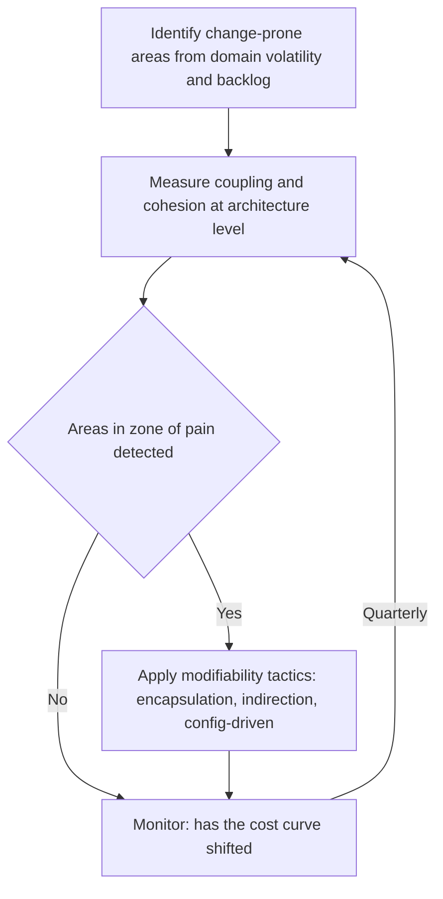

# Modifiability and Maintainability

> **Core skill:** Designing architecture for change — using encapsulation, indirection, configuration-driven behavior, and interface stability tactics to keep modification cost low, and measuring coupling and cohesion at the architecture level to detect when change is becoming expensive.

## Why This Matters

Every system will be changed — by people who did not build it, for reasons that were not anticipated, under deadlines that were not planned. Modifiability is the quality attribute that determines how much those changes cost. A system with poor modifiability does not resist change; it converts every change into a cascade of unintended consequences, and the cost of each modification rises until the system is economically immovable.

Modifiability is not about writing clean code. It is about designing structural properties — encapsulation, interface stability, configuration-driven behavior — that make the code changeable in the first place. Two systems with equally clean code can have vastly different modifiability if one has stable interfaces at module boundaries and the other allows every module to depend on every other module's internals.

The architect's modifiability work is predictive: identify the areas most likely to change (from domain volatility, business strategy, and backlog trends), design those areas for modification, and measure coupling and cohesion at the architecture level so that degradation is detected before change becomes expensive — not discovered when a change estimate comes back at three sprints for what should have been three days.

## Modifiability Scenarios

| Scenario Element | Modifiability-Specific Meaning | Example |
|-----------------|-------------------------------|---------|
| **Source** | Who or what triggers the change | "Product team requesting a new payment method" |
| **Stimulus** | The change request | "Add support for Buy Now Pay Later payment" |
| **Artifact** | What must be changed | "Payment processing module and checkout flow" |
| **Environment** | Conditions when the change is made | "During active development; no freeze" |
| **Response** | What happens: change made, tested, deployed | "Implement new payment adapter; existing payment methods unaffected" |
| **Response measure** | Cost of change in time, effort, and risk | "3 person-days; no changes to other payment methods; no regression in checkout" |

## Architectural Tactics for Modifiability

| Tactic | What It Does | When to Apply | Structural Cost |
|--------|-------------|---------------|-----------------|
| **Encapsulation** | Hides implementation details behind a stable interface; consumers depend on the interface, not internals | Every module boundary; especially across teams | Interface design effort; indirection overhead |
| **Indirection** | Inserts an intermediary that decouples two components that would otherwise depend directly | When two components change at different rates or for different reasons | Added abstraction; debugging complexity; performance overhead |
| **Configuration-driven behavior** | Moves variation from code to configuration so behavior can change without redeployment | When variation is anticipated and predictable | Configuration schema must be designed and versioned; validation complexity |
| **Interface stability** | Defines interfaces with evolution rules (additive only, versioned, frozen) | Cross-team and external-facing interfaces | Evolution rules must be enforced; deprecated interfaces accumulate |
| **Dependency inversion** | High-level modules define interfaces; low-level modules implement them | When the direction of dependency should oppose the direction of control | Interface ownership must be assigned; abstract interface maintenance |
| **Semantic versioning** | Communicates compatibility of changes through version numbers | Public APIs; shared libraries | Discipline required; breaking changes are ambiguous at the boundary |
| **Cohesion enforcement** | Keeps related responsibilities together so changes are localized | Module design; service boundaries | Requires ongoing vigilance; natural entropy pushes toward dispersion |

## Measuring Coupling and Cohesion at Architecture Level

| Metric | What It Measures | Good Value | Danger Signal |
|--------|-----------------|------------|---------------|
| **Afferent coupling** | Number of components that depend on this component | Low; high means this component is hard to change | Every change to this component risks breaking many consumers |
| **Efferent coupling** | Number of components this component depends on | Low; high means this component is fragile | This component breaks whenever any dependency changes |
| **Instability** | Efferent / (Afferent + Efferent) | Balanced across the system | Components at extremes: rigid (high afferent) or fragile (high efferent) |
| **Relational cohesion** | Within a component: how many internal elements are connected | High; elements work together on a common purpose | Low cohesion: component is a grab-bag; change ripples unpredictably |
| **Abstractness** | Ratio of abstract elements to total elements in a component | High where afferent coupling is high | Concrete components with many consumers: hard to change without breaking them |
| **Distance from main sequence** | |Abstractness + Instability − 1|; ideally near 0 | Zone of pain: concrete and highly depended-on; Zone of uselessness: abstract with no dependents |

The architect does not need to compute these metrics continuously, but should understand them well enough to recognize the patterns: a component with many consumers and no abstraction is in the zone of pain; a component with many abstractions and no consumers is dead code.

## The Modifiability Cost Curve

Modifiability decays over time unless actively maintained. The cost of change follows a predictable curve:

| Phase | Modifiability State | Change Cost | What Drives the Curve |
|-------|-------------------|-------------|----------------------|
| **Early** | High modifiability; few consumers; interfaces still plastic | Low | Low coupling; small codebase |
| **Growth** | Modifiability under pressure; consumers multiply; interfaces stabilize | Moderate, rising | Interface commitments made; backward compatibility required |
| **Mature** | Modifiability requires investment; architecture must be refactored periodically | High without investment | Accumulated coupling; interface ossification; knowledge loss |
| **Legacy** | Modifiability is the primary constraint on delivery | Very high; change avoidance dominates | Nobody understands the full system; changes cascade |

The architect's job is to slow the curve: pay modifiability maintenance costs early and continuously so the system does not reach the legacy phase prematurely. The maintenance is not refactoring code — it is refactoring structure: splitting components whose cohesion has decayed, introducing indirection where coupling has grown, stabilizing interfaces that have ossified.



## Practical Applications

### Modifiability Architecture Checklist

- [ ] Areas of high anticipated change are identified from domain analysis and product roadmap
- [ ] High-change areas are designed with encapsulation, indirection, and configuration-driven behavior
- [ ] Cross-team interfaces have explicit evolution rules (additive only, versioned, frozen)
- [ ] Coupling and cohesion are assessed at architecture level at least quarterly
- [ ] Components in the zone of pain (concrete, highly depended-on) have a refactoring plan
- [ ] The modifiability cost curve is tracked: is each change costing more than the last

### Modifiability Assessment Template

```markdown
# Modifiability Assessment: [System] — [Quarter/Date]

## Change-Prone Areas
| Area | Expected Change Rate | Current Coupling | Modifiability Risk | Mitigation |
|---|---|---|---|---|
| [module/service] | High / Medium / Low | [afferent / efferent] | [risk level] | [tactics applied] |

## Zone of Pain Components
| Component | Afferent Coupling | Abstractness | Distance from Main Sequence | Refactoring Plan |
|---|---|---|---|---|
| [component] | [N consumers] | [ratio] | [D] | [plan and timeline] |
```

## Common Pitfalls

| Pitfall | Why It Is a Problem | Better Approach |
|---------|---------------------|-----------------|
| **Modifiability ignored until cost is visible** | By the time change is expensive, the architecture has already ossified | Measure coupling and cohesion early; invest in modifiability before the cost curve rises |
| **Encapsulation without stable interfaces** | Implementation is hidden but the interface changes every release | Design interfaces with evolution rules; version them |
| **Indirection without purpose** | Every dependency gets an abstraction layer; complexity explodes | Add indirection only where change rates or ownership differ |
| **Configuration over-engineering** | Every variation is configuration-driven; configuration becomes code | Limit configuration to variation that is both anticipated and needed |
| **Coupling invisible at architecture level** | Dependencies are in code, not diagrams; nobody sees the web | Diagram component dependencies; measure coupling periodically |
| **No evolution rules for interfaces** | Breaking changes ship without warning; consumers scramble | Published interfaces carry explicit evolution rules and deprecation windows |

## Success Indicators

- Changes to high-volatility areas are consistently faster than changes to stable areas
- Cross-team interface changes do not cause downstream breakage
- The modifiability cost curve is flat or gently rising, not hockey-sticking
- Coupling and cohesion are measured and discussed at architecture reviews
- The team can name the areas most likely to change and the tactics designed for them

## Related Topics

- [[01_Quality_Attribute_Workshops]] — how modifiability scenarios are created and prioritized
- [[07_Quality_Attribute_Trade_Offs]] — modifiability vs performance, simplicity, and time-to-market
- [[04_Architecture_Evaluation_and_Trade_Offs/00_overview|Architecture Evaluation and Trade Offs]] — modifiability evaluation methods
- [[06_Data_Architecture/00_overview|Data Architecture]] — data modifiability and schema evolution
- [[career-path/02_Senior_Software_Engineer/03_Architecture_and_Design_Judgment/00_overview|Architecture and Design Judgment (Senior)]] — component-level modifiability design

## Summary

Modifiability is the quality attribute that determines how much future changes will cost, and the architect's job is to design structure that keeps change cost low. Tactics include encapsulation at module boundaries, indirection where change rates differ, configuration-driven behavior for anticipated variation, and interface stability rules for cross-team contracts. Coupling and cohesion are measured at the architecture level — not just in code — to detect when components are drifting toward the zone of pain, where they are too concrete and too depended-on to change safely. The modifiability cost curve rises unless actively maintained: the architect invests in structural refactoring early and continuously so the system does not reach the legacy phase — where every change costs more than the last — prematurely.