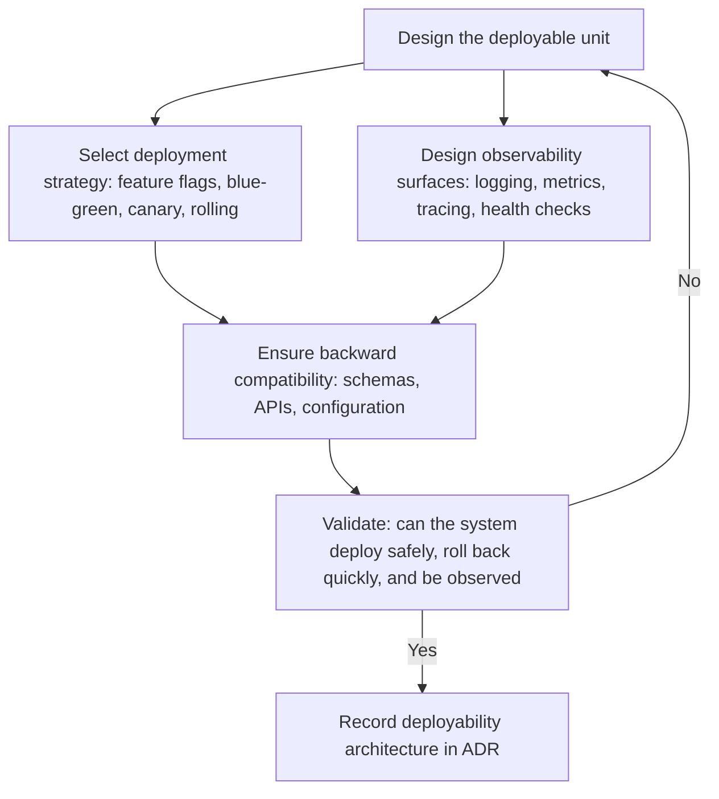

# Deployability and Operability

> **Core skill:** Designing deployment as an architectural concern — shaping the deployable unit, selecting deployment tactics (feature flags, blue-green, canary, rolling update), and embedding observability surfaces so the system can be deployed safely and operated with confidence.

## Why This Matters

A system that runs correctly in a developer's environment but cannot be deployed without downtime, rolled back quickly, or observed in production is not architecturally complete. Deployability and operability are quality attributes that determine whether the system survives contact with production — and they are architectural concerns because they shape the deployable unit, the environment topology, the release mechanism, and the observation points that let operators know the system is healthy.

The architect who defers deployment design to operations discovers that the deployment model contradicts the architectural model: services designed for independent deployment share a database and must deploy together; feature flags were never architected in and must be retrofitted; observability is an afterthought and the first production incident yields no actionable data. The cost of retrofitting deployability into a system not designed for it is paid in every release cycle.

Deployability architecture answers three questions: what is deployed (the deployable unit), how it reaches production (the deployment strategy), and how operators know it is working (the observability surface). The architect designs all three before the first release.

## Deployability Scenarios

| Scenario Element | Deployability-Specific Meaning | Example |
|-----------------|-------------------------------|---------|
| **Source** | Who or what triggers the deployment | "CI/CD pipeline after merge to main" |
| **Stimulus** | The deployment event | "New version of the order service ready for production" |
| **Artifact** | What is being deployed | "Order service v2.3.0, including database schema migration" |
| **Environment** | Conditions during deployment | "Production; peak hours; 10,000 concurrent users" |
| **Response** | System behavior during and after deployment | "Deploy with zero downtime; no user requests fail; can revert within 2 minutes" |
| **Response measure** | Deployment time, rollback time, error rate | "Deployment completes within 5 minutes; rollback within 2 minutes; error rate unchanged" |

## The Deployable Unit

The deployable unit is what gets versioned, built, tested, and released as an atomic whole. Its design has architectural consequences:

| Deployable Unit Design | Architecture Implication | When to Use |
|-----------------------|------------------------|-------------|
| **Monolithic deployable** | Single artifact; entire system deployed together | Simple systems; small teams; low change rate |
| **Service-per-deployable** | Each service is an independent deployable unit | Multiple teams; independent change cadences |
| **Container image** | Standardized artifact with all dependencies | Consistent environments; container orchestration available |
| **Serverless function** | Function as the deployable unit; no server management | Event-driven; variable load; low operational maturity |
| **Static asset bundle** | Frontend assets deployed independently from backend | Separate frontend and backend release cadences |

The deployable unit decision constrains deployment strategy and team autonomy. Two services that share a deployable unit are not independently deployable — regardless of whether the code is in separate repositories or the architecture diagram shows them as separate boxes.

## Deployment Tactics

| Tactic | How It Works | Benefits | Requirements | Risk |
|--------|-------------|----------|-------------|------|
| **Feature flags** | Code for new behavior is deployed but inactive; flags control who sees it | Decouples deployment from release; instant rollback by toggling a flag | Flag management infrastructure; flag cleanup discipline | Flag debt: flags accumulate and become untestable combinations |
| **Blue-green deployment** | Two identical environments (blue and green); traffic switches from blue to green on release | Instant rollback by switching back; zero-downtime deployment | Double infrastructure cost during cutover; database compatibility required | Stateful services require careful migration handling |
| **Canary release** | New version deployed alongside old; small percentage of traffic routed to new version; increased gradually | Risk limited to small traffic fraction; real-user validation | Traffic routing infrastructure; monitoring for canary-vs-baseline comparison | Slow rollout may not catch low-frequency bugs |
| **Rolling update** | Instances updated one at a time; traffic drains from old, routes to new | No additional infrastructure; gradual rollout | Load balancer support; backward compatibility during rollout | Rollback requires reversing the rollout; takes time |
| **Immutable infrastructure** | New instances replace old; no in-place updates | Consistency; repeatable; no configuration drift | Infrastructure-as-code; fast instance provisioning | State management: state must live outside instances |

## Deployment as an Architectural Concern

| Architecture Element | Deployment Implication | The Architect Must Decide |
|---------------------|----------------------|--------------------------|
| **Service boundaries** | Determines what can be deployed independently | Are the boundaries aligned with deployment independence needs? |
| **Database schema** | Schema changes must be backward-compatible during rolling or blue-green deployment | What schema migration rules apply? Expand-contract pattern? |
| **API versioning** | Consumers of different API versions may coexist during deployment | How are API versions handled during deployment windows? |
| **Configuration management** | Configuration changes must be deployable independently of code | What is code-deployed vs config-deployed vs feature-flagged? |
| **State management** | Stateful services complicate all deployment tactics | Where does state live during deployment? Can services be stateless? |
| **Observability** | Deployment safety depends on being able to compare new vs old behavior | What metrics, logs, and traces must be compared during canary or rolling update? |

## Observability as an Operability Tactic

Observability is the operability foundation: without it, deployment is blind and operations is guesswork. The architect designs observation surfaces into the system, not bolted on after:

| Pillar | What It Provides | Architectural Decision | Example |
|--------|-----------------|----------------------|---------|
| **Logging** | Record of events with context | What events are logged; at what level; structured format | "Every authenticated API request logs: user ID, endpoint, response status, latency" |
| **Metrics** | Aggregated measurements over time | What is measured; at what granularity; retention period | "Request rate, error rate, and p95 latency per endpoint per service" |
| **Tracing** | End-to-end request flow across services | Trace context propagation; sampling strategy | "Trace ID propagated through all service calls: upstream to downstream" |
| **Health checks** | Component readiness and liveness | What constitutes healthy; how health is reported | "Readiness probe: database reachable, cache connected; Liveness probe: process alive" |
| **Alerting** | Notification when observability signals cross thresholds | Thresholds; alert routing; runbooks | "Error rate exceeds 1% for 5 minutes: page SRE; p95 latency exceeds 500ms: ticket" |

The architect does not implement observability — but the architect decides where the observation points go, what signals they emit, and how they compose into a system-level view. Without those decisions, each team instruments differently, and the system picture is fragmented.



## Practical Applications

### Deployability Architecture Checklist

- [ ] The deployable unit is explicitly designed: what is versioned, built, and deployed atomically
- [ ] The deployment strategy is selected (blue-green, canary, rolling) and architected before the first release
- [ ] Database schema changes follow backward-compatible migration patterns
- [ ] Feature flags are part of the architecture, not retrofitted per feature
- [ ] Observability surfaces cover logging, metrics, tracing, and health checks at system boundaries
- [ ] Rollback is designed and tested — not assumed to work on the day it is needed

### Deployment Runbook Template

```markdown
# Deployment Runbook: [Service]

## Deployable Unit
- Artifact: [container image / JAR / bundle]
- Versioning: [semantic / calendar / git SHA]

## Deployment Strategy
- Type: [blue-green / canary / rolling]
- Duration: [expected deployment time]
- Rollback: [procedure and expected time]

## Pre-Deployment Checks
- [ ] Schema migration is backward-compatible
- [ ] Feature flags for this release are configured
- [ ] Monitoring dashboards include new vs baseline comparison

## Post-Deployment Validation
- [ ] Error rate within threshold
- [ ] Latency p95 within threshold
- [ ] Canary or green environment metrics match baseline
```

## Common Pitfalls

| Pitfall | Why It Is a Problem | Better Approach |
|---------|---------------------|-----------------|
| **Deployment as an afterthought** | The architecture assumes deployment but does not design for it | Design the deployable unit and deployment strategy with the architecture |
| **Zero-downtime assumed** | Architecture embeds assumptions (shared database, in-process state) that prevent zero-downtime | Verify the architecture can support the deployment strategy before selecting it |
| **Feature flags as code-level concern** | Flags added per feature, inconsistently; no lifecycle management | Architect feature flag infrastructure; design flag lifecycle and cleanup |
| **Observability bolted on** | Logging, metrics, tracing added after incidents reveal blind spots | Design observation surfaces at system boundaries during architecture design |
| **Rollback untested** | Rollback procedure exists on paper but has never been exercised | Test rollback in staging; include it in deployment rehearsals |
| **Schema migration in deployment window** | Long-running migrations block deployment or cause downtime | Use expand-contract; decouple schema migration from code deployment |

## Success Indicators

- Release frequency is a business decision, not a technical constraint
- Failed deployments roll back in under the target time without data loss
- Incidents are diagnosed from observability data, not from SSH sessions
- Feature flags are cleaned up within the release cycle, not accumulating as debt
- The deployment strategy works the same in staging and production

## Related Topics

- [[01_Quality_Attribute_Workshops]] — how deployability scenarios are created and prioritized
- [[07_Quality_Attribute_Trade_Offs]] — deployability vs performance and security trade-offs
- [[07_Operations_and_Infrastructure_Architecture/00_overview|Operations and Infrastructure Architecture]] — full operations architecture discipline
- [[05_Architecture_Across_the_Lifecycle]] — how deployment architecture fits in the delivery lifecycle
- [[career-path/05_Tech_Lead/03_Technical_Direction_and_Architecture/00_overview|Technical Direction and Architecture (Tech Lead)]] — team-level deployment practices

## Summary

Deployability and operability are architectural concerns because deployment strategy shapes the deployable unit, the environment topology, and the backward-compatibility requirements that constrain every structural decision. The architect selects deployment tactics — feature flags, blue-green, canary, rolling update — before the first release, designs the observability surface (logging, metrics, tracing, health checks) so operations is informed rather than blind, and ensures the architecture supports what the deployment strategy demands: backward-compatible schemas, stateless services for horizontal scaling, and configuration management that decouples deployment from release. A system that deploys safely, rolls back quickly, and reveals its internal state to operators is architecturally complete; one that does not is still in design.