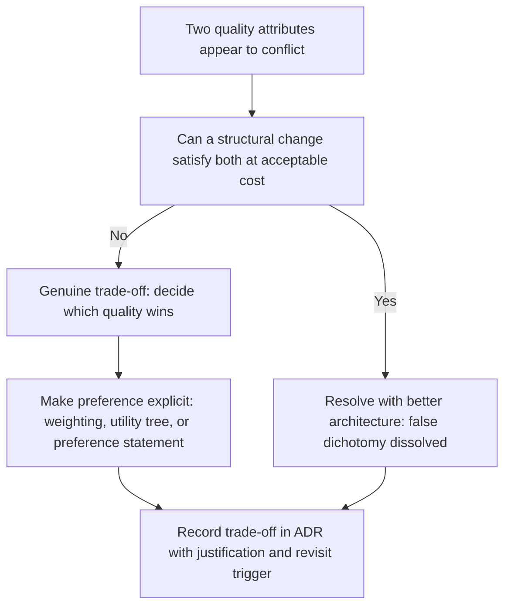

# Quality Attribute Trade Offs

> **Core skill:** Managing conflicts between quality attributes — making the trade-off explicit, deciding which quality wins for each structural choice, recording the preference in ADRs, and recognizing when a trade-off is a false dichotomy that better architecture can dissolve.

## Why This Matters

Quality attributes are not allies. Performance architecture and security architecture pull in opposite directions; availability architecture and modifiability architecture demand different structures; the system that tries to maximize all qualities maximizes none. The architect's most important skill is arguably not selecting tactics for a single quality attribute — it is resolving the conflicts that arise when multiple quality attributes compete for the same structural decision.

The trade-off problem is hardest because it is not solvable by optimization. There is no Pareto-optimal architecture that delivers perfect security, blazing performance, infinite availability, and effortless modifiability. Every structural decision privileges some qualities over others, and the architect who does not make those preferences explicit makes them accidentally — leaving the system shaped by whichever quality attribute happened to dominate the last design discussion.

This note covers the classic conflicts, the trade-off matrix, making preference explicit with weighting and utility trees, recording trade-offs in ADRs, and recognizing false dichotomies — situations where what appears to be an inevitable conflict is actually a design failure that can be resolved with better architecture.

## Classic Quality Attribute Conflicts

| Conflict | Why They Conflict | Structural Manifestation | Example |
|----------|------------------|------------------------|---------|
| **Security vs Performance** | Encryption, authentication, and authorization add latency and consume resources | Every security gate adds a network hop and CPU cost | TLS termination adds 5-50ms; deep packet inspection adds more |
| **Availability vs Consistency** | CAP theorem: partition tolerance forces choice between consistency and availability | Distributed systems must choose: return possibly stale data or refuse requests during partition | Eventually-consistent cache vs strongly-consistent database |
| **Modifiability vs Performance** | Indirection, abstraction, and configuration-driven behavior add overhead | Every abstraction layer adds indirection; configuration evaluation adds runtime cost | Plugin architecture vs hard-coded dispatch |
| **Modifiability vs Simplicity** | Patterns that enable change (indirection, encapsulation, interfaces) add complexity | A system designed for modification is more complex than one designed for a single use | Strategy pattern for one implementation is over-engineering |
| **Availability vs Cost** | Redundancy, multi-region, and automated failover multiply infrastructure cost | High availability requires duplicate resources and cross-region networking | 99.99% costs roughly 2-5x more than 99.9% |
| **Performance vs Portability** | Platform-specific optimizations deliver best performance but bind to the platform | Abstraction layers cost performance; direct platform use costs portability | Native cloud services vs cloud-agnostic abstraction |
| **Usability vs Security** | Authentication steps, permission prompts, and security warnings degrade user experience | Every security interaction is a friction point in the user flow | Multi-factor authentication adds steps to login |
| **Deployability vs Modifiability** | Feature flags and deployment strategies add complexity to the architecture | Every deployment option multiplies the states the system can be in | Feature flags create combinatorial testing complexity |

## The Trade-Off Matrix

A trade-off matrix makes conflicts visible for a specific system. Each cell records the interaction between two quality attributes:

```markdown
# Quality Attribute Trade-Off Matrix: [System]

| | Performance | Availability | Security | Modifiability | Deployability |
|---|---|---|---|---|---|
| **Performance** | — | Favor performance: sync writes over async replication | Conflict: encryption adds latency; accept p95 +15ms | Conflict: minimize indirection; favor direct calls | Low conflict: fast deployment helps performance |
| **Availability** | Conflict: redundant systems add latency | — | Synergy: both need redundancy | Conflict: redundancy complicates modification | Synergy: deployment tactics support availability |
| **Security** | Resolved: TLS terminated at edge; internal traffic in clear | Synergy: security requires availability of auth service | — | Low conflict: both benefit from stable interfaces | Conflict: security gates slow deployment |
| **Modifiability** | Trade-off: accept indirection cost for modifiability | Low conflict: both benefit from modularity | Synergy: stable interfaces help both | — | Conflict: modifiability adds deployment complexity |
| **Deployability** | Resolved: blue-green requires double capacity during cutover | Synergy: deployment automation reduces MTTR | Conflict: security review gates slow deployment | Trade-off: feature flags add modifiability at deployment complexity cost | — |
```

Each cell names the relationship (conflict, synergy, neutral, resolved) and records the decision about which quality wins or how the conflict was resolved.

## Making Preference Explicit

| Method | How It Works | When to Use | Output |
|--------|-------------|-------------|--------|
| **Weighting** | Assign numeric weights to each quality attribute reflecting business priority | When qualities have clearly different business value | Weighted decision matrix |
| **Utility tree** | Organize quality scenarios in a tree; assign business value and technical risk to each | Formal evaluation (ATAM); when many scenarios compete | Prioritized scenario tree |
| **Preference statement** | Declare which quality wins when two conflict for a specific structural decision | Every structural decision where qualities conflict | One sentence in the ADR |
| **Sensitivity points** | Identify the architectural elements where a small change in a quality target produces a disproportionate cost | During architecture evaluation | Documented sensitivity points |

### Utility Tree Example

```markdown
# Utility Tree: [System]

## Performance (Weight: High)
- (H, H) Order submission under peak load: p95 < 2s
- (H, M) Product search: p99 < 500ms
- (M, L) Report generation: complete within 30s

## Availability (Weight: High)
- (H, H) Order service failure: recover within 30s, zero data loss
- (M, H) Degraded mode: search available even if recommendations fail

## Security (Weight: Critical)
- (H, H) Unauthorized access: blocked within first attempt, audit logged
- (H, M) Data in transit: TLS for all external traffic

## Modifiability (Weight: Medium)
- (M, H) Add payment method: 3 person-days, no other payment methods affected
- (M, M) Change notification provider: 1 person-day, no consumer change

[ (Business Value, Technical Risk): H=High, M=Medium, L=Low ]
```

## Recording Trade-Offs in ADRs

Every ADR that makes a structural decision where quality attributes conflict must record the trade-off:

```markdown
# ADR-012: Use synchronous writes for order processing

## Quality Attribute Trade-Off
- **Prioritized:** Consistency — orders must be confirmed before responding to the user
- **Sacrificed:** Availability — during a database partition, order processing is unavailable rather than accepting orders with uncertain status
- **Justification:** Business requirement: an order that cannot be confirmed must not be accepted. Lost revenue from unavailability during partition is lower than cost of order disputes from inconsistent state.

## Revisit Trigger
If the business accepts eventual consistency for orders (e.g., "order received" acknowledgment with async confirmation), this decision should be re-examined.
```

The trade-off section makes the preference explicit: which quality won, which lost, and why. It also names the revisit trigger — the condition under which the preference might change — so the decision is not frozen.

## When Trade-Offs Become False Dichotomies

Not every conflict is a real trade-off. Some are false dichotomies that dissolve with better architecture:

| Apparent Trade-Off | Why It May Be False | Resolution |
|-------------------|--------------------|------------|
| **Security vs Performance** | "We cannot encrypt because it is too slow" | Hardware-accelerated encryption; terminate TLS at edge; cache secure sessions |
| **Modifiability vs Simplicity** | "Abstractions make the system too complex" | Scope abstraction to areas of actual change; avoid abstraction where change is not anticipated |
| **Availability vs Cost** | "Multi-region is too expensive" | Active-passive instead of active-active; warm standby; cloud provider multi-AZ |
| **Consistency vs Availability** | "We must choose one" | Different parts of the system may have different consistency requirements; not an all-or-nothing choice |
| **Deployability vs Stability** | "Frequent deployment risks instability" | Deployment automation, canary releases, and observability make frequent deployment safer than infrequent |

The test for a false dichotomy: can a structural change satisfy both qualities without unacceptable cost? If yes, the trade-off is an architecture problem, not an inherent conflict — and the architect's job is to find the structural resolution rather than to choose one quality over the other.



## Practical Applications

### Trade-Off Analysis Checklist

- [ ] Quality attribute conflicts are identified and made explicit — not left to implicit resolution
- [ ] A trade-off matrix maps the interactions between the system's significant quality attributes
- [ ] Each structural decision where qualities conflict records which quality was prioritized and why
- [ ] Trade-off decisions include revisit triggers: when the preference might change
- [ ] Apparent trade-offs are tested for false dichotomies before being accepted as real
- [ ] Sensitivity points are identified: where a small change in quality target costs disproportionately

### Trade-Off Decision Template

```markdown
# Trade-Off Decision: [Title]

## Conflicting Qualities
- Quality A: [name] — [what the architecture would do to maximize it]
- Quality B: [name] — [what the architecture would do to maximize it]

## False Dichotomy Test
[Can the conflict be resolved structurally? If yes, describe the resolution. If no, proceed.]

## Decision
- Prioritized: [quality] — [reasoning rooted in business impact]
- Sacrificed: [quality] — [accepted cost]
- Mitigation: [what, if anything, reduces the cost to the sacrificed quality]

## Revisit Trigger
[Condition or date when this preference should be re-examined]
```

## Common Pitfalls

| Pitfall | Why It Is a Problem | Better Approach |
|---------|---------------------|-----------------|
| **Trade-offs left implicit** | The system is shaped by whichever quality dominated the last discussion | Every structural decision that involves quality conflict records the preference |
| **One quality dominates all decisions** | Performance-maximized architecture that is unmodifiable; security-maximized architecture that is unusable | Weight qualities; let different qualities win different decisions |
| **False dichotomies accepted uncritically** | Architecture sacrifices qualities unnecessarily because the conflict was assumed, not tested | Test every apparent trade-off: can structure dissolve it? |
| **No revisit triggers** | A trade-off made for startup conditions persists when the system is enterprise-scale | Every trade-off decision names the condition that would reverse it |
| **Trade-off by loudest voice** | The most senior or most vocal stakeholder's quality wins every conflict | Make preference systematic: weighting, utility trees, documented rationale |
| **Pretending there are no trade-offs** | "Our architecture optimizes for all quality attributes equally" | Name the real conflicts; make the choices; be honest about what is sacrificed |

## Success Indicators

- Architecture decisions name the quality attribute trade-offs accepted
- Different structural decisions privilege different qualities — no single quality dominates every choice
- Trade-off decisions include revisit triggers that fire when business context changes
- False dichotomies are identified and resolved structurally before qualities are sacrificed
- The trade-off matrix is a living document, updated as the system evolves

## Related Topics

- [[01_Quality_Attribute_Workshops]] — how quality conflicts surface and are prioritized in workshops
- [[07_Architecture_and_Quality_Attributes]] — the quality attribute catalog and scenario format
- [[04_Architecture_Decision_Making]] — the decision process that produces trade-off ADRs
- [[04_Architecture_Evaluation_and_Trade_Offs/00_overview|Architecture Evaluation and Trade Offs]] — formal trade-off analysis methods
- [[career-path/02_Senior_Software_Engineer/08_Engineering_Economics_and_Trade_Offs/06_Trade_Off_Evaluation|Trade Off Evaluation (Senior)]] — the economic foundation for trade-off decisions

## Summary

Quality attributes conflict by design — security costs performance, availability costs consistency, modifiability costs simplicity — and the architect's job is not to eliminate the conflicts but to make them explicit, decide which quality wins for each structural choice, and record the preference and its justification. The trade-off matrix maps interactions between qualities for a specific system; weighting and utility trees make preferences systematic rather than ad hoc. Every ADR that involves conflicting qualities must record the trade-off and a revisit trigger. Not every conflict is real: the architect tests apparent trade-offs for false dichotomies — situations where better architecture can satisfy both qualities — before accepting that one must be sacrificed. The honesty matters: architecture that claims to optimize for all qualities equally is usually architecture that was never evaluated against any of them.