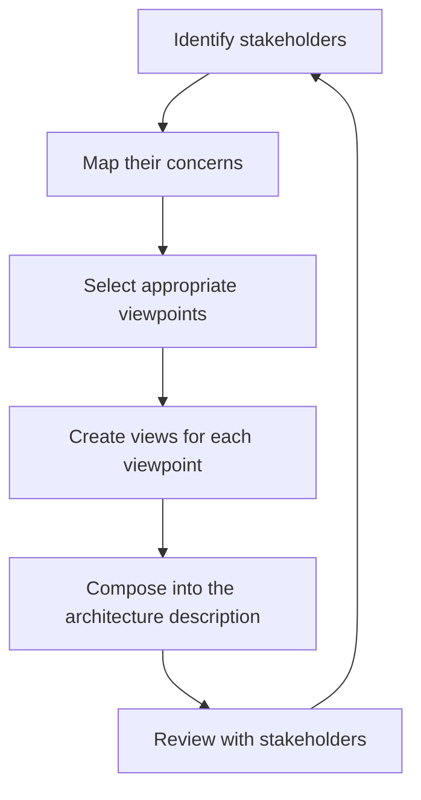

# Architecture Description and Views

> **Core capability:** The architect communicates structure to diverse stakeholders — using views and viewpoints, diagrams at the right abstraction, and a living architecture description that outlasts any single meeting.

## Why This Matters

Architecture that exists only in the architect's head is not architecture — it is tribal knowledge with a title. The deliverable of architectural work is *shared understanding*: the developer who can see why the system is shaped this way, the product manager who understands a structural constraint, the new hire who orients within a week because the diagrams make sense.

Views and viewpoints are the mechanism: a viewpoint is a stakeholder's lens (the security team sees trust boundaries and data flows), a view is the concrete diagram for that lens. The architect's writing skill — ADRs, architecture descriptions, stakeholder briefings — is what makes structural decisions stick beyond the meeting.

## Topics in This Capability Area

| Topic | Core Skill | When It Matters |
|-------|------------|-----------------|
| [[01_Views_and_Viewpoints]] | Selecting and composing views for stakeholder audiences | Architecture documentation; stakeholder reviews |
| [[02_Module_and_Code_Views]] | Communicating static structure: decomposition, layers, dependencies | Developers; new team members |
| [[03_Component_and_Connector_Views]] | Communicating runtime behavior: processes, connectors, data flow | Performance and reliability analysis |
| [[04_Allocation_Views]] | Mapping software to environment: deployment, installation, work assignment | Operations; infrastructure; program management |
| [[05_Architecture_Decision_Records]] | Writing ADRs that survive team changes and remain findable | Every consequential decision |
| [[06_Diagramming_for_Architects]] | Choosing diagram types — C4, UML, informal — and using them effectively | Every architecture description |
| [[07_Communicating_Architecture]] | Presenting architecture to different audiences: engineers, leadership, external | Reviews; onboarding; governance |

## The Viewpoint Selection Process

Views are validated against the concerns they are meant to address — not against the architect's preferences.

## Senior vs Architect

| Activity | Senior engineer | Software Architect |
|----------|-----------------|-------------------|
| Diagrams | Draws for team understanding | Owns the system's architecture description and views |
| ADRs | Writes for consequential team decisions | Owns the ADR set as a system artifact |
| Audience | Team and immediate stakeholders | Multi-team, leadership, governance, onboarding |
| Medium | Whiteboard and team docs | Maintained architecture description with review cadence |

## Practical Applications

### Architecture Description Checklist

- [ ] Every view answers at least one stakeholder concern
- [ ] The architecture description uses consistent diagram notation
- [ ] ADRs are findable, linked, and statused (proposed/accepted/deprecated)
- [ ] The description has a review cadence — not written once and forgotten
- [ ] New team members can orient from the architecture description within a day

## Common Pitfalls

| Pitfall | Why It Is a Problem | Better Approach |
|---------|---------------------|-----------------|
| **One-diagram architecture** | One view shows everything to nobody | Multiple views, each for a specific stakeholder concern |
| **Notation soup** | UML, C4, and free-form mixed; nobody trusts the representation | Choose one notation system; be consistent |
| **ADR graveyard** | Decisions recorded but never revisited; dead decisions mislead | Status ADRs; deprecate superseded ones |
| **Write-once architecture** | Description written at inception, never updated — drifts from reality | Review and update on a cadence; treat as living artifact |

## Success Indicators

- Stakeholders recognize their concerns in the views
- ADRs are cited in design discussions and onboarding
- Diagram conventions are consistent and team members can contribute views
- The architecture description is reviewed and updated within the last quarter
- New hires reference ADRs before asking the architect

## Related Capabilities

- [[01_Architecture_Fundamentals/00_overview|Architecture Fundamentals]]: what gets described and communicated
- [[04_Architecture_Evaluation_and_Trade_Offs/00_overview|Architecture Evaluation and Trade Offs]]: evaluation reports as views
- [[career-path/02_Senior_Software_Engineer/06_Communication_and_Influence/01_Technical_Writing|Technical Writing (Senior)]]: the writing foundation this scales
- [[career-path/03_Staff_Engineer/04_Influence_and_Alignment/01_Writing_Proposals_That_Get_Adopted|Writing Proposals That Get Adopted (Staff)]]: the org-scale counterpart

## Summary

Architecture description is the architect's primary deliverable: views for each stakeholder, ADRs as the permanent record of decisions, and a maintained architecture description as the system's structural memory. The goal is shared understanding that survives staff rotation — because architecture that lives only in one head isn't architecture.