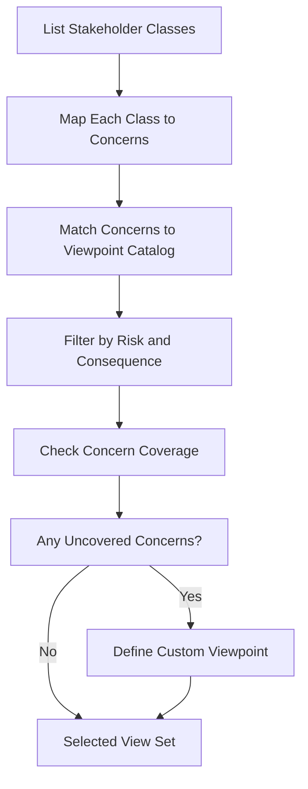

# Views and Viewpoints

> **Core skill:** The architect selects and composes views — concrete diagrams answering specific stakeholder concerns through defined viewpoint lenses — to build a complete architecture description without drowning anyone in detail.

## Why This Matters

A single diagram cannot serve every audience. Developers need module boundaries and dependency rules; operations engineers need deployment topologies and recovery paths; security reviewers need trust zones and data-flow maps. The architect's job is not to draw one perfect picture — it is to draw the right pictures for the right people, each from a defined perspective.

The viewpoint/view distinction formalizes this: a **viewpoint** is a template for looking at the system (the "where to stand"), and a **view** is the artifact produced when looking (the "what you see"). Philippe Kruchten's 4+1 model and the Rozanski & Woods catalog both provide off-the-shelf viewpoint sets, but the architect must still decide which ones a given project needs — and which ones it can skip.

## Viewpoint Catalogs

### Kruchten's 4+1 View Model

The foundational model, published in 1995, organizes architecture description into five concurrent views:

| View | Audience | Addresses | Notation Examples |
|------|----------|-----------|-------------------|
| **Logical** | Developers, designers | Functional requirements — what the system does | UML class, package, sequence |
| **Process** | Integrators, performance engineers | Concurrency, distribution, non-functional requirements | UML activity, sequence, deployment |
| **Development** | Developers, build engineers | Module organization, build structure | UML package, component |
| **Physical** | System engineers, operators | Deployment topology, hardware mapping | UML deployment |
| **Scenarios (+1)** | All stakeholders | Ties the four views together; use cases as validation | UML use case, sequence |

### Rozanski & Woods Viewpoint Catalog

A more detailed catalog from *Software Systems Architecture* (2011), organized by concern:

| Viewpoint | Core Concern | Key Stakeholders | When It Matters |
|-----------|-------------|------------------|-----------------|
| **Context** | System scope, external actors, dependencies | All stakeholders | Every architecture description |
| **Functional** | Runtime functional behavior | Users, testers, developers | Functional correctness |
| **Information** | Data structure, flow, ownership | Data architects, DBAs, compliance | Data-heavy systems |
| **Concurrency** | Threading, processes, locks, deadlocks | Performance engineers, developers | High-concurrency systems |
| **Development** | Module structure, build, code organization | Developers, build engineers | Every system |
| **Deployment** | Hardware, network, environments | Operations, infrastructure | Distributed systems |
| **Operational** | Backup, monitoring, disaster recovery | Operations, support | Production systems |

## Selecting the Right Views



Selection is a filtering process, not a checklist. Every view costs maintenance effort — the architect earns credibility by producing the minimum set that answers every stakeholder's genuine questions.

## Viewpoint Selection Decision Table

| Project Characteristic | Likely Essential Views | Likely Optional Views |
|------------------------|----------------------|----------------------|
| Monolith, single team | Development, Functional, Context | Concurrency, Deployment |
| Distributed microservices | Context, Development, Deployment, Functional | Concurrency (unless high-throughput) |
| Regulatory compliance (HIPAA, PCI) | Context, Functional, Information, Deployment | Concurrency |
| Embedded / real-time | Concurrency, Functional, Physical | Information |
| SaaS with multi-tenancy | Context, Deployment, Development, Information | Concurrency |

## Just-Enough Architecture Documentation

The principle: document only what is necessary to answer the questions stakeholders are actually asking, at the fidelity they can consume. Over-documentation is a form of waste — diagrams nobody reads still require maintenance.

### When to Stop

| Signal | Meaning |
|--------|---------|
| Every stakeholder concern has at least one view | Coverage is sufficient |
| Views are self-consistent (no contradictions) | Coherence is satisfied |
| Stakeholders stop asking "and then what happens?" | Depth is sufficient |
| Non-developer stakeholders can navigate the description | Accessibility is achieved |
| Another view would answer questions nobody is asking | Stop here |

## Practical Applications

### Viewpoint Selection Checklist

- [ ] All stakeholder classes are identified and documented
- [ ] Each stakeholder class's top three concerns are mapped to specific views
- [ ] At least one view addresses each architectural risk area (performance, security, availability)
- [ ] Every view names its viewpoint, audience, and notation conventions
- [ ] The view set has been reviewed against the Rozanski & Woods catalog for gaps
- [ ] Views not produced have a documented reason for omission

### Architecture View Register Template

```markdown
## View Register

| View Name | Viewpoint | Audience | Notation | Status | Last Updated |
|-----------|-----------|----------|----------|--------|--------------|
| System Context | Context | All stakeholders | C4 Level 1 | Complete | 2026-08-22 |
| Container Diagram | Development | Developers, ops | C4 Level 2 | Complete | 2026-08-22 |
| Deployment Topology | Deployment | Operations | UML deployment | Complete | 2026-08-22 |
| Payment Flow Sequence | Functional | Testers, developers | UML sequence | Draft | 2026-08-20 |
```

## Common Pitfalls

| Pitfall | Why It Is a Problem | Better Approach |
|---------|---------------------|-----------------|
| **Single-view architecture** | One diagram forced to serve every audience — satisfies none | Produce the minimum view set: at minimum, context plus development |
| **Viewpoint without audience** | A view created because "we should have one" — no stakeholder asked for it | Every view names its audience; omit views nobody will read |
| **All views, no priority** | Seven views produced equally — overwhelms readers, dilutes maintenance focus | Rank views by stakeholder consequence; maintain high-priority views first |
| **View drift** | Views updated independently; contradictions emerge between them | Cross-check views on each update; one source of truth for each fact |
| **Notation per view** | Every view uses a different notation — readers cannot transfer understanding | One notation family (C4 or UML) across the entire description |
| **Missing context view** | Stakeholders cannot place the system in its environment | Context view is non-negotiable; always produce one |

## Success Indicators

- Stakeholders can find their concerns addressed in at least one specific view
- The view register is current and names an owner for each view
- Views are self-consistent: no contradiction between two views of the same element
- New team members navigate from context view to detail view without explanation
- The view set is reviewed at least quarterly for drift and gaps

## Related Topics

- [[02_Module_and_Code_Views]]
- [[03_Component_and_Connector_Views]]
- [[04_Allocation_Views]]
- [[06_Diagramming_for_Architects]]
- [[career-path/03_Staff_Engineer/04_Influence_and_Alignment/01_Writing_Proposals_That_Get_Adopted|Writing Proposals That Get Adopted (Staff)]]

## Summary

Views and viewpoints are the architect's communication framework: a viewpoint defines a stakeholder lens, a view is the concrete diagram produced through that lens, and the architecture description is the composed set of views. The skill is not in drawing every possible view — it is in selecting the minimal set that satisfies every genuine stakeholder concern, maintaining consistency across views, and knowing when to stop documenting and start building.