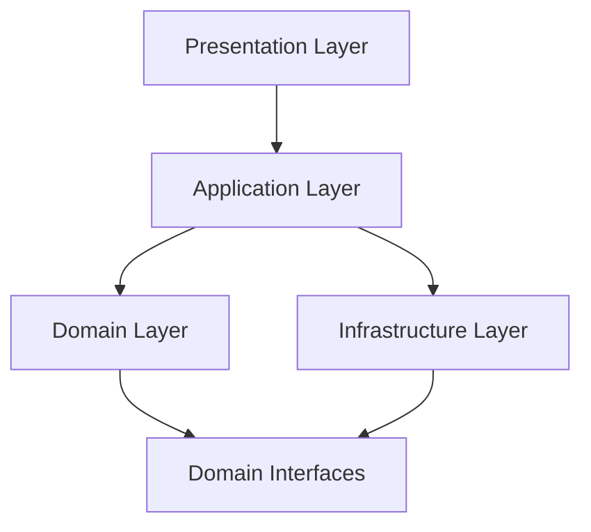

# Module and Code Views

> **Core skill:** The architect communicates static structure — how the system is built from modules, how they depend on each other, and where layers and data models sit — so that developers can navigate, extend, and maintain the codebase with confidence.

## Why This Matters

Static structure is the architecture's skeleton. Before the system runs, before processes start or messages flow, there is a buildable codebase organized into modules with declared dependencies and enforced boundaries. When a developer opens the repository and asks "where does this go?" or "what can I call from here?", the answer lives in the module and code views.

These views are the closest the architect gets to the code itself. They constrain what can depend on what, enforce layering discipline, and make the data model explicit. A system whose runtime behavior is elegant but whose module structure is a tangle of cyclic dependencies will degrade under maintenance — and the degradation starts in the static views.

## Core Module View Types

### Decomposition View

Shows how the system is partitioned into implementation units: modules, packages, namespaces, or source files. The purpose is to make the system intellectually manageable — each module has a clear responsibility, a defined interface, and a reason to exist.

| Principle | Description | Test |
|-----------|-------------|------|
| **Single responsibility** | Each module addresses exactly one functional area | Can you describe it in one sentence without "and"? |
| **Information hiding** | Modules expose interfaces, not internals | Can internals change without affecting clients? |
| **Closure of change** | Changes for one reason affect exactly one module | Does a feature change require touching >2 modules? |
| **Acyclic dependencies** | No circular references between modules | Does the dependency graph have cycles? |

### Uses View

The dependency map: what modules use what other modules. This view answers "if I change module X, what else might break?" and "can I extract this module into a separate service?"



### Layered View

A specialization of the uses view where dependencies flow in one direction — typically downward — through named layers. The layering rules are explicit: a layer may only depend on the layer directly beneath it (strict layering) or on any lower layer (relaxed layering).

| Layer | Responsibility | Dependency Rule |
|-------|----------------|-----------------|
| **Presentation** | UI, API controllers, HTTP handling | Depends on Application |
| **Application** | Use cases, orchestration, DTOs | Depends on Domain, Infrastructure interfaces |
| **Domain** | Entities, value objects, domain services | Depends on nothing (innermost) |
| **Infrastructure** | Persistence, messaging, external services | Implements domain interfaces; depends on Domain |

### Data Model View

The conceptual and logical data model — entities, relationships, cardinalities, and constraints. This view may be expressed as an ER diagram, a UML class diagram focused on domain objects, or a set of table definitions.

## Diagram Conventions

### Notation Choice by Audience

| Audience | Recommended Notation | Why |
|----------|---------------------|-----|
| Developers (team) | C4 Component diagram, UML package | Familiar, precise |
| Developers (new hire) | C4 Container + Component | Navigable at two levels |
| Architects (review) | UML class and package | Complete structural detail |
| Non-technical stakeholders | Simplified boxes-and-lines | Avoid notation overhead |

### C4 Model for Static Structure

| C4 Level | Shows | Maps To |
|----------|-------|---------|
| **System Context** | System and its external actors | Not a module view — context |
| **Container** | Deployable units (web app, database, file system) | High-level decomposition |
| **Component** | Logical components within a container | Decomposition and uses views |
| **Code** | Classes, interfaces (generated from code) | Detailed uses view |

## Enforcing Module Boundaries

### Dependency Rule Enforcement

| Technique | Strength | Cost |
|-----------|----------|------|
| **Convention** | Team agrees; no tooling | Free but fragile |
| **Linter rules** (e.g., ESLint import/no-restricted-paths) | Caught at build time | Low setup cost |
| **ArchUnit / NetArchTest** | Unit-test enforceable | Medium setup cost |
| **Module system** (Java modules, .NET assemblies) | Compiler-enforced | Requires upfront design |
| **Multi-project build** (Gradle, Bazel) | Build-enforced | High setup; strong guarantee |

## Practical Applications

### Module View Checklist

- [ ] Every module has a clear, single responsibility stated in one sentence
- [ ] Dependency graph is documented and has no cycles
- [ ] Layering rules are explicit and enforced by tooling or convention
- [ ] Data model view exists for domain entities and their relationships
- [ ] New team members receive the decomposition view as part of onboarding
- [ ] Module boundaries align with team boundaries (Conway awareness)

### Dependency Review Template

```markdown
## Dependency Health Report

| Metric | Current | Target | Trend |
|--------|---------|--------|-------|
| Module count | 42 | 40–50 | Stable |
| Cyclic dependencies | 0 | 0 | — |
| Average dependencies per module | 3.2 | < 5 | Improving |
| Modules with >10 dependents | 2 | < 3 | At risk |
| Max dependency depth | 5 | < 6 | Acceptable |
```

## Common Pitfalls

| Pitfall | Why It Is a Problem | Better Approach |
|---------|---------------------|-----------------|
| **Missing decomposition view** | Developers discover module boundaries by reading code — slow, error-prone | Produce and maintain a decomposition diagram at C4 Component level |
| **Cyclic dependencies tolerated** | Changes cascade unpredictably; extraction into services becomes impossible | Detect cycles at build time; break them on discovery |
| **Layers in name only** | "Service" classes that call across layers — layering rules exist only on the diagram | Enforce with ArchUnit or equivalent; treat violations as build failures |
| **Data model absent from architecture** | Developers reconstruct the model from schemas and ORM mappings — inconsistencies multiply | Maintain a conceptual data model view as a living architecture artifact |
| **Module-to-team mismatch** | Modules cross team boundaries; every change requires cross-team coordination | Align module boundaries with team ownership (Inverse Conway Maneuver) |
| **Over-decomposition** | Too many modules; overhead of inter-module navigation exceeds benefit of separation | Start coarse; split only when a module has multiple change reasons |

## Success Indicators

- New developers locate the right module for a feature within their first day
- Dependency graph has zero cycles and is verified at build time
- Layering violations are caught automatically, not in code review
- Module boundaries correspond to team ownership boundaries
- Data model view is the reference for all schema discussions

## Related Topics

- [[01_Views_and_Viewpoints]]
- [[03_Component_and_Connector_Views]]
- [[06_Diagramming_for_Architects]]
- [[career-path/02_Senior_Software_Engineer/03_Architecture_and_Design_Judgment/00_overview|Architecture and Design Judgment (Senior)]]

## Summary

Module and code views communicate static structure: decomposition into implementation units, dependency relationships, layering rules, and the data model. They are the architecture views closest to the code, and they matter because they constrain every future change. A system with clear, enforced module boundaries survives team rotation; a system without them decays into a big ball of mud, one unchecked dependency at a time.