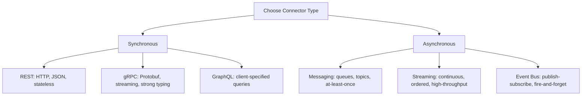

# Component and Connector Views

> **Core skill:** The architect communicates runtime behavior — how components interact at execution time through connectors like REST, messaging, streaming, and RPC — so that integrators, performance reviewers, and reliability engineers can reason about the live system.

## Why This Matters

Static structure tells you how the system is built. Runtime structure tells you how it behaves. The same set of modules can produce radically different runtime topologies: a deployment where every service talks directly to every other service is a different system from one where all traffic flows through a gateway, even if the code modules are identical.

Component and Connector (C&C) views are where architecture meets production. Performance bottlenecks live in connector choices; reliability depends on how components handle failure of their connectors; security is about what components are allowed to communicate. An architect who only draws static views is not describing the system that actually runs — they are describing the system that compiles.

## Component Types by Runtime Role

| Component Type | Responsibility | Examples |
|----------------|----------------|----------|
| **Service** | Provides a capability to other components | REST API, gRPC service, GraphQL endpoint |
| **Client** | Consumes capabilities from services | Web browser, mobile app, upstream gateway |
| **Message Producer** | Emits events or commands | Kafka producer, RabbitMQ publisher |
| **Message Consumer** | Reacts to events or commands | Kafka consumer, SQS listener |
| **Stream Processor** | Transforms continuous data flows | Kafka Streams, Flink job, Spark Streaming |
| **Shared Data Store** | Provides persistent state to multiple components | Database, cache, object store |
| **Infrastructure Component** | Provides cross-cutting capabilities | Load balancer, API gateway, service mesh |

## Architectural Styles in C&C Views

### Client-Server

Components are divided into clients (requestors) and servers (responders). The connector is typically synchronous request-response. Dominant in web applications and APIs.

| Characteristic | Implication |
|----------------|-------------|
| Synchronous by default | Caller blocks; timeouts are critical |
| Server is the bottleneck | Scale the server tier, not the clients |
| State typically server-side | Clients can be thin; session management matters |
| Connector: HTTP, gRPC, WebSocket | Each has different semantics and overhead |

### Publish-Subscribe

Components communicate through events published to channels. Producers and consumers are decoupled — neither knows about the other. Dominant in event-driven architectures.

| Characteristic | Implication |
|----------------|-------------|
| Asynchronous by default | Eventual consistency; no caller timeout |
| Decoupled producers and consumers | Add consumers without modifying producers |
| Event ordering challenges | Must design for out-of-order delivery |
| Connector: Kafka, RabbitMQ, SNS/SQS | Each has different delivery guarantees |

### Shared Data

Components communicate by reading and writing a shared data store. The connector is the data access protocol. Dominant in data-centric systems and legacy integration.

| Characteristic | Implication |
|----------------|-------------|
| Implicit coupling through schema | Schema change impacts all readers/writers |
| No direct component dependencies | Integration testing is harder |
| Consistency is the central challenge | Transaction boundaries matter |
| Connector: SQL, file system, Redis | ACID vs eventual consistency trade-offs |

### Peer-to-Peer

Components are equals — each can initiate or respond to requests. No centralized server. Dominant in distributed systems, blockchain, and file-sharing.

## Connector Semantics



### Connector Comparison

| Connector | Paradigm | Latency | Reliability | Use When |
|-----------|----------|---------|-------------|----------|
| **REST** | Sync request-response | Low | Retry on 5xx | CRUD APIs, external-facing endpoints |
| **gRPC** | Sync + streaming | Very low | Built-in retry, deadline | Internal service-to-service, high throughput |
| **GraphQL** | Sync query | Medium | Client retry on error | Complex data shapes, mobile clients |
| **Messaging (Kafka)** | Async pub-sub | Low-medium | At-least-once / exactly-once | Event sourcing, log processing, decoupling |
| **RPC (legacy)** | Sync request-response | Low | Varies by protocol | Legacy systems, binary protocols |

## Component Interface Specification

Every component in a C&C view must declare:

| Interface Element | Description | Example |
|-------------------|-------------|---------|
| **Provided interfaces** | What the component offers to others | REST GET /orders/{id}, gRPC OrderService.GetOrder |
| **Required interfaces** | What the component needs from others | PaymentGateway.Charge, UserService.GetProfile |
| **Data contracts** | Schemas for messages and responses | JSON Schema, Protobuf, Avro |
| **Quality of service** | Latency/throughput/availability guarantees | P99 < 50ms, 99.95% uptime |
| **Error semantics** | How errors are communicated and handled | HTTP status codes, gRPC error codes, dead-letter queues |

## Practical Applications

### C&C View Checklist

- [ ] Every runtime component is named and its type identified (service, client, producer, etc.)
- [ ] Every connector between components is labeled with its protocol and semantics
- [ ] Each component's provided and required interfaces are documented
- [ ] The view distinguishes synchronous from asynchronous communication paths
- [ ] Failure modes are annotated: what happens when each connector fails?
- [ ] The view has been reviewed by an operations engineer for deployability

### Component Interface Template

```markdown
## Component: Order Service

| Property | Value |
|----------|-------|
| Type | Service |
| Deployment | Container, 3 replicas |
| Provided interfaces | POST /orders (create), GET /orders/{id} (retrieve) |
| Required interfaces | PaymentGateway.Charge, InventoryService.Reserve |
| Data contracts | Order schema in `schemas/order.json` |
| Availability target | 99.9% |
| P99 latency target | 200ms |
| Failure mode | Circuit breaker on PaymentGateway; 5xx returned to caller on Inventory timeout |
```

## Common Pitfalls

| Pitfall | Why It Is a Problem | Better Approach |
|---------|---------------------|-----------------|
| **Missing connector semantics** | Line between boxes says nothing — is it REST, gRPC, or a cron job reading a file? | Label every connector with protocol, direction, and whether it is sync or async |
| **Component responsibilities overlap** | Two components claim the same responsibility — runtime conflicts and duplication | Each responsibility belongs to exactly one component |
| **Implicit shared state** | Components communicate through a database that is not in the view | Model shared data stores as explicit components with connectors |
| **Happy-path-only view** | Diagram shows only successful interactions; failure modes are invisible | Annotate failure paths: timeouts, retries, circuit breakers, fallbacks |
| **Style confusion** | Mixing pub-sub and request-response without clear boundaries | Label architectural style per connector; justify mixed-style decisions |
| **Interface drift** | Component interfaces change without updating the C&C view | Treat C&C views as contract documentation; update on interface changes |

## Success Indicators

- An integrator can wire two components together from the view alone
- Every connector is labeled with protocol, sync/async, and failure semantics
- Performance test scenarios are derived directly from C&C view annotations
- The C&C view and the deployment view are consistent (same components, same connectors)
- Circuit breaker and retry policies are visible on the diagram

## Related Topics

- [[01_Views_and_Viewpoints]]
- [[02_Module_and_Code_Views]]
- [[04_Allocation_Views]]
- [[06_Diagramming_for_Architects]]
- [[career-path/05_Tech_Lead/03_Technical_Direction_and_Architecture/03_Design_Review_Leadership|Design Review Leadership (Tech Lead)]]

## Summary

Component and Connector views describe the runtime architecture: what executes, how it communicates, and what happens when communication fails. They are the primary views for performance analysis, reliability engineering, and integration planning. The architect's discipline is in choosing the right connector for each interaction, documenting interfaces as contracts, and making failure modes visible — because the runtime is where architecture meets reality.