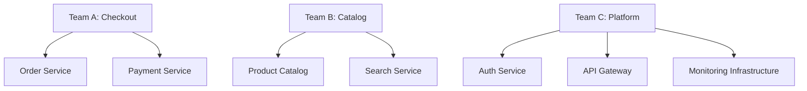

# Allocation Views

> **Core skill:** The architect maps software to its environment — deployment topology, file and configuration layout, and team-to-module assignments — so that operations, infrastructure, and program management can plan, provision, and staff the system.

## Why This Matters

A system that runs perfectly on the architect's laptop but cannot be deployed, installed, or operated in production is not architecture — it is a prototype. Allocation views bridge the gap between logical design and physical reality: what hardware runs what software, how configurations are distributed across environments, and which teams own which modules.

These views also make Conway's Law visible. When the work assignment view shows that two modules owned by different teams communicate synchronously, the architect can see the organizational friction before anyone feels it. Allocation views are where architecture meets operations, infrastructure, and management — and they are the views most likely to be neglected until deployment week, when neglect becomes expensive.

## Deployment View

Shows the mapping of software components to hardware and cloud infrastructure: servers, containers, regions, availability zones, and networks.

### Deployment View Elements

| Element | What It Shows | Audience |
|---------|---------------|----------|
| **Nodes** | Physical or virtual machines, containers, serverless functions | Operations, infrastructure |
| **Environments** | dev, staging, production — each with its own deployment topology | Operations, QA |
| **Regions and zones** | Geographic distribution and failure domains | Infrastructure, DR planning |
| **Network topology** | VPCs, subnets, firewalls, load balancers, CDN | Security, networking |
| **Resource sizing** | CPU, memory, disk, instance count per node | Infrastructure, cost management |

### Environment Parity

| Environment | Purpose | Parity with Production |
|-------------|---------|----------------------|
| **Development** | Local developer workflow | Minimal; may use Docker Compose |
| **Integration/CI** | Automated test execution | Medium; same services, smaller scale |
| **Staging** | Pre-production validation | High; same topology, same data shape |
| **Production** | Live system | The reference; all others approximate it |
| **DR** | Disaster recovery | Hot standby or cold; region-separated |

## Installation View

Documents the file system layout, configuration files, environment variables, and startup sequences that turn deployed binaries into running services.

| Install Element | Example | Why It Matters |
|----------------|---------|----------------|
| **Executable location** | `/opt/payments/payment-service.jar` | Operators know where to find and update |
| **Configuration files** | `/etc/payments/application.yaml` | Configuration changes without rebuild |
| **Log file paths** | `/var/log/payments/service.log` | Monitoring and troubleshooting |
| **Data directories** | `/data/payments/attachments/` | Backup strategy, disk provisioning |
| **Startup scripts** | `systemctl start payment-service` | Service lifecycle management |
| **Environment variables** | `DATABASE_URL`, `LOG_LEVEL` | Secret injection, per-environment tuning |

## Work Assignment View

Maps modules or components to the teams that own them. This view makes organizational structure visible and is the primary tool for detecting Conway's Law friction.



### Conway Visibility Table

| Module Relationship | Team Relationship | Risk | Action |
|--------------------|-------------------|------|--------|
| A depends on B | Same team | Low | Standard coordination |
| A depends on B | Different teams | Medium | Define interface contract; version B's API |
| A and B share a database | Different teams | High | Split the database or assign clear ownership |
| A calls B synchronously | Different teams, different time zones | High | Consider async communication; document SLA |

## Practical Applications

### Deployment View Checklist

- [ ] Every software component is mapped to at least one node in each environment
- [ ] Geographic distribution (regions, zones) is documented and justified
- [ ] Network topology shows firewalls, load balancers, and traffic routing
- [ ] Resource sizing is current and reviewed quarterly
- [ ] Environment parity gaps are documented and accepted

### Work Assignment Audit Template

```markdown
## Work Assignment Audit

| Module | Owning Team | Dependencies (module) | Owning Team (dep) | Risk |
|--------|-------------|----------------------|-------------------|------|
| Order Service | Checkout | Payment Service | Checkout | Low |
| Order Service | Checkout | Product Catalog | Catalog | Medium |
| Payment Service | Checkout | Auth Service | Platform | Medium |
| Search Service | Catalog | Order Service | Checkout | Medium |
```

## Common Pitfalls

| Pitfall | Why It Is a Problem | Better Approach |
|---------|---------------------|-----------------|
| **Deployment view exists only in the ops team's head** | Architecture team designs without deployment constraints; ops discovers integration problems at deploy time | Co-author the deployment view with operations; review at architecture milestones |
| **Production-only deployment view** | Dev and staging environments differ from production in ways nobody documented | Document all environments; call out parity gaps explicitly |
| **Missing installation view** | New operator cannot start the system without tribal knowledge | Document startup sequence, config locations, and environment variables |
| **Work assignment view absent** | Cross-team dependencies are invisible until a coordination failure occurs | Maintain and review the work assignment view quarterly |
| **Static sizing** | Node resource allocations from inception never revisited — over-provisioned or under-provisioned | Review sizing against production metrics quarterly |
| **Single-region deployment without explicit acceptance** | The business assumes DR capability that does not exist | Document region strategy explicitly; if single-region, state it as an accepted risk |

## Success Indicators

- An operator can deploy the system to a new environment from the deployment view alone
- Installation view enables a new operator to start, stop, and troubleshoot services
- Work assignment view reveals all cross-team dependencies and their coordination costs
- Environment parity gaps are documented, sized, and reviewed each quarter
- Resource sizing is within 20% of actual production usage

## Related Topics

- [[01_Views_and_Viewpoints]]
- [[03_Component_and_Connector_Views]]
- [[07_Communicating_Architecture]]
- [[01_Architecture_Fundamentals/00_overview|Architecture Fundamentals]]
- [[07_Operations_and_Infrastructure_Architecture/00_overview|Operations and Infrastructure Architecture]]

## Summary

Allocation views map software to the real world: deployment to hardware and cloud, installation to file systems and configuration, and work assignment to teams. They are the views that make architecture operational — because a system that cannot be deployed, installed, or staffed is not yet a system. The architect's responsibility is to produce these views before deployment week, co-author them with the teams who will live with them, and keep them current as infrastructure and organization evolve.