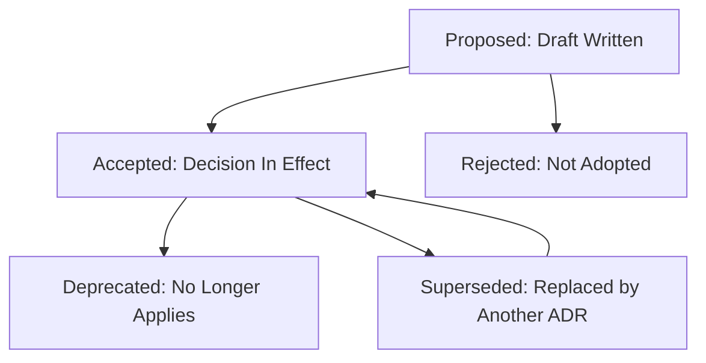

# Architecture Decision Records

> **Core skill:** The architect creates and maintains ADRs — lightweight, findable documents that capture what was decided, why, what alternatives were considered, and what consequences were accepted — as the permanent structural memory of the system.

## Why This Matters

Architecture decisions made without a record become archaeology within six months. Someone encounters a design choice that makes no sense, cannot find anyone who remembers why it was made, and faces a dilemma: change it and risk breaking an unknown constraint, or leave it and live with accumulated cruft. ADRs prevent this by preserving context, reasoning, and trade-offs alongside the code.

At the architect level, ADRs are not just a writing habit — they are a governance artifact. The set of ADRs is the system's decision history. Regulators, auditors, and future architects can trace from requirements to structural choices. A system whose architecture cannot be explained by its ADRs is a system whose architecture exists only in the architect's head — and heads move on.

## The ADR Template

An ADR captures five essential elements in a consistent, searchable format:

```markdown
# ADR-001: Use PostgreSQL as Primary Data Store

## Status
Accepted (2026-08-22)

## Context
We are building an e-commerce platform requiring:
- ACID transactions for order processing and payments
- JSON support for semi-structured product attributes
- Horizontal read scaling for the product catalog
- Team expertise: 5+ years PostgreSQL

Alternatives evaluated: MySQL, MongoDB, Amazon Aurora.

## Decision
We will use PostgreSQL 15 as the primary data store for all transactional workloads.

## Consequences

### Positive
- Zero learning curve for the team
- JSONB supports flexible product attributes without schema migration
- Read replicas provide horizontal read scaling for catalog queries

### Negative
- Write scaling limited to single primary; sharding required above 100K writes/sec
- Operational overhead: backup, replication, and monitoring setup required
- No built-in multi-region write support

### Neutral
- Licensing cost is zero (open source); infrastructure cost comparable to MySQL

## Supersedes
None.

## Superseded By
None.
```

## ADR Lifecycle and States



### State Transition Rules

| From | To | Trigger |
|------|----|---------|
| Proposed | Accepted | Decision reviewed and committed |
| Proposed | Rejected | Decision not adopted; ADR retained for record |
| Accepted | Deprecated | Feature or system removed; decision no longer relevant |
| Accepted | Superseded | New ADR replaces this decision; old ADR links to new one |
| Accepted | Accepted (reaffirmed) | Periodic review confirms decision still valid |

## Findability Strategy

ADRs lose their value if they cannot be found when needed. The architect must design for discoverability from day one.

| Strategy | Implementation | Benefit |
|----------|---------------|---------|
| **Numbered filenames** | `0001-use-postgresql.md`, `0002-use-kafka.md` | Chronological sort; predictable path |
| **ADR index** | `docs/architecture/decisions/README.md` with table of all ADRs | Single entry point; status-at-a-glance |
| **Decision topic tags** | Tags in frontmatter: `database`, `messaging`, `security` | Filterable by concern |
| **Supersede chains** | Each ADR links to what supersedes it and what it supersedes | Full decision genealogy |
| **Repository co-location** | ADRs in `docs/architecture/decisions/` alongside code | Version-controlled; PR-reviewed |
| **Code annotations** | Comment in code referencing ADR number | Trace from code to decision |

## ADR Review Cadence

| Review Type | Frequency | Scope | Participants |
|-------------|-----------|-------|-------------|
| **New ADR review** | Per decision | Single ADR | Decision stakeholders |
| **Quarterly audit** | Every 3 months | All Accepted ADRs: still valid? | Architecture team |
| **Deprecation sweep** | Every 6 months | Identify ADRs to deprecate or supersede | Architecture team + tech leads |
| **Onboarding review** | Per new hire | Top 10 most consequential ADRs | New hire + architect |

## Practical Applications

### ADR Quality Checklist

- [ ] One decision per ADR — not a collection of related decisions
- [ ] Context explains why the decision was needed, with requirements cited
- [ ] At least two alternatives are documented with reasons for rejection
- [ ] Negative consequences are acknowledged, not hidden
- [ ] ADR links to related ADRs (supersedes / superseded by)
- [ ] Status is current and reflects the decision's actual state

### ADR Index Template

```markdown
# Architecture Decision Records

| ADR | Title | Status | Date | Supersedes |
|-----|-------|--------|------|------------|
| ADR-001 | Use PostgreSQL as Primary Data Store | Superseded by ADR-005 | 2026-01-15 | — |
| ADR-002 | Use Kafka for Event Streaming | Accepted | 2026-01-20 | — |
| ADR-003 | Adopt Microservices Architecture | Accepted | 2026-02-01 | — |
| ADR-004 | Use Redis for Session Cache | Deprecated | 2026-03-10 | — |
| ADR-005 | Migrate from PostgreSQL to CockroachDB | Accepted | 2026-08-01 | ADR-001 |
```

## Common Pitfalls

| Pitfall | Why It Is a Problem | Better Approach |
|---------|---------------------|-----------------|
| **ADR graveyard** | Decisions recorded but never revisited; dead decisions mislead new team members | Quarterly audit; mark superseded/deprecated ADRs promptly |
| **Alternatives omitted** | ADR says "we chose X" without saying what else was considered — reader cannot assess the trade-off | Always document at least two alternatives with reasons for rejection |
| **Consequences are all positive** | ADR presents decision as cost-free — future architects cannot see the accepted pain | List positive, negative, and neutral consequences honestly |
| **Huge, unsearchable documents** | 10-page ADRs in a wiki that nobody reads or can find | 1–2 pages; numbered filenames; index page; in version control |
| **Write-at-inception-only** | ADRs written at project start, then abandoned — half the system's decisions are undocumented | Write ADRs throughout the project lifecycle as decisions are made |
| **No supersede chain** | Old ADR says "Accepted" but the decision was reversed — two conflicting truths exist | Every superseded ADR links to its replacement; the index shows current status |

## Success Indicators

- Any team member can find the ADR for a given decision within 60 seconds
- ADR index shows zero "ghost" ADRs (marked Accepted but actually superseded)
- ADRs are cited in design discussions, code reviews, and onboarding
- Quarterly audit completes with all ADRs reaffirmed, deprecated, or superseded
- New hires reference ADRs before asking the architect

## Related Topics

- [[01_Views_and_Viewpoints]]
- [[07_Communicating_Architecture]]
- [[career-path/02_Senior_Software_Engineer/03_Architecture_and_Design_Judgment/04_Architecture_Decision_Records|Architecture Decision Records (Senior)]]
- [[career-path/03_Staff_Engineer/04_Influence_and_Alignment/01_Writing_Proposals_That_Get_Adopted|Writing Proposals That Get Adopted (Staff)]]
- [[01_Architecture_Fundamentals/00_overview|Architecture Fundamentals]]

## Summary

ADRs are the system's structural memory — lightweight, findable records of what was decided, why, and what trade-offs were accepted. The architect owns the ADR set as a governance artifact: ensuring a consistent template, a clear lifecycle from proposed through accepted to deprecated or superseded, a discoverable storage strategy, and a periodic review cadence. A system without maintained ADRs has no explainable architecture — only accumulated choices.