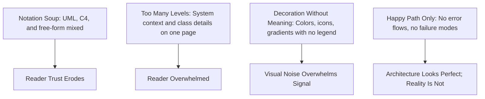

# Diagramming for Architects

> **Core skill:** The architect selects and applies diagram types — C4, UML, and structured informal notation — with discipline, choosing the right abstraction level for each audience and maintaining consistency across the architecture description.

## Why This Matters

A diagram is worth a thousand words only if the words it replaces are the right ones. A diagram at the wrong abstraction level, mixing notations, or decorated with meaningless visual elements wastes the reader's attention and erodes trust in the architecture. The architect's diagramming skill is not artistic talent — it is the discipline of choosing the right diagram type, at the right level of detail, for the right audience, and applying it consistently.

Diagrams are also the architecture description's public face. Stakeholders who never read an ADR will glance at a diagram. If the diagram is clear, they trust the architecture. If it is notation soup with UML, free-form, and C4 shapes mixed together, they trust nothing — and they are right not to. Diagram discipline is architecture credibility.

## The C4 Model (Recommended Stack)

The C4 model by Simon Brown provides four hierarchical levels of abstraction, each for a specific audience:

| Level | Name | Shows | Audience | Typical Notation |
|-------|------|-------|----------|-----------------|
| **1** | System Context | The system and its external actors (users, external systems) | All stakeholders; leadership | Simple boxes, labeled relationships |
| **2** | Container | Deployable units: web apps, databases, file systems, microservices | Developers, ops, architects | Boxes showing technology choices |
| **3** | Component | Logical components within a container and their interactions | Developers, architects | Detailed boxes with interface names |
| **4** | Code | Classes, interfaces (typically generated from code) | Developers | UML class diagrams or IDE-generated |

### C4 Selection Guide

| Question | Appropriate C4 Level |
|----------|----------------------|
| "What does this system do and who uses it?" | Level 1: System Context |
| "What are the deployable pieces and how do they connect?" | Level 2: Container |
| "How is this container structured internally?" | Level 3: Component |
| "How is this component implemented in code?" | Level 4: Code |

## UML for Architecture

UML remains useful for specific architecture concerns where precision is required:

| Diagram Type | Architecture Use | When to Use |
|-------------|-----------------|-------------|
| **Package diagram** | Module decomposition and dependencies | Static structure; development view |
| **Component diagram** | Runtime components, interfaces, ports | C&C view at high detail |
| **Deployment diagram** | Nodes, artifacts, communication paths | Allocation/deployment view |
| **Sequence diagram** | Interaction flows for critical scenarios | Functional view; evaluation walkthroughs |
| **Class diagram** | Domain model; key abstractions | Data model view; design review |

## Structured Informal Notation (Boxes-and-Lines with Discipline)

Not every diagram needs a formal notation system. Free-form boxes-and-lines work when the audience is small, the concept is simple, or the diagram is temporary. But "informal" does not mean "sloppy."

| Discipline Rule | Why |
|-----------------|-----|
| Box shape means something | Rectangles for components, cylinders for data stores, stick figures for users — and be consistent |
| Every line is labeled | An unlabeled line between two boxes says nothing useful |
| Direction indicates flow | Arrow direction means data flow, control flow, or dependency — state which |
| One diagram, one purpose | Don't mix deployment, runtime, and static structure in one diagram |
| Legend is present | Every symbol and line style is explained in a legend on the diagram |

## Diagram Anti-Patterns



### Anti-Pattern Remedies

| Anti-Pattern | Detection Signal | Remedy |
|-------------|-----------------|--------|
| **Notation soup** | Can't tell what notation the diagram uses | Pick one notation system; redraw consistently |
| **Too many abstraction levels** | Diagram needs a zoom to read any part | Split into two diagrams at different C4 levels |
| **Decoration without meaning** | Remove all color — diagram still says the same thing | Every visual property must encode information; add a legend |
| **Happy-path only** | No error flows, timeouts, or fallbacks | Add red dashed lines for failure paths |
| **Orphan diagram** | Diagram not referenced by any architecture document | Every diagram belongs to a view in the architecture description |
| **Copy-paste drift** | Two diagrams show the same system differently | Single source of truth per view; update, don't duplicate |

## Diagram Consistency Across the Architecture Description

| Consistency Element | How to Maintain |
|--------------------|-----------------|
| **Naming** | Same component name in every view that includes it |
| **Notation** | One notation family per architecture description |
| **Abstraction levels** | C4 levels are consistent: a Container in one diagram is not a Component in another |
| **Colour coding** | Same colour for same component type across all diagrams |
| **Interfaces** | Same interface name in C&C view, sequence diagram, and ADR |

## Practical Applications

### Diagram Quality Checklist

- [ ] Diagram has a title stating what view it represents and its audience
- [ ] Every box and line is labeled with a meaningful name
- [ ] Notation is consistent with the rest of the architecture description
- [ ] Abstraction level is appropriate for the audience (C4 Level 1–4 or equivalent)
- [ ] Legend explains all symbols, line styles, and colours used
- [ ] Date and author are present for version tracking

### Diagram Review Template

```markdown
## Diagram Review: [Title]

| Criterion | Pass/Fail | Notes |
|-----------|-----------|-------|
| Audience identified | | |
| Single abstraction level | | |
| Consistent notation | | |
| All elements labeled | | |
| Legend present | | |
| No decoration without meaning | | |
| Error/failure paths shown (if C&C) | | |
```

## Common Pitfalls

| Pitfall | Why It Is a Problem | Better Approach |
|---------|---------------------|-----------------|
| **Notation soup** | UML, C4, and free-form shapes mixed in one diagram — nobody trusts the representation | Choose one notation system; apply it consistently across the entire architecture description |
| **Everything on one diagram** | System context, containers, components, and deployment all on one page — unreadable | Use C4's four levels; produce separate diagrams at each level |
| **Decoration without meaning** | Colours, icons, and gradients that encode nothing — visual noise | Every visual property must encode information; explain in a legend or remove |
| **Unlabeled connectors** | Lines between boxes with no protocol, direction, or semantics | Label every connector: "REST (sync)", "Kafka (async)", "JDBC (sync)" |
| **Orphan diagrams** | Diagrams created for a meeting, then never integrated into the architecture description | Every diagram belongs to a view; every view is in the architecture description |
| **Diagram drift** | Two diagrams show the same component at different levels of detail with different names | Single source of truth per view; cross-check during updates |

## Success Indicators

- Team members can draw a new diagram in the house style without being told the rules
- Diagrams at different C4 levels are consistent — same names, same relationships
- Stakeholders at different levels each have a diagram at their abstraction level
- No diagram in the architecture description is orphaned or unreferenced
- Diagram review catches notation soup and level confusion before stakeholder review

## Related Topics

- [[01_Views_and_Viewpoints]]
- [[02_Module_and_Code_Views]]
- [[03_Component_and_Connector_Views]]
- [[07_Communicating_Architecture]]
- [[career-path/02_Senior_Software_Engineer/06_Communication_and_Influence/01_Technical_Writing|Technical Writing (Senior)]]

## Summary

Diagramming is the architect's visual language — and like any language, it requires grammar and discipline. The C4 model provides four ascending levels of abstraction for different audiences; UML adds precision where needed; structured informal notation works when applied with rules. The anti-patterns are notation soup, mixed abstraction levels, meaningless decoration, and happy-path-only diagrams. The architect's standard is consistency: one notation family, one naming scheme, one source of truth per view — because a diagram that lies about the system is worse than no diagram at all.