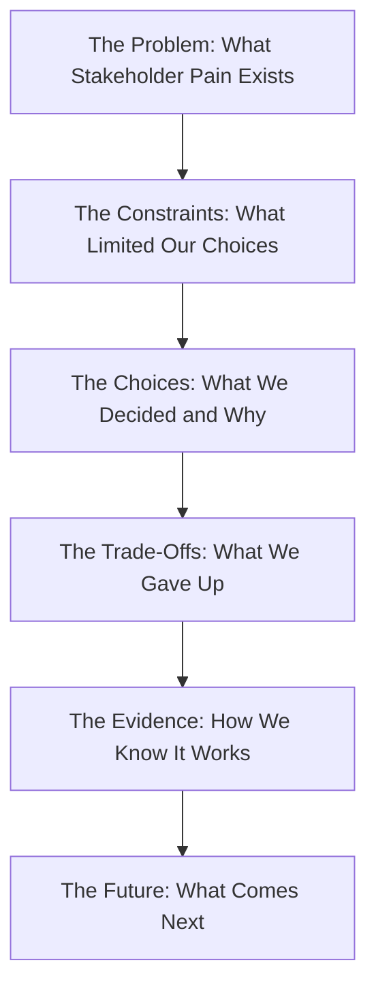

# Communicating Architecture

> **Core skill:** The architect presents architecture as a story — adapting depth, emphasis, and language to each stakeholder audience so that engineers, leadership, and external reviewers each leave with the understanding they need to act.

## Why This Matters

The best architecture description in the world is worthless if nobody reads it — or if they read it and draw the wrong conclusions. Architecture communication is a performance skill as much as a writing skill: the architect must size up an audience in real time, select the right views from the larger description, and present them in a narrative that connects structural choices to audience concerns.

Different audiences need different stories from the same architecture. An engineering team needs detail: interfaces, dependencies, failure modes. A leadership audience needs trade-offs: cost, risk, timeline impact. An external reviewer needs evidence: scenarios evaluated, risks identified, decisions justified. The architect who presents the same deck to every audience is communicating with nobody.

## Audience-Specific Communication

### Engineering Teams

| Focus | What to Show | What to Omit |
|-------|-------------|-------------|
| Module boundaries and interfaces | C4 Component diagrams, sequence diagrams for critical flows | Budget tables, org charts |
| Dependency rules | Uses view with dependency direction arrows | High-level context (unless new to the system) |
| Quality attribute mechanisms | How the architecture achieves performance, reliability, security | The evaluation method that validated it |
| ADRs for recent decisions | The specific ADRs that affect their work | The full ADR history |

### Leadership

| Focus | What to Show | What to Omit |
|-------|-------------|-------------|
| Trade-offs and their costs | Decision matrix: what we chose, what we gave up, what it costs | Interface signatures, protocol details |
| Risk summary | Top 3 risks with mitigation and timeline | Complete risk register with all sensitivity points |
| Timeline and staffing impact | What the architecture means for delivery dates and team needs | Module decomposition detail |
| Architecture rationale | Why this structure — the one-sentence version | The three alternatives we rejected in detail |

### External Reviewers and Governance

| Focus | What to Show | What to Omit |
|-------|-------------|-------------|
| Evaluation evidence | Scenarios used, findings, risk register | Internal team allocation details |
| Compliance mapping | How architecture satisfies each regulatory requirement | Cost discussion (unless relevant) |
| Decision traceability | ADR chain from requirements to structural choices | Implementation-level detail |
| Architecture description completeness | View register showing all views and their status | Draft or incomplete views |

## The Architecture Briefing Format

A structured format for presenting architecture to any audience, adaptable in depth:

```markdown
# Architecture Briefing: [System Name]

## 1. Context (2 minutes)
- What the system does
- Who uses it
- One system context diagram (C4 Level 1)

## 2. Key Views (5–10 minutes)
- 2–4 views selected for this audience
- Each view: what it shows, what it means for them

## 3. Key Decisions (3 minutes)
- Top 3 ADRs most relevant to this audience
- What was decided, why, what trade-offs were accepted

## 4. Risks (3 minutes)
- Top risks with likelihood, impact, and mitigation status
- What help the architect needs from this audience

## 5. Open Items (2 minutes)
- What is not yet decided
- When it will be decided and who decides

## 6. Q&A (remainder)
```

## Architecture as Story

The most effective architecture presentations follow a narrative structure:



Each step answers a question the audience is actually asking — starting with "why should I care?" and ending with "what do I need to do?"

## New-Engineer Orientation from Architecture Docs

The architecture description should enable a new engineer to orient without a one-on-one walkthrough:

| Orientation Step | Architecture Artifact | Time Budget |
|-----------------|----------------------|-------------|
| What does this system do? | System context diagram | 10 minutes |
| What are the deployable pieces? | Container diagram (C4 Level 2) | 20 minutes |
| Where does the code live? | Development view (module structure) | 30 minutes |
| Why was it built this way? | Top 10 ADRs (by consequence) | 1 hour |
| How do I make a change? | C&C view for the relevant flow + ADR for design rules | As needed |

## Practical Applications

### Communication Planning Checklist

- [ ] Audience list identifies every stakeholder group for the current briefing
- [ ] 2–4 views are selected specifically for this audience from the full view register
- [ ] Trade-offs are stated explicitly: what was gained, what was given up
- [ ] Risks are presented with owners and timelines, not as an undifferentiated list
- [ ] Architecture description is available for audience members to read after the session
- [ ] Questions and action items from the session are captured and tracked

### Presentation Architecture Audit

```markdown
## Architecture Communication Audit

| Stakeholder Group | Last Briefing | Views Shown | Open Items | Satisfaction (1–5) |
|-------------------|---------------|-------------|------------|---------------------|
| Engineering team | 2026-08-15 | Component, C&C | 3 | 4 |
| VP Engineering | 2026-07-01 | Context, Decision Matrix | 1 | 4 |
| Security review | 2026-08-20 | C&C, Deployment | 2 | 5 |
| New hires | 2026-08-01 | Context, Development | 0 | 4 |
```

## Common Pitfalls

| Pitfall | Why It Is a Problem | Better Approach |
|---------|---------------------|-----------------|
| **Same deck, every audience** | Engineers get bored by context; leadership drowns in detail — nobody is served | Prepare audience-specific views and emphasis; same architecture, different story |
| **Architecture as blueprint, not story** | List of components and connectors with no narrative — audience cannot follow | Structure as problem-to-solution narrative; every diagram answers a question |
| **Risks without owners** | List of risks presented with no accountability — audience leaves worried but unempowered | Every risk presented has an owner, a mitigation, and a review date |
| **Trade-offs hidden** | Architect presents only the chosen path — audience suspects alternatives were not considered | Explicitly state what was given up and why; it builds credibility |
| **No architecture description to hand** | Briefing relies on slides; audience cannot revisit or reference the material later | Briefing references a maintained architecture description that audience can access |
| **New-hire reliance on architect walkthrough** | Every new engineer needs personal orientation — architect becomes bottleneck | Architecture description must support self-service orientation within a day |

## Success Indicators

- Stakeholders from different groups each report understanding the architecture relevant to their concerns
- Leadership can restate the top trade-offs and risks after a single briefing
- New engineers self-orient from the architecture description within one day
- Briefings produce tracked action items, not just shared understanding
- The architecture description is referenced during briefings — not slides that diverge from it

## Related Topics

- [[01_Views_and_Viewpoints]]
- [[05_Architecture_Decision_Records]]
- [[06_Diagramming_for_Architects]]
- [[career-path/02_Senior_Software_Engineer/06_Communication_and_Influence/01_Technical_Writing|Technical Writing (Senior)]]
- [[career-path/03_Staff_Engineer/04_Influence_and_Alignment/01_Writing_Proposals_That_Get_Adopted|Writing Proposals That Get Adopted (Staff)]]

## Summary

Communicating architecture is a performance skill: selecting the right views, structuring them as a narrative, and adapting depth, emphasis, and language to each audience. The architecture briefing format — context, views, decisions, risks, open items — provides a repeatable structure. The goal is not to present everything known about the architecture but to give each audience exactly what they need to act — and to leave behind a maintained description they can return to when the meeting ends.