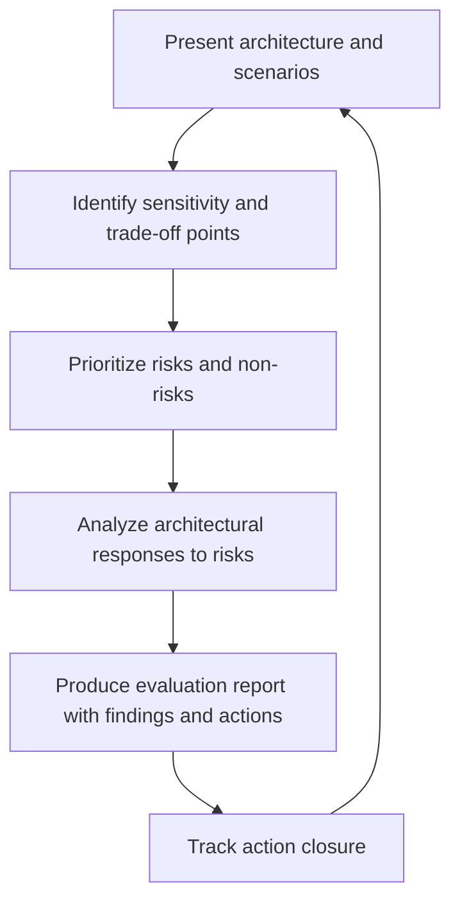

# Architecture Evaluation and Trade Offs

> **Core capability:** The architect evaluates structural choices against quality attributes using methods that produce evidence, not opinions — revealing risks early, making trade-off decisions explicit, and providing a defensible rationale for what was chosen.

## Why This Matters

Most architecture decisions are evaluated by who argues longest. The architect's discipline is replacing argument with method: structured walkthroughs that expose risks before they become incidents, utility trees that make preference explicit, and evaluation reports that document what was found, changed, or accepted.

Evaluation is also the architecture's immune system — catching structural drift before it becomes structural debt. Teams that evaluate architecture regularly find problems when they are still cheap; teams that don't find them in production.

## Topics in This Capability Area

| Topic | Core Skill | When It Matters |
|-------|------------|-----------------|
| [[01_Architecture_Evaluation_Methods]] | Choosing and running ATAM, SAAM, or light-weight evaluations | Major design milestones; new systems; risk reviews |
| [[02_Stakeholder_Centered_Evaluation]] | Anchoring evaluation in stakeholder concerns and scenarios | Every evaluation; the moment a stakeholder is surprised |
| [[03_Trade_Off_Analysis_Structured]] | Making preference explicit with utility trees and decision matrices | When quality attributes conflict (they always do) |
| [[04_Risk_Identification_in_Architecture]] | Detecting sensitivity points, trade-off points, and risk themes | Evaluation sessions; architecture review boards |
| [[05_Architecture_Anti_Patterns]] | Recognizing structural failure modes and intervening early | Quality degradation signals; repeated integration pain |
| [[06_Continuous_Architecture_Evaluation]] | Embedding light-touch evaluation in iterative delivery | Agile teams; CI/CD contexts |
| [[07_Evaluation_Reports]] | Writing findings, risks, non-risks, and action plans | After every evaluation; for governance records |

## The Evaluation Flow

Evaluation is not an event — it is a feedback loop embedded in the architecture lifecycle.

## Senior vs Architect

| Activity | Senior engineer | Software Architect |
|----------|-----------------|-------------------|
| Evaluation | Reviews local design decisions | Runs structured architecture evaluations |
| Risk | Flags risk in their components | Identifies architecture-level risk themes and responses |
| Trade-offs | Balances within a component | Makes cross-quality-attribute trade-offs with recorded rationale |
| Anti-patterns | Recognizes code smells | Detects structural anti-patterns across the system |

## Practical Applications

### Evaluation Checklist

- [ ] Every major architectural decision has been evaluated against at least two quality attribute scenarios
- [ ] Sensitivity points (where small changes create large effects) are identified
- [ ] Trade-off points (where improving one attribute degrades another) are known
- [ ] Evaluation findings produce risk/actions with owners and dates
- [ ] Evaluation reports are accessible to stakeholders who were not in the room

## Common Pitfalls

| Pitfall | Why It Is a Problem | Better Approach |
|---------|---------------------|-----------------|
| **Evaluation-by-argument** | Loudest voice wins; evidence is optional | Structured method with scenarios as criteria |
| **Over-evaluation** | Analysis paralysis; every decision gets the ATAM treatment | Match evaluation depth to decision consequence |
| **Risk-inventory-only** | List of risks with no ownership or tracking | Every risk gets an owner, a response, and a review date |
| **Ignoring non-risks** | Documenting only problems erodes trust in the process | Record what works; the architecture is doing something right |

## Success Indicators

- Architecture decisions survive stakeholder challenge on evidence, not seniority
- Sensitivity and trade-off points are documented before they become production incidents
- Evaluation actions close within an agreed cycle
- Anti-patterns are caught in review, not in postmortems

## Related Capabilities

- [[02_Quality_Attribute_Analysis/00_overview|Quality Attribute Analysis]]: scenarios are the primary evaluation criteria
- [[03_Architecture_Description_and_Views/00_overview|Architecture Description and Views]]: the architecture presented for evaluation
- [[career-path/02_Senior_Software_Engineer/03_Architecture_and_Design_Judgment/03_Architecture_Evaluation|Architecture Evaluation (Senior)]]: the evaluation foundations at senior level

## Summary

Architecture evaluation is structured scrutiny: methods that produce evidence, trade-off analysis that makes preference explicit, risk themes identified and owned, and anti-patterns caught before they calcify. The architect's credibility rests on evaluations that anyone can audit — because the criteria and evidence are in the report, not in the personality.