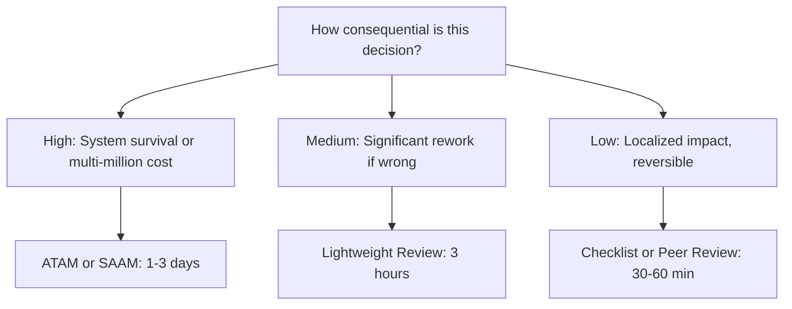

# Architecture Evaluation Methods

> **Core skill:** The architect selects and runs architecture evaluation methods — ATAM, SAAM, ARID, and lightweight reviews — matching evaluation depth to decision consequence and treating evaluation as learning, not gatekeeping.

## Why This Matters

Most architecture flaws are cheap to fix during design and expensive to fix in production. The ratio is not 2:1 or even 10:1 — it is routinely 50:1 or more, because a production architecture flaw means data migration, backwards compatibility, coordinated deployment, and sometimes customer-visible downtime. Evaluation methods exist to find these flaws when they are still ideas on a whiteboard.

But evaluation is not free. A full ATAM consumes two to three days of senior staff time. Running one for every design decision is analysis paralysis. The architect's skill is matching method to consequence: light-weight reviews for tactical decisions, structured methods for strategic ones, and the judgment to know which is which.

## Evaluation Method Catalog

### ATAM — Architecture Trade-Off Analysis Method

The most comprehensive method, developed by the SEI at Carnegie Mellon. Structured into four phases over 2–3 days.

| Phase | Activities | Duration | Participants |
|-------|-----------|----------|-------------|
| **Presentation** | Present ATAM method, business drivers, and the architecture | Half day | Evaluation team, project decision-makers |
| **Investigation** | Identify architectural approaches; generate quality attribute tree; analyze against scenarios | 1 day | Evaluation team, architects, stakeholders |
| **Brainstorming** | Stakeholders brainstorm and prioritize scenarios; analyze against new scenarios | Half day | All stakeholders |
| **Reporting** | Present risks, non-risks, sensitivity points, trade-off points | Half day | All participants |

### SAAM — Scenario-Based Architecture Analysis Method

Predecessor to ATAM; simpler and scenario-focused. Best for comparing candidate architectures against the same set of scenarios.

| Step | Activity |
|------|----------|
| 1 | Describe candidate architectures |
| 2 | Develop scenarios for each quality attribute of concern |
| 3 | Perform scenario evaluations on each candidate |
| 4 | Reveal scenario interactions — where one scenario's solution conflicts with another's |
| 5 | Produce overall evaluation comparing candidates |

### ARID — Active Reviews for Intermediate Designs

Designed for incomplete architectures — when the full system is not yet designed but a subset needs evaluation. Combines review with active stakeholder participation. Best for evaluating partial designs in iterative development.

### Lightweight Evaluation — 3-Hour Focused Review

For decisions where ATAM is overkill but a checklist is insufficient:

| Time | Activity |
|------|----------|
| 0:00–0:15 | Architect presents the system context and the decision under evaluation |
| 0:15–0:45 | Walk through 3–5 priority quality attribute scenarios |
| 0:45–1:15 | Identify risks, non-risks, sensitivity points, and trade-off points |
| 1:15–1:45 | Prioritize risks; assign owners and mitigation actions |
| 1:45–2:15 | Document findings in evaluation report template |
| 2:15–2:45 | Review findings with stakeholders not in the room |
| 2:45–3:00 | Agree on next evaluation checkpoint |

## Method Selection Guide



### Selection Criteria

| Criterion | ATAM | SAAM | ARID | Lightweight |
|-----------|------|------|------|-------------|
| Architecture maturity | Complete | Complete | Partial | Any |
| Decision consequence | Very high | High | Medium | Low-medium |
| Stakeholder breadth | All | Quality-focused | Subset | Relevant |
| Time investment | 2–3 days | 1–2 days | Half day | 3 hours |
| Comparing alternatives | Possible | Strong | No | Yes (limited) |
| Evaluation team needed | External + internal | Internal or external | Internal | Internal |

## Evaluation as Learning, Not Gatekeeping

The most common failure mode of architecture evaluation is positioning it as a pass/fail gate. When stakeholders perceive evaluation as a threat — "if my architecture fails review, I look bad" — they withhold information, minimize risks, and contest findings. Evaluation becomes adversarial instead of investigative.

| Gatekeeping Stance | Learning Stance |
|--------------------|-----------------|
| "Does the architecture pass?" | "What risks does the architecture carry?" |
| Evaluator judges the architect | Evaluator collaborates with the architect |
| Findings are verdicts | Findings are discoveries |
| Failure means rework and embarrassment | Finding a risk now is a win — it avoids production pain |
| Architect defends the design | Architect invites scrutiny |

## Practical Applications

### Evaluation Method Selection Checklist

- [ ] Decision consequence has been assessed: high, medium, or low
- [ ] Method selected matches consequence and available stakeholder time
- [ ] Evaluation scope is explicit: what is being evaluated and what is out of scope
- [ ] Evaluation team includes at least one person not on the architecture team
- [ ] Evaluation date is scheduled before the decision becomes irreversible

### Pre-Evaluation Preparation Template

```markdown
## Evaluation Preparation: [Decision Name]

| Item | Detail |
|------|--------|
| Decision to evaluate | |
| Consequence level | High / Medium / Low |
| Selected method | ATAM / SAAM / ARID / Lightweight |
| Date and duration | |
| Evaluation team | |
| Stakeholders invited | |
| Quality attribute scenarios prepared | |
| Architecture views prepared | |
| Evaluation report template ready | |
```

## Common Pitfalls

| Pitfall | Why It Is a Problem | Better Approach |
|---------|---------------------|-----------------|
| **Evaluation to confirm, not to discover** | Architect runs evaluation hoping it says "everything is fine" — misses real risks | Enter evaluation expecting to find issues; unidentified risks are the real failure |
| **Method mismatch** | Full ATAM for a reversible technology choice — wastes senior staff time on low-consequence decisions | Match method to consequence; save heavy methods for strategic decisions |
| **No external perspective** | Evaluation team consists entirely of the architecture team — blind spots survive | Include at least one person from outside the team who is free to ask naïve questions |
| **Scenario poverty** | Only 2–3 scenarios evaluated — most quality attributes never tested | Prepare 8–12 scenarios covering all quality attributes in scope |
| **Findings with no owners** | Risks identified, written down, and forgotten — no accountability | Every risk finding gets an owner, a mitigation, and a review date |
| **Evaluation report shelved** | Report written, filed, never read again — evaluation had no impact | Evaluation findings feed into the backlog; track closure like any other task |

## Success Indicators

- Evaluations discover at least one non-obvious risk that the architecture team had not identified
- Method selection is proportionate: heavyweight for strategic, lightweight for tactical
- Evaluation findings have owners and closure dates — tracked to completion
- Stakeholders volunteer for evaluations because they see value, not because they are required
- No architecture decision above "medium" consequence goes un-evaluated

## Related Topics

- [[02_Stakeholder_Centered_Evaluation]]
- [[03_Trade_Off_Analysis_Structured]]
- [[07_Evaluation_Reports]]
- [[02_Quality_Attribute_Analysis/00_overview|Quality Attribute Analysis]]
- [[career-path/02_Senior_Software_Engineer/03_Architecture_and_Design_Judgment/03_Architecture_Evaluation|Architecture Evaluation (Senior)]]

## Summary

Architecture evaluation methods range from the comprehensive ATAM (2–3 days, all stakeholders, full quality attribute tree) to a 30-minute peer review. The architect's skill is matching method to decision consequence: heavyweight for strategic, irrevocable decisions; lightweight for tactical, reversible ones. And the stance matters as much as the method — evaluation that positions itself as learning discovers more risks than evaluation that positions itself as gatekeeping, because stakeholders who trust the process share more.