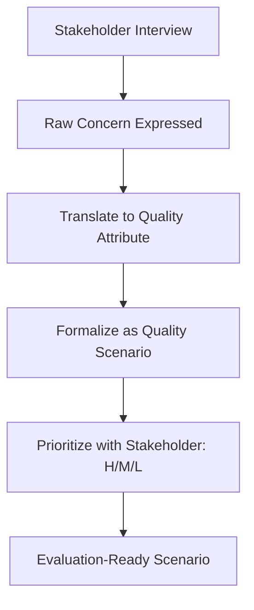

# Stakeholder-Centered Evaluation

> **Core skill:** The architect anchors evaluation in stakeholder concerns — identifying every affected class, mapping their worries to quality scenarios, and ensuring the evaluation process itself captures what stakeholders actually care about, not what the architect assumes they care about.

## Why This Matters

An architecture evaluation built entirely by architects evaluates the architecture the architects want to build — not necessarily the architecture the stakeholders need. Developers worry about maintainability, operations worries about deployability, security worries about attack surface, and product management worries about time-to-market. If the evaluation scenarios come only from the architecture team, the evaluation answers questions nobody else is asking.

The architect's role is to surface stakeholder concerns that stakeholders themselves may not know how to articulate. A product manager may not say "I am worried about modifiability in the payment flow," but they will say "every time we add a payment method, it takes two sprints." Translating that frustration into an evaluation scenario is the architect's skill — and the resulting evaluation is the stakeholder reality check.

## Stakeholder Identification

### Stakeholder Classes Beyond Developers

| Stakeholder Class | Typical Concerns | How to Elicit |
|-------------------|-----------------|---------------|
| **End users** | Responsiveness, reliability, data safety | User research, support tickets, UX team |
| **Product management** | Time-to-market, feature velocity, cost | Roadmap review, feature cycle-time data |
| **Operations / SRE** | Deployability, observability, disaster recovery | Incident postmortems, runbooks, on-call interviews |
| **Security** | Attack surface, data protection, compliance | Threat models, compliance requirements, pen-test findings |
| **Data / analytics** | Data freshness, query performance, schema stability | Data pipeline SLA review, analyst interviews |
| **Program management** | Staffing, skills availability, schedule risk | Team allocation data, hiring pipeline review |
| **External partners** | API stability, integration effort, documentation | Partner integration feedback, API change history |
| **Legal / compliance** | Regulatory obligations, audit trail, data residency | Regulatory requirement documents, audit findings |

### The Stakeholder Concern Elicitation Interview

| Question | What It Reveals |
|----------|----------------|
| "What keeps you up at night about this system?" | Top-of-mind risks — often the right evaluation starting point |
| "What would make you lose confidence in this architecture?" | Implicit quality thresholds; the real acceptance criteria |
| "What change did we make last quarter that was harder than expected?" | Modifiability hotspots; where the architecture resists change |
| "If the system were down for an hour, what would the impact be?" | Availability criticality; disaster recovery priorities |
| "What do you wish the architecture team understood better about your world?" | Blind spots in the current architecture view set |

## Mapping Stakeholder Concerns to Quality Scenarios



### Concern-to-Scenario Translation

| Raw Stakeholder Statement | Quality Attribute | Formal Scenario |
|--------------------------|-------------------|-----------------|
| "Every time we add a payment method, it takes two sprints" | Modifiability | Add a new payment provider and integrate with checkout in less than 5 developer-days |
| "I get paged at 3 AM when the database spikes" | Availability / Performance | Database failover completes within 30 seconds with zero data loss under peak load |
| "Regulatory wants an audit trail for every data access" | Security / Auditability | Every data access is logged with actor, timestamp, and record ID; retrievable within 1 hour |
| "Our partner's API changes break our integration quarterly" | Interoperability / Evolvability | Partner API version change requires less than 2 days of integration work |

## The Evaluation Team Composition

| Role | Responsibility | Why Needed |
|------|----------------|------------|
| **Evaluation leader** | Facilitates the process; keeps time; ensures method discipline | Prevents evaluation from becoming unstructured argument |
| **Architecture presenter** | Presents the architecture being evaluated | The architect whose work is under review |
| **Scribe** | Captures findings, risks, non-risks, actions in real time | Findings lost to memory are findings lost entirely |
| **Stakeholder representatives** | At least one from each stakeholder class in scope | Evaluation without stakeholders is architecture review, not evaluation |
| **External reviewer** | At least one architect from outside the project | Fresh perspective; permission to ask naïve questions |

## Stakeholder-Centered Review Format

1. **Stakeholder introduction** (5 min per class): Each stakeholder class states what they care about. This primes the room — if the scenarios that follow do not address these concerns, the evaluation has failed.

2. **Scenario walkthrough** (remainder): Architecture is exercised against scenarios derived from those concerns. Stakeholders ask "what happens when..." and the architect traces through the architecture.

3. **Concern coverage check** (15 min): After the walkthrough, return to the original concern list. Were any concerns not addressed by a scenario? If so, walk through them now.

## Practical Applications

### Stakeholder Mapping Checklist

- [ ] All stakeholder classes are identified (use the Rozanski & Woods stakeholder catalog as a checklist)
- [ ] At least one representative from each class has been interviewed
- [ ] Each stakeholder class has at least 2 quality scenarios derived from their concerns
- [ ] Scenarios have been prioritized with stakeholders themselves (not assumed by the architect)
- [ ] Evaluation team includes at least one external reviewer and one scribe
- [ ] Concern coverage is checked after scenario walkthrough — no orphan concerns

### Stakeholder Concern Register Template

```markdown
## Stakeholder Concern Register

| Stakeholder Class | Representative | Top Concern | Quality Attribute | Scenario Draft | Priority |
|-------------------|---------------|-------------|-------------------|----------------|----------|
| Operations | Jane (SRE lead) | DB failover time | Availability | Failover < 30s, zero data loss | High |
| Product | Mark (PM) | Payment method velocity | Modifiability | New payment method < 5 dev-days | High |
| Security | Ahmed (SecEng) | Audit trail completeness | Auditability | All access logged, retrievable in 1h | Medium |
| Partners | External API team | API stability | Evolvability | Version change < 2 days integration | Medium |
```

## Common Pitfalls

| Pitfall | Why It Is a Problem | Better Approach |
|---------|---------------------|-----------------|
| **Developer-only evaluation** | Only developers in the room — scenarios miss operations, security, and business concerns | Invite at least one rep from each stakeholder class |
| **Architect-assumed priorities** | Architect ranks scenarios by importance without asking stakeholders — evaluation solves the wrong problems | Stakeholders prioritize their own scenarios; architect facilitates, does not dictate |
| **Stakeholder fatigue** | Every evaluation invites all stakeholders, every time — they stop attending | Invite only stakeholders whose concerns are in scope for this evaluation |
| **Concern lost in translation** | Architect translates stakeholder concern into a scenario that misses the original point | Show the formal scenario back to the stakeholder; confirm it captures their concern |
| **No return channel** | Evaluation findings are never shared back with stakeholders — they don't know if their concerns were addressed | Send evaluation report to all participants; schedule a follow-up on action closure |

## Success Indicators

- Every stakeholder class in scope has at least one representative in the evaluation
- Stakeholders confirm that scenarios capture their actual concerns — not architect assumptions
- Post-evaluation, stakeholders report feeling heard and informed
- Stakeholder concern register is maintained and reviewed before each evaluation
- Evaluation reports include a section mapping stakeholder concerns to findings

## Related Topics

- [[01_Architecture_Evaluation_Methods]]
- [[03_Trade_Off_Analysis_Structured]]
- [[04_Risk_Identification_in_Architecture]]
- [[02_Quality_Attribute_Analysis/00_overview|Quality Attribute Analysis]]
- [[career-path/02_Senior_Software_Engineer/03_Architecture_and_Design_Judgment/03_Architecture_Evaluation|Architecture Evaluation (Senior)]]

## Summary

Stakeholder-centered evaluation anchors the architecture review in what stakeholders actually care about — not what the architect assumes they care about. It requires identifying all stakeholder classes, eliciting their concerns through structured interviews, translating those concerns into formal quality scenarios with stakeholder confirmation, and composing the evaluation team to include stakeholder representatives. The output is an evaluation that answers the questions people are asking, not the questions the architect hopes they will ask.