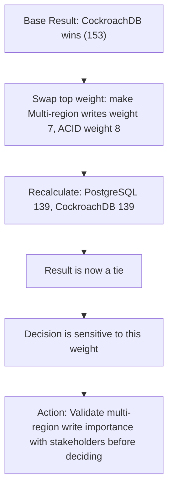

# Trade-Off Analysis Structured

> **Core skill:** The architect makes trade-off reasoning explicit and auditable — using utility trees to prioritize quality attribute scenarios, decision matrices to weigh options against criteria, and sensitivity analysis to test whether conclusions hold when assumptions change.

## Why This Matters

Every architecture decision is a trade-off. Choosing microservices over a monolith trades deployment independence for operational complexity. Choosing synchronous over asynchronous communication trades simplicity for resilience. The problem is not that trade-offs exist — it is that they are usually made implicitly, defended by assertion, and accepted by default. "We chose X because it seemed right" is not analysis; it is preference dressed as judgment.

Structured trade-off analysis makes the architect's reasoning inspectable. A reviewer can see the criteria, the weights, the scores, and the sensitivity — and can challenge any of them. This does not make the decision "correct" in some objective sense; no weighting scheme is free of judgment. But it makes the judgment visible and contestable, which is the foundation of architecture credibility.

## Utility Trees

A utility tree organizes quality attribute scenarios into a hierarchy, with each scenario rated on importance to the business and difficulty to achieve:

### Structure

```
Quality Attributes
├── Performance
│   ├── (H,H) Search results return in < 200ms under 1,000 concurrent users
│   ├── (M,L) API p95 latency stays under 50ms during peak hours
│   └── (L,M) Batch report generation completes in under 60 seconds
├── Availability
│   ├── (H,H) Database failover completes within 30 seconds, zero data loss
│   └── (M,M) Scheduled maintenance causes zero downtime
├── Security
│   ├── (H,M) Unauthorized data access is detected and blocked within 1 second
│   └── (M,H) All PII data is encrypted at rest with key rotation every 90 days
└── Modifiability
    ├── (H,L) New payment method can be added in < 5 developer-days
    └── (M,M) UI framework can be replaced without changing backend APIs
```

### Priority Grid

| | Low Difficulty | Medium Difficulty | High Difficulty |
|---|---|---|---|
| **High Importance** | Do first; low hanging fruit | Core focus of architecture effort | **Highest risk — demands most evaluation attention** |
| **Medium Importance** | Do if time allows | Worth effort but not blocking | Revisit requirements; is it really medium importance? |
| **Low Importance** | Do only if trivial | Skip unless regulatory | Skip; not worth architecture attention |

The (High, High) quadrant — high importance, high difficulty — is where the architecture either succeeds or fails. These scenarios should consume the majority of evaluation time.

## Decision Matrices

When comparing architectural options against weighted criteria, a decision matrix makes the comparison explicit:

### Weighted Decision Matrix Example

| Criterion | Weight | PostgreSQL | MySQL | CockroachDB |
|-----------|--------|------------|-------|-------------|
| ACID transactions | 10 | 5 (50) | 5 (50) | 5 (50) |
| Multi-region writes | 8 | 1 (8) | 1 (8) | 5 (40) |
| Team expertise | 7 | 5 (35) | 3 (21) | 2 (14) |
| Operational simplicity | 6 | 4 (24) | 4 (24) | 2 (12) |
| Horizontal write scaling | 5 | 2 (10) | 2 (10) | 5 (25) |
| JSON support | 4 | 5 (20) | 3 (12) | 3 (12) |
| **Weighted Total** | | **147** | **125** | **153** |

### Sensitivity Analysis

Weights are always subjective. The architect must test whether the conclusion holds when weights change:



| Sensitivity Test | What It Reveals |
|-----------------|-----------------|
| **Weight swap** | Swap the top two criteria weights — does the winner change? If yes, validate those weights carefully |
| **Score challenge** | Lower the winner's score on its strongest criterion by 1 point — does the winner change? If yes, validate that score |
| **Criteria removal** | Remove any single criterion — does the winner change? If yes, the decision is sensitive to that criterion |
| **Threshold test** | What would it take for the second-place option to win? If the gap is small, any reasonable disagreement flips the decision |

## When Utility Trees Over-Complicate

Structured methods have a cost. For decisions where the trade-off is clear, the stakeholders few, or the consequence low, a utility tree or matrix adds ceremony without insight.

| Decision Type | Use Structured Method? |
|---------------|----------------------|
| High-consequence, multiple stakeholders disagree | Yes: utility tree + decision matrix + sensitivity |
| High-consequence, stakeholders agree | Decision matrix without sensitivity may suffice |
| Medium-consequence, clear winner | Weighted pros/cons list (informal matrix) |
| Low-consequence | State the trade-off in an ADR; skip formal analysis |

## Practical Applications

### Utility Tree Template

```markdown
## Utility Tree: [System Name]

| ID | Quality Attribute | Scenario | Importance | Difficulty | Risk |
|----|-------------------|----------|------------|------------|------|
| P1 | Performance | Search results < 200ms under 1,000 concurrent users | High | High | HIGH |
| A1 | Availability | Failover < 30s, zero data loss | High | High | HIGH |
| S1 | Security | Detect unauthorized access < 1s | High | Medium | Medium |
| M1 | Modifiability | New payment method < 5 dev-days | High | Low | Low |
```

### Decision Matrix Checklist

- [ ] Criteria are stated before options are evaluated (prevents tailoring criteria to a preferred option)
- [ ] Weights are assigned and reviewed with stakeholders
- [ ] Scores have a defined scale (1–5 with documented meaning)
- [ ] Sensitivity analysis tests at least weight swaps and score challenges
- [ ] The matrix and its sensitivity results are included in the evaluation report
- [ ] If the winner is weight-sensitive, the deciding weights are validated with stakeholders

## Common Pitfalls

| Pitfall | Why It Is a Problem | Better Approach |
|---------|---------------------|-----------------|
| **Criteria designed to favor a preferred option** | "We need ACID and JSON support" when only PostgreSQL has both — the decision was made before the matrix | Define criteria before evaluating options; have a stakeholder review the criteria list |
| **Weights treated as objective** | Weights are presented as facts — "performance weight = 8" without saying who decided that | State who assigned weights and on what basis; sensitivity-test to see if reasonable weight changes flip the result |
| **Score inflation** | Every option scores 4 or 5 — the matrix says they are all good, which means it says nothing | Define score anchors: 1 = "does not meet", 3 = "meets with effort", 5 = "exceeds"; force distribution |
| **No sensitivity analysis** | Decision is presented as clear-cut when a one-point score change on any criterion would flip it | Always sensitivity-test: swap weights, challenge scores, remove criteria |
| **Analysis as decision** | Utility tree or matrix is treated as the answer — architect stops thinking | Structured analysis informs judgment; it does not replace it |
| **Over-analysis for low-stakes decisions** | 2-hour utility tree session for a reversible technology choice with one obvious winner | Match analysis depth to decision consequence; state in the ADR when lightweight was chosen |

## Success Indicators

- Trade-off rationale in ADRs references structured analysis, not just architect preference
- Sensitivity analysis is performed and documented for high-consequence decisions
- Stakeholders can challenge weights and scores because they are explicit and visible
- Decision matrices are archived alongside ADRs for future review
- Architecture decisions survive stakeholder challenge on evidence, not authority

## Related Topics

- [[01_Architecture_Evaluation_Methods]]
- [[04_Risk_Identification_in_Architecture]]
- [[02_Quality_Attribute_Analysis/00_overview|Quality Attribute Analysis]]
- [[career-path/02_Senior_Software_Engineer/08_Engineering_Economics_and_Trade_Offs/06_Trade_Off_Evaluation|Trade Off Evaluation (Senior)]]
- [[career-path/03_Staff_Engineer/04_Influence_and_Alignment/01_Writing_Proposals_That_Get_Adopted|Writing Proposals That Get Adopted (Staff)]]

## Summary

Structured trade-off analysis makes architectural reasoning inspectable. Utility trees organize quality scenarios by importance and difficulty, identifying the high-priority, high-difficulty quadrant where architecture succeeds or fails. Decision matrices make option comparison explicit with weighted criteria and scored alternatives. Sensitivity analysis tests whether conclusions survive reasonable changes to weights and scores. The architect's discipline is knowing when structured methods add value — and when a clear trade-off stated in an ADR is sufficient.