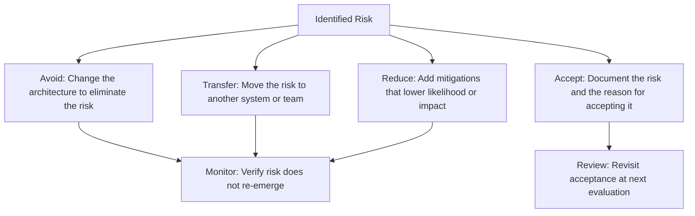

# Risk Identification in Architecture

> **Core skill:** The architect detects structural risk before it becomes structural failure — sensitivity points where small changes cascade, trade-off points where improving one attribute degrades another, and risk themes that span multiple decisions.

## Why This Matters

Architecture risk is not project risk. Project risk concerns budget, schedule, and staffing. Architecture risk concerns structural decisions that, if wrong, force a rewrite — not a schedule slip but a fundamental reorientation of the system. Detecting these risks during design costs hours; detecting them during implementation costs weeks; detecting them in production costs months and sometimes the system itself.

The architect's risk vocabulary is precise: sensitivity points (small changes with large effects), trade-off points (cross-attribute conflicts), and risk themes (patterns across multiple risks). This precision matters because vague risks — "the system might not scale" — are unactionable. Specific risks — "connection pool sizing at the API layer is a sensitivity point; pool exhaustion under 2x expected load causes cascading gateway failures" — are actionable.

## Sensitivity Points

A sensitivity point is an architectural element where a small change in one property produces a large change in overall system behavior.

| Sensitivity Point | Small Change | Large Effect | Quality Attribute |
|-------------------|-------------|--------------|-------------------|
| Database connection pool size | Pool size reduced by 10% | Request queue depth triples under peak load | Performance |
| Encryption key length | Key length doubled from 2048 to 4096 bits | Handshake latency increases 4x | Performance / Security |
| Cache TTL | TTL reduced from 60s to 10s | Database read load increases 6x | Performance / Cost |
| Service instance count | Instances scaled from 3 to 2 | Single-instance failure takes 50% of capacity instead of 33% | Availability |
| Message batch size | Batch size halved | Throughput drops 40%; consumer lag accumulates | Performance |

### Detecting Sensitivity Points

| Technique | How |
|-----------|-----|
| **Stress scenario walkthrough** | "What happens if this parameter is halved? Doubled?" — testing parameter sensitivity |
| **Dependency chain analysis** | Following effects through the architecture; where do they amplify? |
| **Production incident postmortems** | Every incident reveals sensitivity points that were not documented |
| **Load testing at parameter extremes** | Not just expected load but 0.5x and 2x on every tunable parameter |

## Trade-Off Points

A trade-off point is an architectural element where improving one quality attribute necessarily degrades another.

| Trade-Off Point | Improves | Degrades | Why |
|-----------------|----------|----------|-----|
| Synchronous replication | Consistency | Performance | Every write waits for replica acknowledgment |
| Service mesh (sidecar proxy) | Observability, security | Latency, complexity | Extra hop; extra component to manage |
| Encryption at rest | Security | Performance, cost | CPU overhead; key management infrastructure |
| Denormalized data | Read performance | Write complexity, consistency | Every write must update multiple copies |
| Circuit breaker | Resilience | Correctness (under false positives) | Legitimate requests may be rejected |

### Documenting Trade-Off Points

```markdown
## Trade-Off Point: Synchronous Database Replication

| Attribute | Effect |
|-----------|--------|
| **Consistency (improved)** | Zero data loss on primary failure; replicas always current |
| **Write latency (degraded)** | P99 write increases from 15ms to 45ms under normal load |
| **Availability (degraded)** | If all replicas are unreachable, writes fail even if primary is healthy |
| **Mitigation** | Quorum-based replication (2 of 3 replicas) instead of all-replica synchronous |
| **Residual risk** | Window of inconsistency exists if primary and one replica fail simultaneously |
```

## Risk Themes

Risk themes are patterns that span multiple risks — indicating a systemic vulnerability rather than an isolated decision.

| Risk Theme | Signal | Systemic Implication |
|-----------|--------|---------------------|
| **Single point of failure cascading** | Multiple risks trace back to one component or service | That component is under-designed for its actual criticality |
| **Latency accumulation** | Several decisions each add 5–10ms; nobody added them up | System-level latency budget is unmanaged |
| **Operational assumption dependency** | Risks assume manual intervention is fast and correct | Architecture relies on operations maturity that may not exist |
| **Vendor coupling depth** | Risks all trace to a single vendor's product or API | Migration cost is higher than anyone realizes |

## Risk Documentation Format

| Field | Example |
|-------|---------|
| **Risk ID** | R-014 |
| **Title** | Connection pool exhaustion under 2x expected traffic |
| **Category** | Performance / Availability |
| **Sensitivity / Trade-off / Theme** | Sensitivity point |
| **Description** | API gateway connection pool sized for 1.5x peak. At 2x peak, pool exhaustion causes request queuing; queued requests time out; timeouts cascade to upstream callers. |
| **Likelihood** | Medium (peak traffic has grown 30% YoY) |
| **Impact** | High (customer-facing 5xx errors; revenue loss during peaks) |
| **Mitigation** | Resize pool for 3x peak; add circuit breaker at gateway; add autoscaling trigger at 70% pool utilization |
| **Owner** | Infrastructure team — assigned to Jane Chen |
| **Review date** | 2026-11-01 |

## Risk Mitigation Strategies



| Strategy | When to Use | Example |
|----------|-------------|---------|
| **Avoid** | The risk has catastrophic impact and can be designed out | Replace a single-region deployment with multi-region to avoid region-wide outage risk |
| **Transfer** | Another system or team is better positioned to handle the risk | Use a managed database service instead of self-hosted to transfer backup and replication risk |
| **Reduce** | The risk cannot be eliminated but can be contained | Add circuit breakers and retry budgets to reduce cascading failure risk |
| **Accept** | Mitigation cost exceeds the expected cost of the risk materializing | Accept that a non-critical reporting feature may have 1-hour data staleness |

## Practical Applications

### Architecture Risk Register Template

```markdown
## Architecture Risk Register

| ID | Risk | Type | Likelihood | Impact | Risk Score | Mitigation | Owner | Review Date |
|----|------|------|------------|--------|------------|------------|-------|-------------|
| R-001 | Connection pool exhaustion | Sensitivity | Medium | High | 12 | Resize pool; add autoscaling | Jane C. | 2026-11-01 |
| R-002 | Synchronous replication latency | Trade-off | High | Medium | 12 | Quorum replication | Mark T. | 2026-10-15 |
| R-003 | Single-region deployment | Theme | Low | Catastrophic | 10 | Multi-region by Q3 | Ops team | 2026-09-30 |
```

### Pre-Evaluation Risk Audit

- [ ] All known sensitivity points are documented with the parameter that drives them
- [ ] All trade-off points are documented with both the improved and degraded attribute
- [ ] Risks are checked for themes — do multiple risks share a root cause?
- [ ] Every risk has an owner, a mitigation strategy, and a review date
- [ ] The risk register distinguishes architecture risk from project risk

## Common Pitfalls

| Pitfall | Why It Is a Problem | Better Approach |
|---------|---------------------|-----------------|
| **Risks too vague to act on** | "System may not scale" — nobody knows what to do | Specific: "Connection pool at API gateway sized for 1.5x peak; at 2x peak, pool exhaustion" |
| **Sensitivity points undocumented** | Team tunes parameters in production without knowing which ones are dangerous | Document every sensitivity point from evaluation; annotate config files |
| **Trade-off points presented as win-win** | Architect claims decision improves performance AND consistency — hiding the real trade-off | Every trade-off point names what was degraded; if nothing is degraded, it is not a trade-off |
| **Risk themes ignored** | Each risk treated in isolation when three risks share the same root cause | Scan the risk register for themes; address root causes, not symptoms |
| **Risk register as inventory** | Risks listed with no owners, no dates, no follow-up | Every risk has an owner and a review date; track closure |
| **Architecture risk conflated with project risk** | Schedule risk, budget risk, and architecture risk in one undifferentiated list | Separate registers; architecture risk concerns structural decisions, not resource constraints |

## Success Indicators

- Every sensitivity point maps to a specific, tunable parameter with documented effect
- Every trade-off point names both the improved and the degraded quality attribute
- Risk themes are identified and addressed at root-cause level, not symptom level
- Risk register is reviewed at least quarterly; risks close or are reaffirmed
- No production incident reveals a sensitivity point that was not already documented

## Related Topics

- [[01_Architecture_Evaluation_Methods]]
- [[03_Trade_Off_Analysis_Structured]]
- [[05_Architecture_Anti_Patterns]]
- [[02_Quality_Attribute_Analysis/00_overview|Quality Attribute Analysis]]
- [[career-path/02_Senior_Software_Engineer/08_Engineering_Economics_and_Trade_Offs/06_Trade_Off_Evaluation|Trade Off Evaluation (Senior)]]

## Summary

Architecture risk identification moves beyond vague concerns to precise structural vulnerabilities: sensitivity points where small parameter changes produce large effects, trade-off points where improving one attribute degrades another, and risk themes where multiple risks share a root cause. Every risk is documented with likelihood, impact, mitigation strategy, owner, and review date. The architect's standard is that no production incident should reveal a structural risk that was not already in the register — because if it was not documented, it was not evaluated.