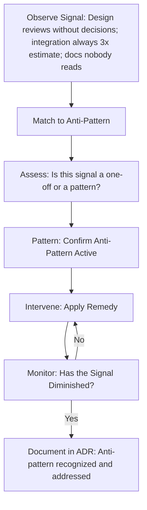

# Architecture Anti-Patterns

> **Core skill:** The architect recognizes structural failure modes — ivory tower, stovepipe, vendor lock-in, and others — by their signals, intervenes before calcification, and treats anti-patterns as learning tools rather than labels for blame.

## Why This Matters

Architecture anti-patterns are not mistakes. They are solutions that were reasonable in their original context but became destructive as the context changed — or solutions that looked reasonable on paper but fail systematically in practice. Understanding them is essential because they recur across organizations, technologies, and decades. The architect who cannot recognize the ivory tower pattern will become the ivory tower architect.

Anti-patterns are also the architecture's early warning system. Before the system fails, it emits signals: design reviews that always end without decisions, integrations that always take three times longer than estimated, architecture documents that nobody reads. Each signal maps to an anti-pattern — and early recognition means early intervention, when the fix is still refactoring rather than rewriting.

## Anti-Pattern Catalog

### Ivory Tower Architecture

| Element | Description |
|---------|-------------|
| **What it is** | Architect designs in isolation from developers, imposes the design without collaboration, and is absent during implementation when the design meets reality |
| **Signals** | Architecture diagrams are detailed to the class level before any code is written; developers complain "the architect doesn't understand how this actually works"; architecture review meetings are one-way presentations |
| **Consequences** | Design unrealistic in practice; developers work around the architecture instead of with it; architect loses credibility and influence |
| **Remedy** | Co-design with senior developers; review architecture against code early and often; architect participates in implementation spikes |

### Stovepipe System

| Element | Description |
|-------------|-------------|
| **What it is** | Each subsystem is an isolated vertical silo with its own technology stack, data store, and conventions — no shared infrastructure, no common integration patterns, no architectural coherence |
| **Signals** | Each team independently chooses database, messaging, and deployment; cross-subsystem features require coordination between teams that use completely different tech; no shared library or platform layer |
| **Consequences** | Integration cost grows quadratically with each new subsystem; operational burden multiplies (every stack needs its own expertise); system cannot be reasoned about as a whole |
| **Remedy** | Establish platform architecture with shared infrastructure; define integration standards; allow team autonomy within agreed architectural constraints |

### Vendor Lock-In

| Element | Description |
|-------------|-------------|
| **What it is** | Architecture is built around a single vendor's product in ways that make migration practically impossible — not just using the product but embedding its proprietary APIs, data formats, and concepts deep into the domain model |
| **Signals** | Domain entities have vendor-specific annotations; business logic depends on vendor-proprietary features; "we can't leave [vendor] because the entire codebase assumes it" |
| **Consequences** | Vendor price increases cannot be resisted; vendor product deprecations force rewrites; architecture roadmap is dictated by vendor roadmap |
| **Remedy** | Abstract vendor-specific concerns behind interfaces; isolate vendor dependencies in adapters; evaluate migration cost at each renewal cycle |

### Cover-Your-Assets Architecture

| Element | Description |
|-------------|-------------|
| **What it is** | Architect documents every decision as a risk transfer — "I recommended X but management chose Y" — instead of owning the architecture outcome. The architecture description becomes a defensive artifact rather than a working tool |
| **Signals** | Every ADR includes a disclaimer about management override; architecture risks all have "accepted by leadership" as mitigation; architect spends more time documenting why things will fail than making them succeed |
| **Consequences** | Architecture becomes political document, not technical guidance; team distrusts architect's recommendations; system decays because nobody owns the architecture outcome |
| **Remedy** | Distinguish architecture recommendations from management decisions in ADRs; own the architecture outcome even when overruled; advocate for the best architecture but commit to making the chosen one work |

### Design-by-Committee

| Element | Description |
|-------------|-------------|
| **What it is** | Architecture decisions require consensus from a large group with conflicting priorities; every concern is addressed by adding another layer, abstraction, or option; the resulting architecture satisfies everyone's checklist and nobody's reality |
| **Signals** | Architecture review meetings have 12+ attendees; every decision takes 3+ meetings to resolve; the architecture has layers that nobody can explain the purpose of; "we compromised" is the primary decision rationale |
| **Consequences** | Over-engineered, internally inconsistent architecture; decision velocity drops to near-zero; complexity from compromise exceeds complexity from any single option |
| **Remedy** | Empower a single architect or small architecture team with decision authority; use evaluation methods to provide evidence, not consensus; stakeholders advise — architect decides |

### Warm-Body Architecture

| Element | Description |
|-------------|-------------|
| **What it is** | Architecture presumes an idealized team with deep expertise in every technology choice — but the actual team lacks those skills. The architecture is sound on paper and unbuildable in practice |
| **Signals** | Technology choices require skills not present in the team or hiring pipeline; "we'll hire for that" appears in ADRs; spikes reveal that the team cannot operate the chosen technology |
| **Consequences** | System is built with shallow understanding of its own foundations; production incidents expose fundamental misunderstandings; team morale decays as they struggle with technology they did not choose |
| **Remedy** | Include team skills assessment in architecture evaluation; prefer technologies the team can learn within the project timeline; if a new technology is essential, budget training and external support |

### Accidental Composite

| Element | Description |
|-------------|-------------|
| **What it is** | System is composed of multiple architectural styles (microservices, monolith, event-driven, batch) glued together without a deliberate composition strategy — each style was adopted for a specific subsystem and nobody planned how they would interact |
| **Signals** | Different subsystems use different communication paradigms with no documented integration pattern; operational runbooks are subsystem-specific with no cross-system guidance; monitoring is fragmented by architectural style |
| **Consequences** | Cross-cutting concerns (logging, monitoring, auth, deployment) are implemented differently per subsystem; partial system failure behavior is unpredictable; new engineers must learn multiple paradigms to be effective |
| **Remedy** | Define integration boundaries explicitly; adopt shared infrastructure for cross-cutting concerns; accept style diversity but document the integration rules |

## Anti-Pattern Detection Flow



## Anti-Pattern as Learning Tool

Anti-patterns are most valuable in postmortems and retrospectives — not to assign blame but to prevent recurrence. The question is not "who caused the ivory tower?" but "what conditions made it possible and how do we prevent them in the next project?"

| Learning Stance | Blaming Stance |
|-----------------|----------------|
| "Our architecture became a stovepipe — what organizational structure drove that?" | "The previous architect built stovepipes — we won't do that" |
| "We had a design-by-committee anti-pattern — where did the decision process break?" | "Too many people were involved — next time, fewer" |
| Document conditions that enabled the anti-pattern | Document the anti-pattern as a label |
| Change the process that produced it | Change the person who produced it |

## Practical Applications

### Anti-Pattern Health Check

- [ ] Architecture review meetings have a clear decision-maker and produce decisions
- [ ] No ADR includes a disclaimer about "management override" as primary risk mitigation
- [ ] Technology choices are validated against team skills availability
- [ ] Cross-subsystem integration patterns are documented and consistent
- [ ] Vendor-specific code is isolated in adapters — migration cost is estimable
- [ ] Architecture team participates in implementation, not just design

### Anti-Pattern Audit Template

```markdown
## Architecture Anti-Pattern Audit

| Anti-Pattern | Signal Present? | Severity | Action |
|-------------|-----------------|----------|--------|
| Ivory Tower | Architecture designed without dev input | Medium | Institute co-design sessions |
| Stovepipe | 3 subsystems, 3 different messaging tech | High | Define integration standard |
| Vendor Lock-In | Domain entities depend on vendor SDK | Low | Add abstraction layer |
| Design-by-Committee | Architecture meetings have 14 attendees | Medium | Empower architecture team decisions |
| Warm-Body | Kafka chosen; no team Kafka experience | High | Training budget or alternative |
```

## Common Pitfalls

| Pitfall | Why It Is a Problem | Better Approach |
|---------|---------------------|-----------------|
| **Anti-pattern as blame** | "This is an ivory tower architecture" means "the architect is arrogant" — defensive response kills learning | Name the pattern, not the person; focus on conditions that enabled it and how to change them |
| **Cargo-cult avoidance** | Architect avoids vendor lock-in so aggressively that they build everything in-house — new anti-pattern: Not-Invented-Here | Abstract strategically; use vendor where it adds value; evaluate trade-offs, not absolutes |
| **Anti-pattern checklist without context** | "We have 3 databases — that's stovepipe!" when the 3 databases serve genuinely different workloads | Look for the pattern's consequences, not surface similarity; stovepipe means isolated, not just different |
| **Late detection** | Anti-pattern recognized only in postmortem after system failure | Run anti-pattern health check quarterly; treat signals as leading indicators |
| **Remedy without root cause** | "We'll add a platform team to fix stovepipe" when stovepipe was caused by organizational silos | Address the root cause — technical remedies for organizational anti-patterns fail |

## Success Indicators

- Anti-pattern signals trigger investigation before they become system failures
- Quarterly architecture health check covers all seven anti-patterns
- Postmortems reference anti-patterns as learning, not blame
- Architecture team co-designs with developers; no ivory tower isolation
- Technology stack diversity is deliberate and documented, not accidental

## Related Topics

- [[01_Architecture_Evaluation_Methods]]
- [[04_Risk_Identification_in_Architecture]]
- [[06_Continuous_Architecture_Evaluation]]
- [[01_Architecture_Fundamentals/00_overview|Architecture Fundamentals]]
- [[career-path/05_Tech_Lead/03_Technical_Direction_and_Architecture/03_Design_Review_Leadership|Design Review Leadership (Tech Lead)]]

## Summary

Architecture anti-patterns — ivory tower, stovepipe, vendor lock-in, cover-your-assets, design-by-committee, warm-body, and accidental composite — are recurring structural failure modes with known signals and remedies. The architect's skill is early detection: recognizing signals before the anti-pattern calcifies, intervening at the root cause rather than the symptom, and treating anti-patterns as learning tools for process improvement, not labels for blame. A quarterly anti-pattern health check is the cheapest form of architecture insurance.