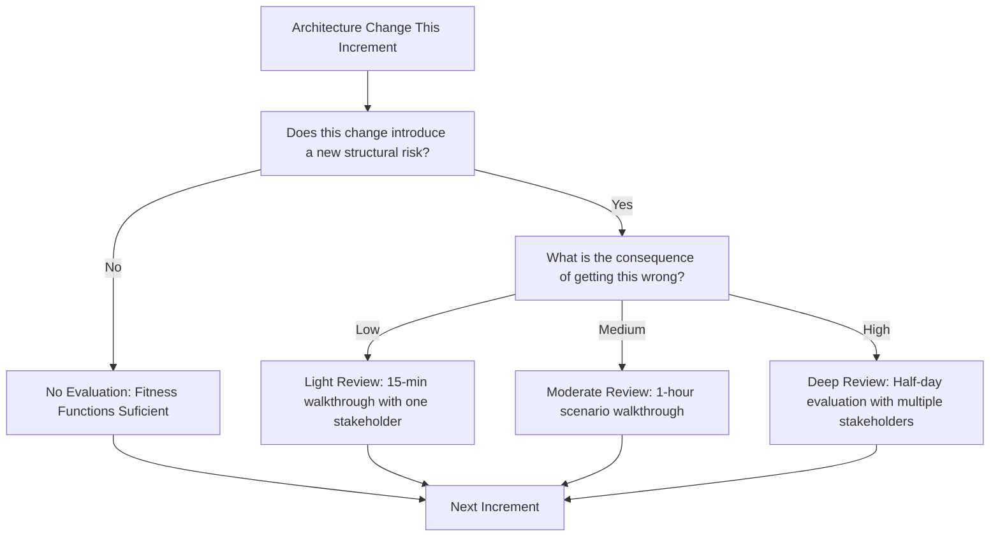

# Continuous Architecture Evaluation

> **Core skill:** The architect embeds evaluation in the delivery rhythm — using light-touch reviews per increment, architecture fitness functions as automated tests, and a just-enough evaluation principle — so that architectural integrity is maintained without a review board bottleneck.

## Why This Matters

Traditional architecture evaluation assumes a big-design-up-front world: the architecture is designed, reviewed, approved, and then built. In iterative delivery, that model breaks. The architecture evolves incrementally, and a two-day ATAM at inception cannot predict structural decisions made six months later. The architect needs evaluation that keeps pace with delivery — continuous, lightweight, and automated where possible.

The alternative is architecture drift: each increment makes locally optimal decisions that collectively degrade the architecture's coherence. By the time the drift is visible — typically in a painful integration or an unachievable quality target — the cost of correction is high. Continuous evaluation catches drift when it is still a design conversation, not a rewrite.

## Evaluation Cadence Tied to Delivery Cadence

| Delivery Cadence | Evaluation Cadence | Method |
|-----------------|-------------------|--------|
| **Weekly sprints** | Per-sprint architecture checkpoint (15 min) | Fitness function results review; new ADR review |
| **Bi-weekly sprints** | Per-sprint checkpoint; monthly deeper review | Per-sprint: fitness functions + new ADRs. Monthly: scenario walkthrough (1 hour) |
| **Monthly releases** | Pre-release evaluation (2–3 hours) | Scenario walkthrough for quality attributes at risk |
| **Quarterly increments** | Quarterly evaluation (half day) | Lightweight ATAM on changed architecture elements |
| **Continuous delivery** | Continuous fitness functions; weekly architecture sync | Automated fitness functions in CI/CD; 30-minute weekly architecture sync |

## Architecture Fitness Functions

Fitness functions are automated tests that verify architectural characteristics — not functional correctness, but structural integrity. They run in CI/CD and fail the build when architecture rules are violated.

### Fitness Function Categories

| Category | What It Verifies | Tool Examples |
|----------|-----------------|---------------|
| **Dependency rules** | No cyclic dependencies; layer dependencies flow in the right direction | ArchUnit (Java), NetArchTest (.NET), dependencruiser (JS) |
| **Module boundaries** | Public API surface does not expose internal types; module A does not import from module B | ArchUnit, ESLint import rules, ts-morph |
| **Naming conventions** | Components follow naming patterns; packages match architecture layers | Custom lint rules, Checkstyle |
| **Performance budgets** | Bundle size under threshold; API response under latency budget | Lighthouse CI, k6 thresholds, size-limit |
| **Security constraints** | No hardcoded secrets; dependencies free of known CVEs | TruffleHog, OWASP Dependency Check, Snyk |
| **Deployment topology** | Required number of replicas; health check endpoints exist | OPA rules, custom infrastructure tests |

### Fitness Function Design Principles

| Principle | Example |
|-----------|---------|
| **Fail fast** | Dependency rule violation fails the PR build, not the release build |
| **Specific message** | "Module `checkout` depends on `catalog.internal.Models` — internal types are not part of the catalog module's public API" — not "Dependency violation" |
| **Evolvable** | Fitness functions change as architecture evolves; they are not frozen at inception |
| **Explainable** | Every fitness function maps to an ADR or architecture rule that justifies it |
| **Non-blocking for emergencies** | Fitness functions can be bypassed with documented justification — but bypasses are tracked |

## Light-Touch Evaluation Per Increment

A lightweight evaluation format that fits within an iteration without disrupting delivery:

| Step | Time | Activity |
|------|------|----------|
| **ADR review** | 5 min | Review new and changed ADRs this increment |
| **Fitness function result review** | 5 min | Any fitness function failures? Any new fitness functions needed? |
| **Drift check** | 5 min | Has the implemented architecture diverged from the described architecture? |
| **Risk scan** | 5 min | Any new sensitivity or trade-off points emerged from this increment's changes? |
| **Action assignment** | 5 min | Any corrective actions needed before the next increment? |

Total: 25 minutes per increment. The goal is not comprehensive evaluation — it is catching structural drift while the fix is still small.

## The Just-Enough Evaluation Principle



The principle: evaluate at the depth the change demands, and no deeper. A dependency added between two modules in the same layer may need a 5-minute fitness function check. A new communication paradigm across system boundaries needs a scenario walkthrough. A fundamental change to the data consistency model needs a half-day evaluation. The skill is matching depth to risk — and not treating every change as if it demands an ATAM.

## Practical Applications

### Continuous Evaluation Setup Checklist

- [ ] Architecture fitness functions exist for dependency rules and module boundaries
- [ ] Fitness functions run in CI/CD and fail the build on violation
- [ ] Per-increment architecture checkpoint is scheduled and attended
- [ ] ADR creation/review is part of the definition of done for consequential changes
- [ ] Fitness function bypasses are tracked and reviewed at each checkpoint
- [ ] Evaluation depth is proportionate to change risk, not calendar-driven

### Fitness Function Register Template

```markdown
## Fitness Function Register

| ID | Rule | Category | Tool | ADR Reference | Last Violation |
|----|------|----------|------|---------------|----------------|
| FF-01 | No cyclic package dependencies | Dependency | ArchUnit | ADR-003 | Never |
| FF-02 | Domain layer does not import Infrastructure | Layering | ArchUnit | ADR-008 | 2026-07-15 (fixed) |
| FF-03 | API P95 latency < 50ms | Performance | k6 | ADR-012 | Never |
| FF-04 | No secrets in source code | Security | TruffleHog | ADR-005 | Never |
```

## Common Pitfalls

| Pitfall | Why It Is a Problem | Better Approach |
|---------|---------------------|-----------------|
| **Evaluation only at milestones** | Quarterly evaluation finds 3 months of drift — expensive to correct | Light-touch evaluation every increment; catch drift when it is one change, not thirty |
| **Fitness functions as substitute for thinking** | "The fitness functions pass, so the architecture is fine" — misses qualitative concerns | Fitness functions verify rules; human review verifies that the rules are the right ones |
| **Over-evaluation in agile contexts** | Team spends more time evaluating than building — architecture becomes the bottleneck | Just-enough principle: evaluate at the depth the change demands |
| **Fitness function rot** | Fitness functions written at inception; never updated; fail for obsolete rules | Review fitness functions at each checkpoint; remove rules that no longer apply |
| **Fitness functions that fail silently** | Build is red but nobody looks because "that test always fails" | Fitness functions must be green in main; if a rule is violated, fix the code or change the rule |
| **No architecture checkpoint cadence** | Continuous delivery with no evaluation touchpoint — drift is invisible until production incident | Weekly 30-minute architecture sync regardless of delivery cadence |

## Success Indicators

- Architecture fitness functions are green in CI/CD on the main branch
- Per-increment architecture checkpoints happen and produce tracked actions
- Architecture drift is detected within one increment of occurring
- Evaluation depth matches change consequence — no lightweight decisions get ATAM, no strategic decisions skip evaluation
- Team members propose new fitness functions when they identify a new invariants

## Related Topics

- [[01_Architecture_Evaluation_Methods]]
- [[04_Risk_Identification_in_Architecture]]
- [[05_Architecture_Anti_Patterns]]
- [[02_Quality_Attribute_Analysis/00_overview|Quality Attribute Analysis]]
- [[career-path/05_Tech_Lead/03_Technical_Direction_and_Architecture/01_Setting_Team_Technical_Vision|Setting Team Technical Vision (Tech Lead)]]

## Summary

Continuous architecture evaluation replaces the big-review-up-front model with evaluation that keeps pace with delivery: light-touch per-increment checkpoints, architecture fitness functions as automated tests in CI/CD, and a just-enough principle that matches evaluation depth to change consequence. The goal is not to eliminate structural drift — some drift is the natural consequence of iterative discovery — but to catch it when correction is still a design conversation, not a rewrite. A 25-minute weekly checkpoint plus automated fitness functions achieves what a quarterly ATAM cannot: evaluation at the speed of development.