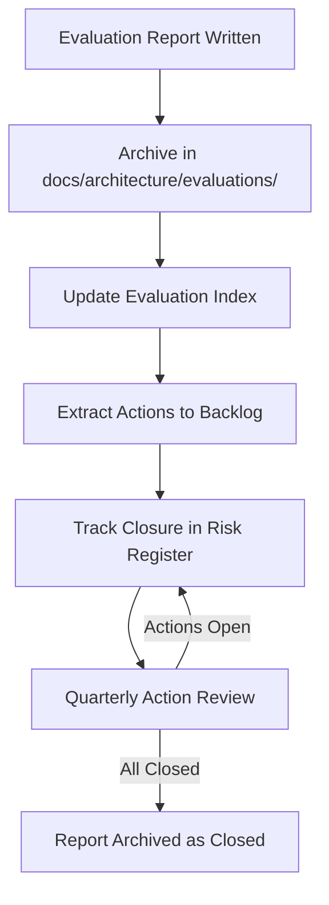

# Evaluation Reports

> **Core skill:** The architect produces evaluation reports that are actionable — structured for different readerships, anchored in evidence, carrying findings with owners and dates, and archived as governance artifacts for future reference.

## Why This Matters

An evaluation without a report is a meeting that happened. The value of evaluation is not the experience of being evaluated — it is the documented findings, risks, non-risks, and action plan that outlast the session. Without a report, findings fade from memory, actions drift without owners, and six months later nobody can prove the architecture was ever reviewed.

Evaluation reports also serve governance. Regulators, auditors, and due-diligence reviewers ask: "Was this architecture evaluated? What was found? What was done about it?" A well-structured evaluation report answers all three questions. A missing report answers none — and the inference, in regulated contexts, is that evaluation did not happen.

## Report Structure

### Standard Evaluation Report Template

```markdown
# Architecture Evaluation Report: [System Name]

**Date:** [Evaluation date]
**Method:** [ATAM / SAAM / Lightweight / ARID]
**Evaluation Team:** [Names and roles]
**Stakeholders Present:** [Names and roles]

## 1. Executive Summary
[2–3 paragraphs: what was evaluated, why, top findings, and overall assessment]

## 2. Architecture Overview
[System context diagram; key architectural approaches; scope of what was evaluated]

## 3. Evaluation Method
[Method used, phases conducted, scenarios applied, participants]

## 4. Findings

### 4.1 Risks
| ID | Risk | Likelihood | Impact | Mitigation | Owner | Target Date |
|----|------|------------|--------|------------|-------|-------------|

### 4.2 Non-Risks
| ID | Non-Risk | Why It Is Safe |
|----|----------|----------------|

### 4.3 Sensitivity Points
| ID | Sensitivity Point | Parameter | Effect |
|----|-------------------|-----------|--------|

### 4.4 Trade-Off Points
| ID | Trade-Off Point | Improved Attribute | Degraded Attribute | Mitigation |
|----|----------------|-------------------|--------------------|------------|

## 5. Action Plan
| Action ID | Action | Owner | Priority | Target Date | Status |
|-----------|--------|-------|----------|-------------|--------|

## 6. Appendices
- A: Quality Attribute Scenarios Used
- B: Utility Tree
- C: Decision Matrices (if applicable)
- D: Stakeholder Concern Register
```

### Section-by-Section Guidance

| Section | Audience | Write For |
|---------|----------|-----------|
| **Executive Summary** | Leadership, external reviewers | Decision-makers who will read one page and act |
| **Architecture Overview** | Stakeholders not in the room | Colleagues who need context to understand findings |
| **Findings** | Architecture team, engineering | Precise, actionable — every finding can become a backlog item |
| **Action Plan** | Owners, program management | Trackable: who, what, when, with status |
| **Appendices** | Future architects, auditors | Complete record: scenarios, utility tree, matrices |

## Writing Findings That Drive Action

| Weak Finding | Strong Finding |
|-------------|---------------|
| "Performance may be a concern" | "API gateway connection pool (currently 200) is a sensitivity point. At 400 concurrent connections (2x current peak), pool exhaustion causes request queuing and cascading 504 errors. Mitigation: resize pool to 600 and add circuit breaker at 70% utilization. Owner: Infrastructure team. Target: 2026-11-01." |
| "We should think about security" | "No authentication between Order Service and Payment Service (internal network assumed trusted). Risk: any compromised internal service can call Payment Service without credentials. Mitigation: mutual TLS between all services. Owner: Security team. Target: 2026-10-15." |
| "The database might need scaling" | "Single PostgreSQL primary cannot handle projected write volume of 150K/sec (current ceiling: ~50K/sec with connection pooling). Trade-off: synchronous replication improves consistency but degrades write throughput by 40%. Recommendation: evaluate CockroachDB for horizontal write scaling. Owner: Data architecture. Target: 2026-09-30 for evaluation report." |

## Non-Risks: Documenting What Works

Non-risks are as important as risks. They document architectural decisions that were scrutinized and found safe — preventing future teams from re-evaluating decisions that were already validated.

| Non-Risk | Why It Is Safe |
|----------|----------------|
| "Stateless API servers behind a load balancer can scale horizontally" | Validated: adding instances reduces per-instance load linearly; no shared state; no session affinity required |
| "Read replicas satisfy catalog query needs" | Validated: catalog queries are read-only; 5-second replication lag is within product SLA of 30 seconds |
| "Message queue decouples Order Service from Fulfillment Service" | Validated: async communication; Fulfillment downtime does not block order acceptance; queue provides 24-hour buffer |

## Following Up on Actions

An action plan without follow-up is a wish list. The evaluation report must include a mechanism for tracking closure:

| Follow-Up Mechanism | When to Use |
|--------------------|-------------|
| **Actions as backlog items** | Engineering actions — create tickets in the team's backlog with evaluation report reference |
| **Quarterly action review** | Architecture-team-owned actions — review all open evaluation actions at the quarterly architecture review |
| **Risk register sync** | Risks from evaluation feed into the architecture risk register; reviewed at each per-increment checkpoint |
| **Stakeholder notification** | When high-priority actions close, notify the stakeholders who raised the original concern |

## Archiving for Governance

| Archiving Requirement | Implementation |
|----------------------|----------------|
| **Version control** | Evaluation reports committed to `docs/architecture/evaluations/` alongside ADRs |
| **Searchable** | Report filename includes date and system name: `2026-08-22-checkout-system-atam.md` |
| **Indexed** | Evaluation index lists all reports with date, method, system, and outcome summary |
| **Linked** | ADRs link to the evaluation reports that informed them; evaluation reports link to the ADRs they reference |
| **Retained** | Reports retained for the life of the system plus regulatory retention period |



## Practical Applications

### Evaluation Report Quality Checklist

- [ ] Executive summary is readable by leadership within 3 minutes
- [ ] Every risk has likelihood, impact, mitigation, owner, and date
- [ ] At least 3 non-risks are documented — what passed scrutiny
- [ ] Sensitivity and trade-off points are documented with the parameters that drive them
- [ ] Action plan has owners who have acknowledged their actions
- [ ] Appendices include the scenarios and utility tree used in evaluation
- [ ] Report is committed to version control and linked from the evaluation index

### Evaluation Index Template

```markdown
# Architecture Evaluation Index

| Date | System | Method | Outcome | Report |
|------|--------|--------|---------|--------|
| 2026-08-22 | Checkout System | ATAM | 5 risks, 2 trade-off points, all with mitigations | [Report](evaluations/2026-08-22-checkout-system-atam.md) |
| 2026-07-15 | Payment Gateway | Lightweight | 2 risks, 1 sensitivity point; low overall risk | [Report](evaluations/2026-07-15-payment-gateway-lightweight.md) |
| 2026-04-01 | Platform API | Lightweight | 1 risk (vendor lock-in); mitigation in progress | [Report](evaluations/2026-04-01-platform-api-lightweight.md) |
```

## Common Pitfalls

| Pitfall | Why It Is a Problem | Better Approach |
|---------|---------------------|-----------------|
| **Risks without specifics** | "Performance may be an issue" — nobody can act on it | Specific: parameter, threshold, effect, mitigation, owner, date |
| **Missing non-risks** | Report reads like a failure catalog — erodes trust in the architecture | Document what passed scrutiny; non-risks prove evaluation was balanced |
| **Action plan without owners** | Actions listed with no accountability — nothing changes | Every action has a named owner who has acknowledged it |
| **Report shelved after delivery** | Findings never acted upon — evaluation had no impact | Extract actions to backlog; track closure at quarterly reviews |
| **No evaluation index** | Reports exist but nobody knows where or how many | Maintain an index; link from the architecture description |
| **Report as gatekeeping artifact** | "The evaluation failed" — report used to block progress, not to guide it | Report describes findings and actions; it does not issue pass/fail verdicts |

## Success Indicators

- Every evaluation produces a report within 48 hours of the session
- Report findings are specific enough to become backlog items without translation
- Action plan has owners, dates, and tracked closure
- Evaluation index shows all evaluation activity since project inception
- Non-risks section of reports is as populated as the risks section
- Stakeholders who raised concerns receive follow-up when their actions close

## Related Topics

- [[01_Architecture_Evaluation_Methods]]
- [[04_Risk_Identification_in_Architecture]]
- [[06_Continuous_Architecture_Evaluation]]
- [[03_Architecture_Description_and_Views/00_overview|Architecture Description and Views]]
- [[career-path/02_Senior_Software_Engineer/06_Communication_and_Influence/01_Technical_Writing|Technical Writing (Senior)]]

## Summary

Evaluation reports transform architecture evaluation from an event into a governance artifact. A well-structured report — executive summary for leadership, findings with precision for the architecture team, non-risks for balance, and an action plan with owners and dates for accountability — ensures that evaluation produces change, not just conversation. The report is archived, indexed, and linked to ADRs so that future architects, auditors, and reviewers can trace from structural decisions back to the evidence that validated them.