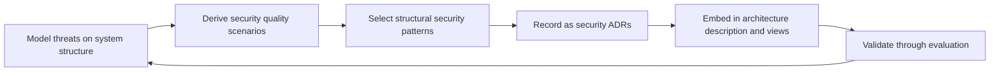

# Security Architecture

> **Core capability:** The architect designs security into system structure — defining trust boundaries, embedding security patterns as architectural choices, and making security trade-offs reviewable at the architecture level before code is written.

## Why This Matters

Security that is applied at the code level after architecture decisions are frozen is fragile and expensive — it is bolt-on security, dependent on every developer remembering every rule. Architecture-level security works differently: trust boundaries drawn into the system structure, access patterns enforced at the seam between components, and security properties designed as quality attribute scenarios before any framework is chosen.

The software architect is not the security specialist. The architect's job is the structural layer: ensuring the system's shape makes the secure path the default path. The specialist (Security Engineer, path 08) provides the depth; the architect provides the structural integration.

## Topics in This Capability Area

| Topic | Core Skill | When It Matters |
|-------|------------|-----------------|
| [[01_Secure_by_Design_Principles]] | Applying security principles at the architecture level — not the code level | System inception; every major design |
| [[02_Trust_Boundaries]] | Drawing and defending trust boundaries in the architecture | Component design; integration points |
| [[03_Threat_Modeling_Architecture_Level]] | STRIDE and attack trees applied to system structure | Before any launch; regulatory requirements |
| [[04_Security_Patterns_in_Architecture]] | Choosing structural security patterns: gateways, authentication brokers, secure channels | Cross-component design |
| [[05_Identity_and_Access_Architecture]] | Designing authentication and authorization at system scale | Multi-service systems; zero trust |
| [[06_Security_Decisions_and_ADRs]] | Recording security architecture decisions with threat rationale | Every security-significant architectural choice |
| [[07_Compliance_Architecture]] | Designing for regulatory requirements at the structural level | GDPR, SOC2, PCI-DSS, HIPAA contexts |

## Security in the Architecture Lifecycle

Security is a quality attribute the architect engineers structurally — not a checklist applied before release.

## Architect vs Security Engineer

| Activity | Software Architect | Security Engineer (Path 08) |
|----------|-------------------|------------------------------|
| Threat modeling | System-level STRIDE: trust boundaries, data flows | Deep attack trees, penetration testing, code-level review |
| Patterns | Architectural security patterns and their structural fit | Secure coding, encryption implementation, pipeline controls |
| Decisions | Security as architecture driver: what the system allows | Security as depth: how secure coding and operations enforce it |
| Compliance | Structural compliance: data flow, storage, boundaries | Audit evidence, vulnerability management, controls |

## Practical Applications

### Security Architecture Checklist

- [ ] Trust boundaries are drawn on architecture diagrams — visible and reviewed
- [ ] Every cross-boundary interaction has an explicit authentication and authorization decision
- [ ] Threat modeling produced at least one structural change in the architecture
- [ ] Security ADRs cite specific threats and the patterns chosen to address them
- [ ] Compliance constraints (data residency, retention, auditing) are designed into the structure

## Common Pitfalls

| Pitfall | Why It Is a Problem | Better Approach |
|---------|---------------------|-----------------|
| **Security-as-sprinkles** | Applied after architecture freezes; seams are the weakest point | Security quality scenarios as first-class architecture drivers |
| **Perimeter-only thinking** | One firewall; everything inside is trusted | Defense in depth; trust boundaries inside the system |
| **Security theater** | Checklists and tools without structural reasoning | Threat modeling first — then tools to support the model |
| **Architect as security owner** | One person holding the security view is a bottleneck | Security views in the architecture description; share ownership |

## Success Indicators

- Trust boundaries survive the first penetration test without redesign
- Security ADRs are cited in incident postmortems as controls that held
- Compliance requirements are visible in the architecture description
- The security specialist and the architect reference each other's artifacts

## Related Capabilities

- [[02_Quality_Attribute_Analysis/00_overview|Quality Attribute Analysis]]: security as a quality attribute scenario
- [[04_Architecture_Evaluation_and_Trade_Offs/00_overview|Architecture Evaluation and Trade Offs]]: evaluating security architecture decisions
- [[career-path/08_Security_Engineer/00_overview|Security Engineer]]: the specialist depth path
- [[career-path/05_Tech_Lead/03_Technical_Direction_and_Architecture/04_Technical_Standards_and_Conventions|Technical Standards and Conventions (Tech Lead)]]: where security standards become team practice

## Summary

Security architecture means drawing trust boundaries into the system structure, choosing architectural security patterns, and recording security decisions with threat rationale — so that the secure path is the structural default. The architect bridges to the security specialist for depth; the architect's own contribution is making the system's shape defensible before any line of application code is written.