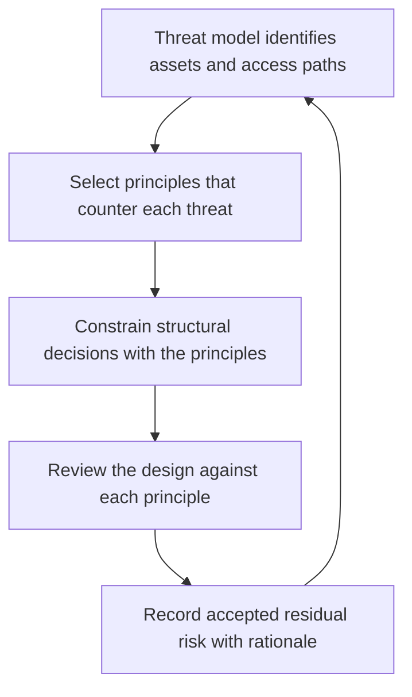

# Secure by Design Principles

> **Core skill:** The architect applies foundational security principles — least privilege, defense in depth, fail secure, complete mediation — as structural constraints on the design so that the secure path is the default path through the system.

## Why This Matters

Security applied to code after the architecture is frozen is bolt-on security: fragile, uneven, and dependent on every developer remembering every rule at every seam. Principles applied at the architecture level work differently. They constrain structure before code exists: where authentication sits, what a service account is allowed to reach, what a component does when its dependency fails, and how many ways exist into the system.

Most of the working principles are decades old — Saltzer and Schroeder cataloged them in 1975 — but their highest-leverage application point is the architecture, not the function. Least privilege is a design decision about component scope; defense in depth is a design decision about how many independent controls stand between an attacker and an asset; fail secure is a design decision about default behavior when a dependency is unavailable. By the time the first line of application code is written, these decisions are already made, for better or worse.

Principles also conflict — with each other, and with availability, operability, and cost. Fail secure opposes uptime; least privilege opposes operational convenience; separation of privilege opposes fast incident response. The architect's contribution is not to recite principles but to prioritize them explicitly: which principle wins in this context, why, and what residual risk is accepted. That rationale belongs in the architecture description, where it can be reviewed when the threat picture changes.

## The Principles and Their Structural Expressions

| Principle | Structural Expression | The Question the Architect Asks |
|-----------|----------------------|---------------------------------|
| **Least Privilege** | Every component, service account, and human role holds the minimum access its function requires | What is the smallest set of resources this component must reach? |
| **Fail Secure** | Denial is the default when authentication, authorization, or a dependency fails | What happens to access if this component dies or times out? |
| **Complete Mediation** | Every access to every protected resource passes a check — no side doors | Is there any path to the data that skips the gate? |
| **Defense in Depth** | Multiple independent controls, so one failure does not become a breach | If this control fails, what stops the attacker next? |
| **Economy of Mechanism** | Small, simple, few security mechanisms — one identity provider, one gateway | Can this mechanism be smaller or eliminated? |
| **Open Design** | Security depends on keys and configuration, never on secrecy of the design | Would this control still hold if the design were published? |
| **Separation of Privilege** | Sensitive operations need two independent conditions to succeed | Can a single credential alone do irreversible damage? |
| **Least Common Mechanism** | Components do not share state or channels unless necessary | Does this shared resource create an unwanted side channel? |

## Applying Principles to Structural Decisions

The test of principle application is concrete: it changes something in the structure. The table below lists recurring architectural decisions and the principle most often violated by the convenient choice.

| Structural Decision | Convenient Choice | Principle Applied | Better Structural Answer |
|---------------------|-------------------|-------------------|--------------------------|
| Service access to data stores | Shared database, one broad credential | Least privilege | Service-owned data with scoped credentials per service |
| Internal service calls | Trust the internal network | Complete mediation, defense in depth | Authenticated and authorized calls even inside the perimeter |
| Admin operations | One powerful admin path | Separation of privilege | Distinct roles, approval workflows, audit on every action |
| Dependency failure behavior | Retry forever, leave access open | Fail secure | Explicit failure modes: deny, degrade, or shed load |
| Error responses | Verbose internal detail to callers | Economy of mechanism | Generic external errors, detailed internal logs |
| Secret distribution | Shared environment variables | Separation of privilege | Managed secrets with rotation and scoped identities |

## Principle Conflicts and Prioritization

| Conflict | Typical Context | Resolution Approach |
|----------|-----------------|---------------------|
| Least privilege vs operability | Operations staff need broad access for incident response | Time-boxed elevation with approval and audit, not permanent broad roles |
| Fail secure vs availability | Identity provider outage blocks all traffic | Degrade to a reduced-capability mode rather than full allow or full deny |
| Defense in depth vs cost and latency | Every call crosses three inspection layers | Concentrate depth at boundaries that matter; measure the latency cost |
| Separation of privilege vs velocity | Two approvals slow every deployment | Reserve separation for irreversible or high-blast-radius actions |
| Economy of mechanism vs separation of privilege | One identity provider is simpler, but is a single point of compromise | Harden the single mechanism with strong recovery and monitoring, or pair it |

Prioritization rule: rank principles by the blast radius of their failure in this specific system. A principle guarding an irreversible, high-value asset outranks one guarding inconvenience.

## From Principles to Structure



The loop matters: principles are not a phase. Every architecture change re-opens the question of which principles are now in tension.

## Practical Applications

### Secure by Design Checklist

- [ ] Every component's access rights are enumerated and are the minimum for its function
- [ ] Every failure mode of every security-relevant component has a defined default behavior
- [ ] No access path to sensitive data skips a mediation point
- [ ] Principle conflicts in the design are recorded with the prioritization rationale
- [ ] Each principle citation in a design review names the specific structural element it constrains

### Principle Application Record

```markdown
## Principle Application Record — <system or feature>

| Structural Decision | Principle Applied | Violation Accepted | Rationale | Review Trigger |
|---------------------|-------------------|--------------------|-----------|----------------|
| Payments service data access | Least privilege | None | Scoped credentials per service | Schema change |
| Internal API calls | Complete mediation | Mutual TLS only, no per-call authorization | Latency budget; mitigated by network segmentation | New internal consumer |
| Admin console | Separation of privilege | Single approver for read-only actions | Blast radius bounded; actions audited | Any write action added |
```

## Common Pitfalls

| Pitfall | Why It Is a Problem | Better Approach |
|---------|---------------------|-----------------|
| **Principles as slogans** | "We follow least privilege" appears in every review; nothing structural changes | Each principle citation names the component, the access, and the constraint |
| **Least privilege in name only** | Roles named narrowly, grants issued broadly to make things work | Audit effective permissions, not role names; verify from the data |
| **Defense in depth as duplication** | Three layers that all check the same thing, failing together | Independent controls with different failure modes, or remove the redundancy |
| **Fail open by omission** | Nobody decided what happens when authentication is unreachable, so it allows | Failure behavior is an explicit design decision for every control |
| **Security through obscurity** | Non-standard schemes, hidden endpoints, secrecy as the control | Standards-based mechanisms; secrecy only for keys and configuration |
| **Principle purity over relevance** | Maximum separation everywhere; delivery slows and teams route around the design | Prioritize by blast radius; accept documented risk where the threat is low |

## Success Indicators

- Design reviews cite principles through specific structural elements, not as general statements
- Every security-relevant component has a documented failure-mode decision
- Effective permissions match intended permissions in an access review
- Principle conflicts and their resolutions appear in the architecture description
- New components inherit secure defaults without re-litigating each decision

## Related Topics

- [[02_Trust_Boundaries]]
- [[03_Threat_Modeling_Architecture_Level]]
- [[02_Quality_Attribute_Analysis/00_overview|Quality Attribute Analysis]]
- [[career-path/08_Security_Engineer/00_overview|Security Engineer]]

## Summary

Secure by design means the foundational security principles — least privilege, fail secure, complete mediation, defense in depth, economy of mechanism, open design, and separation of privilege — operate as constraints on system structure rather than as rules for code. The architect translates each principle into concrete structural decisions, prioritizes explicitly where principles conflict, and records the residual risk so the reasoning survives review. The measure of application is structural change: if citing a principle changes nothing in the design, it was decoration.
