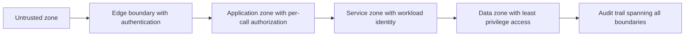

# Trust Boundaries

> **Core skill:** The architect draws the lines where trust changes — process, host, network, region, organization — and makes every crossing carry an explicit authentication and authorization decision.

## Why This Matters

A trust boundary is any line in the system where the level of trust changes: where data or control crosses from something one party controls into something another party controls, or between parties with different privilege. Almost every serious exploit abuses a boundary — a request that the receiving side assumed was already validated, an internal call that skipped authentication because it was internal, a data flow into analytics that never rechecked classification.

The architect's job is to make these seams visible and explicit. Unnamed boundaries are where everybody assumed somebody else checked. Once drawn, each boundary generates two questions for every crossing: who is on the other side, and what are they allowed to do here. A crossing without an answer to both is a structural vulnerability, regardless of how good the code on either side of it is.

Boundaries are not only logical. They exist at the process level, the host level, the network level, the cloud region level, and the organization level — and each type changes which controls are feasible. A process boundary can carry in-memory identity; an organization boundary requires contracts, tokens, and independent verification on both sides. The architect maps all of them onto the same picture so the security conversation starts from structure.

## Boundary Types

| Boundary Type | Crossing Example | Feasible Controls | Design Consideration |
|---------------|------------------|-------------------|----------------------|
| **Process** | One service calls another on the same host | Mutual TLS or workload identity, call-level authorization | Do not assume same-host means trusted; verify anyway |
| **Host** | Application reads from a shared host filesystem | OS permissions, container isolation, filesystem scoping | Host compromise spans every process on it |
| **Network** | Client in one subnet reaches a service in another | Firewalls, segmentation, service mesh policy | Network position is context, not authorization |
| **Cloud Region** | Data replicates to another region | Region-scoped IAM, encryption keys per region, residency controls | Compliance and latency both change at this line |
| **Organization** | Partner system calls your API | OAuth2 scopes, signed requests, contract-defined identity | No shared fate; both sides need independent verification |
| **Tenant** | One customer's data in a shared service | Row-level security, per-tenant keys, isolation model | Multi-tenant systems contain many boundaries in one process |

## What Trusts What

The first boundary artifact is a statement, not a diagram: for each component, what does it trust, and why? Trust claims are hypotheses until validated. The table below is the format that keeps them honest.

| Component | Trusts | Basis for Trust | Verified How | If the Basis Fails |
|-----------|--------|-----------------|--------------|--------------------|
| Web front end | Identity provider tokens | Signature and issuer validation | Key rotation and issuer allowlist | Reject all tokens; fail secure |
| Order service | Payment service responses | Mutual TLS identity | Certificate pinning and rotation | Circuit break, queue for retry |
| Analytics job | Event stream contents | Schema and producer identity checks | Schema registry, producer allowlist | Quarantine topic; alert |
| Admin console | Operator credentials | Strong authentication with hardware factor | Step-up verification per action | Deny session; require re-authentication |

## Authentication at Boundaries

Every crossing has an authentication decision, and the decision has a placement: at the edge, at the receiving service, or both. Edge-only authentication assumes the interior is safe after the gate; service-level authentication assumes the edge can be bypassed. Modern designs assume both can fail and place verification at each boundary that matters, using the cheapest sufficient mechanism at each line.

| Placement | What It Proves | Failure Mode It Leaves Open |
|-----------|----------------|-----------------------------|
| Edge gateway only | The external caller authenticated | Internal callers with a stolen or forged context |
| Receiving service only | The immediate caller's identity | Edge policy bypass, but identity is strong |
| Both edge and service | Caller identity plus a reduced-trust context for internal hops | Higher latency and token propagation complexity |

## Authorization Across Boundaries

Authentication does not transfer across a boundary; authorization must be re-decided on the receiving side against local policy. The recurring failure is the confused deputy: a privileged service performs an action on behalf of a caller without checking whether that caller would be allowed to do it directly. The structural defenses are token scoping — the caller presents only the authority it holds, narrowly scoped to this call — audience restriction, where tokens are valid only at the intended recipient, and per-hop authorization that re-evaluates rather than inherits.

## Drawing Trust Boundaries



Conventions that make boundary drawings usable: one visual treatment for every boundary, a legend naming each zone's trust level, labels on every arrow stating what crosses and under which identity, and a register that tracks each boundary's controls and owner. The diagram is the index; the register is the record.

### Designing the Untrusted Zone

Assume the zone outside your control is hostile and design inward from there. External input enters through a small number of well-defended entry points; nothing behind the edge treats externally supplied data as validated; identities from outside are mapped to internal identities once, at the edge, and never re-derived ad hoc. The untrusted zone design is the reason edge boundaries should be few: each additional entry point is another surface to authenticate, authorize, validate, and monitor.

## Practical Applications

### Trust Boundary Checklist

- [ ] Every trust boundary in the system is drawn and labeled on an architecture view
- [ ] Every crossing has a named identity and an authentication mechanism
- [ ] Every crossing has an authorization decision made on the receiving side
- [ ] The confused deputy case is analyzed for every privileged service
- [ ] Zone trust assumptions are recorded and reviewed when topology changes

### Boundary Register Template

```markdown
## Trust Boundary Register

| Boundary | Zones It Separates | Crossings | Authentication | Authorization | Owner | Last Reviewed |
|----------|--------------------|-----------|----------------|---------------|-------|---------------|
| B1 | Internet to edge | Public API | OAuth2 token at gateway | Scope check at service | Platform team | 2026-08-22 |
| B2 | Edge to services | Internal calls | Workload identity via mutual TLS | Per-call policy in mesh | Platform team | 2026-08-22 |
| B3 | Services to data | Reads and writes | Service credentials | Least privilege grants | Data team | 2026-08-22 |
```

## Common Pitfalls

| Pitfall | Why It Is a Problem | Better Approach |
|---------|---------------------|-----------------|
| **Implicit internal trust** | Inside the perimeter is treated as authenticated and authorized | Every boundary crossing carries identity and authorization, internal or not |
| **Edge-only security** | The perimeter defends the gate; interior calls are unverified and forgeable | Verify at each boundary; edge authentication does not transfer |
| **Boundaries missing from diagrams** | No record exists of where trust changes; reviews cannot see the seams | One visual convention for boundaries, plus a register with owners |
| **Identity laundering** | A service re-issues its own broad identity for a narrow caller | Scope tokens per call; preserve the original caller context in audit |
| **Trust by network position** | Being in the right subnet is used as proof of identity | Network position is context, never authorization |
| **Boundary sprawl** | Dozens of entry points, each with its own trust model | Consolidate entry points; one edge pattern applied uniformly |

## Success Indicators

- A penetration tester can trace every crossing on the boundary view and find a named control
- Confused deputy scenarios are enumerated and closed for every privileged service
- New integrations land on the boundary register before they reach production
- Zone trust assumptions are reviewed on topology changes, not once a year
- Incident postmortems reference boundaries as the containment lines that held

## Related Topics

- [[01_Secure_by_Design_Principles]]
- [[05_Identity_and_Access_Architecture]]
- [[03_Threat_Modeling_Architecture_Level]]
- [[03_Architecture_Description_and_Views/00_overview|Architecture Description and Views]]

## Summary

Trust boundaries are the lines in the system where the level of trust changes, and they are where attacks concentrate. The architect's discipline is to draw every boundary — process, host, network, region, organization, tenant — and require each crossing to answer two questions: who is on the other side, and what are they allowed to do here. Authentication and authorization are re-decided at each line rather than inherited, the untrusted zone is designed inward from hostile assumptions, and the boundary set stays small enough to defend.
