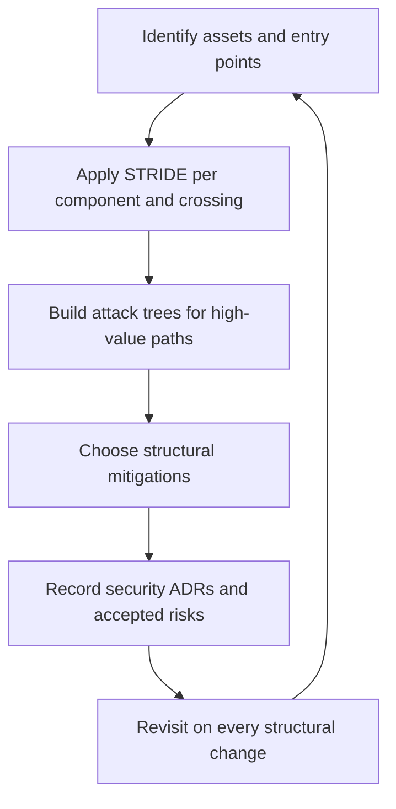

# Threat Modeling at Architecture Level

> **Core skill:** The architect applies STRIDE and attack trees to the system structure — components, connections, and data flows — producing structural mitigations, accepted risks, and security decisions rather than a one-time document.

## Why This Matters

Code-level threat review finds bugs in implementations; architecture-level threat modeling finds weaknesses in shape: a component with too much reach, a data flow with no validation, a boundary that nobody defends, a failure mode that fails open. These findings cannot be fixed in a pull request — they are fixed by changing the structure, which is exactly why they are the architect's work.

STRIDE provides the systematic checklist. Each category — spoofing, tampering, repudiation, information disclosure, denial of service, elevation of privilege — maps directly onto structural elements: identities at boundaries, data at rest and in motion, the audit trail, the data plane, the control plane. Working the categories against every component and every connection produces a threat list proportional to the architecture rather than to the codebase size.

The output discipline separates a real exercise from theater. A session produces three artifact classes: threats mitigated by structural change, threats accepted with named rationale, and security ADRs capturing the decisions. If the exercise leaves no structural trace — no changed design, no recorded risk, no decision — it produced a document that will be read once.

## STRIDE Mapped to Structure

| Threat | What It Targets Structurally | Architectural Question | Typical Structural Mitigation |
|--------|------------------------------|------------------------|-------------------------------|
| **Spoofing** | Identities at boundaries and between components | How does each side prove who is calling? | Strong authentication at boundaries, workload identity for services |
| **Tampering** | Data in motion, data at rest, configuration, infrastructure | Where can data be altered between producer and consumer? | Integrity checks, signed payloads, immutable infrastructure |
| **Repudiation** | The audit trail and its coverage of actions | Can a caller deny having performed this action? | Audit trail as a designed component, not a log side effect |
| **Information Disclosure** | Data flows, storage, error paths, side channels | Which flows carry data beyond where it is needed? | Segmented flows, minimal responses, classification-aware handling |
| **Denial of Service** | Shared resources, synchronous dependencies, control plane | What single dependency can exhaust the system? | Bulkheads, quotas, asynchronous intake, graceful degradation |
| **Elevation of Privilege** | Trust transitions, admin paths, delegation chains | Where can a lower-trust actor acquire higher-trust context? | Least privilege, scoped tokens, separation of privilege |

## Attack Trees for Architectural Threats

STRIDE enumerates; attack trees prioritize. For each high-value asset, the architect decomposes the credible attack paths and asks which structural control breaks each path. The tree stays at architecture level — it names components and flows, not exploits or payloads.

| Attack Goal | Path Through the Structure | Structural Control That Breaks It |
|-------------|---------------------------|-----------------------------------|
| Reach customer records | Partner API to shared database credentials | Per-service scoped credentials; a partner cannot present service identity |
| Take over a tenant | Password reset flow to email integration to support console | Separation of privilege; approval required for console actions |
| Exhaust the order system | Search endpoint to synchronous pricing dependency | Bulkhead and timeout between search and pricing; cached fallback |
| Forge an internal call | Compromised container to service mesh with weak policy | Workload identity requirement; deny by default in mesh policy |

Depth follows value: an attack tree three levels deep on the payment path is worth more than one level on every path. The architect caps the effort where the asset value caps it.

## Running the Threat Modeling Session

| Element | Detail |
|---------|--------|
| **Participants** | Architect, security engineer, a service owner per major component, one operations representative |
| **Inputs** | Context and component views, trust boundary register, data classification, recent incident history |
| **Structure** | Walk each STRIDE category against each component and crossing; capture live, no silent editing afterward |
| **Timebox** | Two hours for a system of five to ten components; split larger systems by zone |
| **Rules** | No solution debates during enumeration; capture threats first, then prioritize and mitigate in a second pass |
| **Cadence** | At inception, at every major structural change, and before launch — never as a one-time event |

## Outputs

| Output | Form | Owner | Follow-Through |
|--------|------|-------|----------------|
| Mitigated threats | Design changes reflected in the architecture description and views | Architect | Re-review the changed structure next session |
| Accepted risks | Threat entry with rationale, blast radius, and review date | Architect with security engineer | Recorded in the risk register; acceptance expires |
| Security ADRs | Decision record citing threat, pattern, and residual risk | Architect | Linked to the threat entry and to infrastructure ADRs |

## The Threat Modeling Loop



## Practical Applications

### Architecture Threat Modeling Checklist

- [ ] Every component and crossing is walked against all six STRIDE categories
- [ ] At least one structural change results from each session — or the output states explicitly why not
- [ ] Accepted risks have blast radius, rationale, and a review date
- [ ] Security ADRs capture each mitigation decision with the threat that drove it
- [ ] The threat model is revisited on structural change, not only on schedule

### Threat Register Template

```markdown
## Threat Register — <system> — <date>

| ID | STRIDE | Threat | Component or Crossing | Disposition | Mitigation or Rationale | Owner | Review Date |
|----|--------|--------|-----------------------|-------------|-------------------------|-------|-------------|
| T1 | Spoofing | Forged internal calls | Orders to Payments | Mitigated | Workload identity required by mesh policy | Platform | 2026-11-22 |
| T2 | Denial of Service | Search exhausts pricing | Search to Pricing | Mitigated | Bulkhead, timeout, cached fallback | Orders team | 2026-11-22 |
| T3 | Information Disclosure | Verbose errors leak schema | Public API | Accepted | Error detail generic; internal logs retained; residual risk low | API team | 2027-02-22 |
```

## Common Pitfalls

| Pitfall | Why It Is a Problem | Better Approach |
|---------|---------------------|-----------------|
| **One-time exercise** | The model is written at inception and never revisited as the structure changes | Trigger the model on structural change; keep it alive with the architecture description |
| **Code-level drift** | The session descends into exploits and payloads; structural weaknesses are missed | Hold the level: components, connections, flows, trust transitions |
| **Enumeration without disposition** | Long threat lists with no decision per entry | Every threat ends mitigated, accepted, or eliminated — with an owner |
| **No structural output** | Findings produce recommendations no one owns; nothing changes | Tie each mitigation to a design change and a security ADR |
| **Only the happy paths** | Failure and recovery flows are never modeled, though they carry the worst exposures | Model failure behavior as a first-class flow |

## Success Indicators

- Threat modeling changes the design at least once per session, and the change is visible in a view
- Accepted risks are re-reviewed before expiry, not after an incident
- Security ADRs trace back to specific threat register entries
- Components enter the session with owners who can speak to their boundaries
- Penetration tests surface findings already known and dispositioned in the register

## Related Topics

- [[02_Trust_Boundaries]]
- [[04_Security_Patterns_in_Architecture]]
- [[06_Security_Decisions_and_ADRs]]
- [[career-path/08_Security_Engineer/00_overview|Security Engineer]]

## Summary

Architecture-level threat modeling applies STRIDE to components, crossings, and data flows, deepens with attack trees where asset value justifies it, and runs as a repeatable session with the right participants and a hard timebox. The outputs — structural mitigations, accepted risks with expiry, and security ADRs — are the point: a session that leaves no design change and no recorded decision has produced theater. The model lives and dies with the architecture, revisited every time the structure moves.
