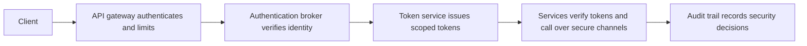

# Security Patterns in Architecture

> **Core skill:** The architect selects and composes structural security patterns — gateways, authentication brokers, secure channels, audit trails — as the system's standing answer to classes of threats, not as per-incident fixes.

## Why This Matters

A threat model tells you what can go wrong; a security pattern tells you what shape prevents it — repeatedly, across every future feature. Patterns are the architecture's standing answers: the gateway that always authenticates, the broker that always verifies identity, the audit trail that always records. Teams copy structures, not policies. A policy memo is forgotten within a quarter; a pattern is inherited by every service built inside it.

Pattern selection is driven by the threat model. A pattern that does not map to a real threat is cost without benefit, and security patterns are expensive: latency hops, new availability dependencies, certificate lifecycles, operational burden. The architect's discipline is to name the threat each pattern addresses, the residual paths it leaves open, and the cost it imposes — then choose the smallest composition that covers the model.

Patterns also compose. The gateway authenticates at the edge, the broker verifies identity, the token service issues scoped credentials, the channel protects each hop, the audit trail records decisions, and detection watches the seams. No single pattern delivers the security posture; the composition does. Composition has rules: one mechanism per job, re-verification at each boundary, and failure behavior that defaults to deny or degrade.

## The Pattern Catalog

| Pattern | Structure | Threat Addressed | Primary Cost |
|---------|-----------|------------------|--------------|
| **API Gateway** | Single authenticated entry point that terminates external calls and routes inward | Endpoint exposure sprawl; unauthenticated entry paths | One latency hop; must scale; misconfiguration risk |
| **Authentication Broker** | Central service verifies credentials and issues sessions or tokens | Inconsistent authentication logic; credential handling sprawl | Availability dependency on the critical path |
| **Claim-Based Identity** | Identity travels as signed claims with the request instead of re-querying state | Repeated credential lookups; coupling to a central session store | Token lifetime and revocation complexity |
| **Secure Channel** | Encrypted and authenticated transport between every pair of components | Interception and tampering in transit | Certificate lifecycle; handshake overhead |
| **Security Token Service** | Issues, signs, scopes, and rotates tokens for users and workloads | Long-lived shared secrets; manual key sprawl | Critical path; must be the best-hardened service |
| **Audit Trail** | Append-only record of security-relevant events spanning components | Repudiation; undetected misuse | Storage growth; privacy handling |
| **Intrusion Detection Placement** | Sensors positioned at boundaries and critical internal segments | Undetected lateral movement | Tuning effort; false positives |
| **Secrets Broker** | Runtime issuance of short-lived secrets to workloads | Static credentials in configuration | Bootstrap problem; availability dependency |

## Selecting Patterns by Threat Model

| Threat Class | Candidate Patterns | Selection Question |
|--------------|--------------------|--------------------|
| Spoofing of external callers | Gateway, authentication broker, token service | Where does trust enter the system, and can it be bypassed? |
| Spoofing between services | Secure channel with workload identity | How does each service prove its identity to the next? |
| Tampering in transit | Secure channel; signed payloads where channels terminate early | Which flows cross segments this control actually defends? |
| Repudiation of actions | Audit trail with identity capture | Which actions are consequential enough to require evidence? |
| Information disclosure | Gateway response minimization; claim scoping; channel encryption | Which flows carry data beyond where it is needed? |
| Denial of service | Gateway quotas and rate limits; bulkheads behind the edge | What shared resource can one caller exhaust? |
| Elevation of privilege | Token scoping and audience restriction; broker design | Where could a low-trust caller acquire high-trust context? |

## Composing Patterns



Composition rules: one mechanism per job — two overlapping authentication layers that fail together are not depth; re-verification at each boundary — authentication does not transfer across hops; and explicit failure behavior — every pattern in the chain has a defined answer for its own unavailability.

## Intrusion Detection Placement

Detection is also an architectural choice: you choose where sensors can see, and each placement has a blind spot.

| Placement | What It Sees | What It Misses | Design Note |
|-----------|--------------|----------------|-------------|
| Edge, north to south | External attack attempts against entry points | Lateral movement behind the edge | Baseline is cheap; tune for noise first |
| Internal segments, east to west | Unusual service-to-service flows, lateral movement | External noise, but detection needs a traffic baseline | Requires knowing normal topology to be useful |
| Host and container | Process and file behavior, privilege escalation attempts | Network-only attacks; fleet-wide coverage cost | Agent lifecycle becomes an architecture concern |
| Data access layer | Anomalous queries, bulk reads, policy violations | Misuse that looks like normal access | Highest signal-to-noise for data theft scenarios |

## Practical Applications

### Security Pattern Selection Checklist

- [ ] Every pattern in the system maps to at least one threat in the threat model
- [ ] Every security-relevant threat has at least one structural pattern addressing it
- [ ] No component can be reached by a path that bypasses the pattern composition
- [ ] Each pattern's failure behavior is defined and tested, not assumed
- [ ] The catalog of patterns in use is small enough to operate, and each has a named owner

### Pattern Selection Record

```markdown
## Pattern Selection Record — <system>

| Pattern | Threat Addressed | Alternative Rejected | Residual Paths Left Open | Cost Accepted | Owner |
|---------|------------------|----------------------|--------------------------|---------------|-------|
| API gateway | Unauthenticated external entry | Per-service edge auth | Gateway misconfiguration | One latency hop | Platform |
| Token service | Long-lived shared secrets | Static service keys | Compromised token within lifetime | Critical path dependency | Platform |
| Audit trail | Repudiation of admin actions | Application logs only | In-process tampering before logging | Storage growth | Security |
```

## Common Pitfalls

| Pitfall | Why It Is a Problem | Better Approach |
|---------|---------------------|-----------------|
| **Pattern without a threat** | A gateway exists because everyone has one; its cost is paid, its benefit unclear | Every pattern cites the threat register entry it addresses |
| **Single-pattern fundamentalism** | All security reduced to a perimeter or a firewall; internal flows stay open | Compose patterns across boundaries; verify the interior too |
| **The bypass path** | Services remain directly reachable; the composition protects only one road | Close every path that does not pass the pattern; verify from outside |
| **Detection nowhere** | Sensors added after incidents, placed where they see nothing new | Place detection where the threat model says movement would happen |
| **Token sprawl** | Each team invents its own token format and lifetime | One token service, one issuer, one verification library |
| **Ignoring pattern cost** | A second gateway hop, a broker dependency, and an extra policy engine arrive with no latency budget | Cost each pattern against the quality attribute scenarios it touches |

## Success Indicators

- Every pattern in production traces to a threat register entry and a named owner
- A new service inherits the security composition by default rather than by negotiation
- Bypass paths are found in review, not in incident response
- Pattern failure modes are exercised in game days or chaos experiments
- The pattern catalog fits on one page; additions require retiring or justifying

## Related Topics

- [[01_Secure_by_Design_Principles]]
- [[03_Threat_Modeling_Architecture_Level]]
- [[05_Identity_and_Access_Architecture]]
- [[04_Architecture_Evaluation_and_Trade_Offs/00_overview|Architecture Evaluation and Trade Offs]]

## Summary

Security patterns are the architecture's standing answers to threat classes: gateway, authentication broker, claim-based identity, secure channel, token service, audit trail, secrets broker, and deliberately placed detection. The architect selects each pattern against the threat model, composes them so that every boundary is mediated and every failure has a defined default, and pays each pattern's cost with eyes open. The composition — not any single pattern — is what the system is defended by.
