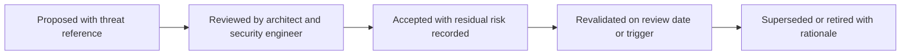

# Security Decisions and ADRs

> **Core skill:** The architect records security-significant decisions as ADRs that carry the threat that drove them, the pattern chosen, the residual risk, and the review date — keeping security reasoning reviewable and deliberately expiring.

## Why This Matters

Most security decisions are invisible in the code. The reasoning — we chose mutual TLS because the threat model showed forged internal calls, we accepted this token lifetime because the latency budget forced it — evaporates within a sprint. Without records, the next team either re-litigates the decision from scratch or, worse, unknowingly undermines it by adding the shortcut the original decision forbade.

Security ADRs differ from ordinary architecture decision records in specific ways. They cite a threat, not a quality preference. They state residual risk explicitly, because security decisions reduce risk rather than eliminate it. They carry a review date, because threat landscapes, compliance regimes, and infrastructure change faster than most architectural context. And they link outward — to the threat register, to the infrastructure that enforces them, and to the compliance evidence that depends on them.

The lifecycle discipline matters more than the template. A security decision accepted with no review date is a claim without an expiry; an accepted risk nobody re-examines is indistinguishable from an unknown risk. The architect treats the security ADR set as a living register: revalidated on schedule and on trigger, superseded when context moves, and auditable as a chain from threat to control to evidence.

## What Makes a Security ADR Different

| Dimension | Ordinary ADR | Security ADR |
|-----------|--------------|--------------|
| **Driver** | A quality attribute trade-off, cost, or delivery constraint | A specific threat with a blast radius, cited by register ID |
| **Alternatives** | Options weighed against quality scenarios | Attack paths each option leaves open or closes |
| **Consequences** | Positive, negative, neutral impacts | Residual risk stated explicitly, with acceptance rationale |
| **Lifespan** | Superseded when technical context changes | Review date mandatory; acceptance expires |
| **Evidence** | Links to evaluations and prototypes | Links to the threat register, infrastructure enforcement, and compliance controls |

## The Security ADR Template

```markdown
# ADR-014: Mutual TLS for Internal Service Calls

## Status
Accepted (2026-08-22). Review due 2027-02-22.

## Threat
T3 in the threat register: forged internal calls from a compromised container,
leading to spoofing and potential elevation of privilege across the service zone.

## Decision
All service-to-service calls carry verifiable workload identity via mutual TLS,
issued by the platform certificate authority with automatic rotation. Services
deny calls that present no valid certificate.

## Alternatives Considered
- Network segmentation only — reduces reach but does not prove identity; rejected.
- Shared secrets per service pair — rotation burden and sprawl; rejected.
- Mesh policy without cryptographic identity — depends on correct routing; rejected.

## Residual Risk
- A compromised workload with a valid certificate can call services that accept
  its identity; blast radius bounded by per-call authorization.
- Certificate authority outage prevents new workload startup; accepted with
  a platform recovery runbook as mitigation.

## Enforcement
- Infrastructure ADR-021: mesh mutual TLS policy is the enforcing mechanism.
- Deployment pipeline rejects services that call peers without the mesh sidecar.

## Compliance Mapping
- SOC 2 CC6.1: logical access controls; test of design references this decision.

## Review Trigger
- Before any external audit, on certificate authority change, or on the review date.
```

## The Security ADR Lifecycle



## Linking Security ADRs to Infrastructure and Compliance

A security ADR that stands alone is a story. The value compounds when the chain is linked in both directions.

| Link Target | Purpose | Mechanism |
|-------------|---------|-----------|
| Threat register entry | Trace the decision to the threat that demanded it | Reference the threat ID in the ADR header and vice versa |
| Infrastructure ADR | Name the mechanism that actually enforces the decision | Cross-reference both directions; the pair is reviewed together |
| Compliance evidence | Show which control the decision satisfies | Compliance matrix row references the ADR ID |
| Architecture description | Keep the decision visible where the structure is described | Annotate the affected components and connections in a view |

## Practical Applications

### Security ADR Checklist

- [ ] Every security-significant decision has an ADR — authentication scheme, authorization model, boundary controls, accepted risks
- [ ] Each ADR cites the threat that drove it, by register ID
- [ ] Residual risk is stated with a rationale for accepting it
- [ ] Every accepted ADR has a review date and a review trigger
- [ ] The ADR is linked to its enforcing infrastructure decision and any compliance controls

### Security ADR Index

```markdown
## Security ADR Index

| ADR | Decision | Threat | Status | Review Due | Enforced By |
|-----|----------|--------|--------|------------|-------------|
| ADR-014 | Mutual TLS for internal calls | T3 | Accepted | 2027-02-22 | Infrastructure ADR-021 |
| ADR-015 | OIDC with corporate identity provider | T1 | Accepted | 2027-02-22 | Platform configuration |
| ADR-016 | Customer data residency in region | C2 compliance | Accepted | 2027-08-22 | Data architecture decision |
```

## Common Pitfalls

| Pitfall | Why It Is a Problem | Better Approach |
|---------|---------------------|-----------------|
| **Security ADR without a threat** | The decision reads as preference; nobody can tell what it defends against | Cite the threat register entry; no threat, no security ADR |
| **Residual risk hidden** | Acceptance looks risk-free; the trade-off disappears for future reviewers | State residual risk and the reason it was accepted |
| **No review date** | The decision silently outlives the threat picture that justified it | Review dates are mandatory; acceptance expires by design |
| **Write-once, never linked** | The decision and its infrastructure enforcement drift apart | Cross-link ADRs to infrastructure decisions and compliance rows |
| **ADR as approval form** | Records are filed for the process, never read or revalidated | Revalidate on schedule; treat the ADR set as a register |
| **Contradicting records** | A security ADR and an infrastructure ADR describe different realities | Review the pair together when either changes |

## Success Indicators

- Every accepted security decision has a bounded review date, and reviews actually happen
- Auditors can follow a chain from a threat to its control to its evidence without interviews
- Engineers cite ADR IDs when changing or questioning security-relevant structure
- Superseded ADRs clearly explain what changed in the context
- The security ADR index doubles as the security decision inventory for the system

## Related Topics

- [[03_Threat_Modeling_Architecture_Level]]
- [[04_Security_Patterns_in_Architecture]]
- [[07_Compliance_Architecture]]
- [[02_Quality_Attribute_Analysis/00_overview|Quality Attribute Analysis]]

## Summary

Security ADRs make security decisions reviewable by recording the threat that drove them, the pattern chosen, the residual risk accepted, and the date the reasoning expires. They differ from ordinary decision records in citing threats instead of preferences, stating residual risk explicitly, and linking to the infrastructure that enforces them and the compliance controls that depend on them. Managed as a living register — revalidated on schedule and trigger, superseded with rationale — they turn scattered security choices into an auditable chain.
