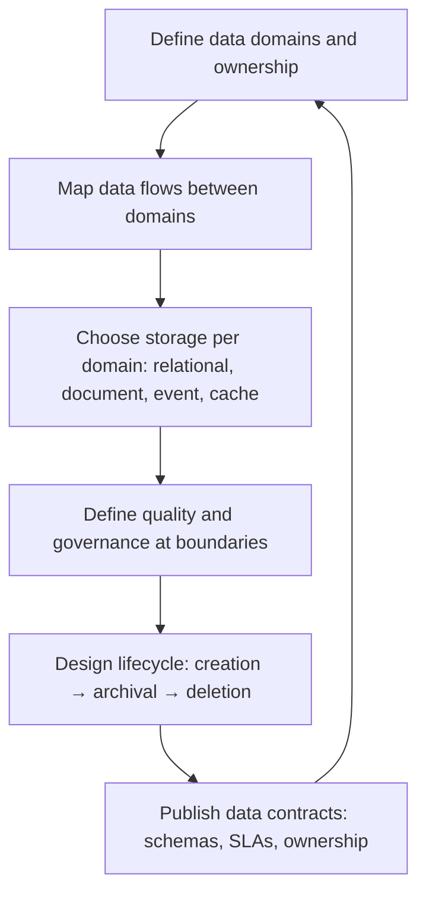

# Data Architecture

> **Core capability:** The architect designs how data moves, lives, is owned, and is governed across the system — making data boundaries, flow, storage choices, and lifecycle decisions explicit and reviewable at the architecture level.

## Why This Matters

Data is the hardest part of any system to change later. Code can be rewritten; a data model shared across teams — or worse, shared silently — cannot. Most architecture that fails at scale fails at the data layer: systems that read each other's databases, schemas that evolved without governance, pipelines nobody understands but everyone depends on.

The software architect owns the data architecture at the structural level: which data lives where, who owns it, how it flows, where the copies are, and what the sources of truth are. The depth of each concern (data modeling, pipeline reliability, storage internals) lives in the Data & ML Engineer path (09); the architect integrates those concerns into the system's larger shape.

## Topics in This Capability Area

| Topic | Core Skill | When It Matters |
|-------|------------|-----------------|
| [[01_Data_Domains_and_Ownership]] | Defining data ownership boundaries at system scale | System growth; data mesh transitions |
| [[02_Data_Flow_Architecture]] | Designing how data moves between components and systems | Every integration; every pipeline |
| [[03_Storage_Selection_and_Polyglot_Persistence]] | Choosing the right data storage technology per domain | New services; modernization |
| [[04_Data_Modeling_at_Architecture_Level]] | Conceptual and domain models as architecture artifacts | System inception; domain discovery |
| [[05_Data_Quality_and_Governance_Architecture]] | Designing quality into the data structure and flow | Regulated domains; data products |
| [[06_Data_Lifecycle_and_Retention]] | Designing retention, archival, and deletion into the system | GDPR, cost management, storage growth |
| [[07_Event_and_Messaging_Architecture]] | Designing event-driven data flow: topics, schemas, contracts | Async systems; event sourcing |

## The Data Architecture View

Data architecture is the structural layer between domain modeling and storage implementation.

## Architect vs Data and ML Engineer

| Activity | Software Architect | Data and ML Engineer (Path 09) |
|----------|-------------------|--------------------------------|
| Ownership boundaries | Defines which team owns which data domain | Implements data ownership infrastructure |
| Flow design | Architecture-level data flows and integration | Pipeline reliability, ETL depth, streaming implementation |
| Storage selection | Polyglot persistence at the system level | Storage tuning, indexing, query optimization |
| Modeling | Conceptual data models as architecture views | Physical models, schema evolution, data contracts |
| Governance | Architecture-level quality gates and ownership | Operational data quality, observability, lineage |

## Practical Applications

### Data Architecture Checklist

- [ ] Data domains and ownership are mapped on the architecture description
- [ ] Every cross-domain data flow is documented with contract and ownership
- [ ] Storage choices are justified against the domain's access patterns and volume
- [ ] Architecture-level data quality criteria are defined at domain boundaries
- [ ] Data lifecycle (retention, archival, deletion) is designed into the system

## Common Pitfalls

| Pitfall | Why It Is a Problem | Better Approach |
|---------|---------------------|-----------------|
| **Shared database as integration** | Couples services; one schema change breaks everything | Service-owned databases with explicit interfaces |
| **Polyglot-for-polyglot** | Every team picks different stores; operational burden explodes | Polyglot with limits: a managed portfolio, not a free-for-all |
| **Data ownership absent** | Nobody knows who fixes data quality; fixes are ad-hoc | Ownership boundaries visible in architecture views |
| **Event schemas as afterthought** | Incompatible events; consumers break silently | Schema registries; data contracts at architecture level |

## Success Indicators

- Data domains and ownership are visible on architecture diagrams
- Cross-service data flows are documented and have known owners
- Storage technology choices cite specific domain access patterns
- Data quality gates are defined and monitored at architecture boundaries

## Related Capabilities

- [[02_Quality_Attribute_Analysis/00_overview|Quality Attribute Analysis]]: data consistency and availability as quality scenarios
- [[05_Security_Architecture/00_overview|Security Architecture]]: data classification and access boundaries
- [[career-path/09_Data_and_ML_Engineer/00_overview|Data and ML Engineer]]: the specialist depth path
- [[15_Solutions_and_Enterprise_Architect/00_overview|Solutions and Enterprise Architect]]: enterprise-level data governance (future path)

## Summary

Data architecture is the structural layer that outlives any single data pipeline: defined domains, owned and contracted flows, justified storage diversity, and lifecycle designed in from the start. The architect draws the map; the data specialist builds the roads.