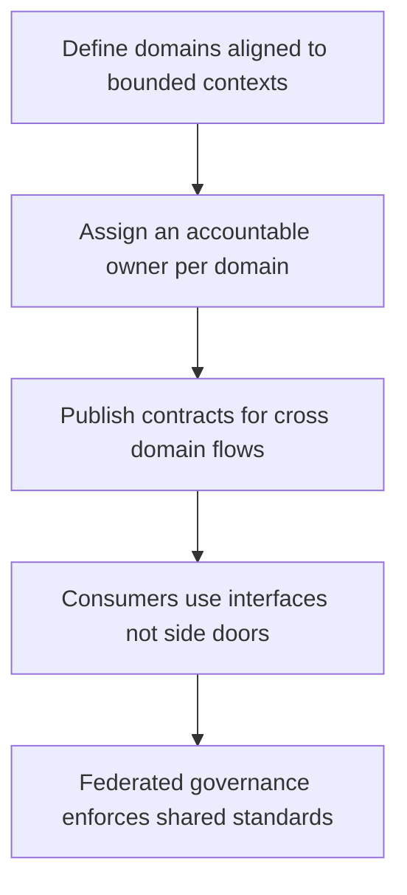

# Data Domains and Ownership

> **Core skill:** The architect defines data domains and their owners as structural boundaries, so every dataset has an accountable owner and every cross-domain flow has a contract — before shared databases quietly turn ownership into a fiction.

## Why This Matters

Data outlives code, and ownership is what keeps it coherent. Systems fail at the data layer more often than anywhere else: two services writing the same table, a dashboard reading a database it does not own, a schema change that breaks consumers nobody remembered. Every one of these failures is an ownership vacuum — a dataset that everyone uses and no one is accountable for.

Domain-driven boundaries apply to data as much as to services. The bounded context that owns a business capability owns the data that capability produces; other domains consume it through interfaces — APIs, events, published extracts — not by reaching into its storage. This single rule prevents the shared-database trap, where integration through a common schema couples every service to every other and turns each migration into an archaeology project.

Data mesh concepts give the architect vocabulary for the hard parts: domain ownership as the organizing principle, data treated as a product with consumers and interfaces, federated governance that sets interoperable standards without centralizing everything, and a self-serve platform that makes the good path the easy path. The architect does not build a mesh; they use its principles to answer the questions that always arise: who owns shared data, and how does it get shared without a new silo or a new shared database.

## From Service Boundaries to Data Domains

| Bounded Context | Data Domain | Accountable Owner | Consumers | Access Mechanism |
|-----------------|-------------|-------------------|-----------|------------------|
| Ordering | Orders, line items | Ordering team | Billing, analytics, support | Domain events; read API |
| Billing | Invoices, payments | Billing team | Finance, analytics | Contracted extracts; events |
| Catalog | Products, pricing | Catalog team | Storefront, partners | Published API; replicated read model |
| Customer | Profile, preferences | Customer team | Everywhere | Events; scoped lookups |

## Data Mesh Principles for Architects

| Principle | What It Means Structurally | The Architect's Responsibility |
|-----------|----------------------------|-------------------------------|
| **Domain ownership** | Data is owned where it originates; producers are accountable for quality and availability | Draw the domain map; assign owners; enforce no direct cross-domain storage access |
| **Data as a product** | Every published dataset is discoverable, addressable, self-describing, and trustworthy | Define the contract expectations: schema, semantics, SLAs, support channel |
| **Federated computational governance** | Global standards exist, but each domain applies and automates them locally | Set the interoperable interface and policy standards; automate compliance where possible |
| **Self-serve platform** | Consumption and publication infrastructure is a product, not a queue | Rely on the platform; resist building bespoke pipelines per domain |

## Ownership of Shared Data

Shared data is where ownership arguments hide. The architecture's job is to pick a pattern per category and make it explicit.

| Category | How Sharing Works | Owner | Trade-Off Accepted |
|----------|-------------------|-------|--------------------|
| **Reference data** (currencies, country codes, tax rates) | Published, versioned dataset consumed by all | A designated domain or central steward | Update latency; occasional staleness |
| **Master data** (customer, product) | One system of record; copies trace lineage to it | The domain that masters it | Write contention at the master; duplicate reads |
| **Event-carried state transfer** | Producer publishes events; consumers maintain local read models | The producing domain owns the event schema | Eventual consistency between domains |
| **Contracted extracts** | Scheduled or streamed copies under a data contract | The source domain owns the interface | Freshness lag; replication cost |
| **Analytical copies** | Warehouse or lakehouse replicas for reporting and ML | A central data team or the source domain by agreement | Definition drift from operational semantics |

## Data Ownership vs Service Ownership

| Aspect | Service Ownership | Data Ownership |
|--------|-------------------|----------------|
| What is owned | Behavior, interfaces, deployment | Integrity, meaning, access policy, lifecycle |
| Change management | Code deploys on the team's cadence | Schema and lifecycle changes ripple to external consumers |
| Consumer base | Service clients | Other domains, analysts, compliance, auditors |
| Failure mode | Outage, visible and immediate | Bad or stale data, silent and spreading |
| Success measure | Availability, latency, error rate | Accuracy, timeliness, provable lineage |

## Domain Ownership Model



## Practical Applications

### Data Domain Checklist

- [ ] Every dataset in the system belongs to exactly one named domain with an accountable owner
- [ ] No service reads or writes another domain's storage directly
- [ ] Every cross-domain flow has a published contract with an owner and defined semantics
- [ ] Shared data categories — reference, master, analytical — have a chosen sharing pattern
- [ ] Domain boundaries and owners are visible on the architecture description

### Data Domain Register

```markdown
## Data Domain Register

| Domain | Datasets Owned | Owner | Interface Published | Consumers | Classification | Review Date |
|--------|----------------|-------|---------------------|-----------|----------------|-------------|
| Orders | orders, line items | Ordering team | Events plus read API | Billing, analytics | Internal | 2026-11-22 |
| Customer | profile, preferences | Customer team | Events plus scoped lookup | All product teams | Personal data | 2026-11-22 |
| Billing | invoices, payments | Billing team | Contracted extracts | Finance, analytics | Financial | 2026-11-22 |
```

## Common Pitfalls

| Pitfall | Why It Is a Problem | Better Approach |
|---------|---------------------|-----------------|
| **Shared database as integration** | One schema change touches every service; coupling is total | Service-owned data with explicit interfaces between domains |
| **Orphan datasets** | Nobody knows who fixes quality or approves changes; fixes are ad hoc | Every dataset appears in the domain register with an owner |
| **Ownership without authority** | A team is named owner but cannot change the schema it is accountable for | Pair accountability with decision authority over the domain's data |
| **Mesh theater** | Teams renamed producers; no contracts, no interfaces, no products | Treat publication as a product commitment: contract, SLA, support |
| **Contract bypass** | Consumers query the database directly for convenience | Close side doors; provide the read API or extract they need |
| **Everything owned by the data team** | Central team becomes a bottleneck and a knowledge grave | Distribute ownership to domains; central team owns platform and standards |

## Success Indicators

- Every dataset in an audit or incident traces to a named owner and interface
- Cross-domain changes are negotiated contract-first rather than discovered at runtime
- New teams adopt the domain map rather than creating yet another schema
- Shared data categories have documented patterns; disputes reference them
- The domain register stays current through project onboarding, not cleanup drives

## Related Topics

- [[02_Data_Flow_Architecture]]
- [[04_Data_Modeling_at_Architecture_Level]]
- [[05_Data_Quality_and_Governance_Architecture]]
- [[career-path/09_Data_and_ML_Engineer/00_overview|Data and ML Engineer]]

## Summary

Data domains are the ownership boundaries of the data layer: every dataset belongs to exactly one domain, every domain has an accountable owner with real authority, and every cross-domain flow runs through a published contract rather than a shared table. Data mesh principles — domain ownership, data as a product, federated governance, self-serve platform — give the architect a vocabulary for scaling this without centralizing everything or fragmenting everything. The register is small; the discipline it encodes is what keeps the data layer from becoming nobody's system.
