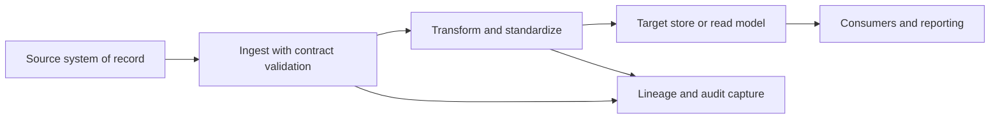

# Data Flow Architecture

> **Core skill:** The architect maps how data moves — source to transform to sink across batch, streaming, change capture, and API patterns — and maintains that map as a first-class architecture view with ownership, latency, and lineage.

## Why This Matters

Data is only useful in motion, and most of a system's hidden complexity lives in movement: where data goes, how fast it arrives, how reliably it survives the trip, and in what shape it lands. Pipelines that nobody documented are the dark matter of system architecture — invisible until they break, and then everyone discovers they were load-bearing.

The integration pattern sets the system's tempo and coupling. Batch extraction is simple, robust, and always somewhat stale. Streaming is fresh and operationally demanding. Change data capture takes truth from the source's own log with minimal intrusion. API-driven flows are synchronous and coupled to the source's availability. Choosing a pattern is choosing which of these properties the system will have, and that choice constrains everything downstream of it.

The architect's artifact is the data flow view: sources, transforms, and sinks with latency expectations, ownership, and failure behavior marked on every edge. Lineage is the same map asked a different question — where did this value come from, and what breaks if it changes — and it is the difference between an incident that takes minutes to trace and one that takes days.

## Source, Transform, Sink

| Stage | Questions to Answer | Typical Decisions |
|-------|---------------------|-------------------|
| **Source** | What is the system of record? How is change detected? | Log-based capture, query extraction, or export; access identity and rate limits |
| **Transform** | Where does business logic live — source, pipeline, or consumer? | Thin pipeline, strong contract; batch windows versus micro-batch versus streaming |
| **Sink** | What write semantics does the consumer need? | Upsert versus append versus replace; ordering guarantees; retention at the sink |

## Integration Patterns Compared

| Pattern | Latency | Coupling | Delivery Properties | Typical Use |
|---------|---------|----------|---------------------|-------------|
| **Batch ETL** | Hours to days | Low at runtime; strong at schema | Whole-window reprocessing; simple retries | Warehouse loads, reporting, billing runs |
| **Streaming** | Milliseconds to seconds | Medium; broker decouples producers | Ordered per partition; at-least-once common | Real-time features, monitoring, notifications |
| **Change data capture** | Near real time | Low intrusion; reads the source log | Log order preserved; replayable | Read model sync, cache warming, replication |
| **API-driven pull** | On demand at call time | High; synchronous dependency | Request-scoped; caller handles failure | Lookups, small volumes, user-initiated queries |
| **Event push** | Seconds | Low with contracts; producers decouple | At-least-once typical; idempotent consumers | Domain integration, workflow triggers |
| **File exchange** | Batch cadence | Lowest; contract is the file | Atomic on completion | Partners, legacy systems, bulk transfers |

## Data Pipeline Architecture

Every pipeline, regardless of pattern, has the same structural concerns. Deciding them once per pipeline is what makes flows operable rather than heroic.

| Pipeline Concern | Design Question | Default Answer |
|------------------|-----------------|----------------|
| Ingest | How does data enter, and who may write? | Single writer per source; identity-scoped access |
| Validation | Where is bad data stopped? | At ingress, against the contract; quarantine rather than drop |
| Idempotency | What happens if this step runs twice? | Every write keyed; re-runs safe by construction |
| Replay and backfill | Can the pipeline reprocess history? | Retain raw input; transformation re-runnable from raw |
| Failure path | Where does poison data go? | Dead-letter store with alerting and an owner |
| Observability | How do you know it worked? | Freshness, volume, and schema checks at stage boundaries |

## Data Lineage as an Architecture Concern

Lineage at architecture level is not column-level forensics; it is the flow map annotated with provenance. It answers three recurring questions: compliance asks where personal data flowed after a correction; engineering asks what breaks if this source changes; operations asks which sink is stale when a pipeline stops. Maintaining lineage means every transform names its inputs and outputs, and every sink names its upstream. The data flow view, kept current, is the lineage record.

## Data Flow as an Architecture View



## Practical Applications

### Data Flow Checklist

- [ ] Every flow from source to sink is drawn on the data flow view with its pattern named
- [ ] Each flow states its latency expectation, delivery semantics, and failure behavior
- [ ] Every pipeline stage is idempotent and replayable, or says explicitly why not
- [ ] Bad data has a quarantine path with an owner and alerting
- [ ] Lineage capture is part of the pipeline, not a separate archaeology effort

### Data Flow Register

```markdown
## Data Flow Register

| Flow | Source | Pattern | Sink | Latency Target | Delivery | Owner | Failure Behavior |
|------|--------|---------|------|----------------|----------|-------|------------------|
| Orders to warehouse | Orders database | CDC | Warehouse fact table | Under 15 minutes | At least once | Data team | Dead-letter plus alert |
| Catalog to storefront | Catalog service | Event push | Read model | Under 5 seconds | At least once, idempotent | Catalog team | Serve previous model |
| Billing extract | Billing service | Batch ETL | Finance system | Daily 06:00 | Exactly on completion | Billing team | Retry next window |
```

## Common Pitfalls

| Pitfall | Why It Is a Problem | Better Approach |
|---------|---------------------|-----------------|
| **Undocumented pipelines** | Flows exist only in someone's scheduler; no one can trace an incident | Every flow registers on the data flow view with an owner |
| **Connector before pattern** | A tool is chosen first; the pattern's properties are discovered later | Choose the integration pattern from latency and coupling needs first |
| **Transform sprawl** | Business logic accumulates in every stage; definitions disagree | Define transformations once, close to the contract that owns the meaning |
| **No replay path** | A bug in a transform means data is wrong forever, or a full rebuild | Keep raw inputs; make transforms re-runnable from raw |
| **Silent freshness decay** | Pipelines slow down gradually; consumers trust stale data | Freshness checks and alerts at stage boundaries |
| **Synchronous where batch fits** | Real-time coupling bought for reporting workloads that refresh daily | Match the pattern to the actual consumer need |

## Success Indicators

- Incident tracing a data error uses the flow view and lineage capture, not interviews
- Every flow has a named owner and an agreed freshness expectation that is monitored
- Pipelines are routinely replayed after transform fixes without side effects
- New integrations reuse registers and patterns rather than inventing flows
- Bad data never reaches consumers silently; last-known-good behavior is defined

## Related Topics

- [[01_Data_Domains_and_Ownership]]
- [[07_Event_and_Messaging_Architecture]]
- [[03_Architecture_Description_and_Views/00_overview|Architecture Description and Views]]
- [[career-path/09_Data_and_ML_Engineer/00_overview|Data and ML Engineer]]

## Summary

Data flow architecture is the map of how data moves: source to transform to sink, with the integration pattern — batch, streaming, change capture, API, events, files — chosen from latency and coupling requirements rather than habit. Every flow carries a contract, an owner, idempotent replayable stages, a quarantine path for bad data, and lineage capture. The flow view is the artifact that makes integration reviewable and incidents traceable, and it is the architect's primary tool for keeping data movement from becoming dark matter.
