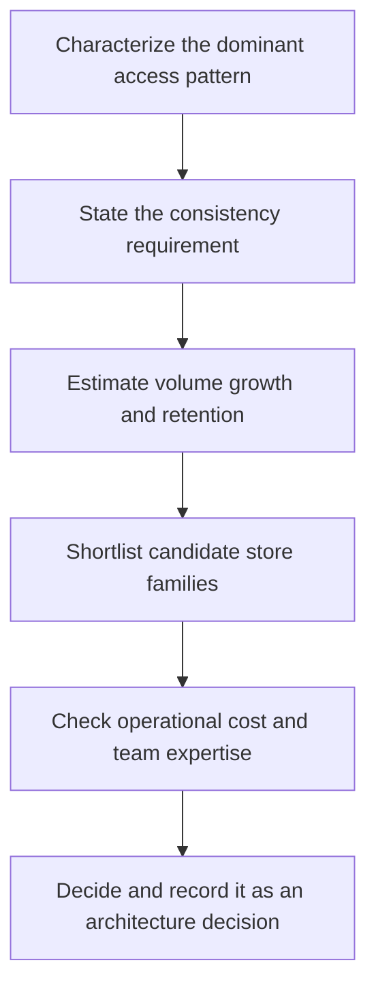

# Storage Selection and Polyglot Persistence

> **Core skill:** The architect selects data stores from access patterns, volume, consistency needs, and operational cost — holding a deliberate, bounded portfolio of persistence technologies rather than a default store plus drift.

## Why This Matters

Storage choices are the most expensive architectural decisions to reverse, because data has weight. Changing a store means migrating data, dual-writing during transition, backfilling history, cutting over consumers, and operating two systems in the meantime. A choice made from habit — or from novelty — locks in that cost for years, and the lock-in is paid not once but at every future migration attempt.

Different data genuinely has different shapes. Transaction records want ACID semantics and schema enforcement; telemetry wants append-heavy write throughput with time-bucketed reads; relationship-heavy domains want graph traversals; search wants inverted indexes; large media wants object storage with lifecycle tiering. Stretching one store across every shape serves none of them well, and the strain shows up as workarounds: hand-rolled indexes, transaction emulation, and query patterns the engine was never built for.

But polyglot persistence is a portfolio with carrying costs. Every technology added means expertise to maintain, backup and restore to prove, upgrades to schedule, monitoring to build, and a distinct set of failure modes to learn. The architect's discipline is twofold: choose each domain's store from explicit criteria, and bound the portfolio — a small, managed, owned set of technologies, each with a reason to exist and a plan to leave.

## The Store Types

| Store Type | Data Shape It Fits | Primary Strength | What It Costs You |
|------------|--------------------|------------------|-------------------|
| **Relational** | Entities with relationships and transactional invariants | ACID, constraints, mature tooling and skills | Write scaling; schema migrations across consumers |
| **Document** | Self-contained aggregates with nested structure | Flexible schema; natural mapping to application objects | Ad hoc query complexity; weak cross-document guarantees |
| **Key-value** | Lookup by a known key at high volume | Extreme throughput and predictable low latency | No lookup by value; access pattern is fixed at design time |
| **Graph** | Relationship-heavy traversals and path queries | Multi-hop questions answered in one traversal | Operational rarity; niche expertise; smaller ecosystems |
| **Columnar** | Analytical scans and aggregations over large history | Compression and scan throughput for analytics | Poor point updates; batch-oriented loading |
| **Time-series** | Metrics and events indexed by time | Retention policies and downsampling built in | Bounded query scope; specialized operations |
| **Search** | Full-text and faceted retrieval | Relevance ranking and text analysis | Consistency lag behind the source of truth |
| **Blob and object** | Large binary or immutable payloads | Cheap durable storage with lifecycle tiering | Not queryable; eventual consistency; access via reference |
| **Cache** | Hot subset of data near the consumer | Latency reduction at scale | Invalidation and staleness; never the source of truth |

## Selection Criteria Matrix

| Dominant Need | Lead Candidates | Avoid | Watch For |
|---------------|-----------------|-------|-----------|
| Transactional integrity across entities | Relational | Key-value, cache | Write scaling limits of a single primary |
| Aggregate reads and writes by identity | Document, key-value | Columnar | Query flexibility you will want later |
| Multi-hop relationship queries | Graph | Relational with deep joins at scale | Operational unfamiliarity |
| Analytics over large history | Columnar, warehouse | Row-store on the hot path | Load latency and update semantics |
| Time-ordered event and metric ingestion | Time-series | Relational without partitioning | Retention policy design from day one |
| Text search and relevance | Search engine | Database full-text for scale | Keeping the index consistent with the source |
| Large immutable payloads | Object storage | Databases holding blobs | References, permissions, lifecycle rules |
| Repeated hot reads of the same rows | Cache in front of a system of record | Cache as primary store | Invalidation strategy and hit-rate assumptions |

## Polyglot Persistence Discipline

Bounded polyglot works on explicit rules. State them; review the portfolio on a cadence; and treat each addition as a commitment to operate the technology for its full life.

| Rule | Rationale |
|------|-----------|
| Default to the relational store until a criterion deliberately fails it | The most familiar store is the cheapest to run; novelty needs a justification |
| One store per job class, not per team preference | Three ways to do caching is three sets of failure modes |
| Every store has a named owner, backup and restore test, and monitoring | A technology without an owner is an outage waiting for a date |
| Every store has a documented exit plan | Migrations are cheaper when the escape route was designed at adoption |
| Cross-store consistency is designed, not hoped for | Outbox patterns, sagas, and reconciliation jobs carry the guarantee |

## Choosing a Store



## Practical Applications

### Storage Selection Checklist

- [ ] Every domain's store choice cites its dominant access pattern and consistency requirement
- [ ] Volume, growth, and retention are estimated for each store, not guessed
- [ ] Every store in the portfolio has a named owner and a proven backup and restore
- [ ] Cross-store consistency mechanisms are designed where data is duplicated
- [ ] The portfolio is reviewed on a cadence; additions require retiring or justifying

### Storage Decision Record

```markdown
## Storage Decision Record — <domain>

| Field | Value |
|-------|-------|
| Dominant access pattern | Point lookups by order ID at 4K per second |
| Consistency requirement | Strong within an order; eventual across domains |
| Volume and growth | 200 GB, 15 percent per quarter; 7-year retention |
| Chosen store | Relational with partitioned history tables |
| Alternatives rejected | Key-value for query inflexibility; document for transactional gaps |
| Operational owner | Orders team with platform support |
| Exit plan | Logical replication to alternate engine; raw change log retained |
```

## Common Pitfalls

| Pitfall | Why It Is a Problem | Better Approach |
|---------|---------------------|-----------------|
| **Default-store stretch** | One engine used for every shape; workarounds accumulate silently | Match store family to access pattern; migrate the misfits deliberately |
| **Polyglot sprawl** | Every team adds its favorite technology; operations collapses under breadth | Bound the portfolio; additions require a decision record and an owner |
| **Consistency assumptions unexamined** | Eventual consistency discovered by consumers, not designed with them | State consistency per store and per flow; design cross-store guarantees |
| **Access-pattern blindness** | A store chosen from benchmarks, not from how the data will actually be read | Enumerate the top query patterns first; choose against them |
| **Operations cost unpriced** | Nobody asked who runs this at 03:00, or how it is backed up | Every choice carries an operational owner and a runbook |
| **No exit plan** | The first migration is also the first time anyone reads the vendor's limits | Record the exit path and export mechanism at adoption |

## Success Indicators

- Store choices trace to documented access patterns and consistency needs
- The persistence portfolio is enumerable on one page and has no orphan technologies
- Backup and restore tests pass for every store, on a schedule
- Migrations between stores are routine projects because exit paths exist
- Teams propose new stores with decision records, not pull requests

## Related Topics

- [[04_Data_Modeling_at_Architecture_Level]]
- [[06_Data_Lifecycle_and_Retention]]
- [[02_Quality_Attribute_Analysis/00_overview|Quality Attribute Analysis]]
- [[career-path/09_Data_and_ML_Engineer/00_overview|Data and ML Engineer]]

## Summary

Storage selection is an architecture decision made from criteria — dominant access pattern, consistency requirement, volume and growth, and operational cost — not from familiarity or fashion. Polyglot persistence lets each domain use the store that fits its data, but only when bounded: a small portfolio with named owners, proven backups, and documented exit plans, and with cross-store consistency designed rather than assumed. The cost of getting this wrong is paid in migrations that nobody wants to run.
