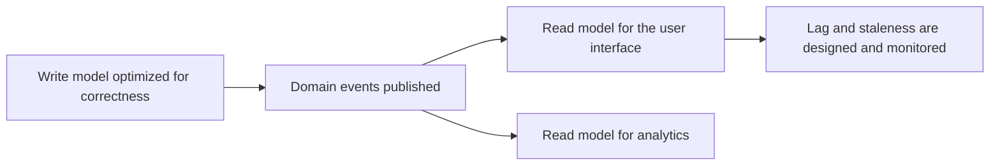

# Data Modeling at Architecture Level

> **Core skill:** The architect treats the conceptual data model — entities, relationships, cardinality — as an architecture artifact: aligned with the domain model, published as a cross-service contract, and allowed to diverge only deliberately where read and write needs differ.

## Why This Matters

The conceptual data model is the system's shared vocabulary made concrete. When it exists and is current, "customer" means one thing across services, reports, and conversations; when it is missing or stale, the word forks silently — the billing team's customer is a paying account, the support team's customer is a person, and every integration between them is a slow-motion accident. Semantic drift, not syntax, is what breaks integrations that were technically compatible.

Architecture-level modeling also fixes the relationship between the data model and the domain model. Entities belong to domains; relationships between entities become data flows between domains; cardinality decides what breaks at scale. The architect maintains this alignment because a data model that contradicts the domain model guarantees translation layers, duplicated logic, and reconciliation jobs that nobody can justify except by pointing at the contradiction.

Finally, the data model is a contract between services, and contracts need owners and version discipline. Where read and write needs genuinely differ, the architecture diverges the models deliberately — write models optimized for correctness, read models shaped for queries — but divergence must be derived from a single source of truth, never maintained as parallel realities.

## The Three Model Levels

| Level | Purpose | Audience | Typical Artifact | Changes When |
|-------|---------|----------|------------------|--------------|
| **Conceptual** | Shared vocabulary of entities and relationships | Business stakeholders, architects | One-page entity-relationship sketch per domain | Domain understanding changes |
| **Logical** | Structure without technology: attributes, keys, cardinality, constraints | Architects, engineers | Normalized model, contract definitions | Business rules change |
| **Physical** | Concrete schemas, types, indexes, partitions | Engineers, database specialists | DDL, migrations, storage configuration | Technology or performance needs change |

The architect owns the first two and reviews the third. Confusing the levels is how physical details — a table name, an index — become entrenched business vocabulary that survives long after the schema that justified it.

## Conceptual Models as Architecture Artifacts

| Model Element | Architecture Question It Answers |
|---------------|----------------------------------|
| **Entity** | Which domain owns this concept, and who answers for its quality? |
| **Relationship** | Which flows carry this connection between domains, in which direction? |
| **Cardinality** | What happens at scale — does one row become millions, or does a join become a fan-out? |
| **Lifecycle states** | Where do retention, archival, and deletion apply to this entity? |
| **Identity** | What makes an instance unique, and is that identity stable over time? |

Keeping the model at one page per domain forces the decisions that matter and avoids the trap of a single enterprise diagram that is always wrong. Annotations for ownership, classification, and lifecycle turn the sketch into an architecture artifact rather than a drawing.

## The Data Model as Cross-Service Contract

| Contract Element | Why It Matters | Failure Without It |
|------------------|----------------|--------------------|
| **Entity identity** | Consumers join and reference entities by a stable key | Identity churn breaks referential links silently |
| **Field semantics** | Meaning, units, enumerations, nullability are part of the interface | Values interpreted differently across consumers |
| **Ownership and change process** | Someone may change the model, with notice to consumers | Breaking changes arrive as incidents |
| **Versioning rules** | Compatibility expectations are stated and tested | Consumers pinned to versions nobody tracks |
| **Lifecycle signals** | Deletions and corrections propagate by agreement | Ghost data accumulates in consumer copies |

## When Models Diverge

Read and write needs pull the model in different directions. The write model wants normalization, invariants, and strict validation; the read model wants denormalized shapes that answer specific queries without joins. CQRS and event-carried state transfer make this divergence an architecture pattern rather than a mess — provided the read models are derived from the write model through a designed flow.

| Model | Optimized For | Integrity Discipline | Update Path |
|-------|---------------|----------------------|-------------|
| **Write model** | Correctness of commands and invariants | Strong constraints; single writer per fact | Direct, transactional |
| **Read model** | Query shape and latency | Derived data; rebuildable at any time | Asynchronous projection from events or change capture |



## Practical Applications

### Data Modeling Checklist

- [ ] Every domain has a one-page conceptual model with entity owners annotated
- [ ] Domain model and data model use the same names for the same concepts
- [ ] Cross-service interfaces name the entities, identity rules, and version expectations
- [ ] Read model divergence is derived through a designed flow, never maintained in parallel
- [ ] Cardinality changes that would break joins or flows are reviewed before they ship

### Conceptual Model Snapshot

```markdown
## Conceptual Model — <domain> — <date>

| Entity | Owner | Identity | Cardinality Notes | Lifecycle | Classification |
|--------|-------|----------|-------------------|-----------|----------------|
| Customer | Customer team | customer_id, stable | 1 to many orders | Retained 7 years after closure | Personal data |
| Order | Ordering team | order_id, stable | Many lines; many orders per customer | Archived after 24 months | Commercial |
| Invoice | Billing team | invoice_id, stable | 1 per order | Retained 7 years | Financial |
```

## Common Pitfalls

| Pitfall | Why It Is a Problem | Better Approach |
|---------|---------------------|-----------------|
| **Model as database diagram only** | The conversation becomes physical before the concepts are agreed | Keep a conceptual artifact; hold physical detail for the logical level |
| **Vocabulary drift** | The same term means different things per team; integrations misfire | One shared vocabulary, reviewed when domains change |
| **Model without an owner** | No one is accountable for coherence across changes | Every entity names an owning domain in the model itself |
| **Copy models as separate truths** | Read models evolve independently; reconciliation never converges | Derive read models through a designed flow; make them rebuildable |
| **Cardinality ignored** | A 1 to 1 assumption becomes a fan-out at scale and breaks flows | Review cardinality changes as architecture changes |
| **Premature normalization debates** | Modeling sessions stall on technology details nobody needs yet | Separate conceptual agreement from logical design explicitly |

## Success Indicators

- Cross-team conversations resolve "what is a customer" with a shared artifact, not a meeting
- Interface changes cite the conceptual model as their source of truth
- Read models can be rebuilt from the write model on demand
- New services map their data to the existing domain vocabulary at design review
- Cardinality and lifecycle annotations are current for every core entity

## Related Topics

- [[01_Data_Domains_and_Ownership]]
- [[02_Data_Flow_Architecture]]
- [[03_Architecture_Description_and_Views/00_overview|Architecture Description and Views]]
- [[career-path/09_Data_and_ML_Engineer/00_overview|Data and ML Engineer]]

## Summary

Data modeling at architecture level means treating the conceptual model as a maintained artifact: one shared vocabulary aligned with the domain model, entities with owners, relationships that become data flows, and cardinality that predicts scale behavior. The model doubles as the cross-service contract — identity, semantics, versioning, lifecycle — and where read and write needs diverge, the divergence is a designed, derived pattern such as CQRS rather than parallel truths drifting apart.
