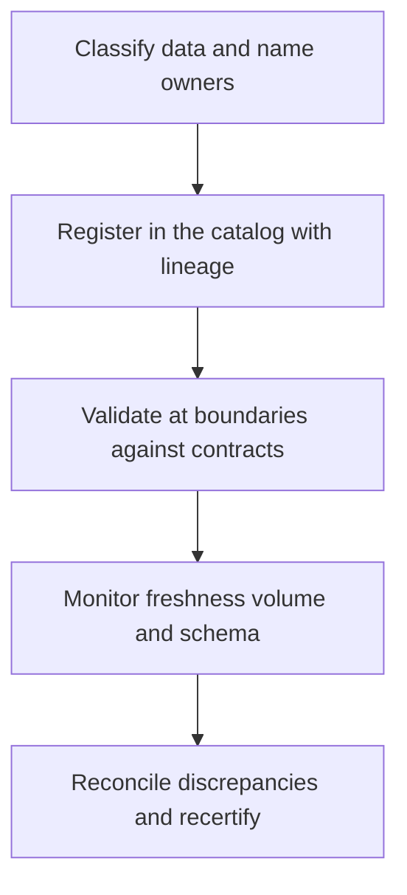

# Data Quality and Governance Architecture

> **Core skill:** The architect designs quality gates and governance structure into the data layer — validation at boundaries, schema enforcement, catalog, lineage, and ownership — so that quality is a property of the architecture rather than a recurring cleanup campaign.

## Why This Matters

Data quality fails at the seams. Each handoff between systems is a place where validation is assumed to have happened elsewhere, where a schema quietly changed, or where a required field became optional in practice. An architecture that names those seams and puts a gate at each one produces quality structurally; an architecture that does not produces quality through heroics — periodic audits, reconciliation scripts, and analysts comparing spreadsheets to find the truth.

Governance is too often imagined as a committee. At architecture level it is a structure: a catalog that says what exists and who owns it, lineage that says where data came from and what depends on it, policy that says how it is classified and protected, and named owners who answer when it is wrong. These are design decisions about the system, not meeting minutes, and they are what make the difference between a data asset and a data liability.

Master data management sits on the same structural question: where does the golden record live, and how do divergent copies reconcile? The architect decides among registry, consolidation, coexistence, and central patterns because the choice determines write paths, reconciliation jobs, and which system is allowed to say what a customer is.

## Quality Dimensions and Architectural Mechanisms

| Dimension | Failure Mode | Architectural Mechanism |
|-----------|--------------|------------------------|
| **Accuracy** | Wrong values enter and propagate | Validation at ingress against the contract; source verification where stakes justify |
| **Completeness** | Required fields or records are missing | Schema enforcement; record-count reconciliation between producer and consumer |
| **Timeliness** | Stale data consumed as if fresh | Freshness monitoring per flow; watermark and latency contracts |
| **Consistency** | The same fact differs between copies | Single writer per fact; reconciliation jobs; master data discipline |
| **Uniqueness** | Duplicate entities inflate every count | Identity rules at boundaries; deterministic deduplication keys |
| **Validity** | Values violate stated rules or enumerations | Constraint checks at the gate; quarantine instead of silent drop |

## Validation at Boundaries

Quality gates belong at boundaries because that is where the architecture controls the transition. The rule is validate once, at the point where data comes under the system's control — and never rely on the claim that it was validated upstream. Contract tests in the pipeline verify that producers keep their promises before consumers are affected.

| Boundary | Gate | Mechanism | Owner |
|----------|------|-----------|-------|
| External to internal ingress | Structural and rule validation | Schema validation, range and enumeration checks | Ingesting domain |
| Domain to domain | Contract conformance | Event and extract schemas; compatibility tests in CI | Producing domain |
| Operational to analytical | Semantics and completeness | Freshness and volume checks; definition sign-off | Analytics owner |
| Any to quarantine | Bad data containment | Dead-letter store with alerting and triage | Ingesting domain |

## Governance as Architecture Structure

| Structure | What It Provides | Architecture Form |
|-----------|------------------|-------------------|
| **Catalog** | What data exists, what it means, who owns it | Metadata registry with owners, descriptions, classification |
| **Lineage** | Provenance and impact analysis | Flow annotations with automated extraction where possible |
| **Ownership** | Accountability for quality and change | Domain register; publication requires a named owner |
| **Classification and policy** | Handling rules by sensitivity | Classification scheme mapped to access and retention policy |
| **Stewardship** | Day-to-day curation and review | Named stewards per domain with a review cadence |

## Master Data Management at Architecture Level

| Pattern | How It Works | Fits When | Cost |
|---------|--------------|-----------|------|
| **Registry** | A central index points to systems of record; no data is copied | Fragmented sources; a fast, low-intrusion start | Consumers still resolve and reconcile themselves |
| **Consolidation** | Copies are merged into a central store for a consistent view | Analytics-grade consistency across messy sources | Matching complexity; lag from sources |
| **Coexistence** | A central golden record exists; local writes are tolerated and reconciled | Phased unification of overlapping systems | Reconciliation discipline forever |
| **Central transactional** | One system of record owns writes; others read | Greenfield or cleanly separable domains | Migration cost for anything legacy |

## Governance Structure Flow



## Practical Applications

### Data Quality and Governance Checklist

- [ ] Every handoff between systems has a named gate with an owner
- [ ] Contract tests in the pipeline prove producers conform before consumers are affected
- [ ] Every published dataset appears in the catalog with an owner and classification
- [ ] Freshness and volume are monitored per flow, with alerts that have owners
- [ ] The master data pattern per shared entity is chosen and documented

### Data Quality Gate Register

```markdown
## Data Quality Gate Register

| Gate | Between | Checks | Threshold | On Failure | Owner |
|------|---------|--------|-----------|------------|-------|
| Ingest validation | Partners to platform | Schema, enums, ranges | 100 percent conformance | Quarantine plus alert | Ingest domain |
| Order events | Orders to analytics | Volume, freshness | 99 percent within 10 minutes | Alert; serve last good | Orders team |
| Customer merge | Sources to master | Match confidence rules | Auto-merge above threshold | Manual review queue | Customer team |
```

## Common Pitfalls

| Pitfall | Why It Is a Problem | Better Approach |
|---------|---------------------|-----------------|
| **Quality as cleanup** | Audits find errors after consumers already acted on them | Gates at boundaries; containment before propagation |
| **Validation assumed upstream** | Each system believes the last one checked; nothing was checked | Validate once, explicitly, at each boundary the architecture controls |
| **Governance as committee** | Meetings produce policies; the system changes nothing | Governance expressed as catalog, lineage, ownership, and automated checks |
| **Catalog as graveyard** | Metadata is entered once and decays; nobody trusts it | Ownership includes catalog currency; reviews have dates |
| **Golden record unowned** | Everyone writes what they believe; reconciliation never converges | Choose an MDM pattern; make the golden record's owner explicit |
| **Metric without action** | Quality dashboards exist; no one is paged and nothing is fixed | Every check has a threshold, an owner, and a defined response |

## Success Indicators

- Data incidents are contained at gates rather than discovered by consumers
- The catalog answers what exists and who owns it without asking a person
- Producers test contracts in CI; breaking changes are caught before release
- Every shared entity has a documented master data pattern and reconciliation path
- Quality checks have owners and thresholds, and alerts lead to action

## Related Topics

- [[01_Data_Domains_and_Ownership]]
- [[06_Data_Lifecycle_and_Retention]]
- [[04_Architecture_Evaluation_and_Trade_Offs/00_overview|Architecture Evaluation and Trade Offs]]
- [[career-path/09_Data_and_ML_Engineer/00_overview|Data and ML Engineer]]

## Summary

Data quality and governance are designed into the architecture or not at all: validation gates at every boundary, schema enforcement and contract tests where domains meet, and a governance structure of catalog, lineage, ownership, classification, and stewardship that makes accountability operational rather than aspirational. Master data management is the same discipline applied to shared entities — a chosen pattern, an owned golden record, and reconciliation that converges. Quality that depends on periodic cleanup is a symptom; quality that depends on structure is a design.
