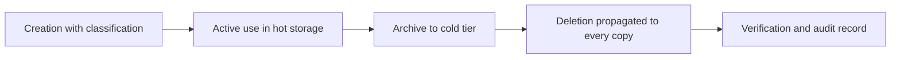

# Data Lifecycle and Retention

> **Core skill:** The architect designs creation, active use, archive, and deletion into the data flows — making retention policy structural, right-to-deletion enforceable across every copy, and retention cost visible before it compounds.

## Why This Matters

Data accumulates by default; deletion must be designed. A system without lifecycle design keeps everything — not because anyone decided to, but because nothing said not to. Storage grows linearly with time, risk grows faster than storage (old data has more copies and weaker controls), and compliance exposure grows quietly in the background. Retention is one of the few architectural properties that gets worse the longer it is ignored.

The right to deletion turns lifecycle from a cost concern into a hard architectural constraint. The difficult part is never the primary-store delete; it is the copies. Caches hold records past their TTL, read models rebuilt from events resurrect them, analytics stores never received the deletion, event streams replay history as if nothing happened, and backups faithfully preserve everything. Enforceable deletion is a propagation problem solved in the architecture: a data inventory, a deletion flow, and per-copy mechanisms that can prove completion.

Backup and recovery are part of the same story, not a separate discipline. A backup that cannot be restored within the required window is a belief, not a control; a backup outside the retention policy is data that never expires. The architect designs the lifecycle end to end — creation to deletion, with recovery in between — because each stage's decisions constrain the others.

## The Lifecycle Stages

| Stage | What Happens | Architecture Concerns | Design Levers |
|-------|--------------|----------------------|---------------|
| **Creation** | Data enters the system | Classification, minimization, purpose | Classify at ingress; collect only what has a stated purpose |
| **Active use** | Services read, write, and update | Performance, hot storage cost, access policy | Tiering, caching, access scoping, TTL choices |
| **Archive** | Rare access, retained for obligation or history | Retrieval path, format longevity, searchability | Cold storage classes, compression, archive index |
| **Deletion** | End of life, on schedule or on request | Propagation to every copy, verification, evidence | Deletion flow with per-store confirmation; cryptographic erasure where physical is impossible |
| **Backup and restore** | Recovery copies retained for resilience | RPO and RTO, immutability, deletion interaction | Backup cadence and windows; restore drills; documented deletion policy for backups |

## Retention Policies Designed into Flow

Retention is a property of the flow, not a note in a policy document. Every dataset answers three questions at design time: how long it is kept, what mechanism enforces that, and what happens at expiry. Enforcement lives at the store level — object lifecycle rules, table TTLs, partition drops — and at the flow level, so that derived copies inherit or restate the retention of their source. A retention period with no enforcing mechanism is a hope; a mechanism with no assigned period is an accident waiting to be discovered by audit.

| Policy Element | Example | Where It Lives |
|----------------|---------|----------------|
| Retention period per class | Orders 7 years; telemetry 13 months; logs 90 days | Data architecture record per dataset |
| Enforcing mechanism | Lifecycle rule, scheduled purge job, partition drop | Store configuration plus pipeline step |
| Expiry behavior | Delete, anonymize, aggregate into history | Documented per dataset |
| Exception path | Legal hold overrides deletion | Named process with owner and evidence |

## Right to Deletion as an Architecture Constraint

| Copy Type | Why It Survives Deletion | Architectural Response |
|-----------|--------------------------|------------------------|
| **Caches** | TTL outlasts the deletion; hot keys persist | Invalidate on deletion events; short TTLs for personal data |
| **Read models and projections** | Rebuilt from event history that still contains the record | Deletion events consumed by every projection; rebuildable state derived after purge |
| **Backups** | Point-in-time copies captured before the deletion | Windowed retention; deletion effective at window expiry; policy documented and consistent |
| **Analytics stores** | Loaded before the request and unlinked to the operational record | Pseudonymization at load time so records become unlinkable; identifiers excluded |
| **Event streams** | Immutable log semantics; replay resurrects deleted data | Tombstone events; compaction windows; consumer rules for handling tombstones |
| **Logs and traces** | Broad capture for observability | Minimize personal data in logs; short retention for anything sensitive |

## Backup and Recovery Architecture

| Decision | Options | What Drives the Choice |
|----------|---------|------------------------|
| Backup cadence | Continuous log shipping versus periodic snapshots | RPO the business will fund |
| Retention of backups | Short rolling window versus long-term archive | Deletion policy consistency and storage cost |
| Immutability | Mutable backups versus write-once retention | Ransomware and tamper resistance requirements |
| Restore testing | Untested versus regularly drilled | Only drilled restores are controls; the rest are claims |
| Geography | Same-region versus cross-region copies | Residency constraints and disaster scenarios pull in opposite directions |

## The Lifecycle Flow



## Practical Applications

### Data Lifecycle Checklist

- [ ] Every dataset has a stated retention period and an enforcing mechanism
- [ ] The data inventory names every copy — cache, projection, warehouse, backup, log
- [ ] Deletion requests propagate to all copies with per-store confirmation
- [ ] Backup retention and the production deletion policy are consistent and documented
- [ ] Restore drills run on schedule and meet the stated recovery objectives

### Retention Schedule

```markdown
## Retention Schedule

| Dataset | Class | Retention | Enforced By | Expiry Behavior | Deletion Propagation | Owner |
|---------|-------|-----------|-------------|-----------------|----------------------|-------|
| Customer profile | Personal | Until closure plus 90 days | Scheduled purge plus cache invalidation | Hard delete across stores | Events to projections; backup window | Customer team |
| Order history | Commercial | 7 years | Partition drop | Aggregate into yearly summary | Primary plus warehouse | Orders team |
| Application logs | Operational | 90 days | Log store lifecycle rule | Delete | Not applicable; PII minimized | Platform |
| Analytics events | Pseudonymized | 25 months | Warehouse partition expiry | Delete | Rebuilt from pseudonymous source only | Analytics |
```

## Common Pitfalls

| Pitfall | Why It Is a Problem | Better Approach |
|---------|---------------------|-----------------|
| **Keep-everything default** | Nobody decided to retain forever; cost and exposure compound annually | Every dataset has a period and a mechanism; the default is expiry, not retention |
| **Deletion only in the primary store** | Copies resurrect data; the deletion is unenforceable in practice | Deletion propagation with per-copy confirmation and evidence |
| **Backups outside the policy** | Data deleted from production lives forever in an untracked vault | Align backup retention with the deletion policy; document the window |
| **Undocumented retention in flows** | Derived stores invent their own periods; nothing is consistent | Retention stated per flow; derived copies inherit or justify deviation |
| **Archive without a retrieval path** | The archive is really a deletion nobody told the business about | Design retrieval with the archive; test pulling a record back |
| **Retention chosen by storage price alone** | Compliance floors and legal holds ignored until audit | Set the floor from obligations; optimize cost within it |

## Success Indicators

- A deletion request completes with per-store evidence within the stated window
- Storage growth curves are explained by retention decisions, not by surprise
- Restore drills consistently meet the stated recovery objectives
- Every dataset's retention appears in both the schedule and an enforcing mechanism
- Auditors can trace from a regulation to a retention period to a purge record

## Related Topics

- [[03_Storage_Selection_and_Polyglot_Persistence]]
- [[05_Data_Quality_and_Governance_Architecture]]
- [[02_Quality_Attribute_Analysis/00_overview|Quality Attribute Analysis]]
- [[career-path/09_Data_and_ML_Engineer/00_overview|Data and ML Engineer]]

## Summary

Data lifecycle design makes retention and deletion properties of the architecture: creation with classification, use with tiering and TTLs, archive with a tested retrieval path, and deletion that propagates to every copy with evidence. The right to deletion is the forcing constraint — it turns the data inventory, the event stream, and the backup window into design problems. Backups join the same discipline, because recovery objectives and deletion promises must be consistent with each other, and both must be provable.
