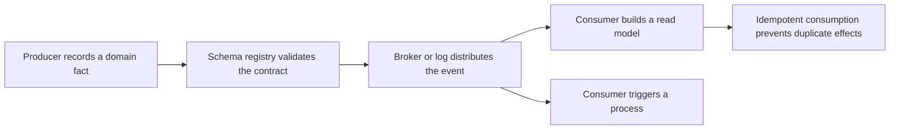

# Event and Messaging Architecture

> **Core skill:** The architect designs event-driven data flow deliberately — event types and their contracts, schema evolution governed by a registry, the messaging infrastructure that carries them, and the consistency model the system will actually have.

## Why This Matters

Events are the asynchronous backbone of data architecture. They carry facts between domains without synchronous coupling, feed read models and analytics, and trigger processes that would otherwise require fragile orchestration. But the moment an event is published, it becomes a public interface: producers can evolve around it, consumers cannot, and every schema decision is a promise made to unknown future readers.

The architecture decisions are therefore explicit ones: what is a domain event, an integration event, or a notification; how schemas evolve and who enforces compatibility; which messaging infrastructure carries the traffic and what delivery semantics it provides; whether the domain stores state or history; and what consistency the consumers actually experience. Defaulting into events — publishing whatever the ORM emitted, into whatever broker was already running — produces the familiar failure set: incompatible schemas discovered at 02:00, replay disasters, duplicated side effects, and consumers who believe at-least-once means exactly-once.

This note is the architect's view: event-driven design as a set of named decisions with contracts, ownership, and failure semantics, rather than an implementation detail of services that happen to talk asynchronously.

## Event Types

| Type | Definition | Schema Rigor | Consumers | Example |
|------|------------|--------------|-----------|---------|
| **Domain event** | A fact about the business within a bounded context, named in the past tense | High inside the domain; versioned if exported | In-domain handlers; projections | OrderPlaced with order ID and lines |
| **Integration event** | A deliberate publication across a domain boundary, contract-governed | Highest; registry enforced; compatibility tested | Other domains, partners | OrderShipped v2 for fulfillment and billing |
| **Notification event** | A signal that something changed, carrying a reference rather than full payload | Low; stable envelope; payload-agnostic | Broad consumers who fetch details | Catalog updated for item ID 8842 |

Commands are not events: a command is a request that can be rejected, an event is a fact that has already happened. Mixing the two — events that are secretly commands — reintroduces the coupling events were adopted to remove.

## Event Schema Design and Versioning

| Change Type | Example | Compatibility | Rule |
|-------------|---------|---------------|------|
| Additive optional field | Adding a discount field | Backward compatible | Consumers must ignore unknown fields by default |
| Field removal | Dropping a deprecated field | Breaking | Version the event or observe a deprecation window with dual publication |
| Type or semantic change | Amount becomes a minor-unit integer | Breaking even if the type name stays | New version or new event type; never redefine meaning in place |
| Enumeration addition | Adding a new payment method | Depends on consumer discipline | Consumers must tolerate unknown values without crashing |

Design rules that pay for themselves: schema first, before the first message is emitted; events state facts and carry the data consumers need rather than pointers to mutable state; events are immutable once published; and version identity is explicit in the event envelope, not inferred from shape.

## Schema Registry as Architecture Component

The schema registry is a structural gate, not a wiki page. Producers register schemas before publication; the registry checks compatibility against the policy; consumers resolve schemas by identity; and CI fails the build when a proposed change violates the contract. Its placement matters — between producer and broker — because that is the point where the system can still refuse an incompatible change cheaply. A registry that is not on the critical path is documentation; one that blocks incompatible publishes is control.

## Messaging Infrastructure Choices

| Platform Style | Model | Ordering and Delivery | Retention | Fit |
|----------------|-------|----------------------|-----------|-----|
| Log-based (Kafka style) | Partitioned append-only log | Ordered per partition; consumer-managed offsets | Replayable, days to forever | Event backbone, high throughput, replay |
| Broker queues (RabbitMQ style) | Queues with routing and acknowledgements | Per-queue; consumed then gone | Until acknowledged | Task distribution, rich routing, work queues |
| Cloud queues (SQS style) | Managed point-to-point queue | Standard unordered or FIFO | Days, then gone | Simple decoupling, retry, buffering |
| Cloud pub-sub (SNS and Event Grid style) | Topic fan-out to subscribers | Best effort per topic; FIFO variants | Short, delivery-oriented | Notifications, fan-out, serverless triggers |
| Managed event bus (EventBridge style) | Rule-based routing between producers and consumers | Best effort; archive options | Configurable archive | SaaS integration, cross-account routing, governance |

## Event Sourcing as an Architectural Decision

Event sourcing stores the sequence of events as the system of record, with state as a derived projection. It is a fit when history is the product — ledgers, audit-critical domains, temporal queries — and a liability when it is adopted for CRUD that merely wants decoupling.

| Aspect | Event Sourcing | State-Store with Event Publication |
|--------|----------------|-----------------------------------|
| System of record | The event log | Current-state tables |
| History queries | Native | Requires separate audit or change capture |
| Schema evolution | Applies to stored history; upcasting needed | Applies to live schema only |
| Rebuild | Replay from origin | Projections rebuilt from published events |
| Operational burden | Snapshots, compaction, replay tooling, schema governance | Familiar database operations |

## The Event Flow



## Practical Applications

### Event Architecture Checklist

- [ ] Every published event is classified as domain, integration, or notification, with the right rigor attached
- [ ] Schemas are registered and compatibility-checked in CI before publication
- [ ] Delivery semantics are stated per topic or queue, and consumers are idempotent accordingly
- [ ] Ordering guarantees are documented per stream, and consumers depend on no stronger truth
- [ ] The consistency model — lag, read-your-writes handling, compensation — is designed and communicated

### Event Contract Template

```markdown
## Event Contract — OrderShipped v2

| Field | Value |
|-------|-------|
| Type | Integration event |
| Producer domain | Fulfillment |
| Payload | order_id, shipment_id, carrier, shipped_at |
| Ordering guarantee | Per order partition |
| Delivery semantics | At least once; consumers deduplicate by event ID |
| Compatibility policy | Backward compatible additions only within v2 |
| Consumers | Billing, notifications, analytics |
| Schema registry reference | order-shipped, version 2 |
```

## Common Pitfalls

| Pitfall | Why It Is a Problem | Better Approach |
|---------|---------------------|-----------------|
| **Events as RPC** | Request-reply semantics over a broker rebuild the coupling in a slower form | Commands for requests; events for facts; accept the async model fully |
| **Schema as afterthought** | The first consumer discovers the contract by parsing production payloads | Schema first; registry enforced; compatibility tested in CI |
| **Exactly-once belief** | Side effects duplicate silently on retry | Assume at-least-once; idempotency keys and dedupe stores on consumers |
| **Fat event syndrome** | Full state blobs couple consumers to producer internals | Carry the fields consumers need; reference detail by identity |
| **Replay never tested** | Recovery from the log is theoretical until the day it is needed | Exercise replay and rebuild paths before incidents, not during |
| **Event sourcing for CRUD** | The log becomes a slow, complex database with no history requirement | Event sourcing only where the history is the product |

## Success Indicators

- Every published event has an owner, a registry entry, and a stated compatibility policy
- Consumers survive producer additions and unknown enumeration values without incident
- Replay and projection rebuilds are routine operations with runbooks
- Delivery and ordering guarantees are documented per stream and referenced in consumer design
- New integrations use existing event contracts or negotiate new ones through the registry

## Related Topics

- [[01_Data_Domains_and_Ownership]]
- [[02_Data_Flow_Architecture]]
- [[02_Quality_Attribute_Analysis/00_overview|Quality Attribute Analysis]]
- [[career-path/09_Data_and_ML_Engineer/00_overview|Data and ML Engineer]]

## Summary

Event-driven architecture is a set of decisions made deliberately: which events are domain facts, integration contracts, or notifications; how schemas evolve under registry-enforced compatibility; which platform carries which traffic with which delivery guarantees; whether history itself is the system of record; and what consistency consumers actually get. The contract discipline — schema first, immutable facts, idempotent consumers, tested replay — is what keeps an event backbone from becoming an unmanageable public interface. The architect owns those decisions because the events outlive the services that publish them.
