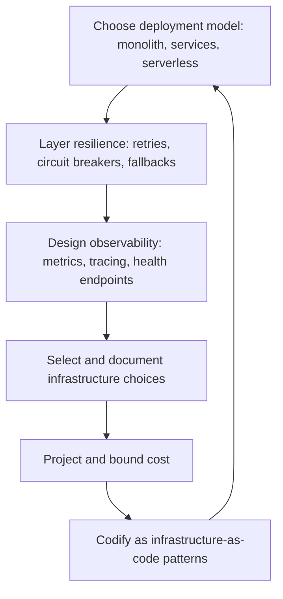

# Operations and Infrastructure Architecture

> **Core capability:** The architect designs deployment, resilience, and observability into the system structure — ensuring the architecture supports how the system runs, not just how it is built.

## Why This Matters

An architecture that cannot be deployed is a diagram. An architecture that cannot be observed is a mystery in production. The operations layer is not a separate concern handled by the platform team — it is a structural property of the architecture: deployment topology, resilience mechanisms, observability surfaces, and the infrastructure assumptions that shape every component.

The software architect does not manage infrastructure or run production. That depth lives in the SRE and Platform Engineer path (07). The architect's contribution is design: deployment models as architecture views, resilience patterns as structural choices, observability as architecture-level quality attributes, and infrastructure decisions recorded as ADRs — so that operations are designed, not inherited.

## Topics in This Capability Area

| Topic | Core Skill | When It Matters |
|-------|------------|-----------------|
| [[01_Deployment_Architecture]] | Designing deployment topologies and release strategies | New systems; cloud migration |
| [[02_Resilience_Architecture]] | Structural resilience: circuit breakers, bulkheads, graceful degradation | High-availability systems |
| [[03_Observability_Architecture]] | Designing observability surfaces: metrics, traces, logs at structure level | Every production system |
| [[04_Cloud_and_Infrastructure_Architecture]] | Choosing and composing cloud services as architecture decisions | Cloud-native; multi-cloud |
| [[05_Network_Architecture_for_Applications]] | Architecture-level networking: gateways, meshes, connectivity | Distributed systems; security boundaries |
| [[06_Infrastructure_as_Code_Architecture]] | IaC as an architectural concern: patterns, environments, immutability | CI/CD; platform engineering |
| [[07_Cost_and_Capacity_Architecture]] | Designing for cost — capacity planning, elastic scaling, FinOps awareness | Cloud cost growth; budget pressure |

## Deployment Meets Architecture

Operations architecture starts at the deployment model and cascades through every structural decision.

## Architect vs SRE and Platform Engineer

| Activity | Software Architect | SRE and Platform Engineer (Path 07) |
|----------|-------------------|--------------------------------------|
| Deployment | Designs the deployment model and topology | Implements deployment pipelines and progressive delivery |
| Resilience | Chooses structural resilience patterns | Operates resilience — chaos engineering, incident response |
| Observability | Designs observability as architecture surface | Implements dashboards, alerts, and observability tooling |
| Infrastructure | Chooses cloud services as architecture decisions | Manages infrastructure lifecycle, cost, and scaling |
| Capacity | Designs for scaling — the architecture-level decision | Capacity planning, auto-scaling, and resource management |

## Practical Applications

### Operations Architecture Checklist

- [ ] Deployment topology is an architecture view: components mapped to hosts, regions, environments
- [ ] Resilience patterns are chosen at the architecture level (circuit breaker, bulkhead, retry policy)
- [ ] Observability surfaces are designed: what is measured, traced, and logged at each boundary
- [ ] Infrastructure choices are recorded as architecture decisions with rationale
- [ ] Cost dimensions are projected and bounded for the architectural choices made

## Common Pitfalls

| Pitfall | Why It Is a Problem | Better Approach |
|---------|---------------------|-----------------|
| **Deployment-as-afterthought** | Architecture designed without deployment model — impossible to ship | Deployability as a quality attribute scenario |
| **Resilience-by-platform-only** | The platform retries, but the architecture is brittle underneath | Structural resilience — not just infrastructure resilience |
| **Observability-as-metrics-dump** | Thousands of metrics, no architecture-level health model | Define observability at architecture boundaries |
| **Cloud-native cargo cult** | Microservices and serverless applied without deployment model reasoning | Justify each infrastructure choice against architecture drivers |

## Success Indicators

- Deployment topology is a maintained architecture view — not tribal knowledge
- Resilience patterns are named and justified in ADRs
- Architecture-level observability tells you the system's health from outside any individual service
- Infrastructure choices are justified against the system's deployment model and cost constraints

## Related Capabilities

- [[02_Quality_Attribute_Analysis/00_overview|Quality Attribute Analysis]]: deployability and resilience as quality attribute scenarios
- [[04_Architecture_Evaluation_and_Trade_Offs/00_overview|Architecture Evaluation and Trade Offs]]: evaluating operations architecture
- [[career-path/07_SRE_and_Platform_Engineer/00_overview|SRE and Platform Engineer]]: the specialist depth path
- [[15_Solutions_and_Enterprise_Architect/00_overview|Solutions and Enterprise Architect]]: enterprise-level infrastructure governance (future path)

## Summary

Operations architecture means designing the deployment model, resilience patterns, observability surface, and infrastructure choices into the system structure — not bolting them on after. The architect draws the topology and chooses the patterns; the SRE and platform team run and refine the result. The system that cannot be deployed or observed is not architected.