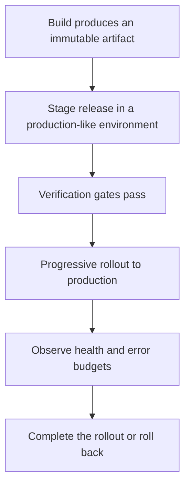

# Deployment Architecture

> **Core skill:** The architect designs the deployment topology — how components map to hosts, regions, and environments, how releases reach production, and who deploys what — and treats deployability as a quality attribute scenario rather than an operations afterthought.

## Why This Matters

An architecture that cannot be deployed is a diagram. The deployment model is not a packaging detail decided at the end; it shapes scaling granularity, failure boundaries, release cadence, and which organizational structures can own the system. A monolith deploys and fails as one unit; microservices scale and degrade per service; serverless trades operational attention for platform constraints; event-driven systems decouple deployment timing from consumption. Each model buys something and pays for it, and the payment always shows up in operations.

Environments and promotion paths are part of the same design. How changes travel from development to a production-like stage to production, what gates stand between them, where environment parity matters and where deliberate difference is correct — these determine whether releases are routine or events. A production environment that has never been rehearsed at staging scale is not a tested system; it is an untested one that happens to be running.

The architect owns the deployment view and the deployability scenarios attached to it: components mapped to runtime hosts and regions, drawn as a maintained view; release strategies chosen for the topology; and responsibilities made explicit — who deploys what, who can promote, who is paged. Deployability designed in advance is what makes the difference between shipping on a Tuesday afternoon and shipping only during a maintenance window.

## Deployment Models

| Model | Unit of Deploy | Scaling Granularity | Failure Boundary | Fit |
|-------|----------------|---------------------|------------------|-----|
| **Monolith** | The whole application | Uniform; scale everything together | Whole system | Small teams, simple operations, strong consistency |
| **N-tier** | Each tier separately | Per tier | Per tier | Classic enterprise structures; separated presentation, logic, and data |
| **Microservices** | One service | Per service | Per service | Independent team ownership and scaling; demands operational maturity |
| **Serverless** | Function or handler | Per function concurrency | Per function | Bursty workloads, event handlers, glue logic |
| **Event-driven** | Consumer groups and processors | Per processor | Per processor and broker | Asynchronous pipelines; decoupled release cadence |

## Environments and Promotion Paths

| Environment | Purpose | Data | Gate to the Next Stage |
|-------------|---------|------|------------------------|
| **Development** | Fast feedback for authors | Synthetic, disposable | Automated tests and review pass |
| **Ephemeral preview** | Per-change verification in a realistic context | Synthetic | Automated checks and reviewer sign-off |
| **Staging** | Integration truth at production-like configuration | Anonymized or synthetic at scale | Integration, performance, and security gates pass |
| **Production** | Real users, real data | Real | Progressive rollout with health gates and rollback armed |

Parity where it matters — configuration shape, topology, runtime versions, dependency versions — and deliberate difference where it must: scale, data, and cost. Every undocumented difference between staging and production is a class of bugs that only exists in production.

## The Deployment View

The deployment view maps architectural elements to their runtime homes: which component runs where, in which region, behind which gateway, with which scaling group. It is the view most requested by operations, security, and finance — and the most frequently out of date. Keeping it current is an architectural obligation, because every other view assumes it is true.



## Deployability as a Quality Attribute Scenario

Deployability is expressed like any other quality attribute — source, stimulus, artifact, environment, response, response measure — and it is testable.

| Element | Example |
|---------|---------|
| Source | A developer delivering a change |
| Stimulus | The change enters the deployment pipeline |
| Artifact | The running system in production |
| Environment | Normal operation under real load |
| Response | The release completes without service interruption |
| Response Measure | Within 30 minutes, error rate under 0.1 percent, rollback possible within 5 minutes |

Scenarios like this turn deployment from an aspiration into an acceptance criterion the pipeline and topology must satisfy.

## Who Deploys What

| Role | Responsibility |
|------|----------------|
| **Architect** | Deployment topology, deployability scenarios, topology-level decisions as ADRs |
| **Platform team** | Pipelines, environments, rollout tooling, promotion mechanics |
| **Service team** | Owns its service's deploy configuration and triggers its releases |
| **Operations and SRE** | On-call, capacity, incident response, operational feedback into the design |

## Practical Applications

### Deployment Architecture Checklist

- [ ] The deployment model is chosen against quality attributes and team structure, recorded as a decision
- [ ] The deployment view is maintained and shows components, hosts, regions, and scaling units
- [ ] At least one deployability scenario exists with a measurable response
- [ ] Environment parity is documented, including deliberate differences
- [ ] Deployment responsibility is explicit per component: who deploys, who promotes, who is paged

### Deployment View Record

```markdown
## Deployment View Record

| Component | Runtime | Region and Zone | Scaling Unit | Deploy Trigger | Owner |
|-----------|---------|-----------------|--------------|----------------|-------|
| Storefront API | Container on managed cluster | Primary region, two zones | Pod replica set | Pipeline on merge | Storefront team |
| Order processor | Container on managed cluster | Primary region, two zones | Consumer group workers | Pipeline on merge | Orders team |
| Thumbnail service | Managed functions | Primary region | Function concurrency | Pipeline on merge | Media team |
| Primary database | Managed relational, multi-zone standby | Primary region, standby in secondary | Vertical plus read replicas | Controlled migration job | Platform |
```

## Common Pitfalls

| Pitfall | Why It Is a Problem | Better Approach |
|---------|---------------------|-----------------|
| **Deployment as an afterthought** | The architecture assumes a topology it cannot actually be deployed into | Deployability as a quality attribute scenario from the first design |
| **Environment drift** | Staging and production differ quietly; bugs are production-only | Parity by default; every difference documented and justified |
| **Snowflake production** | Production is hand-built and irreproducible; nobody dares change it | Immutable, reproducible environments built from code |
| **Big-bang releases** | One colossal deploy maximizes risk and minimizes learning | Progressive rollout with health gates and fast rollback |
| **Ownership ambiguity** | Nobody knows who deploys what; releases wait on heroes | Responsibility per component in the deployment view |
| **Topology by politics** | Conway's Law decides the structure; quality attributes are ignored | Choose the model against scenarios; reorganize deliberately if needed |

## Success Indicators

- Releases are routine: the deployability scenario holds under real load
- The deployment view matches reality when operations checks it
- Environment differences are enumerated and small; production surprises are rare
- Rollbacks are exercised, timed, and known to work
- New services slot into the existing topology without bespoke deployment stories

## Related Topics

- [[02_Resilience_Architecture]]
- [[03_Observability_Architecture]]
- [[06_Infrastructure_as_Code_Architecture]]
- [[career-path/07_SRE_and_Platform_Engineer/00_overview|SRE and Platform Engineer]]

## Summary

Deployment architecture chooses the deployment model against quality attributes and team structure, maps components to runtime homes in a maintained deployment view, and defines promotion paths between environments with deliberate parity. Deployability is exercised like any quality attribute — with a measurable scenario — and responsibility is explicit: who deploys, who promotes, who is paged. The topology is designed, recorded, and kept true, because everything downstream of it, from resilience to cost, inherits its properties.
