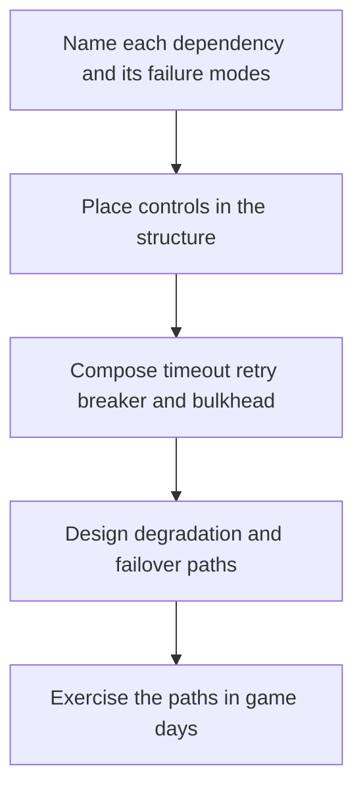

# Resilience Architecture

> **Core skill:** The architect chooses where resilience lives in the structure — timeouts, retries, circuit breakers, bulkheads, graceful degradation, failover — and records the resilience decisions so they survive implementation pressure.

## Why This Matters

Failure is normal, and resilience is what the architecture does about it. Distributed systems fail in partial, untidy ways: a dependency gets slow rather than down, a shared pool saturates under one tenant's traffic, a zone loses power while its neighbors carry on. The system's response to these modes is decided by where the controls sit in the topology — a retry loop in application code, a circuit breaker in the mesh, a bulkhead around a workload class — not by good intentions in a design document.

Resilience as a code pattern is fragile because it is invisible at the architecture level: each team implements its own retry policy, timeouts differ per client library, and the aggregate behavior under stress is nobody's design. Resilience as an architecture choice is placed, scoped, and owned: the platform provides consistent defaults for cross-cutting concerns, service owners tune within documented bounds, and deviations are recorded. What is not recorded drifts.

Every resilience control trades against something else. Retries add load to a struggling dependency; aggressive timeouts cancel legitimate slow operations; failover costs money and complicates consistency; degradation changes what the product does for real users. Those are quality attribute trade-offs, so they are made and recorded like any other architecture decision — with the failure mode addressed, the bounds chosen, and the owner named.

## The Resilience Pattern Catalog

| Pattern | Structural Placement | Failure It Contains | Misuse Cost |
|---------|----------------------|---------------------|-------------|
| **Timeout** | Every outbound call, at the interface | A hung dependency consuming threads and connections indefinitely | Too aggressive: cancels valid slow operations, creates false failures |
| **Retry with backoff** | Caller side, per dependency, with jitter | Transient failures that succeed on a second attempt | Retry storms that amplify an outage if unbounded or synchronized |
| **Circuit breaker** | Caller side, per dependency or dependency class | Repeated calls into a failing dependency; cascading latency | Premature trips; tuning half-open behavior is subtle |
| **Bulkhead** | Resource pool per workload, tenant, or dependency | One consumer exhausting capacity shared with everyone | Over-partitioning wastes capacity and multiplies pools to track |
| **Graceful degradation** | Feature-level fallback paths | Complete loss of one capability taking down a whole journey | Fallbacks that mislead users or serve dangerously stale data |
| **Failover** | Infrastructure level, across zones or regions | Loss of a zone, instance, or region | Cost and data consistency complexity; untested failover is a rumor |
| **Load shedding** | Ingress and gateways, with priority classes | Overload from legitimate traffic after capacity is gone | Shedding the wrong traffic; priorities decided too late |
| **Idempotency** | Write interfaces, via keys | Duplicate effects from retries and replays | Key storage and retention; not all operations are naturally idempotent |

## Resilience as Structure, Not Code

The placement decision is architectural. Cross-cutting controls — timeouts, retries, breaker defaults, transport-level shedding — belong in shared infrastructure where they are consistent and reviewable: gateways, service meshes, platform libraries. Semantic controls — what degradation means for a checkout, which operations tolerate retry — belong with the owning service, because only the domain knows the consequence. The split has an ownership rule: the platform owns the mechanism and its safe defaults; the service owner owns the bounds and the fallback semantics. Anything outside the documented bounds is a recorded deviation, not a local preference.

## Composing Patterns

Composition is where resilience works or fails. Every outbound call has a timeout; retries are bounded, jittered, and only where the operation is safe to repeat; breakers sit between callers and unhealthy dependencies; bulkheads keep one workload's flood from becoming everyone's outage; degradation paths are defined per user-facing capability with the product owner; failover is exercised, not assumed.



## The Resilience Decision Record

```markdown
## Resilience Decision — <dependency or capability>

| Field | Value |
|-------|-------|
| Dependency | Pricing service |
| Failure modes | Latency spikes; partial outage; full outage during release |
| Controls placed | 800 ms timeout; two retries with jitter; breaker after 20 percent errors; cached prices as fallback |
| Bounds rationale | Timeout derived from p99 under load; retry budget fits caller latency budget |
| Degraded behavior | Serve last-known prices with a freshness marker for up to 15 minutes |
| Escalation | Breaker open for 5 minutes alerts the pricing on-call |
| Owner | Orders team tunes bounds; platform owns the mechanism |
| Reviewed | 2026-08-22; revisit if pricing architecture changes |
```

## Practical Applications

### Resilience Architecture Checklist

- [ ] Every external dependency has named failure modes and placed controls
- [ ] Timeouts, retry budgets, and breaker thresholds are derived from measured latency, not guesses
- [ ] Degradation paths exist for every user-facing capability, approved by the product owner
- [ ] Failover and recovery paths are exercised on a schedule, not discovered during incidents
- [ ] Resilience decisions are recorded with owners and bounds; deviations are documented

### Resilience Review Questions

- [ ] What happens to this flow when each dependency is slow, not down?
- [ ] What happens when it is down entirely for longer than a retry budget?
- [ ] Which shared resources could one workload or tenant exhaust?
- [ ] What does the user see in each degraded state, and is that acceptable?
- [ ] Who is paged, and what is the documented playbook?

## Common Pitfalls

| Pitfall | Why It Is a Problem | Better Approach |
|---------|---------------------|-----------------|
| **Retry everything** | Synchronized retries turn a blip into an outage; load multiplies at the worst moment | Bounded retries with jitter, only for safe operations, against a load budget |
| **Missing timeouts** | One slow dependency pins threads and connections until the whole service stalls | Every outbound call carries an explicit timeout, derived from latency data |
| **Resilience in one layer only** | The platform retries, but the architecture is brittle underneath and still collapses | Structure-level resilience: placement, bulkheads, and degradation in the design |
| **Undesigned degradation** | The fallback is an error page nobody approved; the product behavior was never decided | Degradation paths designed per capability with the product owner |
| **Untested failover** | The standby has never served traffic; failover is a hope with a runbook | Regular failover exercises with measured recovery time |
| **Uniform defaults** | The same timeout for a cache read and a payment authorization; one of them is wrong | Bounds derived per dependency from its actual latency profile |

## Success Indicators

- Dependency failures degrade defined journeys instead of cascading across the system
- Breaker, retry, and timeout values trace to measured data and recorded decisions
- Degraded modes are exercised in game days and behave as the product owner agreed
- Failover exercises meet the stated recovery objectives on a schedule
- Resilience behavior is consistent across services except for recorded, justified deviations

## Related Topics

- [[01_Deployment_Architecture]]
- [[03_Observability_Architecture]]
- [[career-path/02_Senior_Software_Engineer/05_Quality_Reliability_Security/02_SRE_Principles|SRE Principles (Senior)]]
- [[04_Architecture_Evaluation_and_Trade_Offs/00_overview|Architecture Evaluation and Trade Offs]]

## Summary

Resilience architecture decides where controls sit and how they compose: timeouts on every call, bounded and jittered retries, circuit breakers between callers and failing dependencies, bulkheads around shared capacity, degradation paths designed per capability, and failover that is exercised rather than assumed. Placement follows a rule — mechanisms and defaults in shared infrastructure, semantics and bounds with the owning service — and every choice is recorded with its failure mode, its bounds, and its owner. Resilience that lives only in code drifts; resilience that lives in the structure is reviewable.
